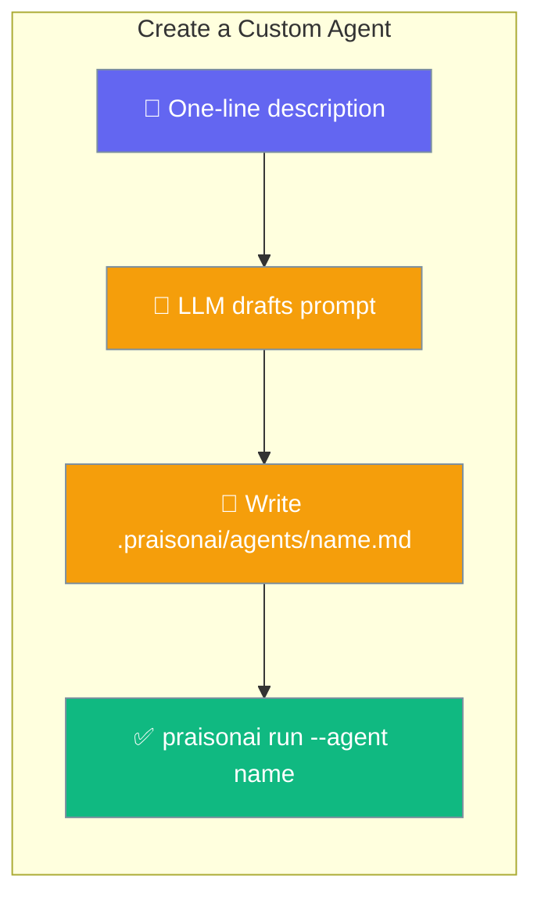
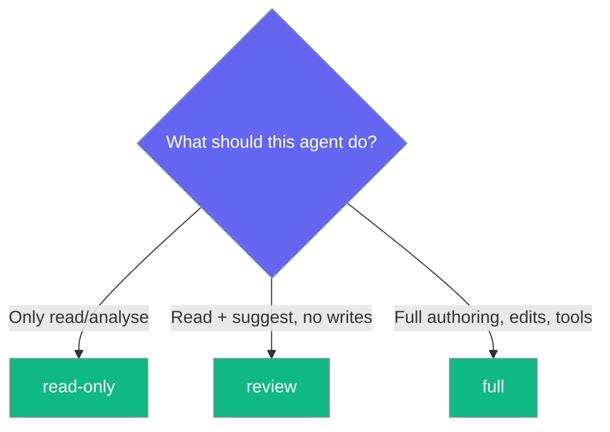
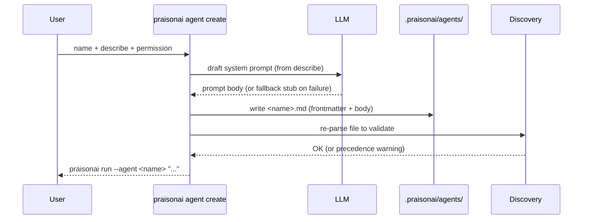

`praisonai agent create` writes a ready-to-run custom agent from a single line of description.

<Note>
Seven older `Agent()` params (`allow_delegation`, `allow_code_execution`, `code_execution_mode`, `auto_save`, `rate_limiter`, `verification_hooks`, `cli_backend`) are deprecated — see [Legacy Agent Parameters](/features/agent-legacy-params).
</Note>



## Quick Start

<Steps>
<Step title="Interactive — one line to start">
Run the command with no arguments and answer the prompts:

```bash
praisonai agent create
```

You'll see:

```
$ praisonai agent create
Agent name: code-reviewer
Describe what this agent does: Review PRs and suggest improvements
Permission preset [full/read-only/review] (full): read-only
Model (gpt-4o-mini):
Created .praisonai/agents/code-reviewer.md
You can now run:
  praisonai run --agent code-reviewer "..."
```
</Step>

<Step title="Scriptable — CI-friendly">
Pass every answer as a flag and skip the prompts with `--yes`:

```bash
praisonai agent create code-reviewer \
  --describe "Review pull requests and suggest improvements" \
  --model gpt-4o-mini \
  --permission read-only \
  --yes
```
</Step>

<Step title="Run the agent you just made">
```bash
praisonai run --agent code-reviewer "Review the diff on this branch"
```
</Step>
</Steps>

---

## Which preset should I pick?

Presets map to the `mode` frontmatter that scopes what the agent may do.



| Preset | Written `mode` | Effect |
|--------|----------------|--------|
| `read-only` | `mode: read-only` | Denies edits and writes — safe for reviewers and analysts. |
| `review` | `mode: review` | Read plus inspection with a limited action surface. |
| `full` | *omitted* | Full toolset — `mode` is left out so the file stays minimal (absence means full). |

<Note>
Interactive default is `full`. For anything that reviews code, choose `read-only` explicitly.
</Note>

---

## How It Works

The command drafts a system prompt, writes the file, then re-parses it to confirm discovery can read it back.



The written file re-parses losslessly through discovery:

```md
---
model: gpt-4o-mini
role: Code Reviewer
goal: Review code and suggest improvements
mode: read-only
---
You are a careful code reviewer.
Describe your responsibilities and ask for clarification instead of guessing.
```

If the LLM draft fails, an editable stub is written instead — file creation is never blocked.

---

## Configuration Options

| Flag | Type | Description |
|------|------|-------------|
| `NAME` | argument | File stem for `.praisonai/agents/<name>.md`. Prompted if omitted. |
| `-d`, `--describe` | str | One-line description of what the agent should do. Drives the prompt draft. |
| `-m`, `--model` | str | Model to use. Defaults to your detected provider. |
| `-p`, `--permission` | str | Permission preset: `read-only`, `review`, or `full`. |
| `--global` | flag | Write to `~/.praisonai/agents/` instead of the project. |
| `-f`, `--force` | flag | Overwrite an existing agent definition. |
| `-y`, `--yes` | flag | Non-interactive: accept defaults and skip prompts. |

**Destination directories**

- Project (default): `<git root or CWD>/.praisonai/agents/<name>.md`
- Global (`--global`): `~/.praisonai/agents/<name>.md`

---

## Common Patterns

**Team of reviewers** — create three read-only reviewers, then run them together via subagents:

```bash
praisonai agent create security-reviewer --describe "Flag security issues in diffs" --permission read-only --yes
praisonai agent create perf-reviewer     --describe "Flag performance regressions"  --permission read-only --yes
praisonai agent create style-reviewer    --describe "Flag style and readability nits" --permission read-only --yes

praisonai run --subagents security-reviewer,perf-reviewer,style-reviewer "Review this PR"
```

**Global helper across every project** — write to your home directory:

```bash
praisonai agent create commit-writer --describe "Write concise commit messages" --global --yes
```

**Overwrite an old definition** — pass `--force`; without it the command refuses and prints the exact path:

```bash
praisonai agent create code-reviewer --describe "Stricter review checklist" --force --yes
```

**Shadow warning** — a `--global` agent is shadowed when a project agent shares its name. The command warns and names the shadowing path so you don't `run` the wrong one. Resolve it by renaming or deleting one of the two files.

---

## Best Practices

<AccordionGroup>
<Accordion title="Start with read-only for anything reviewing code">
The file omits `mode` for `full`, so an explicit `read-only` is the safest default for reviewers.

```bash
praisonai agent create code-reviewer --describe "Review PRs" --permission read-only --yes
```
</Accordion>

<Accordion title="Use --describe even in interactive mode">
A one-line description makes the drafted system prompt dramatically better than a bare name.

```bash
praisonai agent create --describe "Summarise long design docs into 5 bullets"
```
</Accordion>

<Accordion title="Prefer --global only for personal helpers">
Same-named project agents take precedence for `run`, so a global one silently loses to a project override.

```bash
praisonai agent create note-taker --describe "Capture meeting notes" --global --yes
```
</Accordion>

<Accordion title="Keep names path-safe">
A name is a file stem, not a path. Avoid `/`, `\`, `.`, and `..` — the command rejects them before drafting, so you get fast, clear failures.

```bash
praisonai agent create code-reviewer --describe "Review PRs" --yes
```
</Accordion>
</AccordionGroup>

---

## Related

<CardGroup cols={2}>
<Card title="CLI Reference" icon="terminal" href="/cli/cli-reference">
Full command tree, including the `agent` subcommands.
</Card>
<Card title="External Agents" icon="robot" href="/code/external-agents">
Custom agents in the coding CLI.
</Card>
</CardGroup>
