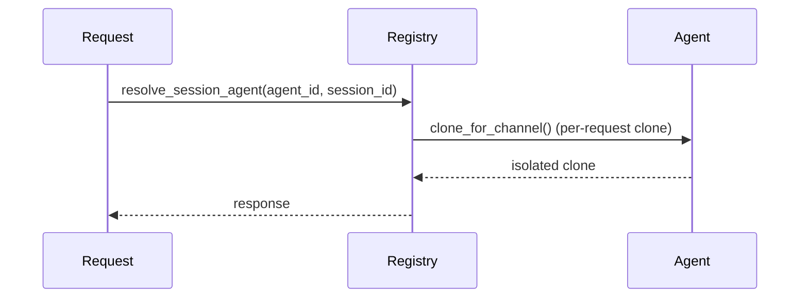

The agent invoke registry maps an agent id to a template agent, so a request handler can resolve and invoke the right agent by id.

```python
from praisonaiagents import Agent
from praisonai.api.agent_invoke import register_agent, get_agent

agent = Agent(
    name="assistant",
    instructions="You are a helpful assistant."
)
register_agent("assistant", agent)          # default (module-global) registry
# Later, in a request handler:
resolved = get_agent("assistant")
```


## Quick Start

<Steps>
<Step title="Default (single-tenant)">
Use the module-level functions — no `registry=` kwarg needed. This is what almost every user wants.

```python
from praisonaiagents import Agent
from praisonai.api.agent_invoke import register_agent, get_agent

agent = Agent(
    name="assistant",
    instructions="You are a helpful assistant."
)
register_agent("assistant", agent)
resolved = get_agent("assistant")   # -> agent
```
</Step>

<Step title="Scoped (multi-tenant / multi-embedding)">
Construct an `AgentRegistry()` per tenant and pass it via the `registry=` kwarg. Two `AgentOS` gateways in the same interpreter can now hold isolated agent sets.

```python
from praisonaiagents import Agent
from praisonai.api.agent_invoke import AgentRegistry, register_agent, get_agent

agent = Agent(name="assistant", instructions="You are a helpful assistant.")

tenant_a = AgentRegistry()
tenant_b = AgentRegistry()

register_agent("assistant", agent, registry=tenant_a)
get_agent("assistant", registry=tenant_a)   # -> agent
get_agent("assistant", registry=tenant_b)   # -> None (isolated)
```
</Step>
</Steps>

---

## How It Works

Every invocation resolves through `resolve_session_agent`, which clones the registered template per request so concurrent callers never share mutable conversation state.



`unregister` pops the id atomically under a lock (`dict.pop`), so a concurrent unregister can't race between the membership check and the delete — the previous split check-then-delete returned uncaught 500s on concurrent deletes, which is the reason the class exists.

---

## Configuration Options

`AgentRegistry` methods:

| Method | Signature | Description |
|---|---|---|
| `register` | `register(agent_id: str, agent: Any) -> None` | Add an agent template under `agent_id`. |
| `unregister` | `unregister(agent_id: str) -> bool` | Atomic remove; returns `True` if it existed. Race-free under concurrent calls. |
| `get` | `get(agent_id: str) -> Optional[Any]` | Look up an agent template by id. |
| `list` | `list() -> list[str]` | List all registered agent ids. |

Module-level functions (backward-compatible):

| Function | New signature | Notes |
|---|---|---|
| `register_agent` | `register_agent(agent_id, agent, *, registry=None)` | Uses module-global when `registry` is omitted. |
| `unregister_agent` | `unregister_agent(agent_id, *, registry=None)` | Same. |
| `get_agent` | `get_agent(agent_id, *, registry=None)` | Same. |
| `list_registered_agents` | `list_registered_agents(*, registry=None)` | Same. |

---

## Best Practices

<AccordionGroup>
<Accordion title="Prefer the default registry unless you run multiple tenants">
The module-global is already thread-safe, and the `registry=` kwarg is the escape hatch, not the default path. Use plain `register_agent(agent_id, agent)` / `get_agent(agent_id)` for single-tenant setups.
</Accordion>

<Accordion title="Give each embedded server its own AgentRegistry">
Two `AgentOS` gateways sharing the module global will step on each other's agent ids. Construct one `AgentRegistry()` per gateway and thread it through your `register_agent(...)` calls.

```python
from praisonai.api.agent_invoke import AgentRegistry, register_agent

gateway_a_registry = AgentRegistry()
gateway_b_registry = AgentRegistry()

register_agent("assistant", agent, registry=gateway_a_registry)
```
</Accordion>

<Accordion title="Registry holds templates, not live conversations">
Every invocation goes through `resolve_session_agent`, which clones the template per request via `clone_for_channel`. Do not stash mutable state on the registered agent expecting it to survive across calls.
</Accordion>
</AccordionGroup>

---

## Related

<CardGroup cols={2}>
<Card title="AgentOS Chat Session Isolation" icon="user" href="/features/agentos-chat-session-isolation">
  Session isolation cloning path
</Card>
<Card title="Serve Agents Auth" icon="lock" href="/features/serve-agents-auth">
  Surface where this registry is invoked
</Card>
</CardGroup>
