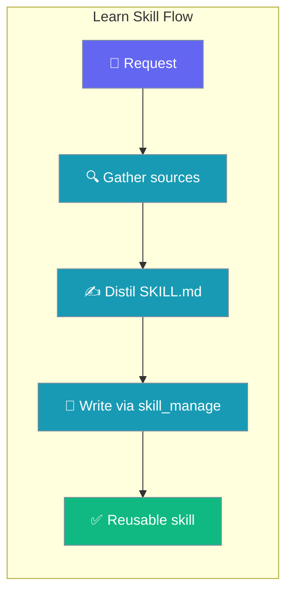
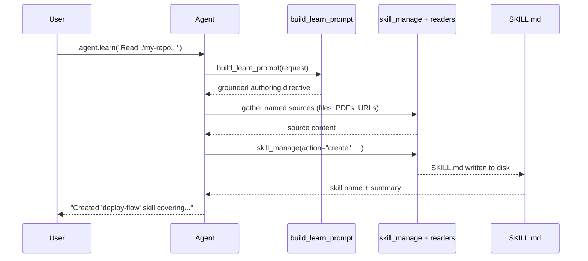

Point an agent at real source material and get one grounded `SKILL.md` back — ready to reuse immediately.



## Quick Start

<Steps>
<Step title="Agent: learn from sources">
```python
from praisonaiagents import Agent

agent = Agent(name="Skill Author", instructions="You learn and write skills.")
agent.learn("Read ./my-repo and the docs in ./docs/*.pdf and make a 'deploy-flow' skill")
```
</Step>

<Step title="Bot: /learn slash command">
Type `/learn` in any PraisonAI bot chat (Telegram, Slack, Discord):

```
/learn deploy steps from this repo and the runbook PDF
```

<Warning>
`/learn` is **admin-only by default** when a `CommandAccessPolicy` is configured. See [Bot Command Access Control](/docs/features/bot-command-access-control).
</Warning>
</Step>

<Step title="Async and alias variants">
```python
# Async variant (event-loop friendly)
await agent.alearn("Read ./my-repo and make a 'ci-deploy' skill")

# Backward-compatible aliases
agent.learn("...")          # alias for learn_skill()
await agent.alearn("...")   # alias for alearn_skill()
```
</Step>
</Steps>

---

## How It Works



`Agent.learn_skill()` calls `build_learn_prompt(request)` to build a curated directive, ensures `skill_manage` (and lightweight file/PDF readers) are available via `_ensure_skill_management_tools()`, then invokes `start()` for a single turn.

---

## What the Grounded Prompt Enforces

The internal `build_learn_prompt` function generates a directive with strict house-style rules:

| Rule | Detail |
|------|--------|
| **Gather only named sources** | Reads local files/directories, PDFs, fetched URLs, or the current chat — only sources the user named |
| **Verbatim accuracy** | Uses only flags, paths, commands, env vars, and API names that appear verbatim in the gathered sources — never invented |
| **Tight `SKILL.md`** | Keeps the file ~100–200 lines; moves long reference material (large code, full API tables) to supporting files referenced by relative path |
| **YAML frontmatter** | Must include at least `name` and `description` |
| **Single write** | Authors one skill via `skill_manage(action="create", name="kebab-case-name", content="...")` |
| **Supporting files** | Long material goes to separate files via `skill_manage(action="write_file", ...)` |

---

## Configuration

| Parameter | Type | Default | Description |
|-----------|------|---------|-------------|
| `request` | `str` | required | Description of sources to learn from and the skill to produce |
| `**kwargs` | `Any` | — | Forwarded to `start()` / `astart()` |

`_ensure_skill_management_tools()` adds `skill_manage`, `read_skill_file`, and `list_skill_scripts` to `self.tools` if they are not already present. This is **idempotent** — safe to call multiple times.

---

## Bot Usage

All PraisonAI bot adapters (Telegram, Slack, Discord) register `/learn` via the shared `CommandRegistry`.

```
/learn <sources and skill to make>
```

**Example:**

```
/learn deploy steps from this repo and the runbook PDF
```

**Usage hint** (when called without arguments):

```
ℹ️ Usage: /learn <sources and skill to make>
Example: /learn deploy steps from this repo and the runbook PDF
```

### Admin-Only Default

`/learn` reads host file system sources and authors skills that alter future agent behaviour. It belongs to `PRIVILEGED_COMMANDS` in `CommandAccessPolicy` — it is **admin-only by default** whenever a policy is configured (`admin_users` or `user_allowed_commands` set).

Without any policy configured, `/learn` is available to all users (backward-compatible behaviour).

See [Bot Command Access Control](/docs/features/bot-command-access-control) to configure `admin_users` and grant selective access.

---

## Common Patterns

### Learn from a Codebase

```python
from praisonaiagents import Agent

agent = Agent(name="Skill Author", instructions="You learn and write skills.")
agent.learn("Read ./my-repo and make a 'dev-setup' skill covering the full local dev workflow")
```

### Learn from PDFs + Code

```python
agent.learn(
    "Read ./src and the PDF manuals in ./docs/manuals/*.pdf "
    "and make a 'data-ingestion' skill"
)
```

### Learn from the Current Chat

```python
agent.learn("Distil what we just did into a 'feature-branch' skill")
```

### Async in an Event Loop

```python
import asyncio
from praisonaiagents import Agent

async def main():
    agent = Agent(name="Skill Author", instructions="You learn and write skills.")
    await agent.alearn_skill("Read ./docs and make an 'api-reference' skill")

asyncio.run(main())
```

---

## Best Practices

<AccordionGroup>
<Accordion title="Name skills explicitly">
Include the target skill name in the request (e.g., `"make a 'deploy-flow' skill"`) so the agent uses that exact kebab-case name rather than deriving one. Consistent names make it easier to invoke and update skills later.
</Accordion>

<Accordion title="Scope the sources tightly">
List only the directories, files, or PDFs the skill should cover. Broad requests like `"read everything"` risk the agent browsing unrelated material or timing out. Narrow sources produce more accurate skills.
</Accordion>

<Accordion title="Use alearn_skill in async code">
In async contexts (FastAPI endpoints, bot handlers), call `await agent.alearn_skill(...)` instead of `agent.learn_skill(...)` to avoid blocking the event loop during potentially long source-gathering turns.
</Accordion>

<Accordion title="Check skill_manage availability">
`learn_skill` auto-adds `skill_manage` if missing, but if you've set `tools=[]` explicitly on the agent, ensure the agent has read access to the source directories too (the `skill_manage` file readers need filesystem access).
</Accordion>
</AccordionGroup>

---

## Related

<CardGroup cols={2}>
  <Card title="Skill Management" icon="puzzle-piece" href="/docs/features/skill-manage">
    Create, list, read, and delete skills via the skill_manage tool
  </Card>
  <Card title="Skill Lifecycle" icon="rotate" href="/docs/features/skill-lifecycle">
    How skills are discovered, activated, and applied during agent runs
  </Card>
  <Card title="Bot Commands" icon="terminal" href="/docs/features/bot-commands">
    Full list of built-in bot commands including /learn
  </Card>
  <Card title="Self Improve" icon="chart-line" href="/docs/features/self-improve">
    Automatic skill improvement loop (distinct from one-shot learn_skill)
  </Card>
</CardGroup>
