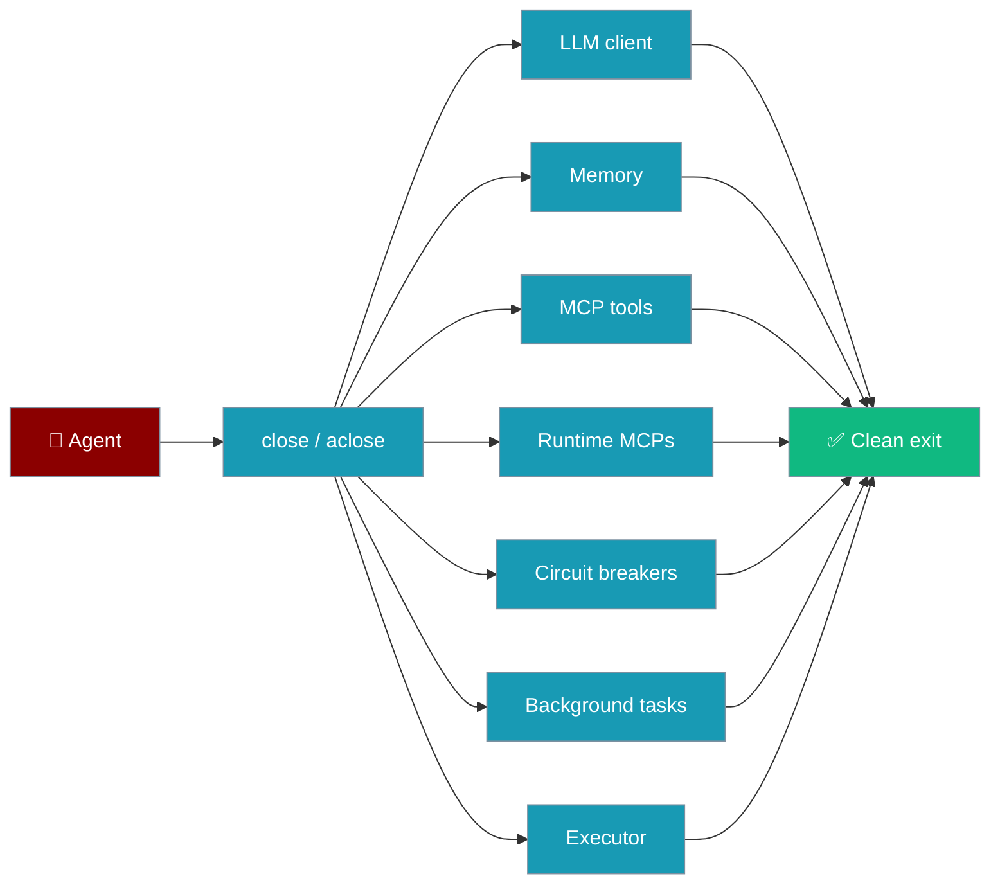
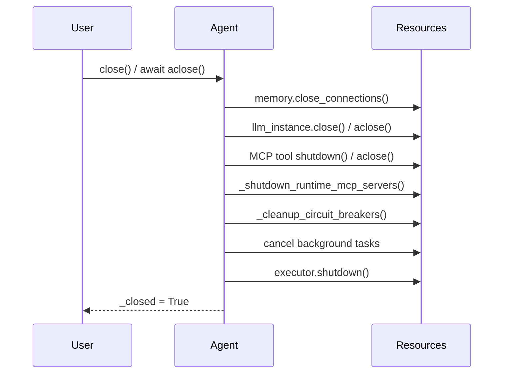

`agent.close()` and `await agent.aclose()` shut down every resource the agent owns — LLM clients, memory, MCP tools, runtime MCPs, and per-agent circuit breakers — in one call.

```python
from praisonaiagents import Agent, MCP

agent = Agent(name="TimeAgent", tools=[MCP("uvx mcp-server-time")])
try:
    agent.start("What time is it in UTC?")
finally:
    agent.close()  # subprocesses, streams, and breakers shut down deterministically
```

Closing an agent fans out to each owned resource so nothing leaks between runs.



## Quick Start

<Steps>

<Step title="Simple">
Pass an MCP at construction time; `close()` shuts down its subprocess and stream.

```python
from praisonaiagents import Agent, MCP

agent = Agent(
    name="TimeAgent",
    instructions="Report the current time.",
    tools=[MCP("uvx mcp-server-time")],
)
try:
    agent.start("What time is it in UTC?")
finally:
    agent.close()
```
</Step>

<Step title="Async">
Use the async context manager or call `aclose()` explicitly — it prefers each tool's `aclose()`.

```python
import asyncio
from praisonaiagents import Agent, MCP

async def main():
    async with Agent(
        name="TimeAgent",
        instructions="Report the current time.",
        tools=[MCP("uvx mcp-server-time")],
    ) as agent:
        await agent.achat("What time is it in UTC?")
    # aclose() runs on exit — MCP tools, breakers, and clients shut down

asyncio.run(main())
```
</Step>

</Steps>

---

## How It Works

Closing an agent walks each owned resource and shuts it down best-effort.



| Resource | Sync path | Async path | Notes |
|---|---|---|---|
| `llm_instance` client | `close()` / bridged `aclose()` | `aclose()` if awaitable, else `close()` | Falls back to the private OpenAI client and `self.llm._client.close()` for legacy patterns. |
| Memory (`_memory_instance` / `memory`) | `close_connections()` | `await memory.aclose()` else `close_connections()` | |
| MCP tools passed via `tools=[MCP(...)]` | `t.shutdown()` for each tool in `self.tools` | prefer `await t.aclose()`, else `t.shutdown()` | Mirrors `remove_mcp_server()`'s best-effort shutdown. |
| Runtime-attached MCPs | `_shutdown_runtime_mcp_servers()` | same | See [Runtime MCP](/features/runtime-mcp). |
| Circuit breakers | `_cleanup_circuit_breakers()` | same | Removes every `tool_{id(agent)}_*` entry from the global registry. |
| Background tasks | `task.cancel()` | `task.cancel()` + `await task` | |
| Thread-pool executor | `shutdown(wait=False, cancel_futures=True)` | same via `run_in_executor` | `cancel_futures` only on Python 3.9+. |

<Note>
`close()` / `aclose()` set `_closed = True` and become no-ops on subsequent calls, so calling them twice is safe. Check `agent.is_closed` to confirm.
</Note>

---

## Best Practices

<AccordionGroup>

<Accordion title="Prefer a team-level context manager">
Wrap a multi-agent run in `with PraisonAIAgents(...) as workflow:` — the team-level context manager fans out to each agent's `close()`. See [Resource Lifecycle](/features/resource-lifecycle).
</Accordion>

<Accordion title="Use try/finally for a single agent">
For a lone agent, wrap the run in `try/finally` and call `agent.close()` (or `await agent.aclose()`), so cleanup runs even when the run raises.
</Accordion>

<Accordion title="Don't rely on __del__ alone">
Garbage-collection cleanup is best-effort — the async client cannot be awaited from a finalizer. Call `close()` / `aclose()` explicitly for deterministic teardown.
</Accordion>

<Accordion title="Cleanup never masks your error">
Each step is guarded individually; failures are logged as warnings and never raise, so a bad shutdown never hides the original exception.
</Accordion>

</AccordionGroup>

---

## Related

<CardGroup cols={2}>
  <Card title="Runtime MCP" icon="plug" href="/features/runtime-mcp">
    Attach and detach MCP servers at runtime
  </Card>
  <Card title="MCP Lifecycle" icon="arrows-rotate" href="/features/mcp-lifecycle">
    Per-MCP context manager and manual shutdown
  </Card>
  <Card title="Resource Lifecycle" icon="recycle" href="/features/resource-lifecycle">
    Team-level cleanup with PraisonAIAgents
  </Card>
  <Card title="Tool Circuit Breaker" icon="shield-halved" href="/features/tool-circuit-breaker">
    How per-agent breakers work and auto-prune
  </Card>
</CardGroup>
