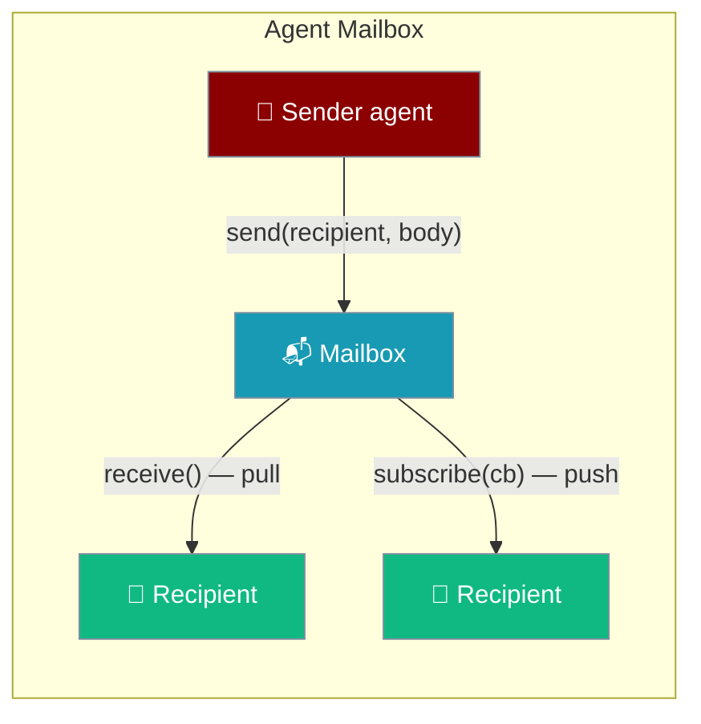
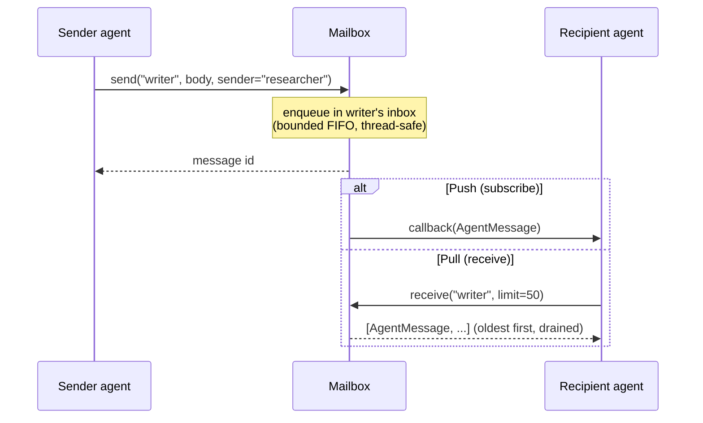
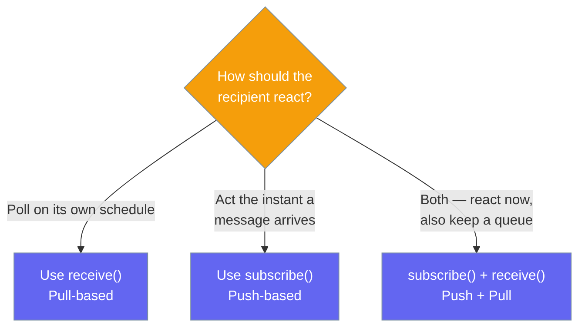
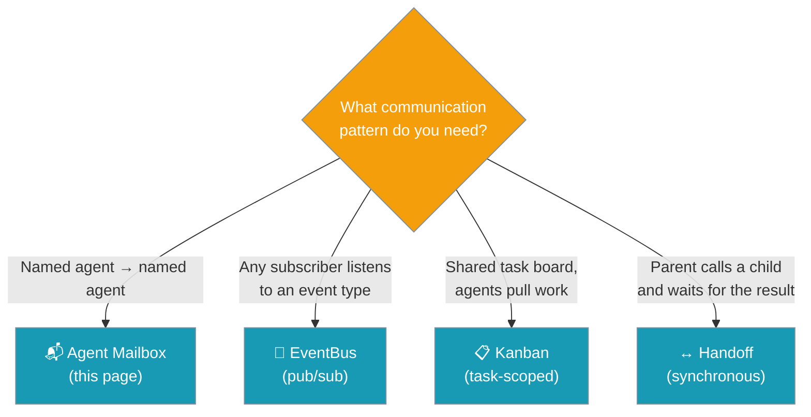

Agent Mailbox delivers a message from one agent to another **by name** — the recipient reads its inbox on its own schedule or reacts the instant a message lands.



Send a message to another agent by name — that's it.

```python
from praisonaiagents import Agent
from praisonaiagents.messaging import InProcessMailbox

mailbox = InProcessMailbox()

researcher = Agent(name="researcher", instructions="Research topics and share findings.")
writer = Agent(name="writer", instructions="Turn findings into a short blog post.")

# Researcher drops findings addressed to the writer
findings = researcher.start("List 3 recent papers on retrieval-augmented generation.")
mailbox.send("writer", findings, sender="researcher")

# Writer picks up its inbox and produces the post
inbox = mailbox.receive("writer")
for msg in inbox:
    post = writer.start(f"Write a blog post from these findings:\n\n{msg.body}")
    print(post)
```

## Quick Start

<Steps>
<Step title="Simple send/receive">
One sender, one receiver — the sender addresses a message and the receiver drains its inbox.

```python
from praisonaiagents.messaging import InProcessMailbox

mailbox = InProcessMailbox()

mailbox.send("writer", "Draft ready for review", sender="researcher")

for msg in mailbox.receive("writer"):
    print(f"{msg.sender} -> {msg.recipient}: {msg.body}")
```
</Step>

<Step title="Push notifications with subscribe">
Register a callback and react the instant a message arrives — no polling.

```python
from praisonaiagents.messaging import InProcessMailbox

mailbox = InProcessMailbox()

def on_message(msg):
    print(f"New message from {msg.sender}: {msg.body}")

mailbox.subscribe("writer", on_message)

mailbox.send("writer", "Findings attached", sender="researcher")
```
</Step>

<Step title="Correlate a request and its reply">
Attach a `correlation_id` so the sender can match a reply to its original request.

```python
from praisonaiagents.messaging import InProcessMailbox

mailbox = InProcessMailbox()

# Researcher asks the writer a question, tagged with a correlation id
mailbox.send("writer", "Need a title for the RAG post", sender="researcher", correlation_id="q1")

# Writer reads the request and replies with the same correlation id
for req in mailbox.receive("writer"):
    mailbox.send(req.sender, "Ten Papers, One Retriever", sender="writer", correlation_id=req.correlation_id)

# Researcher filters its inbox for the matching reply
replies = [m for m in mailbox.receive("researcher") if m.correlation_id == "q1"]
print(replies[0].body)
```
</Step>
</Steps>

---

## How It Works

The sender enqueues a message in the recipient's inbox; the recipient either receives a push callback or pulls the queue.



Each recipient has its own bounded FIFO inbox. `send` appends a message and fires any subscriber callbacks; `receive` drains the oldest messages and removes them from the inbox.

### Choosing your delivery pattern

Pick pull, push, or both based on how the recipient should react.



### Mailbox vs. bus / kanban / handoff

Reach for a mailbox when you need **named agent → named agent** delivery — the one thing the other primitives don't offer.



| Primitive | Addressing | Delivery | Backing |
|-----------|------------|----------|---------|
| **Agent Mailbox** *(this)* | sender → **named recipient** | pull (`receive`) or push (`subscribe`) | in-process default; wrapper can add Redis |
| EventBus | none (type-filtered) | push to any subscriber | in-process |
| Kanban | task, not agent | pull from board | shared store |
| Handoff | parent → child (this run) | synchronous call/return | in-process |

---

## Configuration Options

`InProcessMailbox` takes a single constructor parameter.

| Option | Type | Default | Description |
|--------|------|---------|-------------|
| `max_inbox` | `int` | `1000` | Maximum queued messages per recipient. On overflow the **oldest** message is dropped silently. Must be `> 0` — otherwise raises `ValueError`. |

```python
from praisonaiagents.messaging import InProcessMailbox

mailbox = InProcessMailbox(max_inbox=100)
```

### `AgentMessage`

Every delivered message is an `AgentMessage` dataclass.

| Field | Type | Default | Description |
|-------|------|---------|-------------|
| `sender` | `str` | *(required)* | Address of the sending agent |
| `recipient` | `str` | *(required)* | Address of the receiving agent |
| `body` | `Any` | *(required)* | Arbitrary payload (str, dict, list, model, …) |
| `id` | `str` | `uuid4()` | Auto-generated unique message id |
| `ts` | `float` | `time.time()` | Unix timestamp when the message was created |
| `correlation_id` | `str \| None` | `None` | Optional id for request/response correlation |

Use `msg.to_dict()` and `AgentMessage.from_dict(data)` to round-trip a message through a plain dict.

### `AgentMailboxProtocol`

Any object with these three methods satisfies the mailbox contract — implement it to back a mailbox with your own store.

| Method | Signature | Behaviour |
|--------|-----------|-----------|
| `send` | `send(recipient: str, body: Any, *, sender: str, correlation_id: str \| None = None) -> str` | Deliver a message to a named recipient. Returns the delivered message `id`. |
| `receive` | `receive(agent_id: str, *, limit: int = 50) -> list[AgentMessage]` | Drain up to `limit` pending messages for `agent_id` (oldest first). Empties the returned slice from the inbox. |
| `subscribe` | `subscribe(agent_id: str, callback: Callable[[AgentMessage], None]) -> None` | Register a callback fired for each message delivered to `agent_id`. |

The default `InProcessMailbox` adds one method beyond the protocol:

| Method | Signature | Behaviour |
|--------|-----------|-----------|
| `pending` | `pending(agent_id: str) -> int` | Return the number of undelivered messages queued for `agent_id`. |

<CardGroup cols={2}>
  <Card icon="code" href="/docs/sdk/reference/praisonaiagents/modules/messaging">
    Full dataclass fields, `to_dict()` / `from_dict()`
  </Card>
  <Card icon="code" href="/docs/sdk/reference/praisonaiagents/modules/messaging">
    Protocol contract for custom implementations
  </Card>
</CardGroup>

---

## Common Patterns

### Fan-out to multiple recipients

Address the same payload to several named agents in one loop.

```python
from praisonaiagents.messaging import InProcessMailbox

mailbox = InProcessMailbox()

for agent_id in ("writer", "editor", "reviewer"):
    mailbox.send(agent_id, "Draft v2 is ready", sender="researcher")

print(mailbox.pending("editor"))  # 1
```

### Request/response with `correlation_id`

Tag a request with a UUID, reply with the same UUID, and filter the sender's inbox by it.

```python
import uuid
from praisonaiagents.messaging import InProcessMailbox

mailbox = InProcessMailbox()
cid = str(uuid.uuid4())

mailbox.send("writer", "What's the headline?", sender="researcher", correlation_id=cid)

for req in mailbox.receive("writer"):
    mailbox.send(req.sender, "RAG in Practice", sender="writer", correlation_id=req.correlation_id)

reply = next(m for m in mailbox.receive("researcher") if m.correlation_id == cid)
print(reply.body)  # RAG in Practice
```

### Overflow-safe queue for a slow worker

Bound the inbox so a slow consumer never grows unbounded — oldest messages drop silently.

```python
from praisonaiagents.messaging import InProcessMailbox

mailbox = InProcessMailbox(max_inbox=100)

for i in range(150):
    mailbox.send("slow-worker", f"job-{i}", sender="dispatcher")

# Only the newest 100 survive — jobs 0–49 were dropped silently.
print(mailbox.pending("slow-worker"))  # 100
```

<Warning>
Overflow drops the **oldest** message with no exception and no return value — design the caller for at-most-`max_inbox` buffering.
</Warning>

---

## Best Practices

<AccordionGroup>
<Accordion title="Address matches the agent's name — pick a stable identifier">
Recipient strings are opaque to the mailbox. Use the `Agent(name=...)` value as the recipient key so a scan of the code makes the addressing obvious and the same identifier works everywhere.
</Accordion>

<Accordion title="Bound your inbox to the slowest consumer">
The default `max_inbox=1000` silently drops the oldest message on overflow. If a receiver may be slow or offline for long stretches, either lower `max_inbox` and design for drop tolerance, or drain more aggressively on the receiver side.
</Accordion>

<Accordion title="Keep subscriber callbacks small and non-blocking">
Subscribers fire on the sender's thread (outside the lock, but still synchronous per delivery). A slow callback slows down every future `send()` to that recipient. Push heavy work onto a queue or a thread. A single raising subscriber is logged and does **not** interrupt delivery to others.
</Accordion>

<Accordion title="Reach for a wrapper-backed implementation when you leave one process">
The in-process default is fine for single-process demos and unit tests. Cross-process or cross-host fleets should use a wrapper implementation of `AgentMailboxProtocol` (e.g. Redis) — the interface is identical, only the constructor differs.
</Accordion>
</AccordionGroup>

---

## Related

<CardGroup cols={2}>
  <Card title="Handoffs" icon="right-left" href="/docs/features/handoffs">
    Synchronous parent → child delegation
  </Card>
  <Card title="Kanban" icon="table-columns" href="/docs/features/kanban">
    Shared task board agents pull work from
  </Card>
  <Card title="Multi-Agent Patterns" icon="diagram-project" href="/docs/features/multi-agent-patterns">
    Orchestration patterns for agent teams
  </Card>
  <Card title="Named Agent Delegation" icon="user-group" href="/docs/features/named-agent-delegation">
    Delegatable named agents — the closest cousin
  </Card>
</CardGroup>
