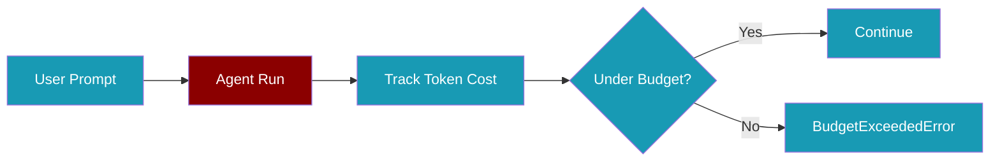
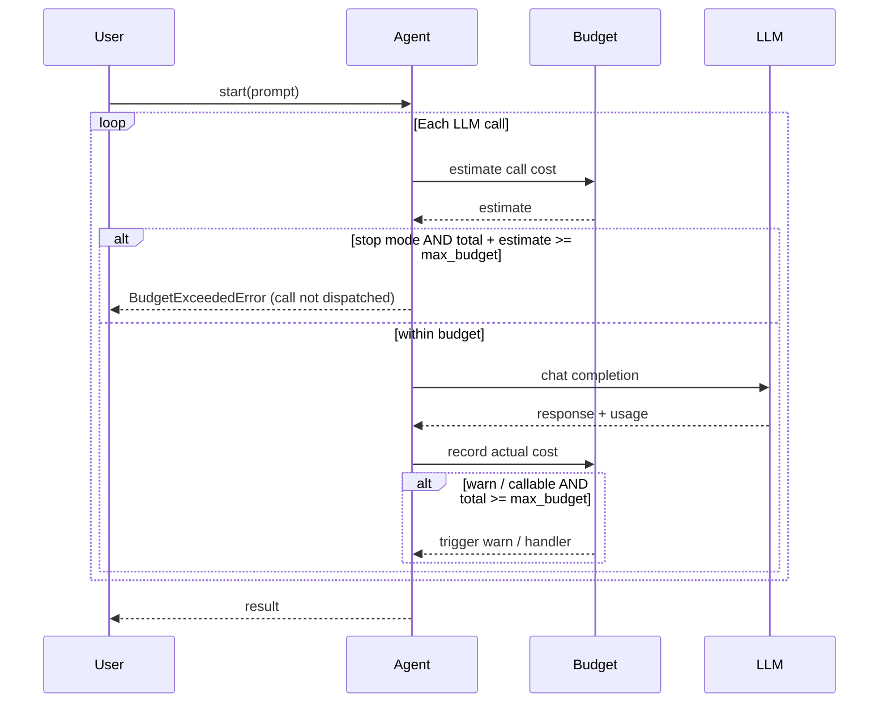

Cap how much an agent can spend per run with `ExecutionConfig(max_budget=...)` — when the limit is hit, PraisonAI stops the run and raises `BudgetExceededError`.

<Note>
**Async enforcement.** `max_budget` is now enforced on async paths (`astart()` / `achat()`) as well as sync paths. Gateway bots using async agents will receive `BudgetExceededError` when their configured ceiling is reached. Previously only sync dispatch enforced the limit.
</Note>



<Warning>
The top-level `Agent(max_budget=...)` shortcut was **removed** (PraisonAI PR #1642). Use `execution=ExecutionConfig(max_budget=...)` — see [CLI budget handling](/docs/features/cli-budget-handling).
</Warning>

## Quick Start

<Steps>
<Step title="Set a simple USD cap">

```python
from praisonaiagents import Agent, ExecutionConfig

agent = Agent(
    name="Researcher",
    instructions="You research topics thoroughly",
    execution=ExecutionConfig(max_budget=0.50),
)

agent.start("Research the history of AI")
```

When spend reaches $0.50, the run stops with `BudgetExceededError` including agent name and totals. In `stop` mode (the default), the guard runs **before** each call — the over-budget call is never dispatched.

</Step>

<Step title="Async run with budget cap">

```python
import asyncio
from praisonaiagents import Agent, ExecutionConfig

agent = Agent(
    name="AsyncResearcher",
    instructions="Research topics asynchronously",
    execution=ExecutionConfig(max_budget=0.50),
)

async def main():
    try:
        await agent.astart("Research the history of AI")
    except Exception as e:
        if "BudgetExceeded" in type(e).__name__:
            print(f"Budget exceeded: {e}")

asyncio.run(main())
```

`astart()` raises `BudgetExceededError` the same way `start()` does — the async path now has identical pre-call guards and post-call cost accounting.

</Step>

<Step title="Warn instead of stopping">

```python
from praisonaiagents import Agent, ExecutionConfig

agent = Agent(
    name="Analyst",
    instructions="Analyse data carefully",
    execution=ExecutionConfig(
        max_budget=1.00,
        on_budget_exceeded="warn",
    ),
)

agent.start("Summarise this quarterly report")
```

With `on_budget_exceeded="warn"`, the agent logs a warning but continues. `warn` and callable modes stay reactive (post-call) — the call always runs, then the warning fires. Default is `"stop"`.

</Step>
</Steps>

<Note>
`max_budget` is enforced on both sync (`start()`) and async (`astart()`) paths as of **1.6.88+**. Gateway bots that call `astart()` internally now honour the budget cap and raise `BudgetExceededError` identically to sync runs.
</Note>

## How It Works



Budget tracking adds zero overhead when `max_budget` is `None` (the default). In `stop` mode and callable modes, the check timing differs: `stop` is pre-call while `warn` and callable stay post-call.

## Estimation

Before each LLM call in `stop` mode, the agent estimates the minimum call cost: input tokens ≈ total characters ÷ 4, plus the configured `max_tokens` output reservation. If the running total plus this estimate meets or exceeds `max_budget`, the call is blocked before dispatch — the LLM is never billed and `$0` is recorded for that turn.

## Async, Streaming, Bots & Gateway

Budget enforcement covers every dispatch path — sync `agent.start()`, async `agent.astart()`, streaming, and the bot / gateway flow. The same pre-call guard (`stop` mode) and post-call accounting (`warn` / callable) run on both `_chat_completion` and `_execute_unified_achat_completion`, so a bot deployed with `execution=ExecutionConfig(max_budget=0.50)` will refuse the over-budget call rather than silently overrunning.

## Configuration Options

| Option | Type | Default | Description |
|--------|------|---------|-------------|
| `max_budget` | `float \| None` | `None` | Hard USD limit per agent run. `None` disables tracking. |
| `on_budget_exceeded` | `"stop" \| "warn" \| callable` | `"stop"` | Action when the cap is reached |

<CardGroup cols={2}>
  <Card title="ExecutionConfig" icon="code" href="/docs/sdk/reference/praisonaiagents/classes/ExecutionConfig">
    Full execution configuration reference
  </Card>
  <Card title="CLI Budget Handling" icon="terminal" href="/docs/features/cli-budget-handling">
    Budget limits from the CLI
  </Card>
</CardGroup>

## Best Practices

<AccordionGroup>
<Accordion title="Start with a conservative cap in production">
Set `max_budget` on any agent that runs unattended or loops over tools. $0.25–$1.00 is a sensible starting range for research agents.
</Accordion>

<Accordion title="Use warn mode during development">
`on_budget_exceeded="warn"` lets you see full output while still logging when you'd have been stopped in production.
</Accordion>

<Accordion title="Combine with rate limiting">
Budget caps control spend; rate limiters control request frequency. Use both for cost-sensitive deployments.
</Accordion>
</AccordionGroup>

## Related

<CardGroup cols={2}>
  <Card title="CLI Budget Handling" icon="wallet" href="/docs/features/cli-budget-handling">
    Set budgets from the command line
  </Card>
  <Card title="Execution Config" icon="settings" href="/docs/features/agent-centric-api">
    All execution options in one place
  </Card>
</CardGroup>
