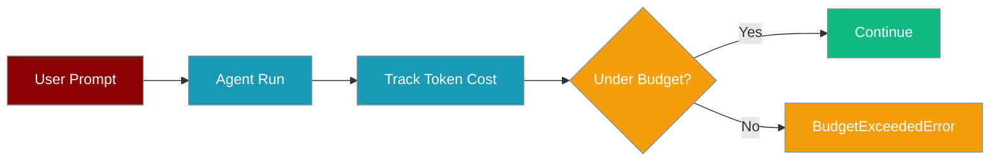
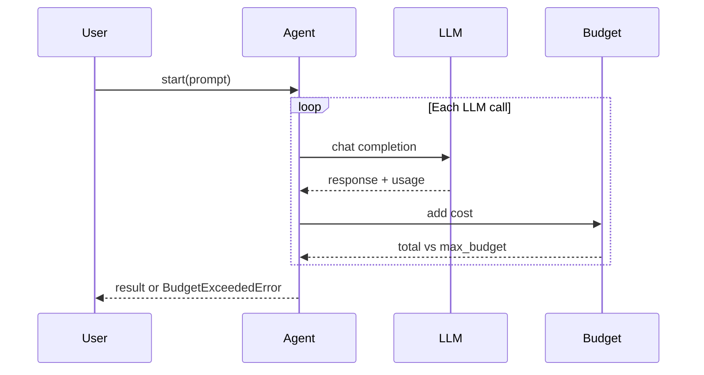

Cap how much an agent can spend per run with `ExecutionConfig(max_budget=...)` — when the limit is hit, PraisonAI stops the run and raises `BudgetExceededError`.



<Warning>
The top-level `Agent(max_budget=...)` shortcut was **removed** (PraisonAI PR #1642). Use `execution=ExecutionConfig(max_budget=...)` — see [CLI budget handling](/docs/features/cli-budget-handling).
</Warning>

## Quick Start

<Steps>
<Step title="Set a simple USD cap">

```python
from praisonaiagents import Agent, ExecutionConfig

agent = Agent(
    name="Researcher",
    instructions="You research topics thoroughly",
    execution=ExecutionConfig(max_budget=0.50),
)

agent.start("Research the history of AI")
```

When spend reaches $0.50, the run stops with `BudgetExceededError` including agent name and totals.

</Step>

<Step title="Warn instead of stopping">

```python
from praisonaiagents import Agent, ExecutionConfig

agent = Agent(
    name="Analyst",
    instructions="Analyse data carefully",
    execution=ExecutionConfig(
        max_budget=1.00,
        on_budget_exceeded="warn",
    ),
)

agent.start("Summarise this quarterly report")
```

With `on_budget_exceeded="warn"`, the agent logs a warning but continues. Default is `"stop"`.

</Step>
</Steps>

## How It Works



Budget tracking adds zero overhead when `max_budget` is `None` (the default).

## Configuration Options

| Option | Type | Default | Description |
|--------|------|---------|-------------|
| `max_budget` | `float \| None` | `None` | Hard USD limit per agent run. `None` disables tracking. |
| `on_budget_exceeded` | `"stop" \| "warn" \| callable` | `"stop"` | Action when the cap is reached |

<CardGroup cols={2}>
  <Card title="ExecutionConfig" icon="code" href="/docs/sdk/reference/praisonaiagents/classes/ExecutionConfig">
    Full execution configuration reference
  </Card>
  <Card title="CLI Budget Handling" icon="terminal" href="/docs/features/cli-budget-handling">
    Budget limits from the CLI
  </Card>
</CardGroup>

## Best Practices

<AccordionGroup>
<Accordion title="Start with a conservative cap in production">
Set `max_budget` on any agent that runs unattended or loops over tools. $0.25–$1.00 is a sensible starting range for research agents.
</Accordion>

<Accordion title="Use warn mode during development">
`on_budget_exceeded="warn"` lets you see full output while still logging when you'd have been stopped in production.
</Accordion>

<Accordion title="Combine with rate limiting">
Budget caps control spend; rate limiters control request frequency. Use both for cost-sensitive deployments.
</Accordion>
</AccordionGroup>

## Related

<CardGroup cols={2}>
  <Card title="CLI Budget Handling" icon="wallet" href="/docs/features/cli-budget-handling">
    Set budgets from the command line
  </Card>
  <Card title="Execution Config" icon="settings" href="/docs/features/execution-config">
    All execution options in one place
  </Card>
</CardGroup>
