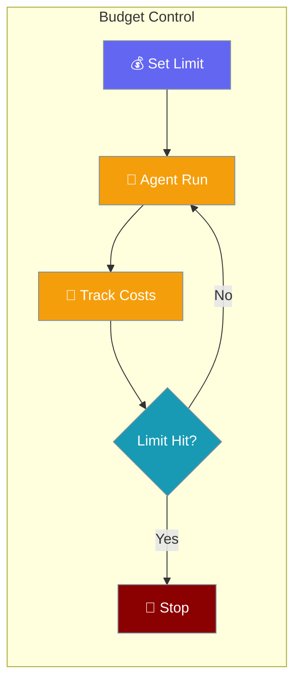
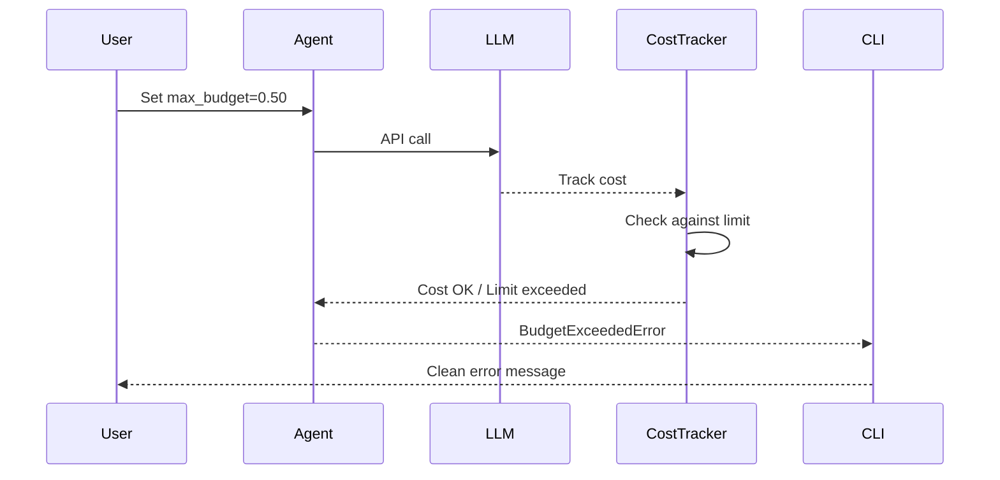

Set a hard USD limit on agent runs without importing ExecutionConfig.



## Quick Start

<Steps>
<Step title="Simple Usage">

Set a budget with the `max_budget` parameter:

```python
from praisonaiagents import Agent

agent = Agent(
    name="Researcher",
    instructions="You research topics thoroughly",
    max_budget=0.50,  # Stop at $0.50
)

agent.start("Research the history of AI")
```

</Step>

<Step title="Equivalent Long Form">

For users who need full execution control:

```python
from praisonaiagents import Agent, ExecutionConfig

agent = Agent(
    name="Researcher", 
    instructions="You research topics thoroughly",
    execution=ExecutionConfig(max_budget=0.50)
)

agent.start("Research the history of AI")
```

</Step>
</Steps>

---

## How It Works



The `max_budget` parameter creates an `ExecutionConfig(max_budget=...)` automatically, tracking USD spend and stopping execution when the limit is reached.

---

## Precedence

When both `max_budget` and `execution.max_budget` are provided, the top-level parameter wins:

| Configuration | Result | Warning |
|---------------|--------|---------|
| Only `max_budget=1.00` | Uses `$1.00` limit | No |
| Only `execution=ExecutionConfig(max_budget=0.50)` | Uses `$0.50` limit | No |
| Both equal: `max_budget=1.00, execution=ExecutionConfig(max_budget=1.00)` | Uses `$1.00` limit | No |
| Both different: `max_budget=1.00, execution=ExecutionConfig(max_budget=0.25)` | Uses `$1.00` limit | Yes |

```python
# Both supplied → top-level max_budget wins, UserWarning emitted
agent = Agent(
    name="Research Agent",
    instructions="Analyze data",
    max_budget=1.00,
    execution=ExecutionConfig(max_budget=0.25, max_iter=50),
)
# → effective ExecutionConfig(max_budget=1.00, max_iter=50)
```

---

## CLI Behavior

The CLI provides clean error handling when budget limits are exceeded:

### Before (Raw Traceback)
```text
Traceback (most recent call last):
  File "/path/to/agent.py", line 42, in start
    response = self.llm.invoke(messages)
  ...
BudgetExceededError: Agent 'Researcher' exceeded budget: $1.2500 >= $1.0000
```

### After (Clean Message)
```text
Budget limit exceeded: [budget] Agent 'Researcher' exceeded budget: $1.2500 >= $1.0000 
- Set max_budget parameter (e.g., Agent(max_budget=1.00))
# exit code: 1
```

The CLI catches `BudgetExceededError` across all display modes (`silent`, `quiet`, `verbose`, `debug`, `jsonl`, `json`, `editor`) and provides actionable guidance.

---

## Catching the Error in Code

Handle budget exceeded errors programmatically:

```python
from praisonaiagents import Agent, BudgetExceededError

agent = Agent(
    name="Research Agent", 
    instructions="Analyze quantum computing trends",
    max_budget=0.50
)

try:
    result = agent.start("Research quantum computing")
    print(f"Research completed: {result}")
except BudgetExceededError as e:
    print(f"Budget exceeded!")
    print(f"Agent: {e.agent_name}")
    print(f"Spent: ${e.total_cost:.4f}")
    print(f"Limit: ${e.max_budget:.4f}")
    print(f"Category: {e.error_category}")
    print(f"Retryable: {e.is_retryable}")
```

### Error Attributes

| Attribute | Type | Description |
|-----------|------|-------------|
| `agent_name` | `str` | Agent that exceeded the budget |
| `total_cost` | `float` | USD spent at the time of error (legacy alias of `used`) |
| `max_budget` | `float` | Configured limit (legacy alias of `limit`) |
| `budget_type` | `str` | `"cost"` for dollar budgets |
| `error_category` | `str` | Always `"budget"` |
| `is_retryable` | `bool` | `False` |

---

## Related

<CardGroup cols={2}>
<Card title="Budget Concepts" icon="gauge-high" href="/docs/concepts/budget">
  Complete budget management guide
</Card>
<Card title="ExecutionConfig" icon="settings" href="/docs/configuration/execution-config">
  Full execution configuration options
</Card>
</CardGroup>