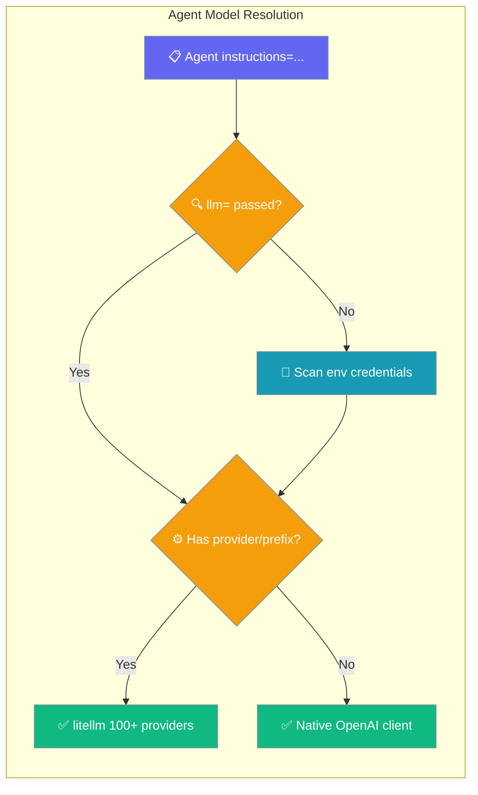
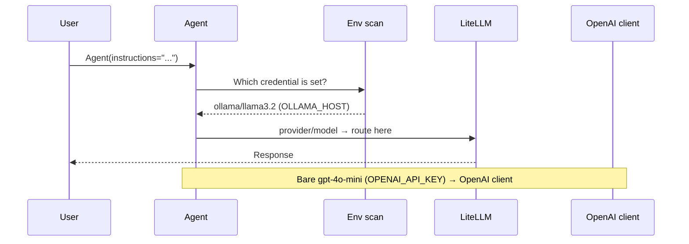

`Agent()` picks a model from your environment when you don't pass `llm=`, then routes provider-prefixed defaults through litellm so a single provider key is enough to start.



As of [PR #4795](https://github.com/MervinPraison/PraisonAI/pull/4795), the SDK `Agent()` constructor uses the same resolver as `praisonai run` — set one provider key and the Agent works with no `llm=`.

## Quick Start

<Steps>
<Step title="Simplest — one provider key">
Set a single provider credential and construct an Agent with no `llm=`:

```python
import os
from praisonaiagents import Agent

os.environ["OLLAMA_HOST"] = "http://localhost:11434"

# No llm=, no OPENAI_API_KEY — the Agent picks ollama/llama3.2
# and routes through litellm.
agent = Agent(instructions="Answer briefly.")
agent.start("2+2")
```
</Step>

<Step title="Explicit provider-prefixed">
Pass a `provider/model` string to route through litellm:

```python
from praisonaiagents import Agent

agent = Agent(llm="anthropic/claude-3-5-sonnet-latest")
agent.start("Write a haiku about the sea.")
```
</Step>

<Step title="Bare OpenAI model">
A bare model name uses the native OpenAI client:

```python
from praisonaiagents import Agent

agent = Agent(llm="gpt-4o")
agent.start("Summarise the plot of Hamlet.")
```
</Step>
</Steps>

---

## How It Works

The Agent scans your environment for a credential when `llm=` is omitted, then forks on whether the resolved model carries a `provider/` prefix.



The first provider whose credential is present wins, in the order below. OpenAI is first so existing OpenAI users keep their default.

| Credential env var | Resolved default model |
|---|---|
| `OPENAI_API_KEY` | `gpt-4o-mini` |
| `ANTHROPIC_API_KEY` | `anthropic/claude-3-5-sonnet-latest` |
| `GEMINI_API_KEY` | `gemini/gemini-1.5-flash` |
| `GOOGLE_API_KEY` | `google/gemini-1.5-flash` |
| `GROQ_API_KEY` | `groq/llama-3.3-70b-versatile` |
| `COHERE_API_KEY` | `cohere/command-r` |
| `OLLAMA_HOST` | `ollama/llama3.2` |

---

## Resolution Table

The class an Agent uses depends on the shape of the resolved model — a `provider/` prefix routes through litellm, a bare name uses the native OpenAI client.

| `llm=` | Environment | Resolved model | Routed through |
|---|---|---|---|
| omitted | `OPENAI_API_KEY` only | `gpt-4o-mini` | Native OpenAI client |
| omitted | `OLLAMA_HOST` only | `ollama/llama3.2` | litellm (100+ providers) |
| omitted | `ANTHROPIC_API_KEY` only | `anthropic/claude-3-5-sonnet-latest` | litellm (100+ providers) |
| `"gpt-4o"` | any | `gpt-4o` | Native OpenAI client |
| `"anthropic/claude-3-5-sonnet-latest"` | any | as given | litellm (100+ providers) |
| `{"temperature": 0.5}` (no `model` key) | any | default | Native OpenAI client |

Before PR #4795, six of the seven env-var defaults resolved the right model name but were then sent to the native OpenAI client — the Agent raised `ValueError: OPENAI_API_KEY environment variable is required`. Only the bare `gpt-4o-mini` default worked. The fix routes any provider-prefixed default through litellm, matching `praisonai run`.

---

## Common Patterns

### I only have a Groq key

```python
import os
from praisonaiagents import Agent

os.environ["GROQ_API_KEY"] = "gsk-..."

# Picks groq/llama-3.3-70b-versatile, routed through litellm.
agent = Agent(instructions="Answer fast.")
agent.start("Name three prime numbers.")
```

### I have an Ollama server running

```python
import os
from praisonaiagents import Agent

os.environ["OLLAMA_HOST"] = "http://localhost:11434"

# Picks ollama/llama3.2, routed through litellm — no cloud key needed.
agent = Agent(instructions="Answer locally.")
agent.start("Explain black holes to a 5-year-old.")
```

---

## Best Practices

<AccordionGroup>
<Accordion title="Prefer explicit llm= in production">
Auto-detection is ideal for a first run. In production, pass `llm="provider/model"` so the model can't change when you add or remove a provider key.
</Accordion>

<Accordion title="Keep OPENAI_MODEL_NAME bare unless you mean the override">
`OPENAI_MODEL_NAME` wins over credential detection. A bare value like `gpt-4o` uses the OpenAI client; a `provider/model` value like `ollama/llama3.2` now routes through litellm instead.
</Accordion>

<Accordion title="The SDK reads the same env vars as praisonai run">
`Agent()` and `praisonai run` share one resolver. A single provider key gives a working Agent in Python and a working command on the CLI.
</Accordion>
</AccordionGroup>

---

## Related

<CardGroup cols={2}>
<Card title="Provider Auto-Detection" icon="magnifying-glass" href="/models#provider-auto-detection-no-config-first-run">
  How credentials pick a default model
</Card>
<Card title="Default Model Selection" icon="list-check" href="/features/default-model-selection">
  Resolution order and MRU state
</Card>
<Card title="Local-First Run" icon="play" href="/features/local-first-run">
  Zero-config first run from your credentials
</Card>
<Card title="LLM Config" icon="cpu" href="/features/llm-config">
  Set model, endpoint, and fallback chain
</Card>
</CardGroup>
