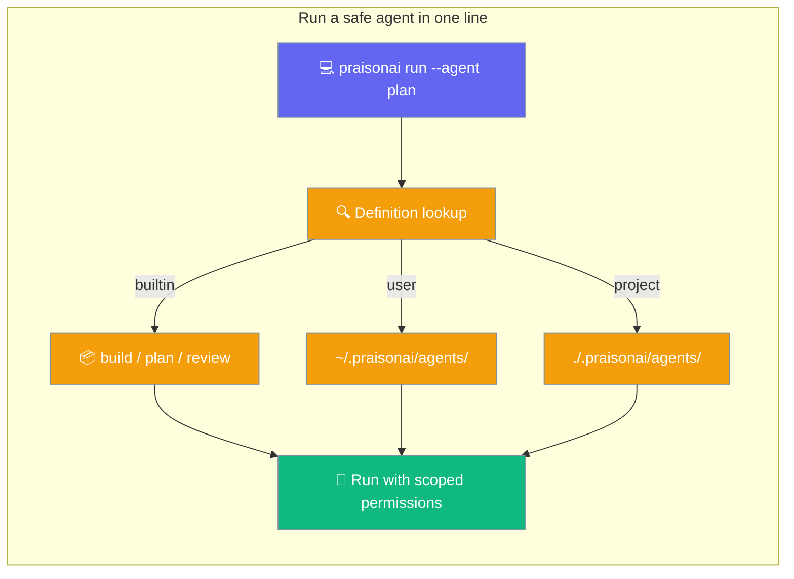
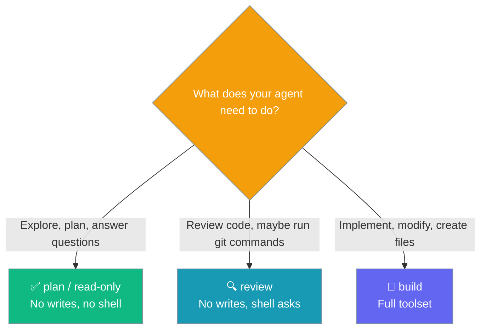
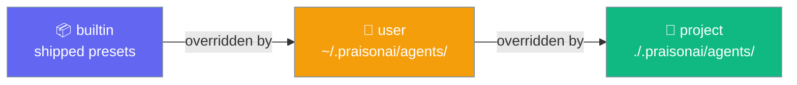

Built-in `build`, `plan`, and `review` agents run safely with one command — and you can declare your own per-agent permissions in YAML or Markdown.



## Quick Start

<Steps>

<Step title="Run a built-in preset (no files, no flags)">

```bash
# Read-only explorer — never modifies files
praisonai run --agent plan "explore this repo"

# Code reviewer — asks before running shell commands
praisonai run --agent review "review the recent diff"

# Full toolset — implements and modifies code
praisonai run --agent build "add a /health endpoint"
```

All three work immediately after installing `praisonai`. No YAML, no configuration.

</Step>

<Step title="Define your own agent with a mode">

Create `.praisonai/agents/reviewer.md`:

````markdown
---
name: reviewer
model: gpt-4o-mini
mode: read-only
permission:
  shell:
    "git *": ask
    "*": deny
---
You are a meticulous code reviewer. Read code and diffs and provide thorough review feedback. Do not modify files.
````

Then run it:

```bash
praisonai run --agent reviewer "review the last commit"
```

</Step>

</Steps>

---

## Built-in Presets

Three agents are shipped with the wrapper and work with zero configuration.

| Preset | Mode | Role | Behaviour | When to use |
|--------|------|------|-----------|-------------|
| `build` | `build` | Builder | No restrictions, full toolset | Implementing / modifying code |
| `plan` | `plan` | Planner | Read allowed; edit / write / bash / execute **denied** | Exploration, planning, Q&A about a repo |
| `review` | `review` | Reviewer | Read allowed; edit / write / execute denied; bash **asks** | Code review with the ability to run safe inspection commands |

<Note>
Built-in presets are the lowest-priority definitions. Any `.praisonai/agents/plan.md` file in your project or home directory automatically overrides the shipped `plan` preset.
</Note>

---

## Choosing a Mode



**Rule of thumb:** Start with `plan`. Promote to `review` if the agent needs to run inspection commands (`git log`, `grep`). Use `build` only when the agent genuinely needs to modify files.

---

## Defining Your Own Agent

### Markdown frontmatter (recommended)

Create a `.md` file in `.praisonai/agents/` (project scope) or `~/.praisonai/agents/` (user scope):

````markdown
---
name: reviewer
model: gpt-4o-mini
mode: read-only
permission:
  shell:
    "git *": ask
    "*": deny
---
You are a meticulous code reviewer…
````

The `mode:` sets coarse defaults. The `permission:` block then overrides specific rules — here, `shell: "git *": ask` means git commands prompt the user while everything else is denied.

### YAML equivalent

```yaml
# .praisonai/agents/reviewer.yaml
name: reviewer
model: gpt-4o-mini
mode: read-only
permission:
  shell:
    "git *": ask
    "*": deny
```

### Flat permission form

```yaml
name: ci-runner
mode: plan
permission:
  read: allow
  edit: deny
  write: deny
```

Bare capability keys (`read`, `edit`) are normalised to `read:*`, `edit:*` automatically.

### Nested per-capability form

```yaml
name: git-assistant
permission:
  bash:
    "git log *": allow
    "git diff *": allow
    "*": deny
  read:
    "*": allow
```

---

## Modes Reference

`mode:` is a coarse shorthand that applies a full rule set without writing individual permission lines.

| Mode | `read:*` | `edit:*` | `write:*` | `bash:*` | `execute:*` |
|------|----------|----------|-----------|----------|-------------|
| `build` / `full` | — | — | — | — | — |
| `read-only` | `allow` | `deny` | `deny` | `deny` | `deny` |
| `plan` | `allow` | `deny` | `deny` | `deny` | `deny` |
| `review` | `allow` | `deny` | `deny` | `ask` | `deny` |

`build` and `full` apply no rules (empty rule set — full toolset).
`plan` is an alias of `read-only`.

---

## Permission Block Reference

The `permission:` block supports three actions:

| Action | Meaning |
|--------|---------|
| `allow` | Proceed without asking |
| `deny` | Block the call immediately |
| `ask` | Prompt the user at runtime |

**Case insensitive:** `ALLOW`, `Allow`, and `allow` are all valid.

**Validation fails closed:** an unknown action (e.g. `permitt`) raises `ValueError` at load time so a typo never silently produces an unrestricted agent.

**Bare keys normalised:** `read` → `read:*`, `bash` → `bash:*`.

**Explicit `permission:` always wins over `mode:` defaults.** If `mode: review` sets `bash:*: ask` but your `permission:` block sets `bash: deny`, the final rule is `deny`.

---

## Precedence

### Definition discovery (lowest → highest priority)



A project `.praisonai/agents/plan.md` completely replaces the built-in `plan` preset.

### Permission resolution at invocation (lowest → highest priority)

| Level | Source | Example |
|-------|--------|---------|
| 1 (lowest) | `mode:` defaults from `MODE_RULES` | `mode: review` → `bash:*: ask` |
| 2 | `permission:` block in the definition file | `bash: "git *": allow` |
| 3 (highest) | CLI flags at invocation | `--allow 'bash:git *'` |

CLI flags always win. This lets you use a shared team definition and override specific rules per invocation.

```bash
# Team definition has mode: review (bash:*: ask)
# CLI override: allow git commands without prompting
praisonai run --agent reviewer "review the diff" --allow 'bash:git *'
```

---

## `ask` Keeps the Run Interactive

Any `ask` rule in the resolved permission set forces an interactive approval backend even when `--approval` is not passed. The agent pauses and prompts before each matching tool call.

Use `ask` for shell operations you want visibility into but don't want to block entirely — the `review` preset does exactly this for bash.

If the run is non-interactive (CI, `--no-tty`), an unresolved `ask` falls back to **deny**.

---

## Common Patterns

**Read-only researcher**
```yaml
mode: plan
# or mode: read-only — they're identical
```

**Git-only assistant**
```yaml
permission:
  bash:
    "git log *": allow
    "git diff *": allow
    "git show *": allow
    "*": deny
  read:
    "*": allow
```

**Deny-by-default with selective allows**
```yaml
permission:
  read:
    "*/src/*": allow
  bash:
    "grep *": allow
  edit: deny
  write: deny
  execute: deny
```

---

## Best Practices

<AccordionGroup>

<Accordion title="Start with a preset before writing your own">
`praisonai run --agent plan` gives you a read-only agent immediately. Only write a custom definition when you need a different model, a different system prompt, or different permission rules.
</Accordion>

<Accordion title="Use ask for shell when reviewing">
The `review` preset uses `bash:*: ask` rather than `bash:*: deny`. This lets the agent run inspection commands (`git log`, `cat`) while keeping you in the loop for anything surprising.
</Accordion>

<Accordion title="Commit .praisonai/agents/ for team-wide defaults">
Project definitions override user and built-in definitions. Committing `.praisonai/agents/` to your repo ensures the whole team uses the same scoped agents.
</Accordion>

<Accordion title="Modes fail closed — typo raises ValueError">
`mode: readonly` (missing the hyphen) raises `ValueError` at load time. This is intentional: a bad mode should never silently fall through to an unrestricted agent. Fix the typo or use `mode: read-only`.
</Accordion>

<Accordion title="CLI flags are escape hatches, not defaults">
Use `--allow` and `--deny` for one-off overrides, not as a substitute for declaring permissions in the agent file. Team members who run the same agent without the flags will get the definition-level rules.
</Accordion>

</AccordionGroup>

---

## Related

<CardGroup cols={2}>
  <Card title="Custom Agents & Commands" icon="file-code" href="/docs/features/custom-agents-commands">
    Full agent definition reference — model, tools, role, goal
  </Card>
  <Card title="Declarative Permissions" icon="shield-halved" href="/docs/features/declarative-permissions">
    Top-level YAML and CLI permission flags
  </Card>
  <Card title="Permission Modes" icon="shield-check" href="/docs/features/permission-modes">
    Runtime PermissionMode enum (DEFAULT / PLAN / ACCEPT_EDITS / BYPASS)
  </Card>
  <Card title="Run CLI" icon="play" href="/docs/cli/run">
    --agent, --allow, --deny, --permissions flags
  </Card>
</CardGroup>
