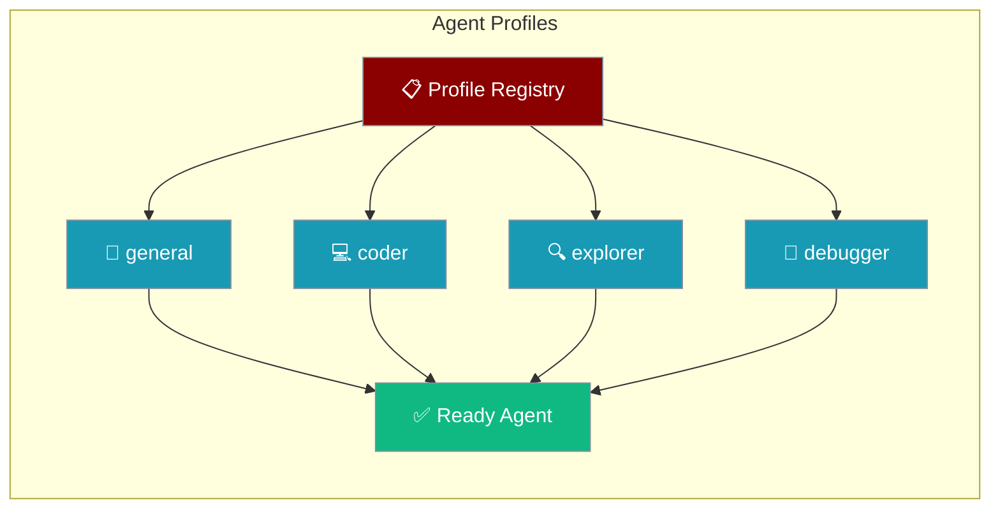
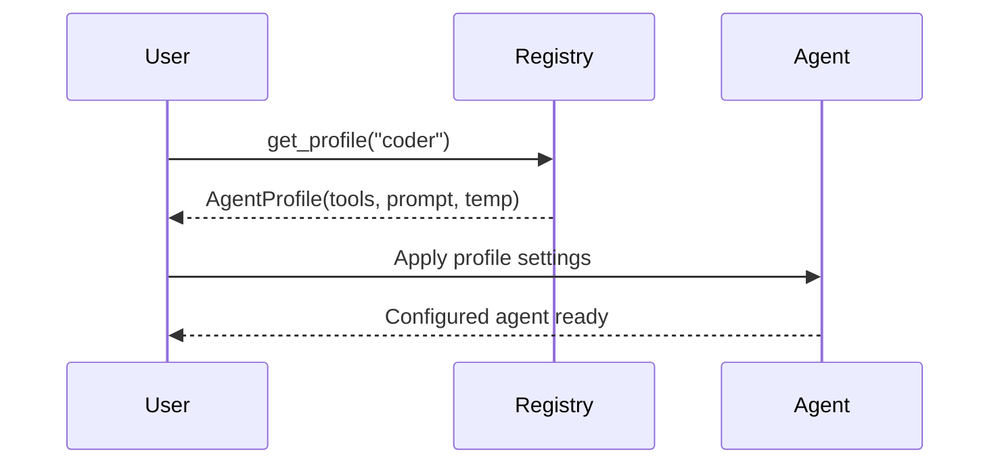

Agent Profiles give you pre-configured agents for common tasks — pick a profile and start immediately.



## Quick Start

<Steps>
<Step title="Use a built-in profile">
```python
from praisonaiagents.agents.profiles import get_profile

coder = get_profile("coder")
print(f"Temperature: {coder.temperature}")
print(f"Tools: {coder.tools}")
```
</Step>

<Step title="Register a custom profile">
```python
from praisonaiagents.agents.profiles import register_profile, AgentProfile, AgentMode

security_auditor = AgentProfile(
    name="security_auditor",
    description="Security vulnerability scanner",
    mode=AgentMode.SUBAGENT,
    system_prompt="You are a security expert...",
    tools=["read_file", "search"],
    temperature=0.2,
    max_steps=40
)

register_profile(security_auditor)
```
</Step>
</Steps>

---

## How It Works



---

## Built-in Profiles

| Profile | Mode | Description |
|---------|------|-------------|
| `general` | Primary | General-purpose coding assistant |
| `coder` | All | Focused code implementation |
| `planner` | Subagent | Task planning and decomposition |
| `reviewer` | Subagent | Code review and quality |
| `explorer` | Subagent | Codebase exploration |
| `debugger` | Subagent | Debugging and troubleshooting |

---

## Agent Modes

| Mode | Description |
|------|-------------|
| `PRIMARY` | Main agent that can spawn subagents |
| `SUBAGENT` | Spawned by another agent for specific tasks |
| `ALL` | Works in any context |

---

## Common Patterns

### List all profiles

```python
from praisonaiagents.agents.profiles import list_profiles

for profile in list_profiles():
    print(f"{profile.name}: {profile.description}")
```

### Filter by mode

```python
from praisonaiagents.agents.profiles import get_profiles_by_mode, AgentMode

subagents = get_profiles_by_mode(AgentMode.SUBAGENT)
for profile in subagents:
    print(f"{profile.name}: {profile.description}")
```

### Use profile with Agent

```python
from praisonaiagents import Agent
from praisonaiagents.agents.profiles import get_profile

profile = get_profile("coder")

agent = Agent(
    instructions=profile.system_prompt,
    llm="gpt-4o-mini"
)
```

---

## AgentProfile Fields

| Field | Type | Description |
|-------|------|-------------|
| `name` | `str` | Unique profile name |
| `description` | `str` | What this agent does |
| `mode` | `AgentMode` | Execution mode |
| `system_prompt` | `str` | System prompt |
| `tools` | `List[str]` | Available tools |
| `temperature` | `float` | LLM temperature |
| `max_steps` | `int` | Maximum execution steps |
| `hidden` | `bool` | Hide from listings |

---

## Best Practices

<AccordionGroup>
<Accordion title="Choose mode based on agent role">
Use `PRIMARY` for orchestrators that spawn other agents, `SUBAGENT` for specialized workers, and `ALL` for utility agents that can serve either role.
</Accordion>

<Accordion title="Set low temperature for precision tasks">
Code review and security auditing profiles work best with `temperature=0.1–0.3` for deterministic, consistent output.
</Accordion>

<Accordion title="Keep custom profiles in a shared module">
Register custom profiles once at app startup and reuse them across your codebase to avoid duplication.

```python
register_profile(security_auditor)
agent_profile = get_profile("security_auditor")
```
</Accordion>

<Accordion title="Use hidden=True for internal profiles">
Set `hidden=True` on profiles that should not appear in user-facing listings but are still available via `get_profile()`.
</Accordion>
</AccordionGroup>

---

## Related

<CardGroup cols={2}>
<Card title="Agent-Centric API" icon="sliders" href="/features/agent-centric-api">
  Consolidated feature configuration for agents
</Card>
<Card title="Specialized Agents" icon="robot" href="/features/specialized-agents">
  Specialized agent patterns and implementations
</Card>
</CardGroup>
