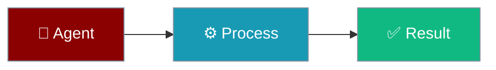

The Agent Profiles module provides built-in agent profiles and mode configurations for common agent use cases.




## Features

- **Built-in Profiles** - Pre-configured agents for common tasks
- **Agent Modes** - Primary, subagent, and all-context modes
- **Custom Profiles** - Register your own agent profiles
- **Profile Discovery** - List and filter available profiles

## Built-in Profiles

| Profile | Mode | Description |
|---------|------|-------------|
| `general` | Primary | General-purpose coding assistant |
| `coder` | All | Focused code implementation |
| `planner` | Subagent | Task planning and decomposition |
| `reviewer` | Subagent | Code review and quality |
| `explorer` | Subagent | Codebase exploration |
| `debugger` | Subagent | Debugging and troubleshooting |

## Quick Start

<Steps>
<Step title="Basic Usage">
```python
from praisonaiagents.agents.profiles import (
    get_profile,
    list_profiles,
    register_profile,
    AgentProfile,
    AgentMode
)

# Get a built-in profile
coder = get_profile("coder")
print(f"Coder temperature: {coder.temperature}")

# List all profiles
for profile in list_profiles():
    print(f"{profile.name}: {profile.description}")
```
</Step>
</Steps>


## Agent Modes

| Mode | Description |
|------|-------------|
| `PRIMARY` | Main agent that can spawn subagents |
| `SUBAGENT` | Spawned by another agent for specific tasks |
| `ALL` | Can be used in any context |

## API Reference

### AgentProfile

```python
@dataclass
class AgentProfile:
    name: str                    # Unique profile name
    description: str             # What this agent does
    mode: AgentMode              # Execution mode
    system_prompt: str           # System prompt
    tools: List[str]             # Available tools
    temperature: float           # LLM temperature
    max_steps: int               # Maximum execution steps
    hidden: bool                 # Hide from listings
```

### Functions

```python
def get_profile(name: str) -> Optional[AgentProfile]:
    """Get a profile by name."""

def list_profiles(include_hidden: bool = False) -> List[AgentProfile]:
    """List all available profiles."""

def register_profile(profile: AgentProfile) -> None:
    """Register a custom profile."""

def get_profiles_by_mode(mode: AgentMode) -> List[AgentProfile]:
    """Get profiles that work in a specific mode."""
```

## Examples

### Using Built-in Profiles

```python
from praisonaiagents.agents.profiles import get_profile

# Get the coder profile
coder = get_profile("coder")

# Use profile settings
print(f"System prompt: {coder.system_prompt[:100]}...")
print(f"Tools: {coder.tools}")
print(f"Temperature: {coder.temperature}")
```

### Custom Profile

```python
from praisonaiagents.agents.profiles import (
    register_profile,
    AgentProfile,
    AgentMode
)

# Create custom profile
security_auditor = AgentProfile(
    name="security_auditor",
    description="Security vulnerability scanner",
    mode=AgentMode.SUBAGENT,
    system_prompt="You are a security expert...",
    tools=["read_file", "search"],
    temperature=0.2,
    max_steps=40
)

register_profile(security_auditor)
```

### Filter by Mode

```python
from praisonaiagents.agents.profiles import (
    get_profiles_by_mode,
    AgentMode
)

# Get all subagent-capable profiles
subagents = get_profiles_by_mode(AgentMode.SUBAGENT)
for profile in subagents:
    print(f"{profile.name}: {profile.description}")
```
## Best Practices

<AccordionGroup>
<Accordion title="Start with defaults">
Use the built-in defaults first. Only add configuration when you hit a specific limitation.
</Accordion>
<Accordion title="Test incrementally">
Add one feature at a time and verify behaviour before combining features.
</Accordion>
<Accordion title="Monitor in production">
Watch token consumption and latency metrics when enabling advanced features in production.
</Accordion>
</AccordionGroup>

## Related

<CardGroup cols={2}>
<Card title="Specialized Agents" icon="user-gear" href="/docs/features/specialized-agents">
  Role-specific agents
</Card>
<Card title="Agent-Centric API" icon="code" href="/docs/features/agent-centric-api">
  API centered on agents
</Card>
</CardGroup>
