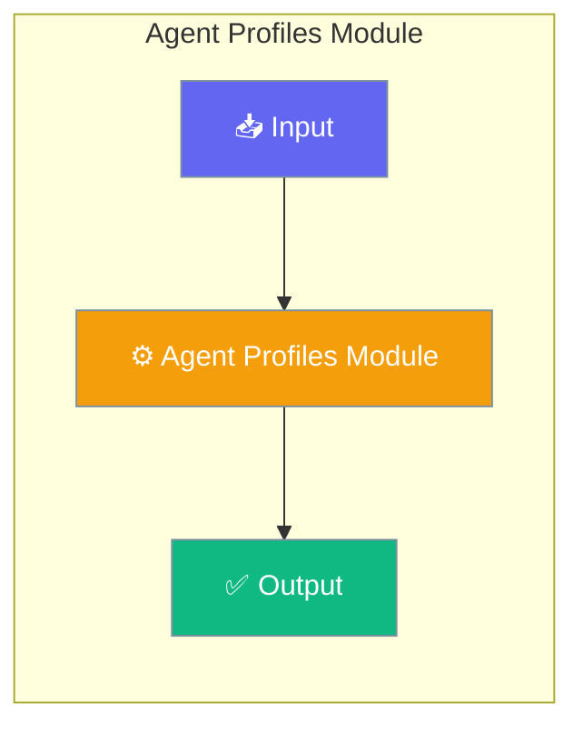

# Agent Profiles Module

The Agent Profiles module provides built-in agent profiles and mode configurations for common agent use cases.




## Features

- **Built-in Profiles** - Pre-configured agents for common tasks
- **Agent Modes** - Primary, subagent, and all-context modes
- **Custom Profiles** - Register your own agent profiles
- **Profile Discovery** - List and filter available profiles

## Built-in Profiles

| Profile | Mode | Description |
|---------|------|-------------|
| `general` | Primary | General-purpose coding assistant |
| `coder` | All | Focused code implementation |
| `planner` | Subagent | Task planning and decomposition |
| `reviewer` | Subagent | Code review and quality |
| `explorer` | Subagent | Codebase exploration |
| `debugger` | Subagent | Debugging and troubleshooting |

## Quick Start


<Steps>
<Step title="Quick Start">
```python
from praisonaiagents.agents.profiles import (
    get_profile,
    list_profiles,
    register_profile,
    AgentProfile,
    AgentMode
)

# Get a built-in profile
coder = get_profile("coder")
print(f"Coder temperature: {coder.temperature}")

# List all profiles
for profile in list_profiles():
    print(f"{profile.name}: {profile.description}")
```
</Step>
</Steps>


## Best Practices

<AccordionGroup>
  <Accordion title="Start simple">
    Enable the feature with a single parameter before adding configuration. Verify it works, then layer in options.
  </Accordion>
  <Accordion title="Use environment variables for secrets">
    Never hardcode API keys or tokens. Use `os.getenv("KEY_NAME")` to read from environment variables.
  </Accordion>
  <Accordion title="Test with minimal examples first">
    Copy the Quick Start example, run it, then extend it. This confirms your environment is set up correctly.
  </Accordion>
  <Accordion title="Check the logs">
    Set `verbose=True` on your agent to see detailed execution logs when debugging unexpected behavior.
  </Accordion>
</AccordionGroup>

## Related

<CardGroup cols={2}>
  <Card title="Features Overview" icon="grid-2" href="/docs/features">
    Browse all PraisonAI features
  </Card>
  <Card title="Quick Start" icon="rocket" href="/docs/introduction">
    Get started with PraisonAI agents
  </Card>
</CardGroup>
