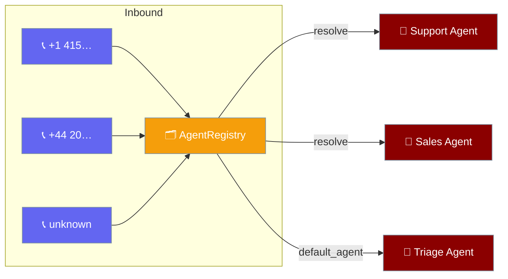
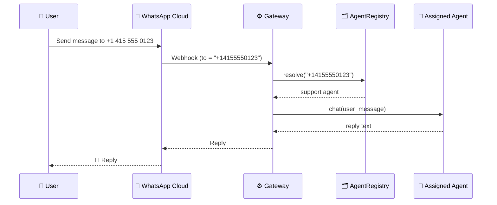
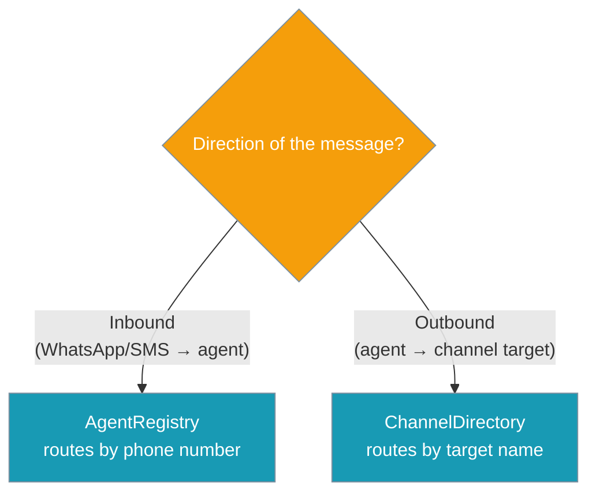

Assign each of your agents a phone number, drop them in a registry, and the gateway dispatches every inbound WhatsApp/SMS message to the right agent.

```python
from praisonaiagents import Agent
from praisonai_bot.bots import AgentRegistry

support = Agent(name="support", instructions="Help customers with product issues.")
sales   = Agent(name="sales",   instructions="Answer pricing and demo questions.")

registry = AgentRegistry(default_agent=support)
registry.assign("+1 (415) 555-0123", support)
registry.assign("+442071838750",    sales)

# The gateway calls this for every inbound message
agent = registry.resolve("+14155550123")  # → support
```



Users experience it as three separate helplines backed by one gateway:

| User texts | Number | Routed to | Reply |
|------------|--------|-----------|-------|
| Alice: "my order hasn't arrived" | +1 415 555 0123 | **support** agent | Shipment lookup |
| Bob: "what does the Pro plan cost?" | +44 20 7183 8750 | **sales** agent | Pricing answer |
| Priya: brand-new number | never seen before | **triage** default agent | "Who are you trying to reach?" |

## Quick Start

<Steps>
<Step title="Enable with a single agent">
One number, one agent. Normalisation means the formatting you assign with does not have to match the inbound format.

```python
from praisonaiagents import Agent
from praisonai_bot.bots import AgentRegistry

agent = Agent(name="support", instructions="Be helpful.")

registry = AgentRegistry()
registry.assign("+14155550123", agent)

registry.resolve("+1 (415) 555-0123")  # → agent  (normalisation matches)
```
</Step>

<Step title="Multiple agents, multiple numbers">
Add a `default_agent` so unknown numbers still get answered.

```python
from praisonaiagents import Agent
from praisonai_bot.bots import AgentRegistry

support = Agent(name="support", instructions="Product help.")
sales   = Agent(name="sales",   instructions="Pricing and demos.")
triage  = Agent(name="triage",  instructions="Greet new callers and route them.")

registry = AgentRegistry(default_agent=triage)
registry.assign("+14155550123", support)
registry.assign("+442071838750", sales)

registry.resolve("+14155550123")     # → support
registry.resolve("+61 400 123 456")  # → triage (fallback)
```
</Step>

<Step title="Wire it into a WhatsApp bot">
A real gateway calls `registry.resolve(inbound_number)` on every message, then hands the chat to the chosen agent. See [WhatsApp Bot](/docs/features/whatsapp-bot) for the full bot setup.

```python
from praisonai_bot.bots import AgentRegistry

registry = AgentRegistry(default_agent=triage)
registry.assign("+14155550123", support)
registry.assign("+442071838750", sales)

async def on_inbound(webhook):
    # `to_number` is the WhatsApp business number the user messaged
    agent = registry.resolve(webhook["to_number"])
    reply = await agent.chat(webhook["text"])
    return reply
```
</Step>
</Steps>

---

## How It Works

The gateway resolves the destination number to an agent, runs the chat, and replies on the same channel.



| Step | What happens |
|------|--------------|
| **Webhook** | The inbound message carries the business number the user texted (`to_number`) |
| **Resolve** | `registry.resolve(to_number)` returns the assigned agent, the `default_agent`, or `None` |
| **Chat** | The gateway runs the chosen agent with the user's text |
| **Reply** | The response is sent back on the same channel |

---

## Number Normalisation

`"+1 (415) 555-0123"` and `"+14155550123"` resolve to the same agent because `normalize_number` strips every non-digit and preserves a single leading `+`. Blank, non-string, or digit-free inputs normalise to `None`.

| Input | Normalised key |
|-------|----------------|
| `"+1 (415) 555-0123"` | `"+14155550123"` |
| `"+44 20 7183 8750"` | `"+442071838750"` |
| `"14155550123"` (no leading `+`) | `"14155550123"` |
| `""`, `"  "`, `None`, non-string | `None` |

---

## API Reference

### `AgentRegistry(default_agent=None)`

In-memory phone-number → agent routing table. No I/O, no dependencies. Not thread-safe.

| Option | Type | Default | Description |
|--------|------|---------|-------------|
| `default_agent` | `Any \| None` | `None` | Fallback returned by `resolve()` when the inbound number is unknown or blank. When `None`, unknown numbers resolve to `None`. |

**Methods**

| Method | Signature | Returns | Description |
|--------|-----------|---------|-------------|
| `assign` | `assign(number: str, agent: Any) -> str` | Normalised key (`str`) | Assign `number` to `agent`. Re-assigning replaces the previous agent. Raises `ValueError` if `number` normalises to empty. |
| `unassign` | `unassign(number: str) -> bool` | `bool` | Remove any agent for `number`. Returns `True` if a mapping was removed, else `False`. |
| `resolve` | `resolve(number: Optional[str]) -> Optional[Any]` | Agent or `None` | Return the agent assigned to `number`, else `default_agent`, else `None`. |
| `numbers` | `numbers() -> List[str]` | `List[str]` | All assigned (normalised) numbers. |
| `__contains__` | `number in registry` | `bool` | Membership test using the normalised key. |
| `__len__` | `len(registry)` | `int` | Number of assigned numbers. |
| `__iter__` | `for key, agent in registry` | `Iterator[Tuple[str, Any]]` | Iterate `(normalised_number, agent)` pairs. |

### `normalize_number(number)`

`normalize_number(number: Optional[str]) -> Optional[str]` returns the canonical key, or `None` when blank / non-string / no digits.

- Strips whitespace and formatting characters (spaces, dashes, parens, dots).
- Preserves a single leading `+`.

---

## AgentRegistry vs ChannelDirectory

Pick by message direction: `AgentRegistry` routes **inbound** by phone number; [`ChannelDirectory`](/docs/features/platform-aware-agents) routes **outbound** by target name.



---

## Common Patterns

**Fallback agent** — set a `default_agent` so unknown numbers are never left unanswered.

```python
from praisonaiagents import Agent
from praisonai_bot.bots import AgentRegistry

triage = Agent(name="triage", instructions="Greet new callers and route them.")
registry = AgentRegistry(default_agent=triage)

registry.resolve("+61 400 123 456")  # → triage (no assignment yet)
```

**Dynamic re-assignment** — remap or drop a number at runtime.

```python
registry.assign("+14155550123", sales)   # move that number to sales
registry.unassign("+442071838750")       # take sales off that number
"+14155550123" in registry               # → True
len(registry)                            # → 1
list(registry)                           # → [("+14155550123", <Agent name='sales'>)]
```

---

## Best Practices

<AccordionGroup>
<Accordion title="Prefer E.164 numbers">
Store numbers as `+<country><digits>` (E.164). Normalisation still handles human-typed variants like `"+1 (415) 555-0123"`, but E.164 is unambiguous and matches what most webhooks send.
</Accordion>

<Accordion title="Build one registry per process">
The registry holds references to already-constructed agents and does no I/O. Create it once at startup and consult it on every inbound message.
</Accordion>

<Accordion title="Always set a default_agent">
Set `AgentRegistry(default_agent=triage)` if you never want to leave an inbound message unanswered. Without it, unknown numbers resolve to `None` and the caller must handle that case.
</Accordion>

<Accordion title="AgentRegistry is not thread-safe">
Construct it before your gateway starts and treat it as read-mostly. If you mutate it from multiple threads, add your own lock.
</Accordion>
</AccordionGroup>

---

## Related

<CardGroup cols={2}>
<Card title="WhatsApp Bot" icon="whatsapp" href="/docs/features/whatsapp-bot">
Connect an agent to WhatsApp — Cloud API or Web mode.
</Card>
<Card title="Channels Gateway" icon="comments" href="/docs/features/channels-gateway">
Route agents across Telegram, Discord, Slack, and WhatsApp.
</Card>
<Card title="Messaging Bots" icon="robot" href="/docs/features/messaging-bots">
All supported messaging platforms in one place.
</Card>
<Card title="Platform-Aware Agents" icon="satellite-dish" href="/docs/features/platform-aware-agents">
Outbound routing with ChannelDirectory and ReachableTarget.
</Card>
</CardGroup>
