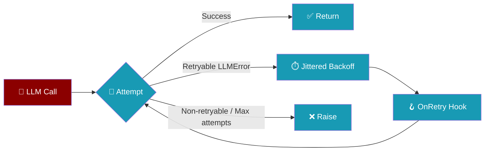
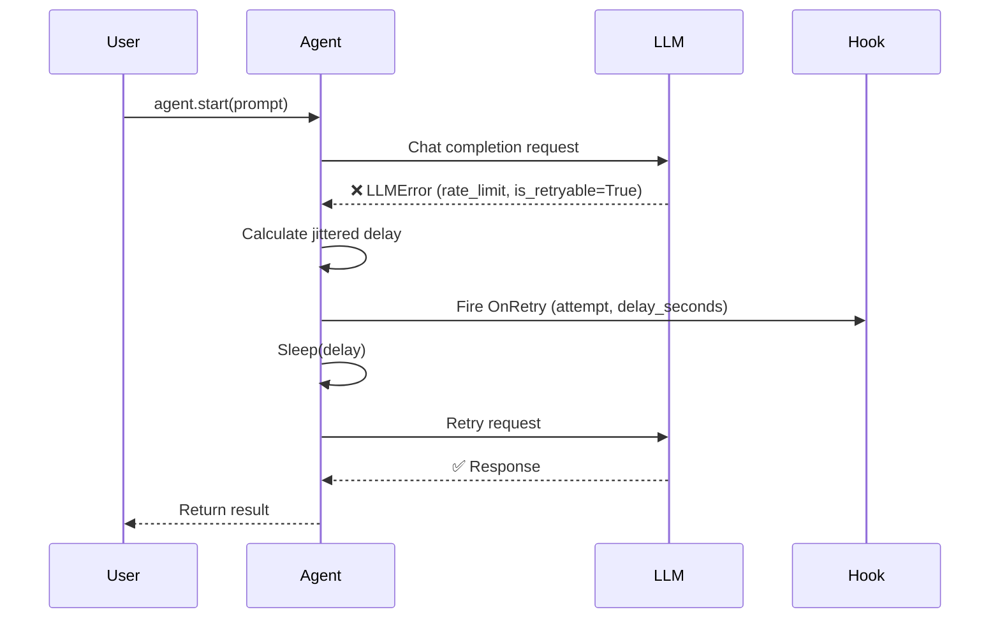
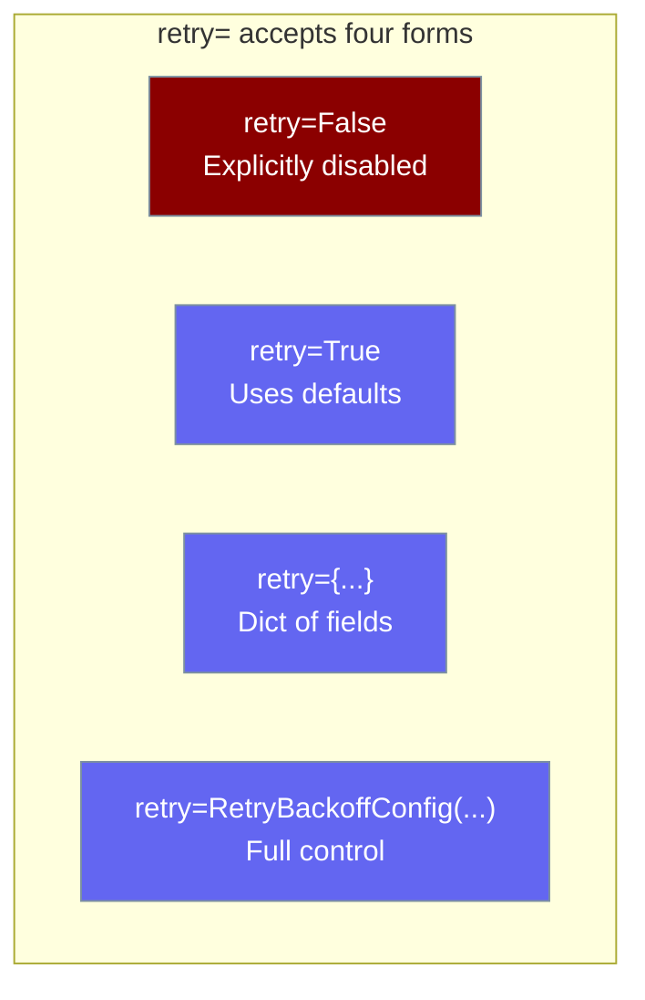

Agent retry automatically re-runs failed LLM calls — across single-shot, streaming, tool-iteration and reflection turns — with jittered exponential backoff so transient rate limits, overloads, and network blips don't break your agent. **Retry is on by default** (`max_retries=3`) on both the native OpenAI-client path and the LiteLLM path. Pass `retry=False` to opt out.

```python
from praisonaiagents import Agent

# Retry is on by default — no retry= needed.
agent = Agent(
    name="Researcher",
    instructions="Research topics on the web",
)
agent.start("Find recent papers on diffusion models")
```

The user runs an agent; transient LLM failures retry automatically with jittered backoff — no `retry=` argument needed.

<Note>
**Upgrading from a version before this fix**
- If you never set `retry=`, your Agent now retries transient errors 3 times by default. In most cases this is transparent and desired.
- If you relied on the old default (no retry) — a strict fail-fast pipeline or a local LLM endpoint — set `retry=False` on every affected Agent to restore the previous behaviour.
- Existing `retry=True`, `retry=dict`, and `retry=RetryBackoffConfig(...)` uses are unchanged.
</Note>

<Note>
Only errors classified as retryable by `LLMError.is_retryable` are retried — non-retryable errors (authentication failures, invalid-request errors) still raise immediately. The `ON_RETRY` hook fires once per retry attempt, on **both** the native and LiteLLM paths.
</Note>



## Quick Start

<Steps>
<Step title="Default — retries are already on">
```python
from praisonaiagents import Agent

# No retry= — retry is on by default with sensible settings.
agent = Agent(
    name="Researcher",
    instructions="Research topics on the web",
)
agent.start("Find recent papers on diffusion models")
```

An `Agent()` with no `retry=` argument retries transient LLM failures automatically — on both the native and LiteLLM paths.

The default policy: 3 retries, 5 s → 10 s → 20 s exponential schedule, capped at 120 s, with 50% additive jitter. `retry=True` is equivalent and explicit.
</Step>

<Step title="Disable with retry=False">
```python
from praisonaiagents import Agent

agent = Agent(
    name="Fast Checker",
    instructions="Quick health check",
    retry=False,
)
agent.start("Ping the model once")
```

`retry=False` turns retries off — the only way to opt out now that retries are on by default. Use it for strict fail-fast pipelines or local LLM servers (LM Studio / vLLM) that never emit `Retry-After`.
</Step>

<Step title="Tune with a dict (no extra import)">
```python
from praisonaiagents import Agent

agent = Agent(
    name="Researcher",
    instructions="Research topics on the web",
    retry={
        "max_retries": 5,
        "base_delay": 2.0,
        "max_delay": 60.0,
        "jitter_ratio": 0.3,
    },
)
agent.start("Find recent papers on diffusion models")
```
</Step>

<Step title="Full control with RetryBackoffConfig">
```python
from praisonaiagents import Agent, RetryBackoffConfig

agent = Agent(
    name="Researcher",
    instructions="Research topics on the web",
    retry=RetryBackoffConfig(
        base_delay=2.0,
        max_delay=60.0,
        jitter_ratio=0.3,
        max_retries=5,
    ),
)
agent.start("Find recent papers on diffusion models")
```
</Step>
</Steps>

---

## How It Works



| Aspect | Detail |
|--------|--------|
| **What gets retried** | Only `LLMError` where `is_retryable=True` (rate limits, overloads) |
| **What does NOT get retried** | Auth errors, invalid requests, non-retryable `LLMError`, any other exception |
| **Total attempts** | `max_retries + 1` (default: 4 total) |
| **Backoff schedule** | `min(base_delay × 2^attempt, max_delay) + uniform(0, jitter_ratio × delay)` |
| **Interruption** | Raises `RuntimeError("Agent interrupted during retry backoff")` immediately |
| **Default when `retry=` is unset** | Applies `RetryBackoffConfig()` (max_retries=3, base_delay=5.0, max_delay=120.0, jitter_ratio=0.5) — same as the LiteLLM path |

### Which turn shapes retry?

`retry=` applies to **every** LLM call the agent makes, whether the model is being called for the first turn, a streaming turn, a tool-iteration turn, a reflection turn, or an async equivalent. If you can configure it, it retries.

| Turn shape | Retried? |
|------------|----------|
| Non-streaming single-shot (`agent.start(...)`) | ✅ |
| Streaming (`agent.start(..., stream=True)`) | ✅ |
| Tool-iteration turns inside a multi-tool loop | ✅ |
| Reflection turns (when `self_reflect=True`) | ✅ |
| Async equivalents (`agent.astart(...)`) | ✅ |
| Reasoning-steps single-shot | ✅ |

`max_retries` also caps the **recursive** retries the LLM path performs after context compression and after backing off on a transient error. These were previously fixed at 2; they now follow the configured policy, and fall back to 2 only when retry is disabled (`retry=False`). Since retry is on by default, the recursive bound follows `max_retries=3` unless you override it.

<Note>
Coverage across streaming and tool-iteration paths was made consistent in [PraisonAI PR #2665](https://github.com/MervinPraison/PraisonAI/pull/2665). Before that release, streaming/tool-iter/reflection turns silently bypassed retry — a transient `429` on those paths surfaced raw. On current versions, `retry=` applies uniformly.
</Note>

<Note>
**Behavioural change (fix for [#3135](https://github.com/MervinPraison/PraisonAI/issues/3135)):** on versions after this fix, an `Agent()` created without a `retry=` argument uses `RetryBackoffConfig()` defaults on the native OpenAI-client path as well as the LiteLLM path. Prior to this fix, the native path silently skipped retries when `retry=` was not set. To restore the old "no retry" default, pass `retry=False`.
</Note>

<Warning>
**Behavioural change:** `RetryBackoffConfig.max_retries` now also bounds the internal recursive retry loop. If you set `max_retries=5`, the compression / transient-backoff paths will now retry up to 5 times instead of the previous fixed 2.
</Warning>

---

## Configuration Options



Omitting `retry=` is the same as `retry=True` — the default `RetryBackoffConfig()` applies.

### RetryBackoffConfig Fields

| Option | Type | Default | Description |
|--------|------|---------|-------------|
| `base_delay` | `float` | `5.0` | Base delay in seconds for the first retry. |
| `max_delay` | `float` | `120.0` | Upper cap on any single backoff (after jitter). |
| `jitter_ratio` | `float` | `0.5` | Adds `uniform(0, jitter_ratio × delay)` on top of exponential delay. Set `0.0` to disable jitter. |
| `max_retries` | `int` | `3` | Maximum number of retries. Bounds **both** the outer `LLMError`-throwing retry loop (up to 4 total attempts by default) **and** the recursive `_chat_completion` retries after context compression / transient backoff. When retry is disabled (`retry=False`), the internal loop caps at 2 for backwards compatibility. |

**Validation** — the constructor raises `ValueError` if:
- `base_delay <= 0`
- `max_delay < base_delay`
- `jitter_ratio` outside `[0, 1]`
- `max_retries < 0`

### Precedence & Defaults

| You pass | What happens |
|----------|--------------|
| Nothing (omit `retry=`) or `retry=None` | **`RetryBackoffConfig()` with `max_retries=3`** — retries transient errors on both native and LiteLLM paths |
| `retry=False` | **Off** — no retry loop on either path (fast fail) |
| `retry=True` | Same as default (`RetryBackoffConfig()`, `max_retries=3`) |
| `retry=RetryBackoffConfig(...)` | Fully custom |
| `retry={"max_retries": N, ...}` (dict) | Converted to `RetryBackoffConfig(**dict)` |

```python
# Default — retry ON with sensible defaults (max_retries=3)
agent = Agent(name="A", instructions="...")

# retry=True — same as default
agent = Agent(name="A", instructions="...", retry=True)

# retry=False — OFF, fast fail on both paths
agent = Agent(name="A", instructions="...", retry=False)

# Dict — constructed from field names
agent = Agent(name="A", instructions="...", retry={"max_retries": 5, "base_delay": 2.0})

# RetryBackoffConfig — used directly
from praisonaiagents import Agent, RetryBackoffConfig

agent = Agent(
    name="A",
    instructions="...",
    retry=RetryBackoffConfig(max_retries=5, base_delay=2.0),
)
```

---

## Common Patterns

### Rate-limit friendly long jobs

```python
from praisonaiagents import Agent, RetryBackoffConfig

agent = Agent(
    name="Batch Processor",
    instructions="Process a large batch of documents",
    retry=RetryBackoffConfig(
        base_delay=1.0,
        max_delay=300.0,
        jitter_ratio=0.5,
        max_retries=10,
    ),
)
agent.start("Summarise all 500 documents in the queue")
```

### Strict mode — fail fast

Pass `retry=False` to disable retries entirely and surface transient errors immediately.

```python
from praisonaiagents import Agent

agent = Agent(
    name="Fast Checker",
    instructions="Quick health check",
    retry=False,
)
```

For a small-but-nonzero budget, keep retries on with a low `max_retries`:

```python
from praisonaiagents import Agent, RetryBackoffConfig

agent = Agent(
    name="Fast Checker",
    instructions="Quick health check",
    retry=RetryBackoffConfig(max_retries=1),
)
```

### Disable recursive retries entirely

Set `max_retries=0` to disable the recursive compression / transient-backoff retries while keeping the retry policy configured.

```python
from praisonaiagents import Agent, RetryBackoffConfig

agent = Agent(
    name="No Recursion",
    instructions="Surface transient failures immediately",
    retry=RetryBackoffConfig(max_retries=0),
)
```

### Reproducible tests — disable jitter

```python
from praisonaiagents import Agent, RetryBackoffConfig

agent = Agent(
    name="Test Agent",
    instructions="Deterministic for testing",
    retry=RetryBackoffConfig(jitter_ratio=0.0),
)
```

### Observe retries with a hook

```python
from praisonaiagents import Agent, RetryBackoffConfig
from praisonaiagents.hooks import HookRegistry, HookEvent

registry = HookRegistry()

@registry.on(HookEvent.ON_RETRY)
def on_retry(event):
    print(
        f"[retry] attempt {event.attempt + 1}/{event.max_retries} "
        f"in {event.delay_seconds:.1f}s: {event.error_message[:80]}"
    )

agent = Agent(
    name="API Caller",
    instructions="Call the API",
    retry=RetryBackoffConfig(max_retries=5),
    hooks=registry,
)
agent.start("Fetch the latest data")
```

The `OnRetry` hook receives:

| Field | Type | Description |
|-------|------|-------------|
| `attempt` | `int` | Current attempt number (0-based) |
| `max_retries` | `int` | Configured max retries |
| `delay_seconds` | `float` | Seconds the agent will sleep before the next attempt |
| `error_message` | `str` | String representation of the failing `LLMError` |
| `operation` | `str` | `"llm_request"` (sync) or `"async_llm_request"` (async) |

---

## Observability

The same backoff moment surfaces through **two** consumers — pick whichever fits your integration:

| Consumer | Best for | Payload |
|----------|----------|---------|
| [`ON_RETRY` hook](#observe-retries-with-a-hook) | Programmatic control, metrics, alerting | `attempt`, `max_retries`, `delay_seconds`, `error_message`, `operation` |
| [`RETRY` stream event](/docs/features/streaming#reacting-to-retries) | Live UIs and `stream-json` pipelines | `event.metadata`: `attempt`, `max_attempts`, `delay`, `reason` |

Same signal, two consumers — hooks for programmatic control, stream events for live UIs and stream-json pipelines. When a run uses `praisonai run --output stream-json`, the stream event is emitted as a canonical [`run.retry` NDJSON event](/docs/features/run-stream-events#event-schema-schema_version--1), so a rate-limited run shows `retrying in Ns (attempt k/N)` instead of a silent-looking terminal.

```python
from praisonaiagents import Agent
from praisonaiagents.streaming import StreamEvent, StreamEventType

def on_event(event: StreamEvent):
    if event.type == StreamEventType.RETRY:
        m = event.metadata or {}
        print(f"Retrying in {m['delay']:.1f}s (attempt {m['attempt']}/{m['max_attempts']}) — {m['reason']}")

agent = Agent(name="API Caller", instructions="Call the API")
agent.stream_emitter.add_callback(on_event)
agent.start("Fetch the latest data")
```

---

## Best Practices

<AccordionGroup>
<Accordion title="Keep the defaults, tune only when needed">
The defaults (`base_delay=5.0`, `max_delay=120.0`, `jitter_ratio=0.5`, `max_retries=3`) ship on every Agent and suit most OpenAI and Anthropic rate-limit patterns. Leave `retry=` off and only tune when you observe systematic timeouts or excessive waiting.
</Accordion>

<Accordion title="Opt out with retry=False for strict fail-fast paths">
If your pipeline needs to surface transient LLM errors immediately — a health check, a local LM Studio / vLLM endpoint that never emits `Retry-After`, or a batch job with a hard wall-clock budget — pass `retry=False` explicitly. Omitting `retry=` no longer disables retries.
</Accordion>

<Accordion title="Don't disable jitter in production">
Setting `jitter_ratio=0.0` creates a deterministic schedule that is useful for tests but dangerous in production. When many agents share the same API key and all retry at the same second, they hammer the endpoint simultaneously — exactly what jitter prevents. Keep `jitter_ratio` at `0.3` or higher in production.
</Accordion>

<Accordion title="Cap max_delay for user-facing flows">
A 120-second wait is acceptable for background batch jobs but not when a human is waiting for a response. For interactive agents, set `max_delay` to something like `20.0` or `30.0`, and keep `max_retries` low (`1`–`2`).
</Accordion>

<Accordion title="Use the OnRetry hook for observability, not control flow">
The `OnRetry` hook is the right place to log metrics and send alerts. Retries are best-effort — if all attempts fail, the original `LLMError` propagates to your caller. Build your resilience strategy around catching that exception in your application code, not inside the hook.
</Accordion>
</AccordionGroup>

---

## Related

<Note>
Agent retry now applies to **both** the LiteLLM-backed agent loop **and** the native OpenAI-client path by default (`max_retries=3`). For the SDK-level `Retry-After` + backoff on the native `OpenAIClient` used by `AutoAgents` and direct `get_openai_client()` callers, see [OpenAI Client Retries](/docs/features/openai-client-retries).
</Note>

<CardGroup cols={2}>
<Card title="OpenAI Client Retries" icon="rotate" href="/docs/features/openai-client-retries">
  SDK-level `Retry-After` + backoff for the native OpenAI client path.
</Card>
<Card title="Tool Retry Policy" icon="wrench" href="/docs/features/tool-retry-policy">
  Retry **tool** calls — a different surface from LLM call retry.
</Card>
<Card title="Structured LLM Errors" icon="circle-alert" href="/docs/features/structured-llm-errors">
  Which `LLMError` categories are classified as retryable.
</Card>
<Card title="Hook Events" icon="webhook" href="/docs/features/hook-events">
  The `OnRetry` event and all other lifecycle hooks.
</Card>
<Card title="Agent Retry Strategies" icon="rotate-right" href="/docs/best-practices/agent-retry-strategies">
  Strategy guidance for production retry patterns.
</Card>
</CardGroup>
