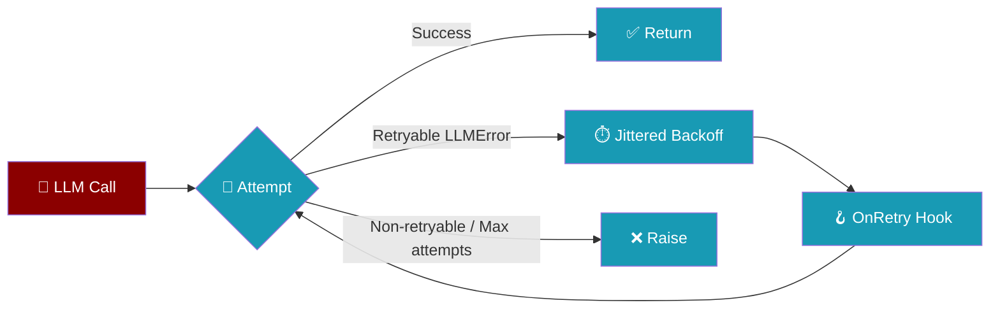
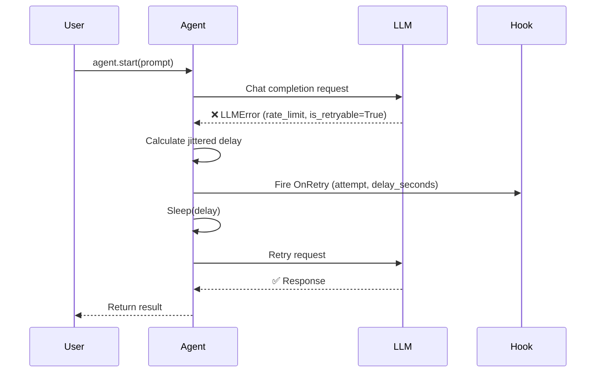
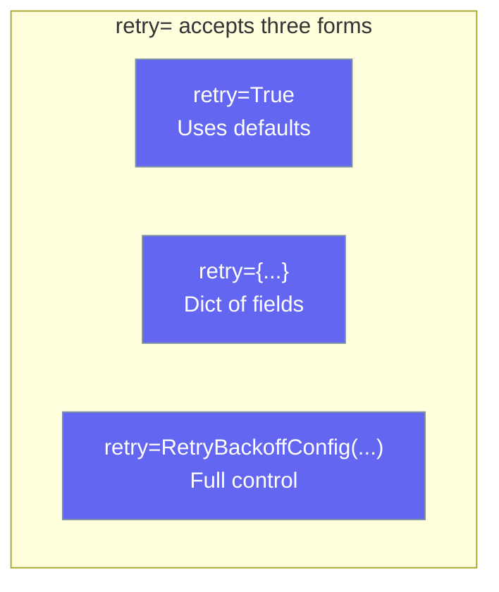

Agent retry automatically re-runs failed LLM calls — across single-shot, streaming, tool-iteration and reflection turns — with jittered exponential backoff so transient rate limits, overloads, and network blips don't break your agent.

```python
from praisonaiagents import Agent

agent = Agent(
    name="Researcher",
    instructions="Research topics on the web",
    retry=True,
)
agent.start("Find recent papers on diffusion models")
```

The user runs an agent; transient LLM failures retry automatically with jittered backoff.



## Quick Start

<Steps>
<Step title="Enable with True (simplest)">
```python
from praisonaiagents import Agent

agent = Agent(
    name="Researcher",
    instructions="Research topics on the web",
    retry=True,
)
agent.start("Find recent papers on diffusion models")
```

The user sends a research query; transient LLM failures trigger automatic retries with backoff.

`retry=True` enables retry with sensible defaults: 3 retries, 5 s → 10 s → 20 s exponential schedule, capped at 120 s, with 50% additive jitter.
</Step>

<Step title="Tune with a dict (no extra import)">
```python
from praisonaiagents import Agent

agent = Agent(
    name="Researcher",
    instructions="Research topics on the web",
    retry={
        "max_retries": 5,
        "base_delay": 2.0,
        "max_delay": 60.0,
        "jitter_ratio": 0.3,
    },
)
agent.start("Find recent papers on diffusion models")
```
</Step>

<Step title="Full control with RetryBackoffConfig">
```python
from praisonaiagents import Agent, RetryBackoffConfig

agent = Agent(
    name="Researcher",
    instructions="Research topics on the web",
    retry=RetryBackoffConfig(
        base_delay=2.0,
        max_delay=60.0,
        jitter_ratio=0.3,
        max_retries=5,
    ),
)
agent.start("Find recent papers on diffusion models")
```
</Step>
</Steps>

---

## How It Works



| Aspect | Detail |
|--------|--------|
| **What gets retried** | Only `LLMError` where `is_retryable=True` (rate limits, overloads) |
| **What does NOT get retried** | Auth errors, invalid requests, non-retryable `LLMError`, any other exception |
| **Total attempts** | `max_retries + 1` (default: 4 total) |
| **Backoff schedule** | `min(base_delay × 2^attempt, max_delay) + uniform(0, jitter_ratio × delay)` |
| **Interruption** | Raises `RuntimeError("Agent interrupted during retry backoff")` immediately |

### Which turn shapes retry?

`retry=` applies to **every** LLM call the agent makes, whether the model is being called for the first turn, a streaming turn, a tool-iteration turn, a reflection turn, or an async equivalent. If you can configure it, it retries.

| Turn shape | Retried? |
|------------|----------|
| Non-streaming single-shot (`agent.start(...)`) | ✅ |
| Streaming (`agent.start(..., stream=True)`) | ✅ |
| Tool-iteration turns inside a multi-tool loop | ✅ |
| Reflection turns (when `self_reflect=True`) | ✅ |
| Async equivalents (`agent.astart(...)`) | ✅ |
| Reasoning-steps single-shot | ✅ |

`max_retries` also caps the **recursive** retries the LLM path performs after context compression and after backing off on a transient error. These were previously fixed at 2; they now follow the configured policy, and fall back to 2 only when `retry=` is not set.

<Note>
Coverage across streaming and tool-iteration paths was made consistent in [PraisonAI PR #2665](https://github.com/MervinPraison/PraisonAI/pull/2665). Before that release, streaming/tool-iter/reflection turns silently bypassed retry — a transient `429` on those paths surfaced raw. On current versions, `retry=` applies uniformly.
</Note>

<Warning>
**Behavioural change:** `RetryBackoffConfig.max_retries` now also bounds the internal recursive retry loop. If you set `max_retries=5`, the compression / transient-backoff paths will now retry up to 5 times instead of the previous fixed 2.
</Warning>

---

## Configuration Options



### RetryBackoffConfig Fields

| Option | Type | Default | Description |
|--------|------|---------|-------------|
| `base_delay` | `float` | `5.0` | Base delay in seconds for the first retry. |
| `max_delay` | `float` | `120.0` | Upper cap on any single backoff (after jitter). |
| `jitter_ratio` | `float` | `0.5` | Adds `uniform(0, jitter_ratio × delay)` on top of exponential delay. Set `0.0` to disable jitter. |
| `max_retries` | `int` | `3` | Maximum number of retries. Bounds **both** the outer `LLMError`-throwing retry loop (up to 4 total attempts by default) **and** the recursive `_chat_completion` retries after context compression / transient backoff. When `retry=` is not set, the internal loop caps at 2 for backwards compatibility. |

**Validation** — the constructor raises `ValueError` if:
- `base_delay <= 0`
- `max_delay < base_delay`
- `jitter_ratio` outside `[0, 1]`
- `max_retries < 0`

### Precedence

```python
# Bool — enable with defaults
agent = Agent(name="A", instructions="...", retry=True)

# Dict — constructed from field names
agent = Agent(name="A", instructions="...", retry={"max_retries": 5, "base_delay": 2.0})

# RetryBackoffConfig — used directly
from praisonaiagents import Agent, RetryBackoffConfig

agent = Agent(
    name="A",
    instructions="...",
    retry=RetryBackoffConfig(max_retries=5, base_delay=2.0),
)

# None (default) — no retry
agent = Agent(name="A", instructions="...")
```

---

## Common Patterns

### Rate-limit friendly long jobs

```python
from praisonaiagents import Agent, RetryBackoffConfig

agent = Agent(
    name="Batch Processor",
    instructions="Process a large batch of documents",
    retry=RetryBackoffConfig(
        base_delay=1.0,
        max_delay=300.0,
        jitter_ratio=0.5,
        max_retries=10,
    ),
)
agent.start("Summarise all 500 documents in the queue")
```

### Strict mode — fail fast

```python
from praisonaiagents import Agent, RetryBackoffConfig

agent = Agent(
    name="Fast Checker",
    instructions="Quick health check",
    retry=RetryBackoffConfig(max_retries=1),
)
```

### Disable recursive retries entirely

Set `max_retries=0` to disable the recursive compression / transient-backoff retries while keeping the retry policy configured.

```python
from praisonaiagents import Agent, RetryBackoffConfig

agent = Agent(
    name="No Recursion",
    instructions="Surface transient failures immediately",
    retry=RetryBackoffConfig(max_retries=0),
)
```

### Reproducible tests — disable jitter

```python
from praisonaiagents import Agent, RetryBackoffConfig

agent = Agent(
    name="Test Agent",
    instructions="Deterministic for testing",
    retry=RetryBackoffConfig(jitter_ratio=0.0),
)
```

### Observe retries with a hook

```python
from praisonaiagents import Agent, RetryBackoffConfig
from praisonaiagents.hooks import HookRegistry, HookEvent

registry = HookRegistry()

@registry.on(HookEvent.ON_RETRY)
def on_retry(event):
    print(
        f"[retry] attempt {event.attempt + 1}/{event.max_retries} "
        f"in {event.delay_seconds:.1f}s: {event.error_message[:80]}"
    )

agent = Agent(
    name="API Caller",
    instructions="Call the API",
    retry=RetryBackoffConfig(max_retries=5),
    hooks=registry,
)
agent.start("Fetch the latest data")
```

The `OnRetry` hook receives:

| Field | Type | Description |
|-------|------|-------------|
| `attempt` | `int` | Current attempt number (0-based) |
| `max_retries` | `int` | Configured max retries |
| `delay_seconds` | `float` | Seconds the agent will sleep before the next attempt |
| `error_message` | `str` | String representation of the failing `LLMError` |
| `operation` | `str` | `"llm_request"` (sync) or `"async_llm_request"` (async) |

---

## Best Practices

<AccordionGroup>
<Accordion title="Start with retry=True, tune later">
The defaults (`base_delay=5.0`, `max_delay=120.0`, `jitter_ratio=0.5`, `max_retries=3`) are well-suited to most OpenAI and Anthropic rate-limit patterns. Start with `retry=True` and only tune when you observe systematic timeouts or excessive waiting.
</Accordion>

<Accordion title="Don't disable jitter in production">
Setting `jitter_ratio=0.0` creates a deterministic schedule that is useful for tests but dangerous in production. When many agents share the same API key and all retry at the same second, they hammer the endpoint simultaneously — exactly what jitter prevents. Keep `jitter_ratio` at `0.3` or higher in production.
</Accordion>

<Accordion title="Cap max_delay for user-facing flows">
A 120-second wait is acceptable for background batch jobs but not when a human is waiting for a response. For interactive agents, set `max_delay` to something like `20.0` or `30.0`, and keep `max_retries` low (`1`–`2`).
</Accordion>

<Accordion title="Use the OnRetry hook for observability, not control flow">
The `OnRetry` hook is the right place to log metrics and send alerts. Retries are best-effort — if all attempts fail, the original `LLMError` propagates to your caller. Build your resilience strategy around catching that exception in your application code, not inside the hook.
</Accordion>
</AccordionGroup>

---

## Related

<Note>
Agent retry covers the LiteLLM-backed agent loop. For the native `OpenAIClient` path used by `AutoAgents` and direct `get_openai_client()` callers, see [OpenAI Client Retries](/docs/features/openai-client-retries).
</Note>

<CardGroup cols={2}>
<Card title="OpenAI Client Retries" icon="rotate" href="/docs/features/openai-client-retries">
  SDK-level `Retry-After` + backoff for the native OpenAI client path.
</Card>
<Card title="Tool Retry Policy" icon="wrench" href="/docs/features/tool-retry-policy">
  Retry **tool** calls — a different surface from LLM call retry.
</Card>
<Card title="Structured LLM Errors" icon="circle-alert" href="/docs/features/structured-llm-errors">
  Which `LLMError` categories are classified as retryable.
</Card>
<Card title="Hook Events" icon="webhook" href="/docs/features/hook-events">
  The `OnRetry` event and all other lifecycle hooks.
</Card>
<Card title="Agent Retry Strategies" icon="rotate-right" href="/docs/best-practices/agent-retry-strategies">
  Strategy guidance for production retry patterns.
</Card>
</CardGroup>
