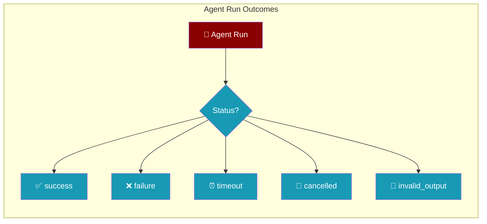
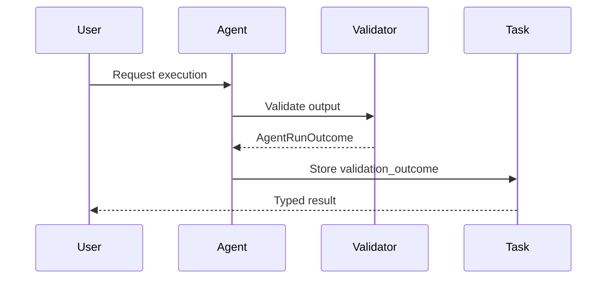
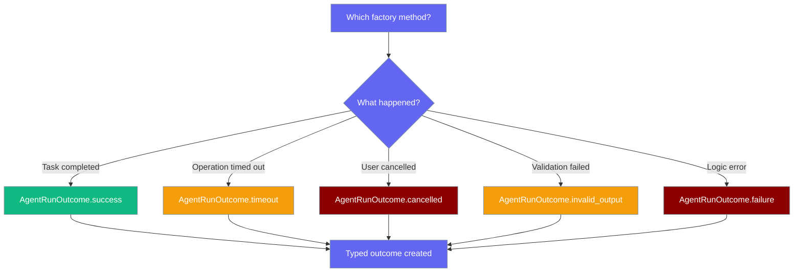

Run outcomes give every agent execution a typed status so your code can handle success, failure, timeout, cancellation, and invalid output exhaustively — no string matching.

The user handles every finish state in code; the agent returns a typed `AgentRunOutcome` instead of an ambiguous string.



## Quick Start

<Steps>
<Step title="Simple Usage">
Every agent execution returns an `AgentRunOutcome` that you can check for success.

```python
from praisonaiagents import Agent, AgentRunOutcome

agent = Agent(
    name="Research Agent",
    instructions="Research the given topic thoroughly"
)

# Agent executes and produces an outcome
result = agent.start("Research renewable energy")

# Check the outcome
if result.outcome.is_success():
    print(f"Success: {result.outcome.output}")
else:
    print(f"Failed: {result.outcome.error}")
```
</Step>

<Step title="Exhaustive Matching">
Match all five status types exhaustively to handle every possible outcome.

```python
from praisonaiagents import Agent, AgentRunOutcome

agent = Agent(name="Validator")
result = agent.start("Validate this data")

# Handle all possible outcomes
if result.outcome.status == "success":
    process_success(result.outcome.output)
elif result.outcome.status == "timeout":
    retry_with_longer_timeout(result)
elif result.outcome.status == "invalid_output":
    fix_validation_and_retry(result)
elif result.outcome.status == "cancelled":
    handle_cancellation(result)
elif result.outcome.status == "failure":
    log_permanent_error(result.outcome.error)
```
</Step>

<Step title="Validation Routing">
Access typed outcomes from task validation instead of parsing strings.

```python
from praisonaiagents import Agent, Task, PraisonAIAgents

# Setup workflow with validation
workflow = PraisonAIAgents(
    agents=[validator_agent, executor_agent],
    tasks=[
        Task(description="Validate input", task_type="decision"),
        Task(description="Execute if valid")
    ]
)

result = workflow.kickoff()

# Check validation outcome
validation_task = result.tasks[0]
if validation_task.validation_outcome.status == "invalid_output":
    print(f"Validation failed: {validation_task.validation_outcome.error}")
    retry_with_fixes()
else:
    proceed_to_execution()
```
</Step>
</Steps>

---

## How It Works



Every agent execution produces an `AgentRunOutcome` with a typed status that enables exhaustive pattern matching:

| Status | Meaning | Retryable | When It Occurs |
|--------|---------|-----------|----------------|
| `success` | Completed successfully | No | Agent produced valid output |
| `failure` | Non-retryable logic error | No | Unhandled exception, logic error |
| `timeout` | Operation exceeded time limit | **Yes** | Slow LLM, network hang |
| `cancelled` | External cancel signal | No | User Ctrl-C, parent cancelled child |
| `invalid_output` | Output didn't pass validation | **Yes** | Wrong format, validator rejected |

---

## The Five Statuses

| Status | Meaning | Retryable | Typical Cause |
|--------|---------|-----------|---------------|
| `success` | Completed successfully | No | Agent produced valid output |
| `failure` | Non-retryable logic error | No | Unhandled exception, validation logic error |
| `timeout` | Operation exceeded time limit | **Yes** | Slow LLM, slow tool, network hang |
| `cancelled` | External cancel signal | No | User Ctrl-C, parent agent cancelled child |
| `invalid_output` | Output didn't pass validation | **Yes** | Wrong format, missing fields, validator rejected |

---

## Creating Outcomes

Create outcomes using factory methods — each sets appropriate defaults automatically.

```python
from praisonaiagents import AgentRunOutcome

# Success with output
outcome = AgentRunOutcome.success(
    output="Task completed successfully",
    elapsed_s=2.5,
    agent_name="Research Agent"
)

# General failure
outcome = AgentRunOutcome.failure(
    error="Unexpected error occurred",
    error_category="execution",
    agent_name="Analysis Agent"
)

# Timeout - auto-sets error_category="timeout"
outcome = AgentRunOutcome.timeout(
    error="Agent timed out after 30s",
    elapsed_s=30.0
)

# Cancelled - auto-sets error_category="cancelled"
outcome = AgentRunOutcome.cancelled(
    error="User cancelled the operation"
)

# Invalid output - auto-sets error_category="validation"
outcome = AgentRunOutcome.invalid_output(
    error="Output format is invalid"
)
```

---

## Retry Decisions

Use `is_retryable()` to determine if an operation can be retried safely.

```python
from praisonaiagents import Agent

agent = Agent(name="Processor")

for attempt in range(3):
    result = agent.start("Process data")
    
    if result.outcome.is_success():
        break
    elif result.outcome.is_retryable():
        print(f"Attempt {attempt + 1} failed: {result.outcome.error}")
        continue
    else:
        print(f"Permanent failure: {result.outcome.error}")
        break
```

---

## Reading the Outcome From a Task

After task validation routing, check both the new typed outcome and legacy feedback.

```python
from praisonaiagents import Task, PraisonAIAgents

# Task with decision routing
validation_task = Task(
    description="Validate the user input",
    task_type="decision"
)

workflow = PraisonAIAgents(
    agents=[validator_agent],
    tasks=[validation_task]
)

result = workflow.kickoff()

# Access typed outcome (recommended)
outcome = validation_task.validation_outcome
if outcome.status == "invalid_output":
    print(f"Validation failed: {outcome.error}")

# Legacy dict still available for backward compatibility
feedback = validation_task.validation_feedback
print(f"Legacy status: {feedback['status']}")
```

---

## HandoffResult Integration

Handoff results now include typed outcomes automatically derived from legacy fields.

```python
from praisonaiagents import Agent, handoff

billing_agent = Agent(name="Billing Agent")
support_agent = Agent(
    name="Support Agent",
    handoffs=[billing_agent]
)

# Handoff to billing agent
result = support_agent.handoff_to(billing_agent, "Handle billing issue")

# Check typed outcome
if result.outcome.status == "timeout":
    print(f"Handoff timed out: {result.outcome.error}")
    retry_handoff()
elif result.outcome.is_success():
    print(f"Handoff successful: {result.outcome.output}")
```

---

## Migration from String-Based Validation

Replace string parsing with typed status matching for safer code.

**Before:**
```python
# String parsing - error-prone
if decision_str in ["invalid", "retry", "failed", "errors"]:
    handle_validation_failure()
elif decision_str in ["success", "valid", "approved"]:
    proceed_with_task()
```

**After:**
```python
# Typed matching - exhaustive and safe
if outcome.status == "invalid_output":
    handle_validation_failure()
elif outcome.status == "success":
    proceed_with_task()
```

For gradual migration, use the compatibility helper:
```python
from praisonaiagents import validate_decision_string

# Convert legacy string to typed status
status = validate_decision_string(legacy_decision_str)
if status == "invalid_output":
    handle_invalid_output()
```

---

## Decision Flow



---

## Best Practices

<AccordionGroup>
<Accordion title="Prefer status matching over string parsing">
Always match against the typed `status` field instead of parsing error messages or legacy strings.

```python
# Good - exhaustive type-safe matching
if outcome.status == "invalid_output":
    retry_with_fixes()

# Bad - brittle string parsing
if "invalid" in str(outcome.error):
    retry_with_fixes()
```
</Accordion>

<Accordion title="Use `is_retryable()` to drive retry logic">
Let the outcome determine retry behavior instead of hardcoding status lists.

```python
# Good - use built-in retry detection
if outcome.is_retryable():
    schedule_retry()

# Bad - maintain your own retry logic
if outcome.status in ["timeout", "invalid_output"]:
    schedule_retry()
```
</Accordion>

<Accordion title="Put structured data in `context`, not in `error`">
Use the `context` field for machine-readable metadata, keep `error` human-readable.

```python
# Good - structured context
outcome = AgentRunOutcome.failure(
    error="Database connection failed",
    context={
        "database_host": "db.example.com",
        "timeout_seconds": 30,
        "retry_count": 3
    }
)

# Bad - structured data in error message
outcome = AgentRunOutcome.failure(
    error="Database connection failed: host=db.example.com, timeout=30s"
)
```
</Accordion>

<Accordion title="Always handle all five statuses">
Exhaustive matching prevents bugs from unhandled cases. Avoid fall-through `else` clauses.

```python
# Good - explicit handling
if outcome.status == "success":
    handle_success(outcome.output)
elif outcome.status == "timeout":
    handle_timeout()
elif outcome.status == "invalid_output":
    handle_validation_error()
elif outcome.status == "cancelled":
    handle_cancellation()
elif outcome.status == "failure":
    handle_permanent_error()
# No else clause needed - all cases covered

# Bad - fall-through else
if outcome.status == "success":
    handle_success()
else:
    # What exactly happened? Unknown!
    handle_generic_error()
```
</Accordion>
</AccordionGroup>

---

## Related

<CardGroup cols={2}>
<Card title="Task Validation & Feedback" icon="check-circle" href="./task-validation-feedback">
  Task validation with typed outcomes
</Card>
<Card title="Agent Handoffs" icon="arrow-right-arrow-left" href="./handoffs">
  Agent-to-agent delegation with outcomes
</Card>
</CardGroup>