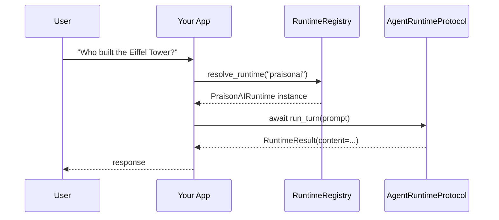
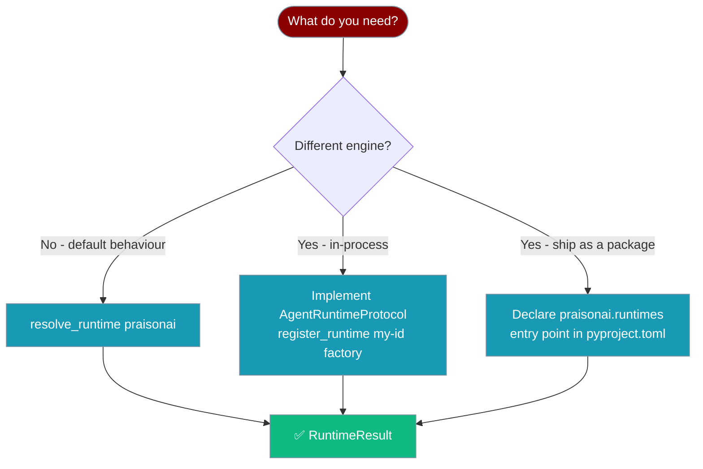

One protocol, many runtimes — pick the engine that runs a single agent turn without changing your Agent code.

```mermaid
graph LR
    A[👤 Agent + prompt]:::input --> R{Runtime Registry}:::config
    R -->|resolve_runtime "praisonai"| B[🏠 Built-in PraisonAIRuntime]:::process
    R -->|resolve_runtime "echo"| C[🧩 Custom Runtime]:::process
    R -->|entry-point praisonai.runtimes| D[📦 Plugin Runtime]:::process
    B --> O[✅ RuntimeResult / RuntimeDelta]:::result
    C --> O
    D --> O

    classDef input fill:#8B0000,stroke:#7C90A0,color:#fff
    classDef config fill:#6366F1,stroke:#7C90A0,color:#fff
    classDef process fill:#189AB4,stroke:#7C90A0,color:#fff
    classDef result fill:#10B981,stroke:#7C90A0,color:#fff
```

<Note>
`AgentRuntimeProtocol`, `resolve_runtime`, `register_runtime`, and `list_runtimes` are importable directly from `praisonaiagents` as of PR #2335. The deep `praisonaiagents.runtime.*` paths remain available for backward compatibility.
</Note>

## Quick Start

<Steps>
<Step title="Run a turn with the built-in runtime">
```python
import asyncio
from praisonaiagents import resolve_runtime

async def main():
    runtime = resolve_runtime("praisonai")
    result = await runtime.run_turn("Who built the Eiffel Tower?")
    print(result.content)

asyncio.run(main())
```
</Step>

<Step title="Stream the response">
```python
import asyncio
from praisonaiagents import resolve_runtime

async def main():
    runtime = resolve_runtime("praisonai")
    async for delta in runtime.stream_turn("Tell me a story"):
        if delta.type == "text":
            print(delta.content, end="")

asyncio.run(main())
```

<Note>
The built-in `praisonai` runtime currently yields a single delta containing the full response. True token-by-token streaming is pending Agent-side support.
</Note>
</Step>

<Step title="Register and use a custom runtime">
```python
import asyncio
from praisonaiagents import register_runtime, resolve_runtime
from praisonaiagents.runtime import RuntimeResult, RuntimeDelta

class EchoRuntime:
    def supports(self, model_ref=None):
        return True

    async def run_turn(self, prompt, **kwargs):
        return RuntimeResult(content=f"echo: {prompt}")

    async def stream_turn(self, prompt, **kwargs):
        yield RuntimeDelta(type="text", content=f"echo: {prompt}")

register_runtime("echo", lambda: EchoRuntime())

async def main():
    runtime = resolve_runtime("echo")
    result = await runtime.run_turn("Hello!")
    print(result.content)

asyncio.run(main())
```
</Step>
</Steps>

---

## How It Works

The registry auto-discovers built-in and plugin runtimes, then hands back an instance implementing `AgentRuntimeProtocol`.



| Stage | What happens |
|---|---|
| Discover | Registry auto-loads built-ins and plugin runtimes from `praisonai.runtimes` entry points |
| Resolve | `resolve_runtime("praisonai")` returns an `AgentRuntimeProtocol` instance |
| Execute | `await runtime.run_turn(prompt)` returns a `RuntimeResult`; `runtime.stream_turn(prompt)` yields `RuntimeDelta`s |
| Fail-closed | Unknown runtime IDs raise `ValueError` with the list of available IDs |

---

## Picking a Runtime



| You want… | Use |
|---|---|
| Default behaviour — wraps existing Agent | `resolve_runtime("praisonai")` |
| Different engine *in-process* | Implement `AgentRuntimeProtocol`, `register_runtime("my-id", factory)` |
| Different engine *shipped as a package* | Declare a `praisonai.runtimes` entry point |

---

## Configuration Options

### `AgentRuntimeProtocol`

Any object implementing these three methods is a valid runtime:

| Method | Signature | Notes |
|---|---|---|
| `supports` | `(model_ref=None) -> bool` | Return `True` if this runtime can handle the given model |
| `run_turn` | `(prompt, *, system_prompt=None, model_ref=None, **kwargs) -> RuntimeResult` | Async; run one agent turn |
| `stream_turn` | `(prompt, **kwargs) -> AsyncIterator[RuntimeDelta]` | Async generator; stream one agent turn |

`**kwargs` understood by the built-in runtime: `tools`, `max_tokens`, `temperature`.

### `RuntimeConfig`

| Field | Type | Default | Notes |
|---|---|---|---|
| `runtime_id` | `str` | required | Unique runtime identifier |
| `metadata` | `Dict[str, Any]` | `{}` | Optional runtime metadata |

### `RuntimeResult`

<Warning>
The built-in runtime returns `RuntimeResult(error=...)` instead of raising an exception when execution fails. Custom runtimes should follow the same pattern so callers handle failure uniformly.
</Warning>

| Field | Type | Default | Notes |
|---|---|---|---|
| `content` | `str` | required | Agent response text |
| `metadata` | `Dict[str, Any]` | `{}` | Includes `model`, `agent_id`, `runtime` |
| `error` | `Optional[str]` | `None` | Set on failure — runtime returns errors, does not raise |

### `RuntimeDelta`

| Field | Type | Default | Notes |
|---|---|---|---|
| `type` | `str` | required | `"text"`, `"tool_call"`, `"thinking"`, `"error"` |
| `content` | `str` | `""` | Delta payload |
| `metadata` | `Dict[str, Any]` | `{}` | Runtime metadata |

### `RuntimeRegistryEntry`

| Field | Type | Default | Notes |
|---|---|---|---|
| `runtime_id` | `str` | required | |
| `display_name` | `Optional[str]` | falls back to `runtime_id` | |
| `description` | `Optional[str]` | `None` | |
| `is_builtin` | `bool` | `False` | `True` for the `praisonai` runtime |
| `metadata` | `Dict[str, Any]` | `{}` | |

### `RuntimeRegistry` methods

| Method | Purpose |
|---|---|
| `register(runtime_id, factory_or_instance, **metadata)` | Register a runtime; raises `ValueError` if already registered |
| `unregister(runtime_id) -> bool` | Remove a runtime and any aliases pointing to it |
| `is_registered(runtime_id) -> bool` | Check if registered (or aliased) |
| `is_available(runtime_id) -> bool` | Alias for `is_registered` |
| `list_runtimes() -> List[RuntimeRegistryEntry]` | All registered runtimes with metadata |
| `list_names() -> List[str]` | IDs only |
| `get_entry(runtime_id) -> Optional[RuntimeRegistryEntry]` | Metadata for one runtime |
| `resolve(runtime_id, config_overrides=None)` | Instantiate runtime; raises `ValueError` with available IDs if not found |
| `add_alias(alias, canonical_runtime_id)` | Alias an existing runtime |
| `clear()` | Reset (for tests) |

---

## Common Patterns

### Implement a custom runtime

```python
from praisonaiagents import register_runtime
from praisonaiagents.runtime import RuntimeResult, RuntimeDelta

class MyRuntime:
    def supports(self, model_ref=None):
        return True

    async def run_turn(self, prompt, *, system_prompt=None, model_ref=None, **kwargs):
        response = await my_llm_client.complete(prompt, system=system_prompt)
        if response.error:
            return RuntimeResult(content="", error=response.error)
        return RuntimeResult(content=response.text)

    async def stream_turn(self, prompt, **kwargs):
        async for token in my_llm_client.stream(prompt):
            yield RuntimeDelta(type="text", content=token)

register_runtime("my-llm", lambda: MyRuntime())
```

### Plugin runtime via pyproject.toml

Ship your runtime as an installable package. The registry discovers it automatically at import time.

```toml
[project.entry-points."praisonai.runtimes"]
my-runtime = "my_package.runtime:MyRuntimeClass"
```

```python
# my_package/runtime.py
from praisonaiagents.runtime import RuntimeResult, RuntimeDelta

class MyRuntimeClass:
    def supports(self, model_ref=None):
        return True

    async def run_turn(self, prompt, **kwargs):
        return RuntimeResult(content=f"handled: {prompt}")

    async def stream_turn(self, prompt, **kwargs):
        yield RuntimeDelta(type="text", content=f"handled: {prompt}")
```

### Alias a runtime

```python
from praisonaiagents.runtime.registry import add_runtime_alias

add_runtime_alias("default", "praisonai")
```

### Replace the default runtime

```python
from praisonaiagents.runtime.registry import unregister_runtime
from praisonaiagents import register_runtime

unregister_runtime("praisonai")
register_runtime("praisonai", lambda: MyCustomRuntime())
```

### List available runtimes

```python
from praisonaiagents import list_runtimes

for runtime_id in list_runtimes():
    print(runtime_id)
```

### Check if a runtime is available

```python
from praisonaiagents.runtime.registry import is_runtime_available

if is_runtime_available("my-runtime"):
    runtime = resolve_runtime("my-runtime")
```

---

## Best Practices

<AccordionGroup>
<Accordion title="Return errors, don't raise">
The built-in runtime returns `RuntimeResult(error=...)` instead of raising. Custom runtimes should follow the same pattern so callers can handle failure uniformly with a single `if result.error:` check.
</Accordion>
<Accordion title="Use a factory for stateful runtimes">
Pass `register_runtime("id", lambda: MyRuntime())` so each `resolve_runtime` call gets a fresh instance. This is important for runtimes that hold per-turn state or open connections.
</Accordion>
<Accordion title="Emit typed deltas in stream_turn">
`stream_turn` yields `RuntimeDelta`s — emit `type="text"` for tokens, `type="error"` on failure, `type="tool_call"` or `type="thinking"` for richer UIs. Always end with an `error` delta rather than raising.
</Accordion>
<Accordion title="Use registry.clear() only in tests">
The registry is process-wide and thread-safe. Call `RuntimeRegistry().clear()` only in test teardown to avoid affecting other parts of your application.
</Accordion>
</AccordionGroup>

---

## Related

<CardGroup cols={2}>
<Card icon="cloud" href="/docs/features/managed-runtime-protocol">Run the whole agent loop on remote provider infrastructure</Card>
<Card icon="bolt" href="/docs/features/runtime-selection">Select runtimes by model or provider at the YAML level</Card>
<Card icon="route" href="/docs/features/runtime-resolution">Resolve and cache runtimes at turn time</Card>
<Card icon="plug" href="/docs/features/load-mcp-tools">Plug in tools from any Model Context Protocol server</Card>
</CardGroup>
