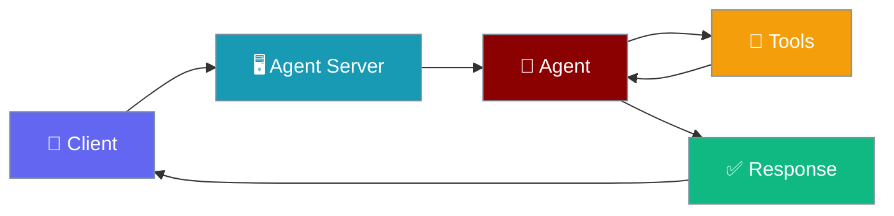

The Agent Server module provides an HTTP server with Server-Sent Events (SSE) for real-time agent communication.




## Features

- **REST API** - HTTP endpoints for agent operations
- **SSE Streaming** - Real-time event streaming to clients
- **CORS Support** - Configurable cross-origin settings
- **Multi-client** - Handle multiple concurrent connections

## Quick Start

<Steps>
<Step title="Basic Usage">
```python
from praisonaiagents.server import AgentServer, ServerConfig

# Create server with custom config
config = ServerConfig(
    host="0.0.0.0",
    port=8080,
    cors_origins=["http://localhost:3000"]
)

server = AgentServer(config=config)

# Start server (non-blocking)
server.start()

# Broadcast events to connected clients
server.broadcast("message", {"text": "Hello clients!"})

# Stop server
server.stop()
```
</Step>
</Steps>


## API Reference

### ServerConfig

```python
@dataclass
class ServerConfig:
    host: str = "127.0.0.1"
    port: int = 8765
    cors_origins: List[str] = ["*"]
    auth_token: Optional[str] = None
    max_connections: int = 100
```

### AgentServer

```python
class AgentServer:
    def start(self, blocking: bool = False) -> None:
        """Start the server."""
    
    def stop(self) -> None:
        """Stop the server and disconnect clients."""
    
    def broadcast(self, event_type: str, data: Dict) -> None:
        """Broadcast event to all connected clients."""
    
    @property
    def is_running(self) -> bool:
        """Check if server is running."""
    
    @property
    def client_count(self) -> int:
        """Get number of connected clients."""
```

## HTTP Endpoints

| Endpoint | Method | Description |
|----------|--------|-------------|
| `/health` | GET | Health check |
| `/info` | GET | Server information |
| `/events` | GET | SSE event stream |
| `/publish` | POST | Publish event to clients |

## Examples

### Context Manager

```python
from praisonaiagents.server import AgentServer

with AgentServer(port=8080) as server:
    # Server is running
    server.broadcast("status", {"ready": True})
    
    # Do work...
    
# Server automatically stopped
```

### Event Handler

```python
server = AgentServer()

@server.on_event("message")
def handle_message(data):
    print(f"Received: {data}")

server.start()
```

### Client Connection (JavaScript)

```javascript
const eventSource = new EventSource('http://localhost:8765/events');

eventSource.onmessage = (event) => {
    const data = JSON.parse(event.data);
    console.log('Received:', data);
};

eventSource.addEventListener('message', (event) => {
    console.log('Message event:', JSON.parse(event.data));
});
```

### Publishing Events

```bash
# Publish via HTTP
curl -X POST http://localhost:8765/publish \
  -H "Content-Type: application/json" \
  -d '{"type": "notification", "data": {"text": "Hello!"}}'
```
## Best Practices

<AccordionGroup>
<Accordion title="Start with defaults">
Use the built-in defaults first. Only add configuration when you hit a specific limitation.
</Accordion>
<Accordion title="Test incrementally">
Add one feature at a time and verify behaviour before combining features.
</Accordion>
<Accordion title="Monitor in production">
Watch token consumption and latency metrics when enabling advanced features in production.
</Accordion>
</AccordionGroup>

## Related

<CardGroup cols={2}>
<Card title="Async Jobs" icon="clock" href="/docs/features/async-jobs">
  Asynchronous job processing
</Card>
<Card title="Chat Interface" icon="comments" href="/docs/features/chat">
  Chat UI for agents
</Card>
</CardGroup>
