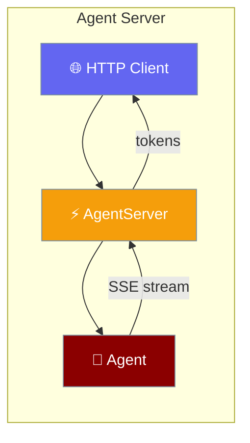
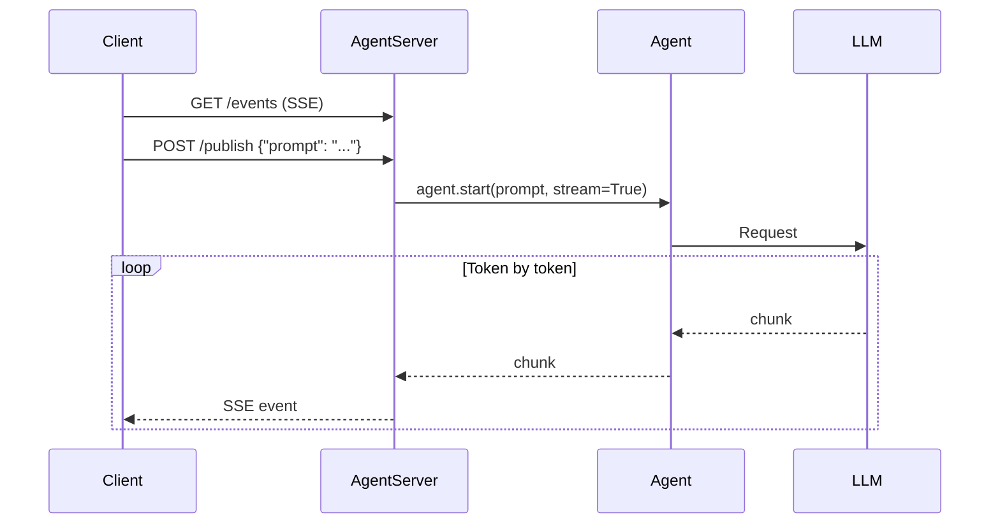

Expose any agent as an HTTP server with live token streaming — connect from a browser, CLI, or mobile app in minutes.



## Quick Start

<Steps>
<Step title="Install">
```bash
pip install praisonaiagents
```
</Step>

<Step title="Serve an agent">
```python
from praisonaiagents import Agent
from praisonaiagents.server import AgentServer

agent = Agent(
    name="Assistant",
    instructions="You are a helpful assistant."
)

server = AgentServer(agent=agent, port=8080)
server.start()
```
</Step>

<Step title="Connect from a browser">
```javascript
const eventSource = new EventSource('http://localhost:8080/events');

eventSource.onmessage = (event) => {
    const data = JSON.parse(event.data);
    document.write(data.text);
};
```
</Step>
</Steps>

---

## How It Works



| Endpoint | Method | Description |
|----------|--------|-------------|
| `/health` | GET | Health check |
| `/info` | GET | Server info and connected clients |
| `/events` | GET | SSE event stream |
| `/publish` | POST | Send prompt, receive streamed response |

---

## Configuration Options

```python
from praisonaiagents.server import AgentServer, ServerConfig

config = ServerConfig(
    host="0.0.0.0",
    port=8080,
    cors_origins=["http://localhost:3000"],
    auth_token=None,
    max_connections=100,
)

server = AgentServer(agent=agent, config=config)
```

| Option | Type | Default | Description |
|--------|------|---------|-------------|
| `host` | `str` | `"127.0.0.1"` | Bind address |
| `port` | `int` | `8765` | Port number |
| `cors_origins` | `List[str]` | `["*"]` | Allowed CORS origins |
| `auth_token` | `str` | `None` | Bearer token for auth |
| `max_connections` | `int` | `100` | Max concurrent clients |

---

## Common Patterns

### Context manager (auto-stop)

```python
from praisonaiagents import Agent
from praisonaiagents.server import AgentServer

agent = Agent(name="Assistant", instructions="You are a helpful assistant.")

with AgentServer(agent=agent, port=8080) as server:
    server.broadcast("status", {"ready": True})
    input("Press Enter to stop...")
```

### Broadcast to all clients

```python
server = AgentServer(agent=agent)
server.start()

server.broadcast("notification", {"text": "System update complete"})
print(f"Connected clients: {server.client_count}")
```

### Publish via curl

```bash
curl -X POST http://localhost:8080/publish \
  -H "Content-Type: application/json" \
  -d '{"prompt": "What is the weather today?"}'
```

---

## Best Practices

<AccordionGroup>
  <Accordion title="Use context manager for short-lived servers">
    Wrap the server in `with AgentServer(...) as server:` so it always stops cleanly — even on exceptions. Avoid calling `start()` and `stop()` manually unless you need non-blocking background mode.
  </Accordion>
  <Accordion title="Set CORS origins explicitly in production">
    The default `cors_origins=["*"]` is fine for development. In production, list only the domains that should connect: `cors_origins=["https://myapp.com"]`.
  </Accordion>
  <Accordion title="Add auth_token for public endpoints">
    Pass `auth_token="your-secret"` to require `Authorization: Bearer your-secret` on every request. Clients without the token receive 401.
  </Accordion>
  <Accordion title="Check client_count before broadcasting">
    `server.broadcast()` sends to all connected clients — if no clients are connected it is a no-op. Check `server.client_count > 0` before broadcasting time-sensitive events.
  </Accordion>
</AccordionGroup>

---

## Related

<CardGroup cols={2}>
  <Card title="Streaming" icon="bolt" href="/docs/features/streaming">
    Token-by-token streaming inside a single agent
  </Card>
  <Card title="Async" icon="clock" href="/docs/features/async">
    Async agent execution patterns
  </Card>
</CardGroup>
