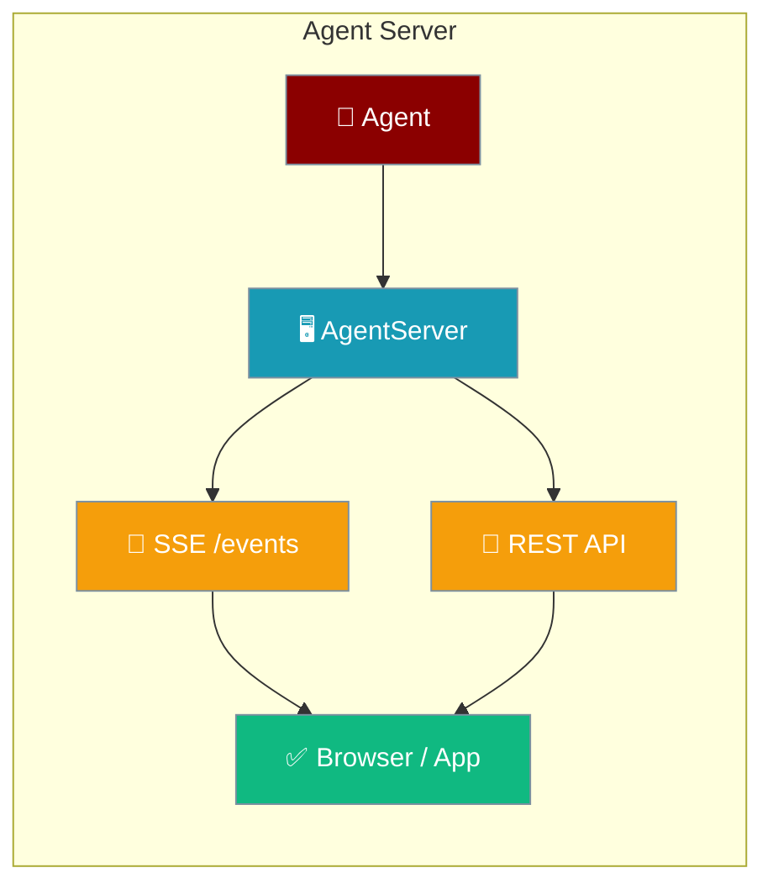
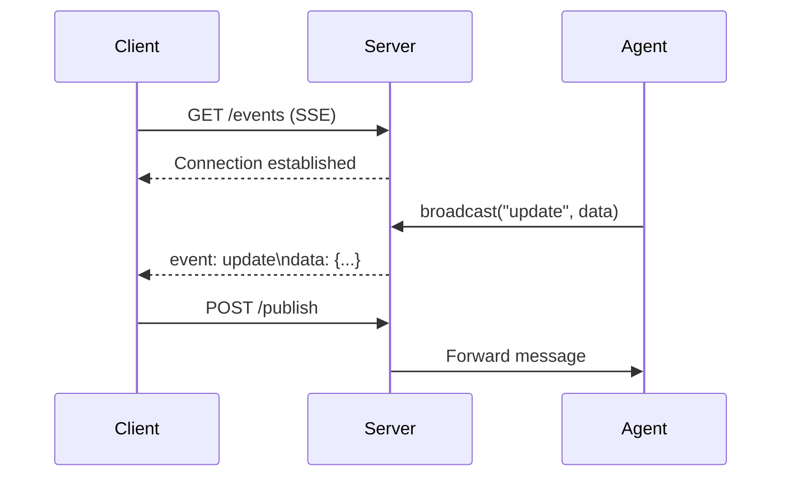

Agent Server exposes your agents over HTTP with Server-Sent Events (SSE) for real-time streaming to any client.



## Quick Start

<Steps>
<Step title="Start the server">
```python
from praisonaiagents.server import AgentServer

server = AgentServer(port=8765)
server.start()

server.broadcast("status", {"ready": True})
```
</Step>

<Step title="Connect from a browser">
```javascript
const eventSource = new EventSource('http://localhost:8765/events');

eventSource.onmessage = (event) => {
    const data = JSON.parse(event.data);
    console.log('Received:', data);
};
```
</Step>
</Steps>

---

## How It Works



---

## Configuration

```python
from praisonaiagents.server import AgentServer, ServerConfig

config = ServerConfig(
    host="0.0.0.0",
    port=8080,
    cors_origins=["http://localhost:3000"],
    auth_token="secret",
    max_connections=100
)

server = AgentServer(config=config)
server.start()
```

**ServerConfig Options:**

| Option | Type | Default | Description |
|--------|------|---------|-------------|
| `host` | `str` | `"127.0.0.1"` | Bind address |
| `port` | `int` | `8765` | Port number |
| `cors_origins` | `List[str]` | `["*"]` | Allowed origins |
| `auth_token` | `str` | `None` | Optional auth token |
| `max_connections` | `int` | `100` | Max concurrent clients |

---

## HTTP Endpoints

| Endpoint | Method | Description |
|----------|--------|-------------|
| `/health` | GET | Health check |
| `/info` | GET | Server information |
| `/events` | GET | SSE event stream |
| `/publish` | POST | Publish event to clients |

---

## Common Patterns

### Context Manager

```python
from praisonaiagents.server import AgentServer

with AgentServer(port=8080) as server:
    server.broadcast("status", {"ready": True})
```

### Event Handler

```python
from praisonaiagents.server import AgentServer

server = AgentServer()

@server.on_event("message")
def handle_message(data):
    print(f"Received: {data}")

server.start()
```

### Publish via HTTP

```bash
curl -X POST http://localhost:8765/publish \
  -H "Content-Type: application/json" \
  -d '{"type": "notification", "data": {"text": "Hello!"}}'
```

---

## Best Practices

<AccordionGroup>
<Accordion title="Use context manager for clean shutdown">
The `with AgentServer(...) as server:` pattern ensures the server stops and all clients disconnect cleanly when your code exits.
</Accordion>

<Accordion title="Set cors_origins explicitly in production">
Default `"*"` allows all origins. In production, restrict to your frontend domain.

```python
config = ServerConfig(cors_origins=["https://your-app.com"])
```
</Accordion>

<Accordion title="Monitor client count before broadcasting">
Check `server.client_count` before broadcasting to avoid unnecessary processing when no clients are connected.

```python
if server.client_count > 0:
    server.broadcast("update", data)
```
</Accordion>

<Accordion title="Use auth_token for secure deployments">
Set `auth_token` to require all clients to authenticate before receiving events.
</Accordion>
</AccordionGroup>

---

## Related

<CardGroup cols={2}>
<Card title="Event Bus" icon="radio" href="/features/event-bus">
  Internal agent event bus for pub/sub communication
</Card>
<Card title="Display System" icon="monitor" href="/features/display-system">
  Rich display system for agent output formatting
</Card>
</CardGroup>
