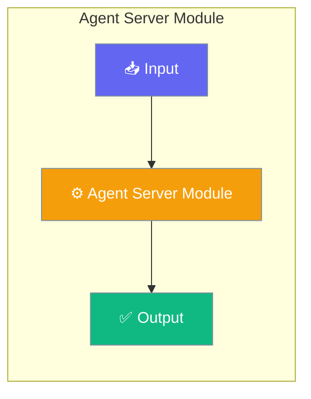

# Agent Server Module

The Agent Server module provides an HTTP server with Server-Sent Events (SSE) for real-time agent communication.




## Features

- **REST API** - HTTP endpoints for agent operations
- **SSE Streaming** - Real-time event streaming to clients
- **CORS Support** - Configurable cross-origin settings
- **Multi-client** - Handle multiple concurrent connections

## Quick Start


<Steps>
<Step title="Quick Start">
```python
from praisonaiagents.server import AgentServer, ServerConfig

# Create server with custom config
config = ServerConfig(
    host="0.0.0.0",
    port=8080,
    cors_origins=["http://localhost:3000"]
)

server = AgentServer(config=config)

# Start server (non-blocking)
server.start()

# Broadcast events to connected clients
server.broadcast("message", {"text": "Hello clients!"})

# Stop server
server.stop()
```
</Step>
</Steps>


## Best Practices

<AccordionGroup>
  <Accordion title="Start simple">
    Enable the feature with a single parameter before adding configuration. Verify it works, then layer in options.
  </Accordion>
  <Accordion title="Use environment variables for secrets">
    Never hardcode API keys or tokens. Use `os.getenv("KEY_NAME")` to read from environment variables.
  </Accordion>
  <Accordion title="Test with minimal examples first">
    Copy the Quick Start example, run it, then extend it. This confirms your environment is set up correctly.
  </Accordion>
  <Accordion title="Check the logs">
    Set `verbose=True` on your agent to see detailed execution logs when debugging unexpected behavior.
  </Accordion>
</AccordionGroup>

## Related

<CardGroup cols={2}>
  <Card title="Features Overview" icon="grid-2" href="/docs/features">
    Browse all PraisonAI features
  </Card>
  <Card title="Quick Start" icon="rocket" href="/docs/introduction">
    Get started with PraisonAI agents
  </Card>
</CardGroup>
