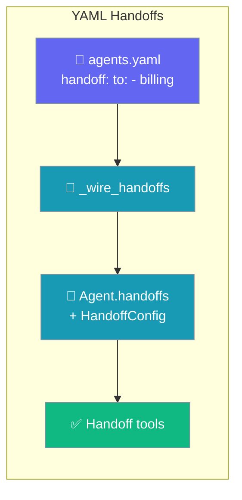
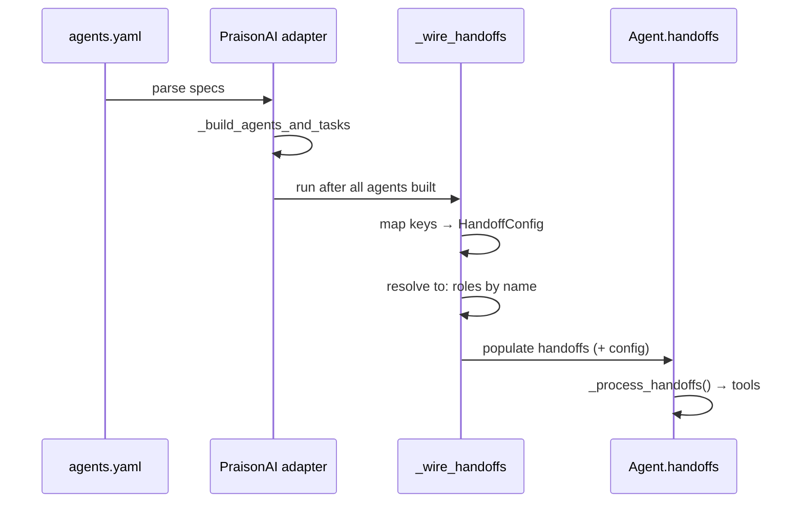

Declare which agents can hand off to which — and their execution limits — directly in `agents.yaml`.



## Quick Start

<Steps>
<Step title="Declare handoff: in agents.yaml">
Add a `handoff:` block under any agent. `to:` lists the target agent keys.

```yaml
# agents.yaml
agents:
  triage:
    role: Customer Service Triage
    goal: Route the customer to the right specialist
    handoff:
      to: [billing, tech, refund]
      timeout: 30
      max_depth: 3
      max_concurrent: 1
      detect_cycles: true
  billing:
    role: Billing Specialist
    goal: Resolve billing questions
  tech:
    role: Technical Support
    goal: Fix technical issues
  refund:
    role: Refund Specialist
    goal: Process refunds
```
</Step>

<Step title="Run it">
The adapter wires the `handoff:` dict into core `Agent.handoffs` — no Python required.

```bash
praisonai run agents.yaml
```
</Step>
</Steps>

---

## Three Surfaces, Same Wiring

YAML, CLI, and Python all populate the same `Agent.handoffs` with the same `HandoffConfig`.

<Tabs>
<Tab title="YAML">
```yaml
# agents.yaml
agents:
  triage:
    role: Customer Service Triage
    goal: Route the customer to the right specialist
    handoff:
      to: [billing, tech, refund]
      timeout: 30
      max_depth: 3
      max_concurrent: 1
      detect_cycles: true
```
</Tab>

<Tab title="CLI">
```bash
praisonai --handoff to=billing,tech,refund \
          --handoff-timeout 30 \
          --handoff-max-depth 3 \
          --handoff-max-concurrent 1 \
          --handoff-detect-cycles
```
</Tab>

<Tab title="Python">
```python
from praisonaiagents import Agent
from praisonaiagents.agent.handoff import HandoffConfig

billing = Agent(name="billing", role="Billing Specialist", goal="Resolve billing questions")
tech = Agent(name="tech", role="Technical Support", goal="Fix technical issues")
refund = Agent(name="refund", role="Refund Specialist", goal="Process refunds")

triage = Agent(
    name="triage",
    role="Customer Service Triage",
    goal="Route the customer to the right specialist",
    handoffs=[billing, tech, refund],
    handoff_config=HandoffConfig(
        timeout_seconds=30,
        max_depth=3,
        max_concurrent=1,
        detect_cycles=True,
    ),
)
```

The Python API is documented in full on the [Agent Handoffs](/features/handoffs) page.
</Tab>
</Tabs>

---

## How It Works

The adapter runs a wiring pass after every agent is built, then resolves each `to:` role by name.



Unknown target roles are logged and skipped — they never raise.

---

## Configuration Options

Every key under `handoff:` maps onto a field of core `HandoffConfig`.

| YAML key | Type | Default | HandoffConfig field | Description |
|----------|------|---------|---------------------|-------------|
| `to` | `List[str]` | required | — (resolved to `handoffs=[…]`) | Target agent keys. Unknown roles warned + skipped. |
| `timeout` | `int` (seconds) | `300.0` | `timeout_seconds` | Per-handoff execution timeout. |
| `max_depth` | `int` | `10` | `max_depth` | Maximum nested handoff chain length. |
| `max_concurrent` | `int` | `5` | `max_concurrent` | Maximum parallel handoffs (`0` = unlimited). |
| `detect_cycles` | `bool` | `true` | `detect_cycles` | Refuse to hand off if it would form a cycle. |
| `policy` | `str` | — | *(not yet mapped)* | Wrapper-only orchestration hint. Currently a no-op — core has no equivalent. |

<Note>
Only keys that are present are forwarded. Omit a key to keep the `HandoffConfig` default.
</Note>

---

## Common Patterns

**Triage router** — one agent fans out to specialists with a single-hop limit:

```yaml
agents:
  triage:
    role: Triage
    goal: Send each request to the right specialist
    handoff:
      to: [billing, tech]
      max_depth: 1
```

**Safe chains** — cap depth and refuse cycles for deep delegation graphs:

```yaml
agents:
  planner:
    role: Planner
    goal: Break work into steps and delegate
    handoff:
      to: [researcher, writer]
      max_depth: 3
      detect_cycles: true
```

---

## Best Practices

<AccordionGroup>
<Accordion title="Match to: entries to agent keys, not display names">
`_wire_handoffs` resolves each `to:` value against the agent keys in the same `agents:` map. A typo is logged and skipped, so the handoff silently disappears — check your logs if a target never fires.
</Accordion>

<Accordion title="Set max_depth for router agents">
The default depth is `10`. For a simple triage router, set `max_depth: 1` so a request cannot bounce through multiple specialists.
</Accordion>

<Accordion title="Keep detect_cycles on">
Cycle detection defaults to `true`. Leave it enabled unless you have a deliberate loop — it prevents two agents from handing off to each other forever.
</Accordion>

<Accordion title="policy: is a no-op today">
The wrapper `policy:` key (e.g. `round-robin`) has no core equivalent yet, so it is parsed but ignored. Do not rely on it to change routing behaviour.
</Accordion>
</AccordionGroup>

---

## Related

<CardGroup cols={2}>
<Card title="Agent Handoffs" icon="arrow-right-arrow-left" href="/features/handoffs">
  The full Python handoff API and context policies
</Card>

<Card title="Handoff Tool Policy" icon="shield-halved" href="/features/handoff-tool-policy">
  Control which tools a target agent inherits on handoff
</Card>
</CardGroup>
