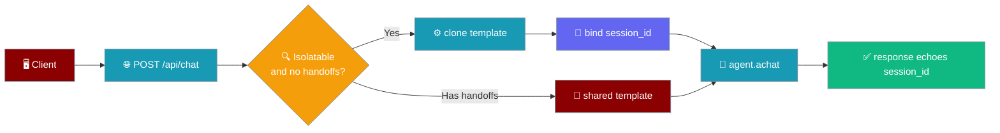
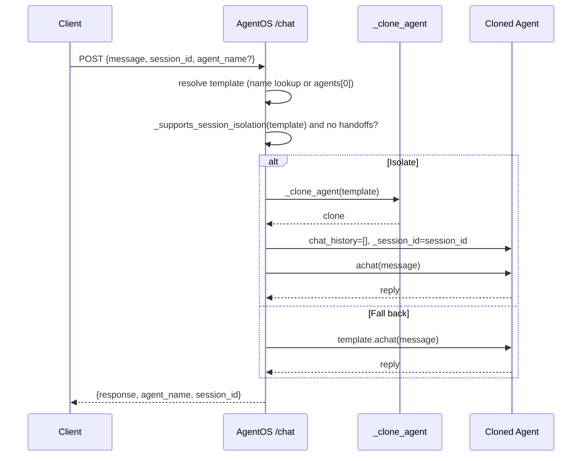
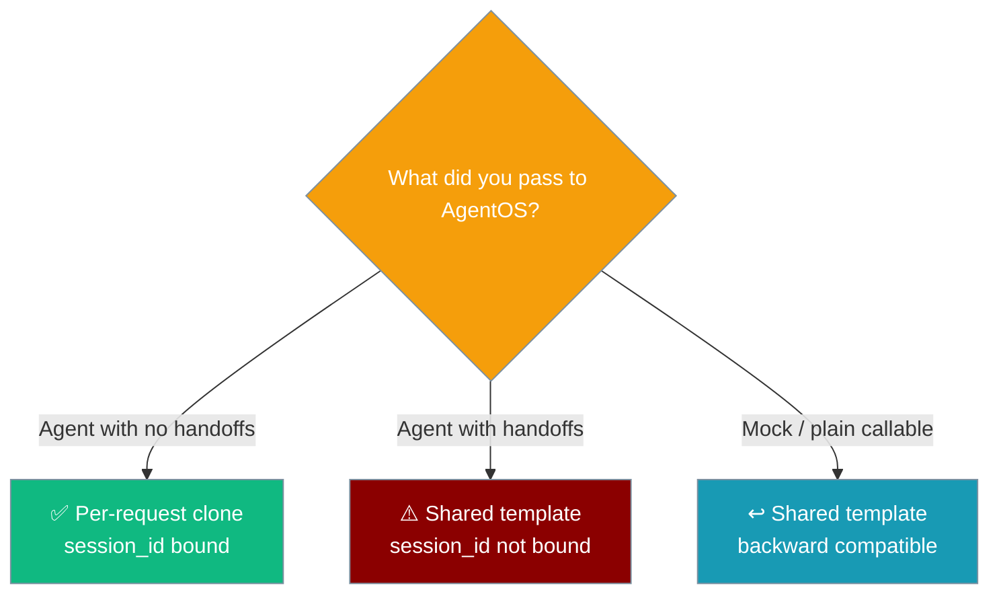

`AgentOS` clones a fresh agent for each `POST /api/chat`, so concurrent callers never share `chat_history` and the agent you passed into `AgentOS(agents=[…])` is never mutated by request traffic.



## Quick Start

<Steps>
<Step title="Serve an Agent">
```python
from praisonai import AgentOS
from praisonaiagents import Agent

app = AgentOS(agents=[
    Agent(name="assistant", instructions="Be helpful"),
])
app.serve(port=8000)
```
</Step>

<Step title="Chat With a Session">
Supply a `session_id` to continue the same conversation across calls. Omit it to make each call a fresh session.

```bash
# First turn — mint a session by supplying an id
curl -s -X POST http://127.0.0.1:8000/api/chat \
  -H "Content-Type: application/json" \
  -d '{"message": "Hi, my name is Alice.", "session_id": "alice", "agent_name": "assistant"}'

# Follow-up on the same session — the agent remembers "Alice" for this session id
curl -s -X POST http://127.0.0.1:8000/api/chat \
  -H "Content-Type: application/json" \
  -d '{"message": "What is my name?", "session_id": "alice", "agent_name": "assistant"}'
```
</Step>
</Steps>

Two concurrent clients using different `session_id`s never see each other's transcripts.

---

## How It Works

Each request resolves a per-request agent, resets its transcript, binds the session, and runs one turn.



The handler reuses the wrapper's existing helpers (`_supports_session_isolation`, `_clone_agent` from `praisonai.api.agent_invoke`) rather than reinventing cloning.

---

## Session Contract

| Request | Behaviour |
|---------|-----------|
| `session_id` supplied | Bound to `agent._session_id` (and `_history_session_id` when the attribute exists). Follow-up calls with the same id continue that conversation. |
| `session_id` omitted / falsy | Both cleared to `None` on the clone — each such call is a fresh session, not a sticky default. |
| Any request | The response echoes the supplied `session_id` back verbatim. |

The response model is unchanged: `{response, agent_name, session_id}`. Only the internal binding of `session_id` and the concurrency semantics changed.

<Warning>
An agent configured with `handoffs=[…]` is not cloned per request. It stays on the shared template, so `chat_history` is shared and `session_id` is not bound. This is deliberate — cloning would drop the handoffs. Use a session-aware backend (e.g. `praisonai_mcp.serve_agents`) if you need both handoffs and session isolation.
</Warning>

<Note>
If cloning fails, `/api/chat` returns HTTP `500` with detail `"Failed to isolate agent for session: {reason}"`. It is retry-safe and typically indicates a non-copyable custom object on the agent (e.g. a live socket).
</Note>

---

## When Cloning Applies

Only real `Agent` instances that expose the per-session machinery are cloned. Plain mocks and lightweight callables fall back to the shared template.



---

## Best Practices

<AccordionGroup>
<Accordion title="Send a session_id to continue a conversation">
Supplying the same `session_id` on each turn is how a client continues one conversation. Omitting it starts a fresh session on a fresh clone every time.
</Accordion>

<Accordion title="Don't rely on handoffs for isolation over /chat">
Agents with `handoffs` stay on the shared template and are not session-isolated over `/chat`. Reach for `serve_agents([...])` when you need handoffs and per-session isolation together.
</Accordion>

<Accordion title="Retry on a 500 isolation error">
A `500 — Failed to isolate agent for session` means the clone step raised, usually from a non-copyable object on the agent. It is safe to retry after removing the offending object.
</Accordion>

<Accordion title="Isolation is in-process only">
This clone model isolates concurrent in-process requests. It does not persist sessions across process restarts — use a session store backend for durable history.
</Accordion>
</AccordionGroup>

---

## Related

<CardGroup cols={2}>
<Card title="Serve Agents" icon="server" href="/features/serve-agents">
`serve_agents([...])` — per-session isolation with handoff support, useful for comparison
</Card>
<Card title="PraisonAI Call" icon="phone" href="/call">
The call server that hosts the n8n agent-invoke router
</Card>
</CardGroup>
