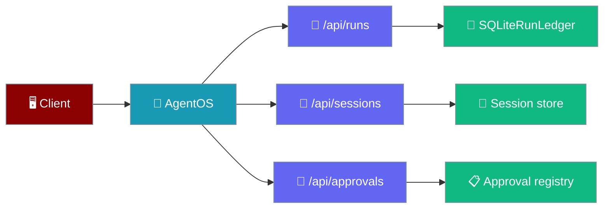
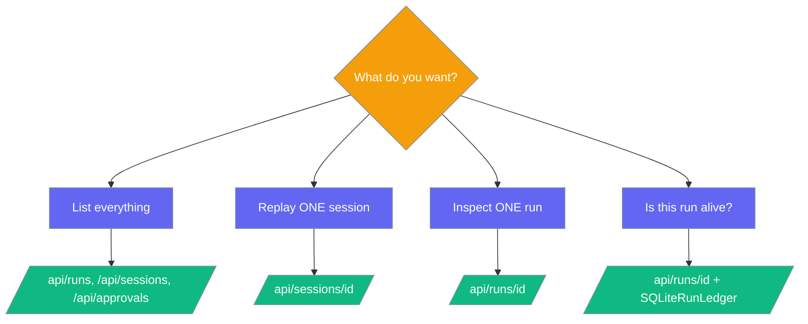
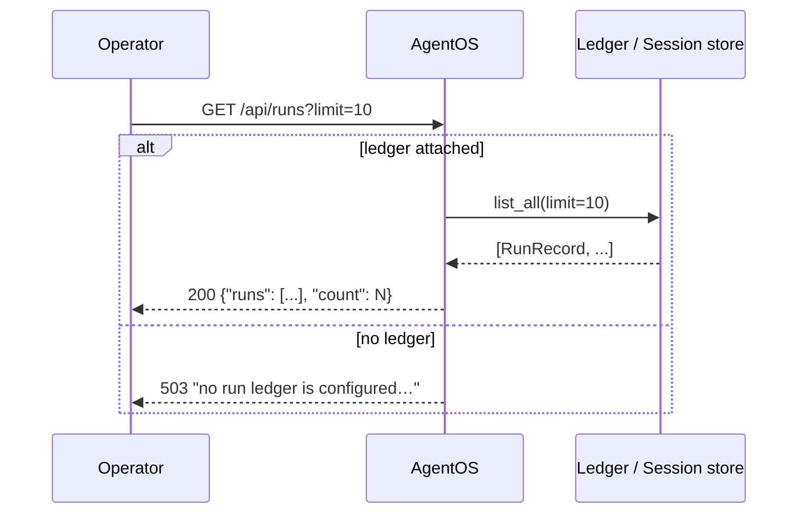

AgentOS can list and inspect past runs, replay a session's transcript, and list which tools require approval — all over HTTP, with `503` (not an empty list) when the underlying store is missing.



## Quick Start

<Steps>
<Step title="Attach a ledger and serve">
Attaching a `SQLiteRunLedger` unlocks `/api/runs` and `/api/runs/{run_id}`.

```python
from praisonai import AgentOS
from praisonaiagents import Agent
from praisonaiagents.runs import SQLiteRunLedger

app = AgentOS(agents=[Agent(instructions="Be helpful")])
app.run_ledger = SQLiteRunLedger()   # unlocks /api/runs and /api/runs/{id}
app.serve(port=8000)
```
</Step>

<Step title="Read runs over HTTP">
```bash
curl http://localhost:8000/api/runs?limit=10
curl http://localhost:8000/api/runs/<run_id>
```
</Step>
</Steps>

---

## Enabling Each Endpoint

Each endpoint reads a store you attach to the `AgentOS` instance.

<Tabs>
<Tab title="Runs">
Attach a run ledger to expose `/api/runs` and `/api/runs/{run_id}`.

```python
from praisonaiagents.runs import SQLiteRunLedger

app.run_ledger = SQLiteRunLedger()
```

See [Run Ledger](/features/run-ledger).
</Tab>

<Tab title="Sessions">
Attach a session store with `recent()`, `get_chat_history()`, and optionally `session_exists()` to expose `/api/sessions` and `/api/sessions/{session_id}`.

```python
from praisonaiagents.session import DefaultSessionStore

app.session_store = DefaultSessionStore()
```

See [SQLite Transcript Store](/features/sqlite-transcript-store) and [Session Persistence](/features/session-persistence).
</Tab>

<Tab title="Approvals">
No attribute needed. `/api/approvals` reads the process-global registry populated by `add_approval_requirement(...)` / `require_approval(...)`.

```python
from praisonaiagents.approval import add_approval_requirement

add_approval_requirement("delete_file", risk_level="high")
```

See [Approval Protocol](/features/approval-protocol).
</Tab>
</Tabs>

---

## Endpoint Reference

Five read-only routes, each returning `503` naming what to configure when its store is absent.

| Method | Path | Purpose | Missing-store behaviour |
|---|---|---|---|
| GET | `/api/runs?limit=50` | List runs from the attached ledger. `limit` bounded `1 ≤ limit ≤ 500`. | `503` — no run ledger configured; attach a `SQLiteRunLedger` as `run_ledger`. |
| GET | `/api/runs/{run_id}` | Fetch a single run. | `503` if no ledger; **`404`** if the ledger returns `None` for that id. |
| GET | `/api/sessions?limit=20` | List recent sessions. `limit` bounded `1 ≤ limit ≤ 200`. | `503` if `session_store` is unset or lacks `recent()`. |
| GET | `/api/sessions/{session_id}?limit=100` | Return the transcript for one session. `limit` bounded `1 ≤ limit ≤ 500`. | `503` if no store; **`404`** if `session_exists(session_id)` is `False`, or the store has no `session_exists()` and the transcript is empty. |
| GET | `/api/approvals` | List global + per-agent approval requirements. | `503` if `praisonaiagents.approval` is not installed or the registry exposes no requirement listing. |

---

## Response Shapes

Every response matches the endpoint's contract exactly.

<AccordionGroup>
<Accordion title="GET /api/runs">
Each run is the record's own `as_dict()` (or `vars()`) — ledgers with extra fields are not truncated.

```json
{ "runs": [ { "run_id": "r1", "status": "done" } ], "count": 1 }
```
</Accordion>

<Accordion title="GET /api/runs/{run_id}">
The record's dict directly — no wrapper.

```json
{ "run_id": "r1", "status": "done", "agent": "researcher" }
```
</Accordion>

<Accordion title="GET /api/sessions">
```json
{ "sessions": [ { "session_id": "s1", "messages": 4 } ], "count": 1 }
```
</Accordion>

<Accordion title="GET /api/sessions/{session_id}">
The chat history as the store returns it.

```json
{ "session_id": "s1", "messages": [ { "role": "user", "content": "hi" } ] }
```
</Accordion>

<Accordion title="GET /api/approvals">
```json
{ "requirements": [ { "tool": "delete_file", "agent": null, "risk_level": "high" } ] }
```
</Accordion>
</AccordionGroup>

---

## Why the Errors Look Like This

<Info>
A missing store returns **`503` naming what to configure**, not an empty list. An empty list is indistinguishable from *"no runs yet"* and lets an operator debugging a missing run conclude the run never happened. An unknown run or session is **`404`**, not an empty object, for the same reason. Out-of-range `limit` values return **`422`** — SQLite treats `LIMIT -1` as unlimited, so the bounds are pinned deliberately.
</Info>

---

## Choosing an Endpoint

This decision diagram maps a question to the endpoint that answers it.



---

## How Operators Interact

An operator lists runs; the ledger either answers or the endpoint says what to attach.



---

## Best Practices

<AccordionGroup>
<Accordion title="Attach a ledger in production">
The `503` names what to attach, but you want the endpoint to actually work. Attach a `SQLiteRunLedger` before deploying.
</Accordion>

<Accordion title="Treat 503 as a config bug, not a request bug">
A `503` means the store is missing, not that the request was malformed. Do not retry it — fix the configuration.
</Accordion>

<Accordion title="Read-only on purpose">
Mutating a run over HTTP is a much larger design question. Use the SDK for changes; these endpoints only read.
</Accordion>

<Accordion title="Keep limit conservative">
The upper bounds (`runs ≤ 500`, `sessions ≤ 200`) exist because clients can otherwise ask for a full-table scan. Request only what you need.
</Accordion>
</AccordionGroup>

---

## Related

<CardGroup cols={2}>
<Card title="AgentOS" icon="rocket" href="/concepts/agentos">
The AgentOS platform and its routes.
</Card>
<Card title="Run Ledger" icon="database" href="/features/run-ledger">
Attach a SQLiteRunLedger to record runs.
</Card>
<Card title="SQLite Transcript Store" icon="database" href="/features/sqlite-transcript-store">
Persist session transcripts for replay.
</Card>
<Card title="Approval Protocol" icon="lock" href="/features/approval-protocol">
Require approval for sensitive tools.
</Card>
</CardGroup>
