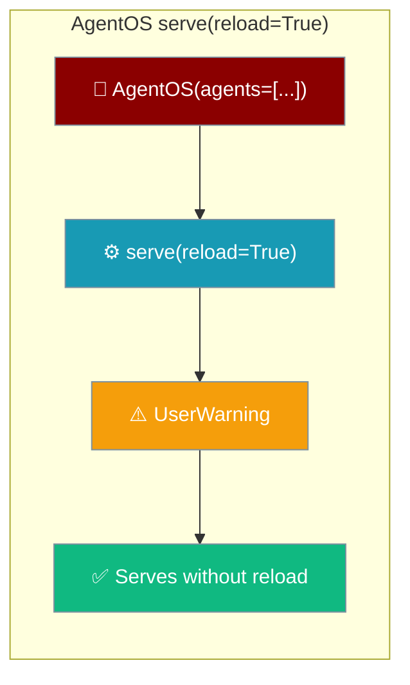
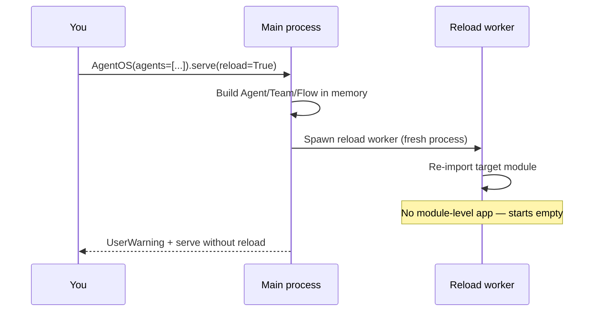

A programmatically built `AgentOS` cannot hot-reload — `serve(reload=True)` warns and serves without reload.



## Quick Start

<Steps>
<Step title="What happens today">

`serve(reload=True)` on a programmatic `AgentOS` emits a `UserWarning` and runs without reload:

```python
from praisonai import AgentOS
from praisonaiagents import Agent

assistant = Agent(name="assistant", instructions="Be helpful.")

AgentOS(agents=[assistant]).serve(reload=True)
# UserWarning: reload is unsupported for a programmatically built AgentOS;
# serving without reload.
```

The CLI `praisonai app --reload` prints the same guidance in yellow.

</Step>

<Step title="Get reload with a module factory">

Expose your `AgentOS` as a module-level factory and run uvicorn against the import string:

```python
# mymodule.py
from praisonai import AgentOS
from praisonaiagents import Agent

def create_app():
    return AgentOS(agents=[Agent(name="assistant", instructions="Be helpful.")]).get_app()
```

```bash
uvicorn "mymodule:create_app" --factory --reload
```

</Step>
</Steps>

---

## Why reload is unsupported

Uvicorn's reload worker runs in a **separate process** and re-imports the target module.



A programmatically built `AgentOS(agents=[...])` has **no importable module-level app**. The reload worker would start empty and fail, so `serve(reload=True)` warns and serves without reload rather than crash.

| Path | Reload behaviour |
|------|------------------|
| `AgentOS.serve(reload=True)` | `UserWarning`, serves without reload |
| `praisonai app --reload` | Yellow guidance line, serves without reload |
| `uvicorn "mymodule:create_app" --factory --reload` | Reload works — uvicorn owns the import |

<Note>
Non-reload serving is unchanged. `AgentOS(agents=[...]).serve()` works exactly as before.
</Note>

---

## Common Patterns

### Development with reload

Point uvicorn at your factory so edits to `mymodule.py` reload automatically:

```bash
uvicorn "mymodule:create_app" --factory --reload --port 8000
```

### Production without reload

For production, call `serve()` directly — reload is a development-only convenience:

```python
from praisonai import AgentOS
from praisonaiagents import Agent

AgentOS(agents=[Agent(name="assistant", instructions="Be helpful.")]).serve(port=8000)
```

---

## Best Practices

<AccordionGroup>
<Accordion title="Use a module factory for live reload">
Expose `create_app()` returning `AgentOS(...).get_app()` and run `uvicorn "mymodule:create_app" --factory --reload`. Uvicorn controls the import, so each edit re-imports cleanly.
</Accordion>

<Accordion title="Don't rely on reload in production">
Reload re-imports on every change and adds overhead. Serve with `AgentOS(...).serve()` (no reload) in production.
</Accordion>

<Accordion title="Prefer CLI serve commands for reloadable files">
`praisonai serve agents --reload`, `praisonai serve unified --reload`, and `praisonai serve recipe --reload` all hot-reload because they load from a file via an app factory. See [Serve](/cli/serve).
</Accordion>
</AccordionGroup>

---

## Related

<CardGroup cols={2}>
<Card title="Serve" icon="server" href="/cli/serve">
`--reload` support across CLI serve commands
</Card>
<Card title="Recipe Serve Advanced" icon="gauge-high" href="/features/recipe-serve-advanced">
App-factory pattern for workers and reload
</Card>
</CardGroup>
