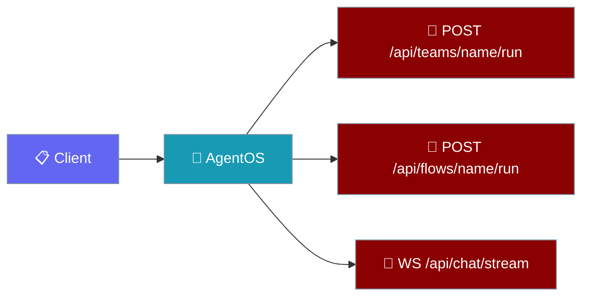
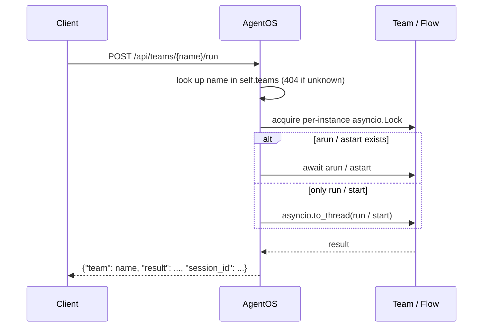
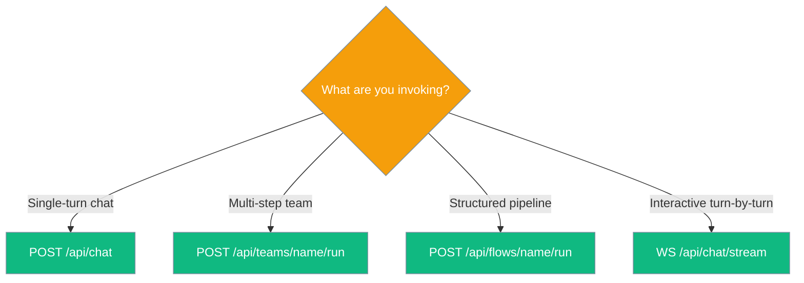

AgentOS routes every team and flow you pass in as its own HTTP endpoint, and exposes a chat WebSocket that speaks the agent's native `achat`/`chat` surface.



## Quick Start

<Steps>
<Step title="Serve teams, flows, and WebSocket chat">
Pass `teams=` and `flows=` to `AgentOS` — each one becomes its own route, and `/api/chat/stream` is always available.

```python
from praisonai import AgentOS
from praisonaiagents import Agent, Task, AgentTeam, AgentFlow

team = AgentTeam(
    name="research_team",
    agents=[Agent(name="researcher", instructions="Research the topic")],
    tasks=[Task(description="Summarise the input", agent="researcher")],
)

flow = AgentFlow(
    name="writer_flow",
    steps=[Agent(name="writer", instructions="Write a short reply")],
)

AgentOS(
    agents=[Agent(name="assistant", instructions="Be helpful")],
    teams=[team],
    flows=[flow],
).serve(port=8000)
```
</Step>

<Step title="Call every surface">
Teams and flows are plain `POST` endpoints; the chat stream is a WebSocket.

```bash
# Team
curl -X POST http://localhost:8000/api/teams/research_team/run \
  -H "Content-Type: application/json" \
  -d '{"message": "quantum computing basics"}'

# Flow
curl -X POST http://localhost:8000/api/flows/writer_flow/run \
  -H "Content-Type: application/json" \
  -d '{"message": "Draft a one-line haiku"}'

# WebSocket chat
websocat ws://localhost:8000/api/chat/stream
> {"message": "Hello", "agent_name": "assistant"}
< {"response": "Hi there!"}
< {"done": true}
```
</Step>
</Steps>

---

## How It Works

A team or flow call acquires that instance's lock, invokes the async entry point first, and offloads a sync target to a thread.



A WebSocket frame clones and binds a per-request agent, then speaks its native chat surface.

```mermaid
sequenceDiagram
    participant Client
    participant WS as /api/chat/stream
    participant Agent

    Client->>WS: {"message": ..., "agent_name": ..., "session_id": ...}
    WS->>Agent: _isolate_agent() → clone + bind_session
    alt achat exists
        WS->>Agent: await achat(message)
    else chat
        WS->>Agent: asyncio.to_thread(chat, message)
    end
    Agent-->>WS: reply
    WS-->>Client: {"response": "..."}
    WS-->>Client: {"done": true}
    Note over WS,Client: on a bad frame → {"error": "..."}; socket stays open
```

---

## Endpoint reference

Three surfaces resolve under the default `/api` prefix (`AgentOSConfig.api_prefix`).

| Method | Path | Purpose | Error contract |
|---|---|---|---|
| POST | `/api/teams/{team_name}/run` | Invoke a team by name. | `404` if `team_name` doesn't match a `getattr(team, "name", None)` in `self.teams`; `501` if the team exposes no `arun`/`astart`/`run`/`start`; `500` on team error. |
| POST | `/api/flows/{flow_name}/run` | Invoke a flow by name. | Same as teams but checks `self.flows`. |
| WS | `/api/chat/stream` | Chat with an agent over WebSocket. | Closes with code `1008` if a configured launch token is missing/invalid; sends `{"error": "..."}` on bad frames and keeps the socket open. |

---

## Request and response shapes

Teams and flows share one request model; the WebSocket exchanges JSON frames.

<AccordionGroup>
<Accordion title="POST /api/teams/{team_name}/run">
Request:

```json
{"message": "string", "session_id": "optional-string"}
```

Response:

```json
{"team": "research_team", "result": "...", "session_id": "optional-string"}
```
</Accordion>

<Accordion title="POST /api/flows/{flow_name}/run">
Same shape as teams, with `flow` instead of `team`.

Request:

```json
{"message": "string", "session_id": "optional-string"}
```

Response:

```json
{"flow": "writer_flow", "result": "...", "session_id": "optional-string"}
```
</Accordion>

<Accordion title="WS /api/chat/stream frames">
```json
// client → server
{"message": "...", "agent_name": "optional", "session_id": "optional"}

// server → client (success)
{"response": "..."}
{"done": true}

// server → client (error)
{"error": "..."}
```
</Accordion>
</AccordionGroup>

---

## Authentication (WebSocket)

The HTTP api-key middleware does not run on the WebSocket handshake. When you configure `AgentOSConfig(api_key=...)` or set `PRAISONAI_AGENTOS_API_KEY`, the WS endpoint checks the token itself and rejects unauthenticated clients with close code `1008` before `accept()`. Pass the token via `Authorization: Bearer`, `X-API-Key`, or `?api_key=` in the URL — browsers can only use the query form. Comparison uses `hmac.compare_digest`.

```python
import asyncio, json, websockets

async def main():
    url = "ws://localhost:8000/api/chat/stream?api_key=YOUR_TOKEN"
    async with websockets.connect(url) as ws:
        await ws.send(json.dumps({"message": "Hello", "agent_name": "assistant"}))
        print(await ws.recv())  # {"response": "..."}
        print(await ws.recv())  # {"done": true}

asyncio.run(main())
```

---

## Concurrency and session isolation

Teams and flows serialise per instance; chat clones its agent per request.

- Each team and flow has a lazy per-instance `asyncio.Lock` — concurrent calls to the *same* instance queue, while different instances run in parallel (teams/flows carry mutable run state and cannot run re-entrantly).
- Per-request chat uses an isolated agent clone via `_isolate_agent()` (chat history is not shared across callers), except when `handoffs` are configured on the template — those agents stay on the shared template because `clone_for_channel` drops handoffs, so delegation isn't silently lost.
- WebSocket calls use the exact same `_isolate_agent()` helper as `POST /chat`.

---

## Choosing the right surface

Pick the surface that matches the interaction shape.



---

## Best Practices

<AccordionGroup>
<Accordion title="Give every team and flow a stable name">
The lookup matches `getattr(team, "name", None)` against the path. Without a `name`, the call silently returns `404`.
</Accordion>

<Accordion title="Attach a launch token in production">
Set `AgentOSConfig(api_key=...)` (or `PRAISONAI_AGENTOS_API_KEY`) so the WebSocket endpoint isn't an unauthenticated back door — the HTTP api-key middleware does not cover the WS handshake.
</Accordion>

<Accordion title="Treat WebSocket errors as sticky">
The socket stays open on `{"error": ...}`, so a retry can send another frame without a new handshake.
</Accordion>

<Accordion title="Construct one instance per concurrent caller">
Teams and flows serialise same-instance calls. For true concurrency, build multiple team/flow instances — one per concurrent caller.
</Accordion>
</AccordionGroup>

---

## Related

<CardGroup cols={2}>
<Card title="AgentOS Read Endpoints" icon="list" href="/features/agentos-read-endpoints">
Health, agents, approvals, and other read routes.
</Card>
<Card title="AgentOS Serve Reload" icon="rotate" href="/features/agentos-serve-reload">
Hot-reload agents without restarting the server.
</Card>
<Card title="Session Persistence" icon="database" href="/features/session-persistence">
Carry conversation state across calls with `session_id`.
</Card>
<Card title="Approval Protocol" icon="lock" href="/features/approval-protocol">
Gate risky tool calls behind an approval registry.
</Card>
</CardGroup>
