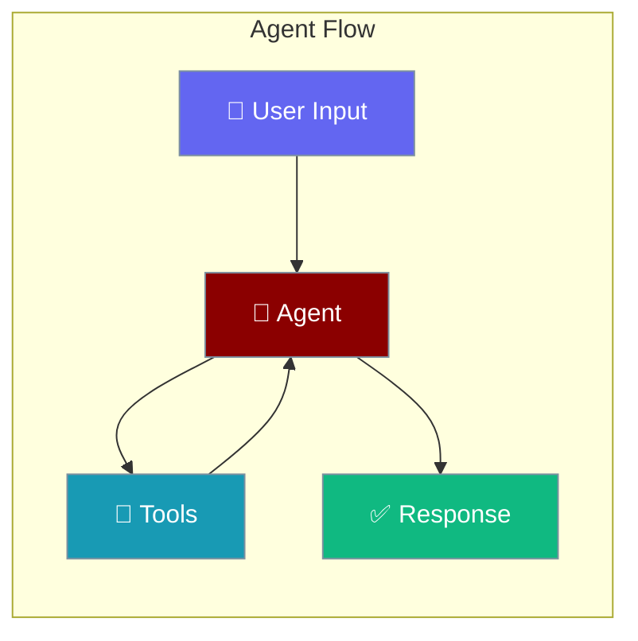
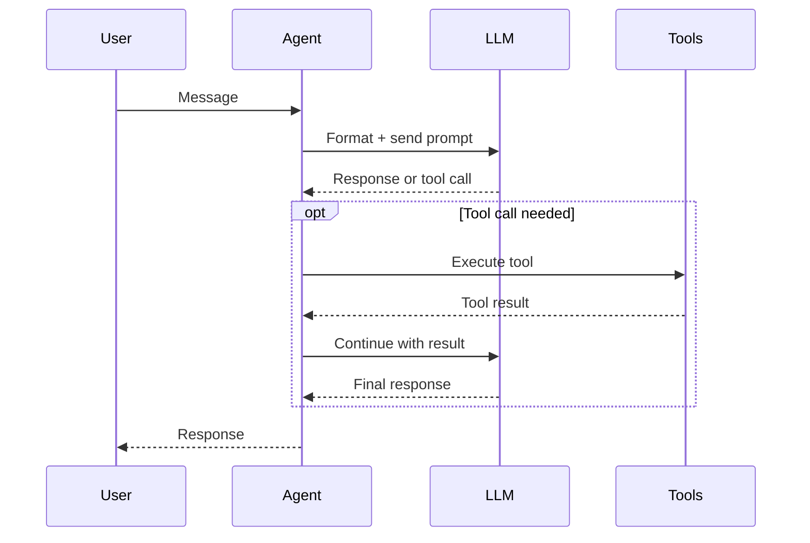

An Agent is an AI that follows your instructions, uses tools, and completes tasks through conversation.

```python
from praisonaiagents import Agent

agent = Agent(
    name="Assistant",
    instructions="You are a helpful research assistant. Answer questions accurately and concisely.",
)

agent.start("What are the main benefits of solar energy?")
```



## Quick Start

<Steps>
<Step title="Simple Agent">
```python
from praisonaiagents import Agent

agent = Agent(instructions="You are a helpful assistant.")
response = agent.start("Explain machine learning in one paragraph.")
print(response)
```
</Step>

<Step title="Agent with Tools">
```python
from praisonaiagents import Agent
from praisonaiagents.tools import duckduckgo

agent = Agent(
    name="Researcher",
    instructions="You are a research agent. Use web search for current information.",
    tools=[duckduckgo],
)
agent.start("What are the latest developments in quantum computing?")
```
</Step>

<Step title="Agent with Features">
```python
from praisonaiagents import Agent

agent = Agent(
    name="SmartAssistant",
    instructions="You are a smart assistant that remembers and plans.",
    memory=True,
    planning=True,
    reflection=True,
)
agent.start("Help me plan a comprehensive study schedule for learning Python.")
```
</Step>
</Steps>

---

## How It Works



| Phase | What happens |
|---|---|
| 1. Receive | Agent receives user input |
| 2. Think | LLM decides whether to respond or call a tool |
| 3. Act | If tool needed, executes it and feeds result back |
| 4. Respond | Final answer returned to user |

---

## Key Parameters

| Parameter | Type | Description |
|---|---|---|
| `name` | `str` | Agent name (shown in logs and multi-agent setups) |
| `instructions` | `str` | System prompt — what the agent does and how |
| `llm` | `str` | Model name (e.g., `"gpt-4o"`, `"claude-3-5-sonnet"`) |
| `tools` | `list` | List of tools the agent can use |
| `memory` | `bool \| MemoryConfig` | Enable conversation memory |
| `planning` | `bool \| PlanningConfig` | Enable pre-execution planning |
| `reflection` | `bool \| ReflectionConfig` | Enable self-review of responses |
| `caching` | `bool \| CachingConfig` | Enable response caching |
| `output` | `str \| OutputConfig` | Control response verbosity |
| `execution` | `str \| ExecutionConfig` | Control iteration and budget limits |

---

## Common Patterns

### Pattern 1 — Simple Q&A agent
```python
from praisonaiagents import Agent

agent = Agent(instructions="Answer questions clearly and accurately.")
response = agent.start("What is the difference between RAM and storage?")
print(response)
```

### Pattern 2 — Specialized domain agent
```python
from praisonaiagents import Agent

agent = Agent(
    name="LegalAnalyst",
    instructions="""You are a legal document analyst.
    Identify key clauses, risks, and obligations.
    Always recommend consulting a qualified attorney.""",
    llm="gpt-4o",
)
agent.start("Analyze this software license agreement for unusual terms.")
```

### Pattern 3 — Fully-featured production agent
```python
from praisonaiagents import Agent, MemoryConfig, ExecutionConfig

agent = Agent(
    name="ProductionAgent",
    instructions="You are a reliable production assistant.",
    memory=MemoryConfig(backend="redis", user_id="user_123"),
    execution=ExecutionConfig(max_iter=30, max_budget=0.25),
    caching=True,
)
response = agent.start("Summarize our Q3 performance metrics.")
print(response)
```

---

## Best Practices

<AccordionGroup>
<Accordion title="Write clear instructions">
The `instructions` parameter is your agent's personality and purpose. Be specific: "You are a customer support agent for Acme Corp. Answer questions about orders, returns, and products. Escalate billing disputes to a human." Clear instructions outperform vague ones every time.
</Accordion>

<Accordion title="Add features progressively">
Start with just `Agent(instructions="...")` and add features (`memory`, `planning`, `reflection`) one at a time. Each feature has a cost — only add what your use case actually needs.
</Accordion>

<Accordion title="Use the right model">
`gpt-4o-mini` handles simple Q&A and extraction cheaply and fast. Use `gpt-4o` or `claude-3-5-sonnet` for complex reasoning, code generation, and nuanced writing tasks.
</Accordion>

<Accordion title="Name agents in multi-agent setups">
Always set `name` when using multiple agents. Names appear in logs, hooks callbacks, and help diagnose which agent produced which output in complex workflows.
</Accordion>
</AccordionGroup>

---

## Related

<CardGroup cols={2}>
<Card icon="wrench" href="/docs/features/tools">
  Tools — add capabilities like web search and code execution
</Card>
<Card icon="brain" href="/docs/features/memory">
  Memory — give agents persistent memory across sessions
</Card>
</CardGroup>
