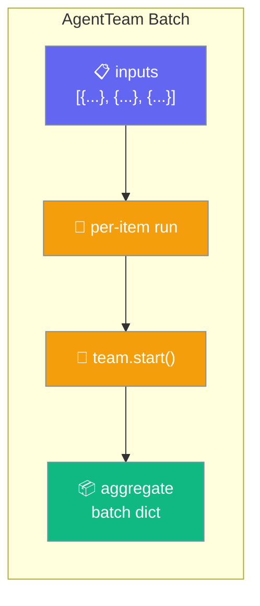
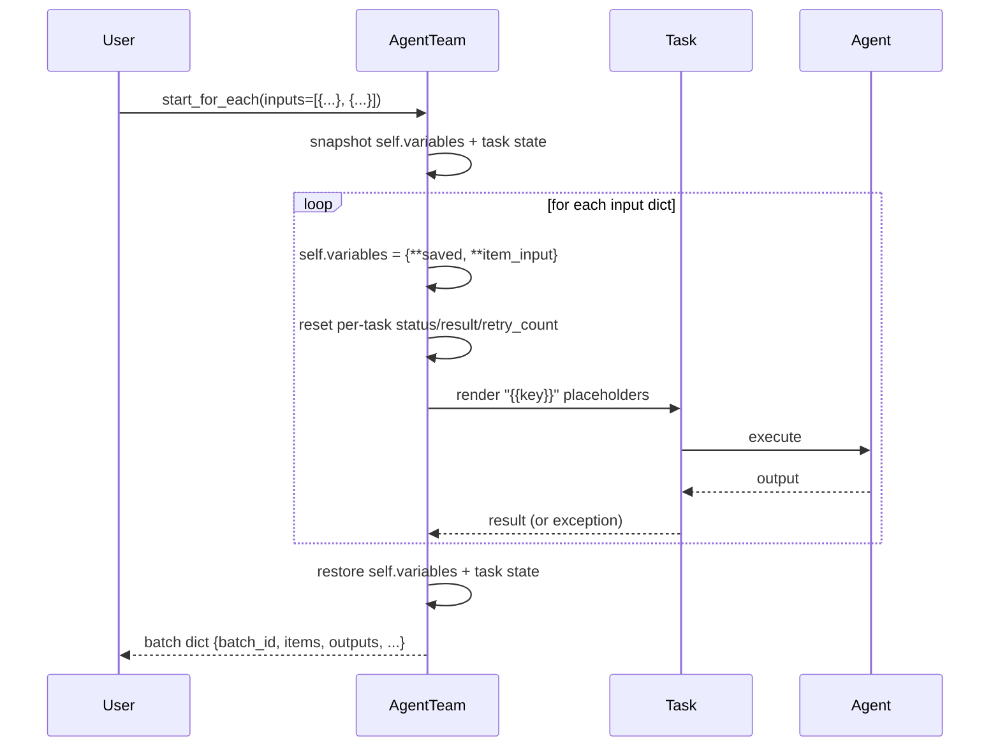

Run the same team many times over a list of inputs with a single call.



## Quick Start

<Steps>
<Step title="Run the team over a list of inputs">
Each input dict fills the `{{placeholder}}` slots in your task templates.

```python
from praisonaiagents import Agent, AgentTeam, Task

writer = Agent(
    name="Writer",
    instructions="Write a short, factual bio"
)

bio_task = Task(
    description="Write a short bio for {{name}}",
    expected_output="A 2-3 sentence bio for {{name}}",
    agent=writer,
)

team = AgentTeam(agents=[writer], tasks=[bio_task], process="sequential")

batch = team.start_for_each(inputs=[
    {"name": "Ada Lovelace"},
    {"name": "Alan Turing"},
])

print(batch["succeeded"], "/", batch["total"])
for item in batch["items"]:
    print(item["index"], item["input"]["name"], "→", item["success"])
```
</Step>

<Step title="Run it asynchronously">
`astart_for_each` is the async twin — same inputs, same result shape.

```python
import asyncio
from praisonaiagents import Agent, AgentTeam, Task

writer = Agent(name="Writer", instructions="Write a short, factual bio")
task = Task(
    description="Write a short bio for {{name}}",
    expected_output="A 2-3 sentence bio for {{name}}",
    agent=writer,
)
team = AgentTeam(agents=[writer], tasks=[task])

async def main():
    batch = await team.astart_for_each(
        inputs=[{"name": "Ada"}, {"name": "Bob"}],
        on_error="continue",
    )
    for item in batch["items"]:
        print(item["index"], "ok" if item["success"] else item["error"])

asyncio.run(main())
```
</Step>
</Steps>

---

## How It Works

The team runs once per input dict, restoring its original templates afterwards so it stays reusable.



| Step | What happens |
|------|--------------|
| Snapshot | Original `self.variables` and per-task state are saved. |
| Per item | The item dict merges over saved variables; task state resets so each item runs fresh. |
| Interpolate | `{{key}}` placeholders in `Task.description` / `Task.expected_output` are filled. |
| Aggregate | Per-item results collect into a single batch dict. |
| Restore | Variables and task templates are restored — the team is safe to reuse. |

---

## Result Shape

`start_for_each` returns a plain dict summarising the whole batch.

| Key | Type | Description |
|-----|------|-------------|
| `batch_id` | `str` | `"batch_"` + 12 hex chars from `uuid4`. |
| `items` | `list[dict]` | Per-input results in input order. Each has `index`, `input`, `success`, `output`, `error`. |
| `outputs` | `list` | Every item's `output`, aligned with `items` (`None` for failures). |
| `succeeded` | `int` | Count of items with `success=True`. |
| `failed` | `int` | Count of items with `success=False`. |
| `total` | `int` | `len(items)`. |
| `token_usage_total` | `dict` | Session-level cumulative token usage from `get_token_usage_summary()` — **not** batch-scoped. |

Each entry in `items` has this shape:

| Key | Type | Description |
|-----|------|-------------|
| `index` | `int` | 0-based position in `inputs`. |
| `input` | `dict` \| `None` | The original input dict passed for this item. |
| `success` | `bool` | Whether the run completed without raising. |
| `output` | `Any` | Return value of `start()` / `astart()`; `None` on failure. |
| `error` | `str` \| `None` | `str(exception)` on failure; `None` on success. |

---

## Parameters

| Parameter | Type | Default | Description |
|-----------|------|---------|-------------|
| `inputs` | `list[dict]` | Required | One dict per run. Keys fill `{{placeholder}}` slots in `Task.description` / `Task.expected_output`. `None` items are treated as `{}`. Non-dict items raise `ValueError`. |
| `on_error` | `"continue"` \| `"fail_fast"` | `"continue"` | `continue` captures per-item errors and keeps going. `fail_fast` re-raises the first exception. Any other value raises `ValueError`. |
| `output` | `str` | `"silent"` | Forwarded to `start()`. Available on `start_for_each` only. |
| `**kwargs` | — | — | Forwarded verbatim to `start()` / `astart()`. |

---

## Error Handling

Choose whether a failing item stops the batch or is recorded and skipped.

<Tabs>
<Tab title="continue (default)">
Errors are captured per item; the batch runs to completion.

```python
batch = team.start_for_each(
    inputs=[{"name": "Ada"}, {"name": "Bob"}],
    on_error="continue",
)

for item in batch["items"]:
    if not item["success"]:
        print("failed:", item["index"], item["error"])
```
</Tab>

<Tab title="fail_fast">
The first failing item re-raises immediately.

```python
batch = team.start_for_each(
    inputs=[{"name": "Ada"}, {"name": "Bob"}],
    on_error="fail_fast",   # re-raise on first failing item
)
```
</Tab>
</Tabs>

---

## Common Patterns

Generate bios for many names in one call.

```python
from praisonaiagents import Agent, AgentTeam, Task

writer = Agent(name="Writer", instructions="Write a short, factual bio")
task = Task(
    description="Write a short bio for {{name}}",
    expected_output="A 2-3 sentence bio for {{name}}",
    agent=writer,
)
team = AgentTeam(agents=[writer], tasks=[task])

batch = team.start_for_each(inputs=[
    {"name": "Ada Lovelace"},
    {"name": "Grace Hopper"},
    {"name": "Katherine Johnson"},
])

for output in batch["outputs"]:
    print(output)
```

Run the same batch asynchronously.

```python
import asyncio
from praisonaiagents import Agent, AgentTeam, Task

writer = Agent(name="Writer", instructions="Write a short, factual bio")
task = Task(
    description="Write a short bio for {{name}}",
    expected_output="A 2-3 sentence bio for {{name}}",
    agent=writer,
)
team = AgentTeam(agents=[writer], tasks=[task])

batch = asyncio.run(team.astart_for_each(
    inputs=[{"name": "Ada"}, {"name": "Grace"}],
))
print(batch["succeeded"], "/", batch["total"])
```

Map rows from a CSV into inputs.

```python
import csv
from praisonaiagents import Agent, AgentTeam, Task

writer = Agent(name="Writer", instructions="Write a short, factual bio")
task = Task(
    description="Write a short bio for {{name}}",
    expected_output="A 2-3 sentence bio for {{name}}",
    agent=writer,
)
team = AgentTeam(agents=[writer], tasks=[task])

with open("people.csv", newline="") as f:
    inputs = [{"name": row["name"]} for row in csv.DictReader(f)]

batch = team.start_for_each(inputs=inputs)
print(batch["succeeded"], "of", batch["total"], "succeeded")
```

---

## Best Practices

<AccordionGroup>
<Accordion title="Use double braces in templates">
Placeholders use `{{name}}` (double braces). This runs through the team's built-in `variables` interpolator, not Python's `str.format`. Single braces are left untouched.
</Accordion>

<Accordion title="Pick on_error by job type">
Use `on_error="continue"` for bulk jobs where one bad row shouldn't stop the rest. Use `on_error="fail_fast"` for evaluation harnesses that must halt on the first failure.
</Accordion>

<Accordion title="token_usage_total is session-cumulative">
`token_usage_total` comes from `get_token_usage_summary()` and reflects cumulative session usage, not just this batch. For finer accounting, reset the team between batches or inspect per-item outputs.
</Accordion>

<Accordion title="The team stays reusable">
`self.variables` and the task templates are restored in a `finally` block after every batch, so you can call `start_for_each` again — or `start()` — on the same team without side effects.
</Accordion>
</AccordionGroup>

---

## Related

<CardGroup cols={2}>
<Card title="AgentTeam" icon="users" href="/concepts/agentteam">
  The team class behind batch runs.
</Card>
<Card title="Multi-Agent Execution" icon="play" href="/features/multi-agent-execution">
  How teams execute tasks.
</Card>
<Card title="Dynamic Variables" icon="file-code" href="/features/dynamic-variables">
  How `{{placeholder}}` interpolation works.
</Card>
<Card title="Async Crew Kickoff" icon="bolt" href="/features/async-crew-kickoff">
  Running teams asynchronously.
</Card>
</CardGroup>
