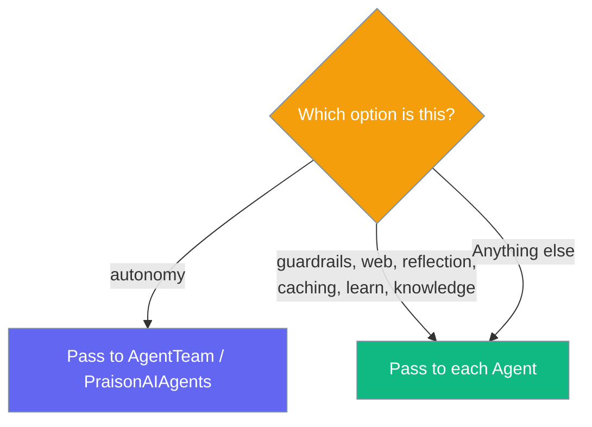

`AgentTeam` (also exported as `PraisonAIAgents`) applies `autonomy` at the team level; the feature options belong on each `Agent`.



## Quick Start

<Steps>
<Step title="Put feature options on each Agent">

Give every agent its own `web`, `knowledge`, or other feature options.

```python
from praisonaiagents import Agent, AgentTeam

researcher = Agent(
    name="Researcher",
    instructions="Research the topic.",
    web=True,                    # Feature options live on the Agent
    knowledge=["notes.txt"],
)
writer = Agent(
    name="Writer",
    instructions="Write a summary.",
    reflection=True,
)

team = AgentTeam(agents=[researcher, writer])
team.start("Summarise the latest AI safety research")
```

</Step>

<Step title="Put autonomy on the team">

`autonomy` is the one option the team applies for you.

```python
from praisonaiagents import Agent, AgentTeam

team = AgentTeam(
    agents=[Agent(name="Worker", instructions="Do the task.")],
    autonomy=True,               # Applied at the team level
)
team.start("Plan and execute the task")
```

</Step>
</Steps>

---

## How It Works

`AgentTeam` accepts six feature options for API symmetry with `Agent`, but does not apply them at the team level. Passing them logs a warning and ignores the value.

| Option | Belongs on | Passing it to the team does… |
|--------|-----------|------------------------------|
| `autonomy` | `AgentTeam` | Applies at the team level |
| `guardrails` | Each `Agent` | Warns and is ignored at the team level |
| `web` | Each `Agent` | Warns and is ignored at the team level |
| `reflection` | Each `Agent` | Warns and is ignored at the team level |
| `caching` | Each `Agent` | Warns and is ignored at the team level |
| `learn` | Each `Agent` | Warns and is ignored at the team level |
| `knowledge` | Each `Agent` | Warns and is ignored at the team level |

<Warning>
Passing `guardrails`, `web`, `reflection`, `caching`, `learn`, or `knowledge`
to `AgentTeam` / `PraisonAIAgents` triggers:

```text
AgentTeam received ['web'] but does not yet apply them at the team level;
pass these to individual Agent(...) instances instead.
```
</Warning>

---

## Common Patterns

Move the option down from the team onto each agent.

<CodeGroup>
```python Before (warns, ignored)
from praisonaiagents import Agent, AgentTeam

team = AgentTeam(
    agents=[
        Agent(name="Researcher", instructions="Research."),
        Agent(name="Writer", instructions="Write."),
    ],
    web=True,          # Warns and is ignored
)
```

```python After (works)
from praisonaiagents import Agent, AgentTeam

team = AgentTeam(
    agents=[
        Agent(name="Researcher", instructions="Research.", web=True),
        Agent(name="Writer", instructions="Write.", web=True),
    ],
)
```
</CodeGroup>

---

## Best Practices

<AccordionGroup>
<Accordion title="Set feature options per role">
Each agent has a different job. Give the researcher `web=True` and the writer
`reflection=True` rather than forcing one option across the whole team.
</Accordion>

<Accordion title="Reserve the team for autonomy">
`autonomy` is the only feature option the team propagates. Keep team-level
configuration to `autonomy`, `process`, and `manager_llm`.
</Accordion>

<Accordion title="Watch the logs">
A warning on construction means an option landed in the wrong place. Move it
onto the `Agent(...)` instances it was meant for.
</Accordion>
</AccordionGroup>

---

## Related

<CardGroup cols={2}>
<Card title="Knowledge Quick Start" icon="book" href="/knowledge/quickstart">
  Give each agent its own documents
</Card>
<Card title="Multi-Agent Pipelines" icon="users" href="/features/multi-agent-pipelines">
  Coordinate multiple agents
</Card>
</CardGroup>
