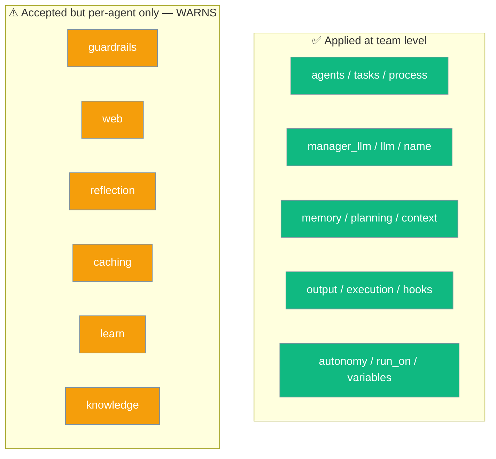

`AgentTeam` applies orchestration params at the team level, but six feature params only work when set on individual `Agent(...)` instances.

```python
from praisonaiagents import Agent, Task, PraisonAIAgents

researcher = Agent(name="Researcher", instructions="Research the topic.")
writer = Agent(name="Writer", instructions="Write a summary.")

team = PraisonAIAgents(agents=[researcher, writer])
team.start()
```



## Quick Start

<Steps>
<Step title="Team-level params work">

```python
from praisonaiagents import Agent, PraisonAIAgents

researcher = Agent(name="Researcher", instructions="Research the topic.")
writer = Agent(name="Writer", instructions="Write a summary.")

team = PraisonAIAgents(
    agents=[researcher, writer],
    process="sequential",
    memory=True,
    planning=True,
)
team.start()
```

`agents`, `process`, `memory`, `planning`, and the other orchestration params take effect for the whole team.

</Step>
<Step title="Feature params belong on each Agent">

```python
from praisonaiagents import Agent, PraisonAIAgents

researcher = Agent(
    name="Researcher",
    instructions="Research the topic.",
    knowledge=["notes.pdf"],
    guardrails=lambda o: (True, o),
)
writer = Agent(name="Writer", instructions="Write a summary.")

team = PraisonAIAgents(agents=[researcher, writer])
team.start()
```

Set `knowledge`, `guardrails`, `web`, `reflection`, `caching`, and `learn` on the `Agent(...)` that needs them.

</Step>
</Steps>

---

## What Applies Where

`AgentTeam` accepts the six feature params for API symmetry with `Agent`, but only stores them — it never enforces them at the team level. Only orchestration params and `autonomy` fan out.

| Param | Scope | Notes |
|-------|-------|-------|
| `agents` | Team | Team roster |
| `tasks` | Team | Auto-generated from agents if omitted |
| `process` | Team | `"sequential"`, `"workflow"`, `"hierarchical"` |
| `manager_llm` | Team | Manager LLM for hierarchical process |
| `llm` | Team | Default LLM for all agents |
| `name` | Team | Team name |
| `variables` | Team | Global variables for substitution |
| `memory` | Team | Multi-agent memory |
| `planning` | Team | Multi-agent planning |
| `context` | Team | Context management |
| `output` | Team | Output/verbosity config |
| `execution` | Team | Iteration/retry limits |
| `hooks` | Team | Multi-agent hooks |
| `autonomy` | Team | Propagated per agent via `_init_autonomy` |
| `run_on` | Team | Shared sandbox for all agents |
| `guardrails` | **Per-agent only** | **Warns** if passed to the team |
| `web` | **Per-agent only** | **Warns** if passed to the team |
| `reflection` | **Per-agent only** | **Warns** if passed to the team |
| `caching` | **Per-agent only** | **Warns** if passed to the team |
| `learn` | **Per-agent only** | **Warns** if passed to the team |
| `knowledge` | **Per-agent only** | **Warns** if passed to the team |

---

## Wrong vs Right

Passing feature params to the team compiles fine — no `TypeError` — but silently does nothing. Move them onto the agents that need them.

<CodeGroup>
```python Warns — no team-level effect
from praisonaiagents import Agent, PraisonAIAgents

researcher = Agent(name="Researcher", instructions="Research.")
writer = Agent(name="Writer", instructions="Write.")

# knowledge/guardrails/etc. are NOT applied at the team level
team = PraisonAIAgents(
    agents=[researcher, writer],
    knowledge=["notes.pdf"],
    guardrails=lambda o: (True, o),
)
```

```python Correct — configure per Agent
from praisonaiagents import Agent, PraisonAIAgents

researcher = Agent(
    name="Researcher",
    instructions="Research.",
    knowledge=["notes.pdf"],
    guardrails=lambda o: (True, o),
)
writer = Agent(name="Writer", instructions="Write.")

team = PraisonAIAgents(agents=[researcher, writer])
```
</CodeGroup>

<Warning>
Passing any of `guardrails`, `web`, `reflection`, `caching`, `learn`, or `knowledge` to `AgentTeam` logs:

```
AgentTeam received ['knowledge', 'guardrails'] but does not yet apply them at the team level; pass these to individual Agent(...) instances instead.
```

The team still runs — those settings are simply ignored at the team level.
</Warning>

---

## Why It's This Way

These six params exist on `AgentTeam` for **parity with the `Agent` API surface**, so the same call shape works in both places. There is no team-level orchestrator for guardrails, web, reflection, caching, learn, or knowledge yet, so the team stores the values but cannot enforce them. Each `Agent` already enforces them individually, which is where they belong.

---

## Best Practices

<AccordionGroup>
  <Accordion title="Put feature params on the Agent that needs them">
    A researcher needs `knowledge`; a validator needs `guardrails`. Configure each `Agent(...)` for its own job instead of hoping the team fans settings out.
  </Accordion>
  <Accordion title="Watch the logs when a feature seems inactive">
    If knowledge or guardrails appear to do nothing on a team, check for the "does not yet apply them at the team level" warning — it means the param landed on the team, not an agent.
  </Accordion>
  <Accordion title="Use team params for orchestration only">
    Reserve `AgentTeam(...)` for `process`, `memory`, `planning`, `context`, `output`, `execution`, `hooks`, and `autonomy` — the params that actually fan out.
  </Accordion>
</AccordionGroup>

---

## Related

<CardGroup cols={2}>
  <Card icon="shield-check" href="/features/guardrails" title="Guardrails">
    Validate agent output per agent.
  </Card>
  <Card icon="book" href="/features/knowledge-source-types" title="Knowledge Sources">
    What `Agent(knowledge=...)` accepts.
  </Card>
  <Card icon="globe" href="/features/web" title="Web">
    Enable web search and fetch per agent.
  </Card>
  <Card icon="rotate" href="/features/reflection" title="Reflection">
    Self-reflection per agent.
  </Card>
  <Card icon="database" href="/features/caching" title="Caching">
    Response and prompt caching per agent.
  </Card>
  <Card icon="graduation-cap" href="/features/learn" title="Learn">
    Continuous learning per agent.
  </Card>
</CardGroup>
