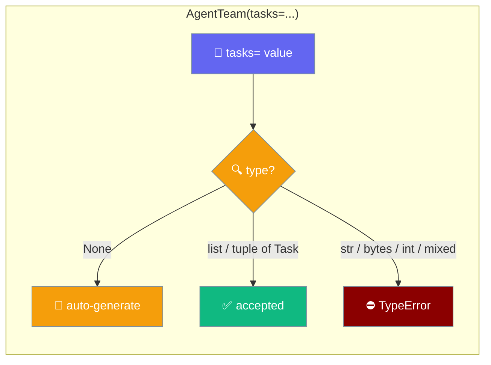

`AgentTeam` only accepts `tasks=None` (auto-generate one per agent) or a list / tuple of `Task` instances — anything else raises a clear `TypeError` at construct time.



## Quick Start

<Steps>
<Step title="Let the team auto-generate tasks">

```python
from praisonaiagents import Agent, AgentTeam

writer = Agent(name="Writer", instructions="Write a short bio")
team = AgentTeam(agents=[writer])  # tasks=None by default
team.start("Write one sentence about rain")
```

`tasks=None` generates one task per agent — the shortest working run.

</Step>

<Step title="Pass explicit Task instances">

```python
from praisonaiagents import Agent, AgentTeam, Task

writer = Agent(name="Writer", instructions="Write a short bio")
task = Task(
    description="Write one sentence about rain",
    expected_output="One sentence",
    agent=writer,
)

team = AgentTeam(agents=[writer], tasks=[task])
team.start()
```

Use a list of `Task` instances when you need per-task control.

</Step>
</Steps>

---

## Common Mistake

`tasks=` is not a prompt string — passing one raises a `TypeError`.

```python
# ❌ Wrong — tasks is not a prompt string
team = AgentTeam(agents=[writer], tasks="Write one sentence")
# TypeError: tasks must be a sequence of Task instances, not str.
# Pass tasks=None to auto-generate from agents, or tasks=[Task(...)].
```

Fix it by passing the prompt to `start()`, or wrapping it in a `Task`.

<CodeGroup>
```python Option A — prompt goes to start()
from praisonaiagents import Agent, AgentTeam

writer = Agent(name="Writer", instructions="Write a short bio")
team = AgentTeam(agents=[writer])
team.start("Write one sentence")
```

```python Option B — wrap as Task
from praisonaiagents import Agent, AgentTeam, Task

writer = Agent(name="Writer", instructions="Write a short bio")
task = Task(
    description="Write one sentence",
    expected_output="One sentence",
    agent=writer,
)
team = AgentTeam(agents=[writer], tasks=[task])
```
</CodeGroup>

---

## Accepted and Rejected Inputs

Every `tasks=` value resolves to one of these outcomes.

| `tasks=` value | Result |
|----------------|--------|
| `None` | Auto-generates one task per agent |
| `[Task(...), Task(...)]` | Accepted |
| `(Task(...),)` | Accepted (tuple works) |
| `[]` | `ValueError("If tasks are provided, at least one task must be present")` |
| `"Write ..."` | `TypeError` naming `Task` and the valid shapes |
| `b"..."` | `TypeError` |
| `123` | `TypeError("tasks must be a sequence of Task instances, got int")` |
| `[task, "x"]` | `TypeError("tasks[1] must be a Task instance, got str")` |

---

## Error Reference

Grep these exact messages when you hit a failure.

| Input | Exception | Message |
|-------|-----------|---------|
| `str` / `bytes` | `TypeError` | `tasks must be a sequence of Task instances, not str. Pass tasks=None to auto-generate from agents, or tasks=[Task(...)].` |
| Non-sequence (e.g. `int`) | `TypeError` | `tasks must be a sequence of Task instances, got int` |
| Sequence with a non-`Task` item | `TypeError` | `tasks[1] must be a Task instance, got str` |
| Empty list / tuple | `ValueError` | `If tasks are provided, at least one task must be present` |

---

## Best Practices

<AccordionGroup>
<Accordion title="Prefer tasks=None for simple runs">
Pass the prompt to `start()` and let the team auto-generate one task per agent — often all you need.
</Accordion>
<Accordion title="Use Task(...) when you need per-task control">
`Task(description=..., expected_output=..., agent=...)` gives you templating with `{{placeholder}}`, custom `expected_output`, and a specific `agent=`.
</Accordion>
<Accordion title="A tuple of Task works too">
`tasks=(t1, t2)` is accepted — the sequence is coerced to a list internally, useful when the task list is static.
</Accordion>
<Accordion title="Empty list is a ValueError, not a TypeError">
`tasks=[]` has always raised `ValueError` — that check pre-dates the strict type validation.
</Accordion>
</AccordionGroup>

---

## Related

<CardGroup cols={2}>
<Card icon="users" href="/concepts/agentteam" title="AgentTeam">
  The team class and its full parameter list.
</Card>
<Card icon="list-check" href="/features/agentteam-supported-params" title="AgentTeam Params">
  Which params apply at the team level.
</Card>
<Card icon="layer-group" href="/features/agentteam-batch" title="Batch Runs">
  Run the same team once per input.
</Card>
<Card icon="list-check" href="/concepts/tasks" title="Tasks">
  Task configuration and templating.
</Card>
</CardGroup>

<Note>
Validation added in [PraisonAI PR #5738](https://github.com/MervinPraison/PraisonAI/pull/5738) (fixes [#5736](https://github.com/MervinPraison/PraisonAI/issues/5736)).
</Note>
