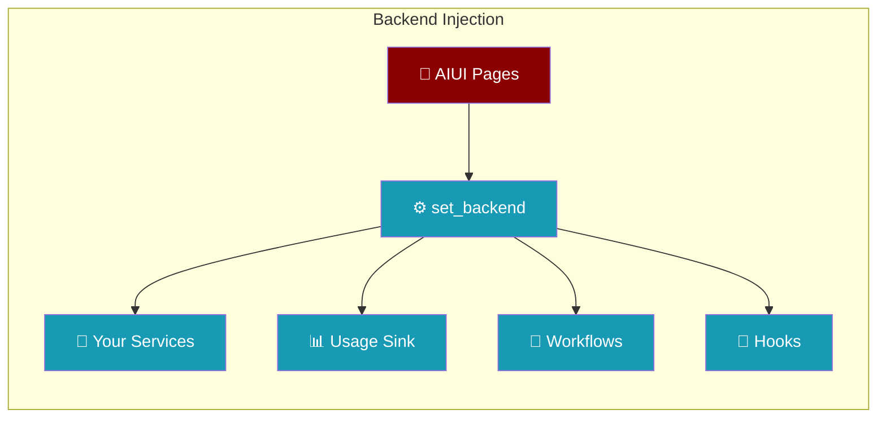

```python
from praisonaiagents import Agent

agent = Agent(name="ui-agent", instructions="Use AG-UI or A2UI backends for streaming.")
agent.start("Stream this response to the frontend UI.")
```


Wire your own backend services into PraisonAIUI using the dependency injection API for custom data sources and business logic.

The user wires custom services into PraisonAIUI; the agent streams responses while injected backends supply data and hooks.



## Quick Start

<Steps>
<Step title="Auto-wire Default Backends">

Let bridges auto-configure available services:

```python
from praisonai.integration import configure_host, setup_bridges

configure_host(title="My App")
setup_bridges()  # Auto-wires usage, workflows, hooks, approvals
```

</Step>

<Step title="Custom Backend Override">

Replace specific backends with your implementations:

```python
import praisonaiui.backends as backends

# Override usage tracking
backends.set_backend("usage_sink", my_database_sink)
backends.set_backend("usage_query", my_analytics_query)

# Override workflow execution
backends.set_backend("workflows", my_workflow_runner)
```

</Step>
</Steps>

---

## Available Backend Keys

The injection API supports these standard backend keys:

| Key | Expected Type | Purpose | Auto-wired by |
|-----|---------------|---------|---------------|
| `hooks` | `Callable[[], List[Dict]]` | List UI-friendly hook definitions | `hooks_query.list_hooks_for_api` |
| `workflows` | `Callable[str, dict, dict] -> dict` | Execute YAML workflows | `workflows_service.run_workflow` |
| `usage_sink` | `TokenUsageSinkProtocol` | Persist token usage data | `usage_bridge.register_usage_sink` |
| `usage_query` | `UsageQueryProtocol` | Query usage analytics | `usage_bridge.get_usage_query` |
| `approvals_pending` | `Callable[[], List[Dict]]` | List pending approvals | `approvals_bridge.list_pending_approvals` |
| `approvals_policies` | `Callable[[], List[Dict]]` | List approval policies | `approvals_bridge.get_approval_policies` |

---

## Backend Interfaces

### Hooks Backend

List registered hooks for UI consumption:

```python
def list_hooks_for_api() -> List[Dict[str, Any]]:
    """Return hooks in UI-friendly format."""
    return [
        {
            "name": "pre_task_hook",
            "event": "task.start",
            "description": "Validates task inputs",
            "enabled": True
        }
    ]

backends.set_backend("hooks", list_hooks_for_api)
```

### Workflows Backend

Execute YAML-driven workflows:

```python
def execute_workflow(workflow_id: str, workflow: dict, input_data: dict) -> dict:
    """Execute workflow and return run record."""
    text = input_data.get("text", input_data.get("message", ""))
    
    # Your workflow execution logic
    result = my_workflow_engine.run(workflow_id, text, workflow)
    
    return {
        "id": result.run_id,
        "workflow_id": workflow_id,
        "status": result.status,
        "input": {"text": text},
        "output": result.output,
        "error": result.error,
        "created_at": result.timestamp
    }

backends.set_backend("workflows", execute_workflow)
```

### Usage Tracking Backends

Wire custom analytics services:

```python
from praisonaiagents.telemetry.protocols import TokenUsageSinkProtocol, UsageQueryProtocol

class MyAnalyticsSink:
    def persist(self, task_id: str, agent_name: str, model: str, 
               metrics: Any, metadata: dict = None) -> None:
        # Send to analytics service
        analytics.track_usage(task_id, agent_name, model, 
                             input_tokens=metrics.input_tokens,
                             output_tokens=metrics.output_tokens)

class MyAnalyticsQuery:
    def get_summary(self) -> dict:
        return analytics.get_usage_summary()
    
    def list_recent(self, limit: int = 50) -> list:
        return analytics.get_recent_usage(limit)

backends.set_backend("usage_sink", MyAnalyticsSink())
backends.set_backend("usage_query", MyAnalyticsQuery())
```

### Approvals Backends

Integrate with approval workflow systems:

```python
def list_pending_approvals() -> List[Dict[str, Any]]:
    """List approvals awaiting human review."""
    pending = approval_system.get_pending()
    return [
        {
            "id": item.id,
            "type": item.type,
            "description": item.description,
            "requester": item.agent_name,
            "created_at": item.timestamp,
            "metadata": item.data
        }
        for item in pending
    ]

def get_approval_policies() -> List[Dict[str, Any]]:
    """List configured approval policies."""
    return [
        {
            "name": "high_cost_operations",
            "description": "Require approval for operations >$10",
            "conditions": ["cost > 10.0"],
            "approvers": ["admin", "finance"]
        }
    ]

backends.set_backend("approvals_pending", list_pending_approvals)
backends.set_backend("approvals_policies", get_approval_policies)
```

---

## Auto-wired Bridges

The `setup_bridges()` function automatically wires available services:

```python
from praisonai.integration.bridges import (
    usage_bridge,
    hooks_query, 
    workflows_service,
    approvals_bridge,
    schedules_runner
)

# Auto-wired when available:
sink = usage_bridge.register_usage_sink()        # -> "usage_sink"
query = usage_bridge.get_usage_query()           # -> "usage_query"  
workflows_service.run_workflow                   # -> "workflows"
hooks_query.list_hooks_for_api                  # -> "hooks"
approvals_bridge.list_pending_approvals         # -> "approvals_pending"
approvals_bridge.get_approval_policies          # -> "approvals_policies"

# Plus schedule runner (separate system)
schedules_runner.ensure_schedule_runner()        # Starts daemon if needed
```

---

## Custom Integration Example

Complete example integrating with external systems:

```python
import praisonaiui.backends as backends
from praisonai.integration import configure_host, create_host_app

# External service clients
class WorkflowEngine:
    def execute(self, workflow_id: str, input_text: str) -> dict:
        # Call external workflow service
        response = requests.post(f"{WORKFLOW_API}/execute", json={
            "workflow_id": workflow_id,
            "input": input_text
        })
        return response.json()

class AuditService:
    def log_usage(self, metrics: dict) -> None:
        # Send to audit/compliance system
        requests.post(f"{AUDIT_API}/usage", json=metrics)

# Custom backends
class ExternalWorkflowBackend:
    def __init__(self):
        self.engine = WorkflowEngine()
    
    def __call__(self, workflow_id: str, workflow: dict, input_data: dict) -> dict:
        text = input_data.get("text", "")
        result = self.engine.execute(workflow_id, text)
        
        return {
            "id": result["run_id"],
            "workflow_id": workflow_id,
            "status": result["status"],
            "output": result.get("output"),
            "error": result.get("error")
        }

class AuditUsageSink:
    def __init__(self):
        self.audit = AuditService()
    
    def persist(self, task_id: str, agent_name: str, model: str, 
               metrics: Any, metadata: dict = None) -> None:
        self.audit.log_usage({
            "task_id": task_id,
            "agent": agent_name,
            "model": model,
            "tokens": getattr(metrics, 'total_tokens', 0),
            "cost": getattr(metrics, 'cost', 0.0),
            "timestamp": datetime.now().isoformat()
        })

# Wire custom backends
configure_host(title="External Integration Demo")

backends.set_backend("workflows", ExternalWorkflowBackend())
backends.set_backend("usage_sink", AuditUsageSink())

# Other backends auto-wired by setup_bridges()
from praisonai.integration import setup_bridges
setup_bridges()

app = create_host_app()
```

---

## Backend Discovery

Check what backends are currently registered:

```python
import praisonaiui.backends as backends

# List all registered backends
current_backends = backends.get_all_backends()
print(current_backends.keys())
# ['hooks', 'workflows', 'usage_sink', 'usage_query']

# Check specific backend
if backends.has_backend("usage_sink"):
    sink = backends.get_backend("usage_sink")
    print(f"Usage sink: {type(sink).__name__}")

# Clear a backend
backends.clear_backend("workflows")

# Clear all backends
backends.clear_all_backends()
```

---

## Error Handling

Backends should handle errors gracefully:

```python
class RobustWorkflowBackend:
    def __call__(self, workflow_id: str, workflow: dict, input_data: dict) -> dict:
        try:
            result = self.execute_workflow(workflow_id, workflow, input_data)
            return result
        except ExternalServiceError as e:
            # Return error format expected by UI
            return {
                "id": f"failed-{uuid.uuid4()}",
                "workflow_id": workflow_id,
                "status": "failed",
                "error": f"External service error: {str(e)}",
                "created_at": datetime.now().isoformat()
            }
        except Exception as e:
            # Log unexpected errors but don't crash UI
            logger.exception("Workflow backend error")
            return {
                "id": f"error-{uuid.uuid4()}",
                "workflow_id": workflow_id,
                "status": "error", 
                "error": "Internal error occurred",
                "created_at": datetime.now().isoformat()
            }
```

---

## Best Practices

<AccordionGroup>

<Accordion title="Use setup_bridges() first, then override">
Let auto-wiring handle standard cases, override specific backends:

```python
from praisonai.integration import setup_bridges
import praisonaiui.backends as backends

setup_bridges()  # Auto-wire available services
backends.set_backend("usage_sink", MyCustomSink())  # Override specific
```
</Accordion>

<Accordion title="Implement graceful fallbacks">
Handle missing external services gracefully:

```python
class FallbackWorkflowBackend:
    def __call__(self, workflow_id, workflow, input_data):
        try:
            return self.external_service.execute(workflow_id, input_data)
        except ConnectionError:
            # Fallback to local execution
            return self.local_executor.run(workflow, input_data)
```
</Accordion>

<Accordion title="Keep backend interfaces lightweight">
Backends are called frequently - keep them fast and stateless:

```python
# Good - lightweight, cached connection
class CachedDatabaseSink:
    def __init__(self):
        self._connection = None
    
    @property
    def connection(self):
        if self._connection is None:
            self._connection = create_db_connection()
        return self._connection

# Avoid - heavy initialization on every call
class BadDatabaseSink:
    def persist(self, ...):
        connection = create_new_db_connection()  # Expensive!
        # ...
```
</Accordion>

</AccordionGroup>

---

## Related

<CardGroup cols={2}>
<Card title="Host Integration" icon="plug" href="/docs/features/host-integration">
  Main integration module
</Card>
<Card title="L3 Dashboard Pages" icon="chart-line" href="/docs/features/l3-dashboard-pages">
  Auto-registered pages backed by custom backends
</Card>
</CardGroup>

<Note>
L3 dashboard pages can be backed by custom backends via `set_backend()`. For example, set a custom `"workflows"` backend to power the Workflow Runs page with your own data.
</Note>