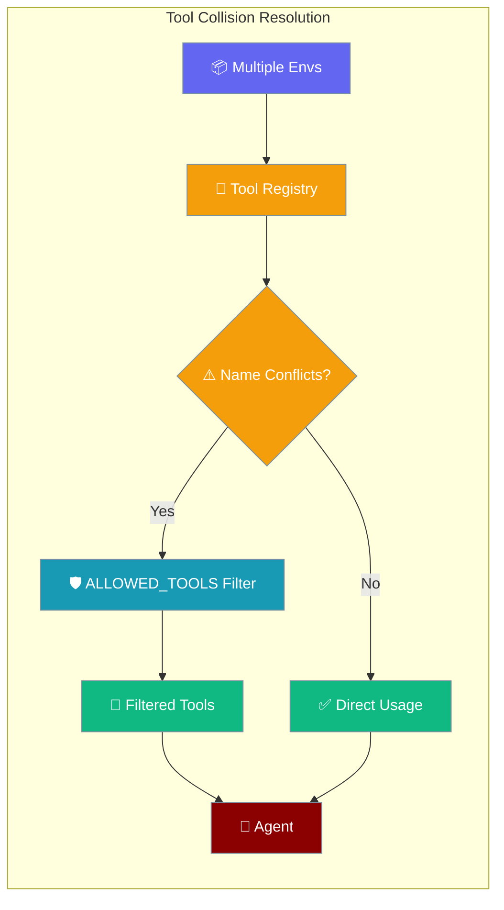
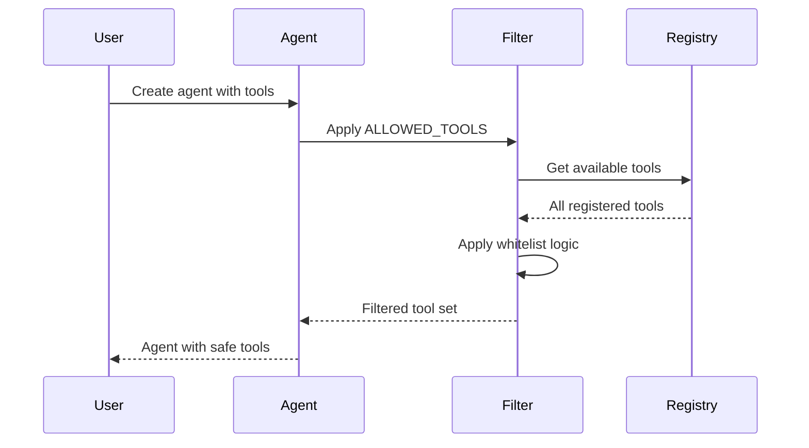
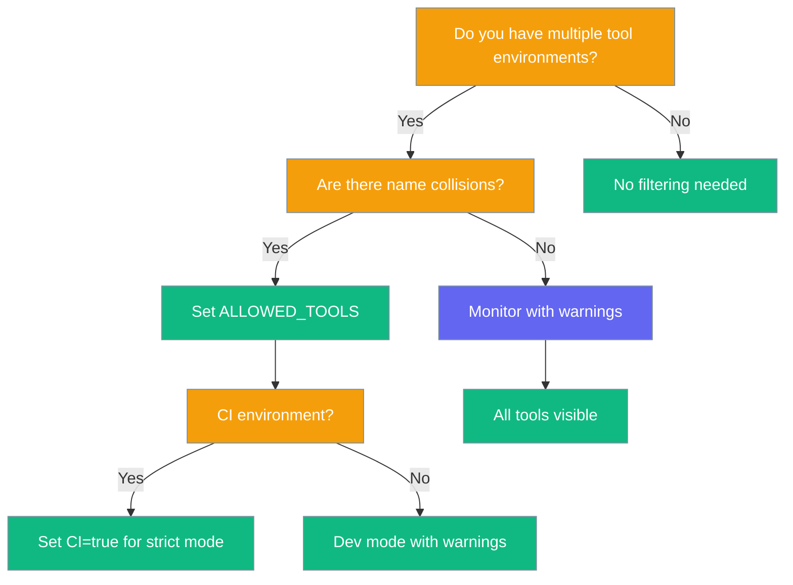

Tool whitelisting prevents agent confusion by filtering visible tools to only those explicitly allowed, solving collision problems in multi-environment deployments.



## Quick Start

<Steps>
<Step title="Set Environment Variable">
Enable tool whitelisting by setting `ALLOWED_TOOLS` to a comma-separated list of tool names:

```bash
export ALLOWED_TOOLS="search,send_message"
```

```python
from praisonaiagents import Agent

agent = Agent(
    name="Assistant",
    instructions="Use only the whitelisted tools",
    tools=["search", "send_message", "extract_pdf"],  # extract_pdf gets filtered out
)

agent.start("Find recent news and message me a summary")
```
</Step>

<Step title="Programmatic Usage">
Use the `AllowedToolsFilter` class directly for more control:

```python
from praisonaiagents.allowed_tools_filter import AllowedToolsFilter

tool_filter = AllowedToolsFilter()
available_tools = {"search", "send_message", "extract_pdf"}
visible_tools = tool_filter.filter_tools(available_tools)
tool_filter.log_diagnostics()

print(f"Filtered tools: {visible_tools}")
```
</Step>
</Steps>

---

## How It Works

The filter operates at tool registration time, intercepting the complete tool registry and returning only whitelisted tools.



| Environment State | Behavior |
|------------------|----------|
| `ALLOWED_TOOLS` unset | All tools visible (with collision warning) |
| `ALLOWED_TOOLS=""` | **Error** - empty string not allowed |
| `ALLOWED_TOOLS=search,send_message` | Only these tools visible |
| Unknown tool + `CI=true` | **Strict failure** at startup |
| Unknown tool + dev mode | Warning logged, unknown tools stripped |

---

## Configuration Options

| Option | Type | Default | Description |
|--------|------|---------|-------------|
| `ALLOWED_TOOLS` (env) | `str` (csv) | unset | Comma-separated tool names to whitelist |
| `HERMES_ONLY_TOOLS` (env) | `str` (csv) | unset | **Deprecated** backward-compatibility alias |
| `CI` (env) | `str` | unset | When truthy (`true`/`1`/`yes`), unknown tools cause startup failure |
| `env_var_name` (constructor) | `str` | `"ALLOWED_TOOLS"` | Override the primary environment variable name |

### AllowedToolsFilter Methods

| Method | Returns | Description |
|--------|---------|-------------|
| `filter_tools(available_tools)` | `Set[str]` | Apply whitelist filter to tool set |
| `is_enabled()` | `bool` | Check if filtering is active |
| `get_whitelist()` | `Optional[Set[str]]` | Get current whitelist set |
| `log_diagnostics()` | `None` | Print startup diagnostics report |
| `get_diagnostics()` | `Dict[str, Any]` | Get diagnostics as dictionary |

---

## Common Patterns

### Multi-Environment Composition

Combine YouTube, Twilio, and Gmail tool modules while ensuring agents see only canonical tools:

```python
from praisonaiagents import Agent

# Multiple environments might register overlapping tool names
# ALLOWED_TOOLS ensures deterministic tool selection
agent = Agent(
    name="Communication Assistant", 
    instructions="Handle multimedia communication tasks",
    tools=["youtube_search", "twilio_send", "gmail_send", "search", "send_message"]
)
# Only tools in ALLOWED_TOOLS whitelist will be visible
```

### CI/CD Strict Mode

Catch typos early by enabling strict mode in pipelines:

```bash
# In CI environment
export CI=true
export ALLOWED_TOOLS="search,send_message,nonexistent_tool"
# This will fail fast with ValueError instead of silently ignoring typos
```

### Backward Compatibility Migration

Existing projects using `HERMES_ONLY_TOOLS` continue working:

```bash
# Legacy (still works)
export HERMES_ONLY_TOOLS="search,send_message"

# Preferred (takes precedence if both are set)
export ALLOWED_TOOLS="search,send_message"
```

---

## Best Practices

<AccordionGroup>
<Accordion title="Use exact registered tool names">
Tool names are case-sensitive and must match exactly as registered in the tool registry. Use `list_tools()` to verify available names before whitelisting.

```python
from praisonaiagents.tools import list_tools
print("Available tools:", list_tools())
```
</Accordion>

<Accordion title="Enable strict mode in CI pipelines">
Set `CI=true` in automated environments to catch typos in `ALLOWED_TOOLS` that would otherwise be silently ignored in development.

```bash
# In CI/CD pipelines
export CI=true
export ALLOWED_TOOLS="search,send_message"
```
</Accordion>

<Accordion title="Prefer ALLOWED_TOOLS over legacy naming">
New projects should use `ALLOWED_TOOLS` instead of the deprecated `HERMES_ONLY_TOOLS`. The new name is clearer and future-proof.

```bash
# ✅ Preferred
export ALLOWED_TOOLS="search,send_message"

# ❌ Deprecated (backward compatibility only)  
export HERMES_ONLY_TOOLS="search,send_message"
```
</Accordion>

<Accordion title="Combine with BotConfig for layered security">
Environment-variable whitelisting is global and name-based, while `BotConfig.allowed_tools` provides per-bot runtime filtering. Use both for comprehensive tool security.

```python
from praisonaiagents import Agent, BotConfig

# Global filter (env var): search,send_message,extract_pdf
# Bot-level filter (runtime): search,send_message only
bot_config = BotConfig(allowed_tools=["search", "send_message"])
agent = Agent(name="Bot", bot_config=bot_config)
```
</Accordion>
</AccordionGroup>

---

## When to Use ALLOWED_TOOLS



### Real-World Scenario

User runs an agent in an environment with YouTube, Gmail, and Twilio integrations. Each provides a `send_message` tool:

1. **Without ALLOWED_TOOLS**: Agent might pick wrong `send_message` implementation
2. **With ALLOWED_TOOLS**: Agent gets deterministic tool set: `search,gmail_send,twilio_sms`
3. **User types**: "/summarize latest emails and send alerts"  
4. **Agent behavior**: Uses `search` for email summary, `gmail_send` for notifications (not the conflicting tools)

---

## Related

<CardGroup cols={2}>
<Card title="Tool Configuration" icon="wrench" href="/configuration/tool-config">
  Environment variables and tool setup
</Card>
<Card title="Security Best Practices" icon="shield" href="/security">
  Agent and tool security guidelines  
</Card>
</CardGroup>