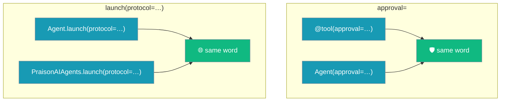

One vocabulary spans the SDK: `approval=` gates tools and agents, and `launch(protocol=...)` serves them.

```python
from praisonaiagents import Agent, tool
from praisonaiagents.agents import PraisonAIAgents

@tool(approval=True)
def refund_order(order_id: str) -> str:
    """Refund an order."""
    return f"Refunded {order_id}"

support = Agent(name="support", tools=[refund_order], approval="high")
billing = Agent(name="billing", instructions="Answer billing questions.")

PraisonAIAgents(agents=[support, billing]).launch(protocol="mcp", port=7777)
# → http://localhost:7777/mcp — same launch() you already know from protocol="http"
```



## Quick Start

<Steps>
<Step title="Gate a tool">
`approval=True` on `@tool` registers the tool at `"high"` risk.

```python
from praisonaiagents import tool

@tool(approval=True)
def delete_account(user_id: str) -> str:
    """Delete a user account."""
    return f"Deleted {user_id}"
```
</Step>

<Step title="Gate an agent">
The same word gates the agent — `approval="high"` asks before any high-risk tool.

```python
from praisonaiagents import Agent

agent = Agent(name="support", instructions="Help users.", approval="high")
```
</Step>

<Step title="Serve over MCP">
`launch(protocol="mcp")` publishes the agent(s) over MCP — same `launch()` as `protocol="http"`.

```python
agent.launch(protocol="mcp", port=7777)
```
</Step>
</Steps>

---

## The two words

| Concept | The word | Where it appears |
|---------|----------|------------------|
| Human sign-off before running | `approval=` | `@tool(approval=…)` and `Agent(approval=…)` |
| Serve over a protocol | `launch(protocol=…)` | `Agent.launch(protocol=…)` and `PraisonAIAgents.launch(protocol=…)` |

`launch(protocol="mcp")` delegates to `serve_agents(...)`, so single- and multi-agent serving share one endpoint (`/mcp`), one tool schema (`ask_{name}` + `list_agents`), and one session model.

---

## Deprecated spellings

Old spellings still work but are on the way out.

| Deprecated | Use instead | Note |
|------------|-------------|------|
| `@tool(requires_approval=…)` | `@tool(approval=…)` | Still works, emits a `DeprecationWarning`. `.requires_approval` and `.approval` both hold the resolved value. |
| `serve_agents([...])` (free function) | `launch(protocol="mcp")` | Kept as a thin alias for a function-call idiom — identical behaviour. Not deprecated; use whichever fits your code. |

---

## Best Practices

<AccordionGroup>
<Accordion title="Prefer approval= everywhere">
Write `approval=` on both `@tool` and `Agent`. One word means one mental model — no guessing which surface uses which spelling.
</Accordion>

<Accordion title="Pick the launch idiom that fits your code">
Hold an `Agent` or `PraisonAIAgents` object? Call `launch(protocol="mcp")`. Writing an imperative script? Call `serve_agents([...])`. Both resolve to the same server.
</Accordion>

<Accordion title="Migrate off requires_approval">
`requires_approval=` warns on every use — including explicit `False`. Swap it for `approval=` to silence the `DeprecationWarning`.
</Accordion>
</AccordionGroup>

---

## Related

<CardGroup cols={2}>
<Card title="Tool Approval" icon="shield-check" href="/docs/features/tool-requires-approval">
`@tool(approval=…)` decorator reference
</Card>
<Card title="Agent Approval" icon="shield-check" href="/docs/features/approval">
`Agent(approval=…)` config and the dangerous-tools registry
</Card>
<Card title="Serve Agents" icon="server" href="/docs/features/serve-agents">
`serve_agents([...])` — what `launch(protocol='mcp')` delegates to
</Card>
<Card title="Agents MCP" icon="robot" href="/docs/deploy/servers/agents-mcp">
`launch(protocol='mcp')` ergonomics and Docker
</Card>
</CardGroup>
