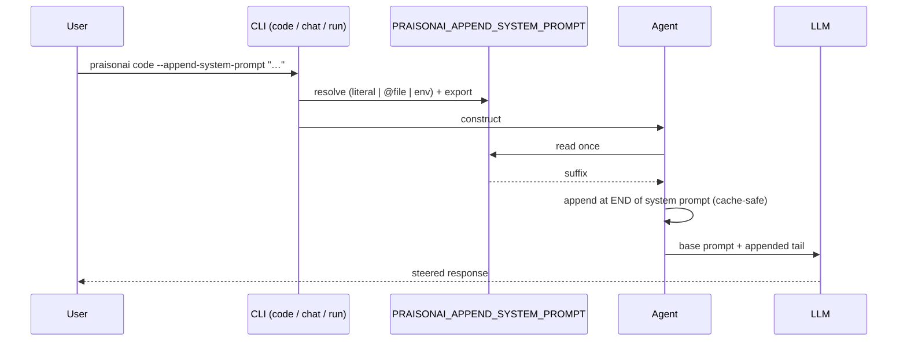
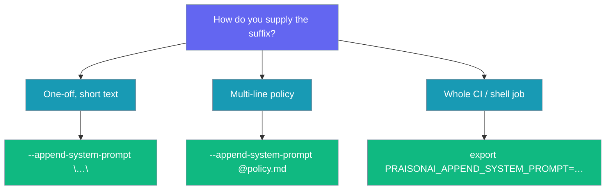

`--append-system-prompt` appends an arbitrary text suffix to the assembled system prompt for a single invocation — never persisted, and applied at the very end so the cacheable prompt prefix stays intact.

```mermaid
graph LR
    subgraph "Append System Prompt"
        Flag[🚩 --append-system-prompt<br/>/ env var] --> Resolve{🔎 Resolve}
        Resolve -->|literal| Text[📝 Text]
        Resolve -->|@file| File[📄 File contents]
        Resolve -->|env fallback| Env[🌐 PRAISONAI_APPEND_SYSTEM_PROMPT]
        Text --> Append[➕ Base prompt + tail<br/>cache-safe]
        File --> Append
        Env --> Append
        Append --> Agent[🤖 Agent]
    end

    classDef input fill:#6366F1,stroke:#7C90A0,color:#fff
    classDef check fill:#F59E0B,stroke:#7C90A0,color:#fff
    classDef source fill:#189AB4,stroke:#7C90A0,color:#fff
    classDef result fill:#10B981,stroke:#7C90A0,color:#fff

    class Flag input
    class Resolve check
    class Text,File,Env source
    class Append,Agent result
```

## Quick Start

<Steps>
<Step title="Append literal text">

```bash
praisonai code --append-system-prompt "Always answer in French"
```

</Step>

<Step title="Read the suffix from a file">

```bash
praisonai run "Refactor this module" --append-system-prompt @policy.md
```

</Step>

<Step title="Set the env var (CI-friendly)">

```bash
export PRAISONAI_APPEND_SYSTEM_PROMPT="Be brief. No preamble."
praisonai chat
```

</Step>
</Steps>

---

## How It Works

The CLI resolves the flag value, exports it as `PRAISONAI_APPEND_SYSTEM_PROMPT`, and the core `Agent` reads that single env var when it assembles its system prompt. Because every construction path — interactive TUI, one-shot prompt, YAML agents, and Python `Agent(...)` — funnels through the same env var, the suffix reaches all of them without a new constructor parameter.



The suffix is appended **after** the stable prompt prefix (and after any path-scoped glob rules), so the cacheable base prompt is preserved and prompt-cache reuse is unaffected. A whitespace-only or unset value is a no-op, and the suffix is **never** written to any agent definition, YAML, or session backstory.

---

## Choosing a Form

Pick the form that matches how long the guidance should live and how it's supplied.



| Option | Type | Default | Description |
|---|---|---|---|
| `--append-system-prompt` | `str` (literal or `@file`) | `None` | Per-invocation suffix appended to the system prompt. |
| `PRAISONAI_APPEND_SYSTEM_PROMPT` (env) | `str` | *unset* | Fallback used when the flag is omitted. |

When the value starts with `@`, the file contents are read (a missing file falls back to treating the raw value as literal text, so a run is never derailed).

---

## Where It Applies

One flag, three commands, same value shape everywhere. Exporting the env var also reaches YAML and Python agents in the same process.

| Command | Flag | Env fallback |
|---|---|---|
| `praisonai code` | `--append-system-prompt` | `PRAISONAI_APPEND_SYSTEM_PROMPT` |
| `praisonai chat` | `--append-system-prompt` | `PRAISONAI_APPEND_SYSTEM_PROMPT` |
| `praisonai run` | `--append-system-prompt` | `PRAISONAI_APPEND_SYSTEM_PROMPT` |
| YAML / Python | — | `PRAISONAI_APPEND_SYSTEM_PROMPT` |

<Note>
On `praisonai run`, setting `--append-system-prompt` keeps the run in-process. The warm-runtime fast path is bypassed for this invocation because that separate process never received the export and would silently drop the suffix.
</Note>

---

## Common Patterns

Steer one CLI run in French, no code changes:

```bash
praisonai code --append-system-prompt "Always answer in French"
```

Read the suffix from a policy file:

```bash
praisonai run "Refactor this module" --append-system-prompt @policy.md
```

Set once for a CI job, use across every command:

```bash
export PRAISONAI_APPEND_SYSTEM_PROMPT="Reply in strict JSON, no prose."
praisonai chat
```

Same knob from Python — every `Agent` constructed after the export picks it up:

```python
import os
from praisonaiagents import Agent

os.environ["PRAISONAI_APPEND_SYSTEM_PROMPT"] = "Reply concisely; no bullet points."
agent = Agent(instructions="You are a research assistant")
agent.start("Summarise transformer attention in 3 lines.")
```

---

## Best Practices

<AccordionGroup>
<Accordion title="Keep the suffix short">
Long suffixes reduce prompt-cache reuse across turns. Prefer a concise steer over a full policy in the flag itself.
</Accordion>

<Accordion title="Prefer @file for multi-line policies">
Reading from a file keeps shell quoting sane and versions the policy alongside your project.
</Accordion>

<Accordion title="Use the env var in CI">
Set `PRAISONAI_APPEND_SYSTEM_PROMPT` once so the same command runs everywhere without editing each invocation.
</Accordion>

<Accordion title="Not for persistent behaviour">
When the guidance is permanent, put it in YAML or `instructions=` instead — the suffix disappears when the process exits.
</Accordion>
</AccordionGroup>

<Warning>
The suffix is **never persisted**. It applies to a single invocation only — you must re-supply it (flag or env var) on every run.
</Warning>

<Warning>
Under `praisonai run`, this flag **bypasses the warm runtime** and runs in-process, so the first-invocation cost is a bit higher than a plain `run`. The warm runtime is a separate process that never receives the env export and reuses a cached agent whose system prompt is already assembled.
</Warning>

---

## Related

<CardGroup cols={2}>
  <Card title="Code CLI" icon="code" href="/cli/code">
    Code assistant mode for programming tasks
  </Card>
  <Card title="Chat CLI" icon="comments" href="/cli/chat">
    Interactive chat mode with AI agents
  </Card>
  <Card title="Run CLI" icon="play" href="/cli/run">
    Run agents from files or prompts
  </Card>
  <Card title="Prompt Caching" icon="database" href="/features/caching">
    Preserve the cacheable prompt prefix
  </Card>
</CardGroup>
