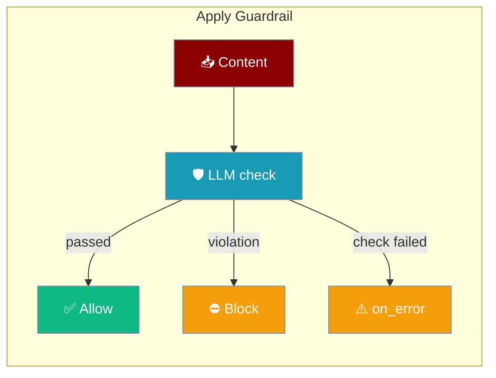
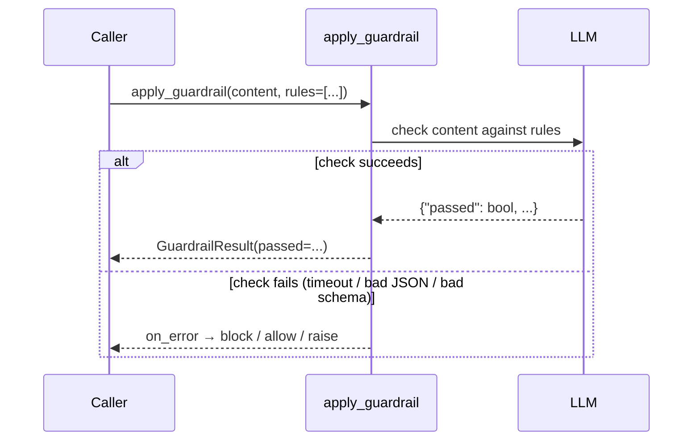
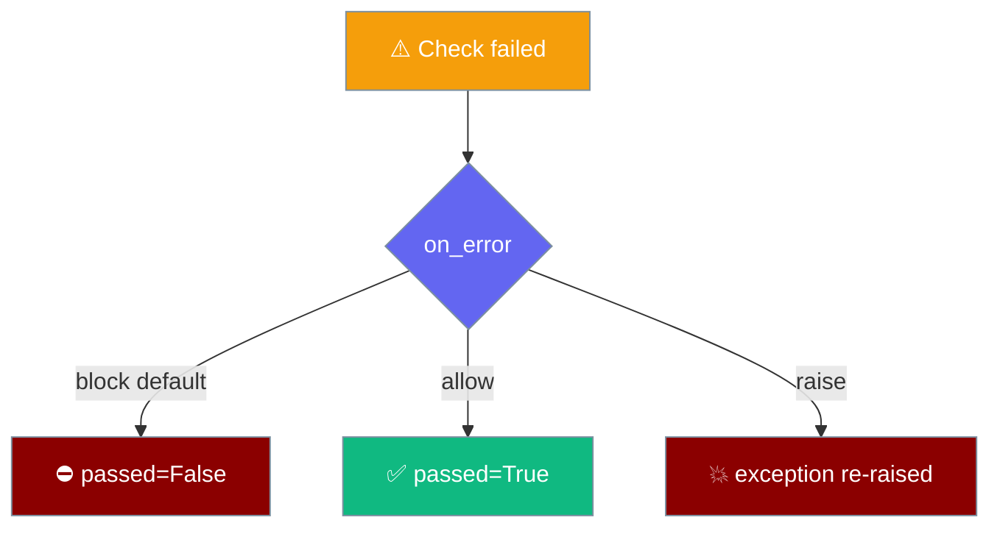

`apply_guardrail` runs a single LLM-backed content check and, since it fails closed by default, blocks content whenever the check itself cannot complete.

```python
from praisonaiagents import Agent
from praisonai.capabilities import apply_guardrail

def policy_check(output: str):
    result = apply_guardrail(output, rules=["no_pii", "no_profanity"])
    return (result.passed, output if result.passed else "Blocked by guardrail.")

agent = Agent(
    name="safe-assistant",
    instructions="Draft a customer-facing reply.",
    guardrails=policy_check,
)
agent.start("Write a reply to the customer.")
```

The agent produces output, the guardrail LLM checks it against your rules, and the content is blocked, allowed, or the error is raised — depending on `on_error`.



<Warning>
**Fail-closed default (PraisonAI PR [#5380](https://github.com/MervinPraison/PraisonAI/pull/5380)).** A rate-limit, timeout, network error, invalid JSON, empty response, or a missing / non-`bool` `passed` field now returns `passed=False` — the content is blocked. Before this PR the same failures silently returned `passed=True`. Pass `on_error="allow"` to restore the old permissive behaviour, or `on_error="raise"` to surface the underlying exception.
</Warning>

## Quick Start

<Steps>
<Step title="Use it as an agent guardrail">
Wrap `apply_guardrail` in a validator and pass it to `guardrails=`.

```python
from praisonaiagents import Agent
from praisonai.capabilities import apply_guardrail

def validator(output: str):
    result = apply_guardrail(output, rules=["no_pii"])
    return (result.passed, output)

agent = Agent(
    name="assistant",
    instructions="Answer the user politely.",
    guardrails=validator,
)
agent.start("Summarise the account status.")
```
</Step>

<Step title="Call it directly">
Run a one-off check on any string.

```python
from praisonai.capabilities import apply_guardrail

result = apply_guardrail("Some content", rules=["no_pii", "no_profanity"])
print(result.passed)
print(result.violations)
```
</Step>

<Step title="Await the async twin">
Use `aapply_guardrail` inside an event loop.

```python
import asyncio
from praisonai.capabilities import aapply_guardrail

async def main():
    result = await aapply_guardrail("Some content", rules=["no_pii"])
    print(result.passed)

asyncio.run(main())
```
</Step>
</Steps>

---

## How It Works

The check runs an LLM against your rules and returns a `GuardrailResult`. Any failure inside the check is routed through `on_error`.



---

## Choosing `on_error`

`on_error` decides what happens when the check itself cannot produce a valid decision.



| Mode | When the check fails | Use when |
|------|----------------------|----------|
| `"block"` (default) | `passed=False`, content blocked | Safety matters more than availability |
| `"allow"` | `passed=True`, content passes | You prefer availability (old behaviour) |
| `"raise"` | Underlying exception re-raised | You want to handle the error yourself |

---

## Parameters

| Parameter | Type | Default | Description |
|-----------|------|---------|-------------|
| `content` | `str` | — | Content to check |
| `guardrail_name` | `str` | `"default"` | Name of the guardrail |
| `rules` | `List[str]` | `None` | Rules to check against (falls back to built-in PII / profanity / harm / misinformation rules) |
| `model` | `str` | `"gpt-4o-mini"` | Model used for the check |
| `timeout` | `float` | `60.0` | Request timeout in seconds |
| `api_key` | `str` | `None` | Optional API key override |
| `api_base` | `str` | `None` | Optional API base URL override |
| `metadata` | `Dict[str, Any]` | `None` | Metadata carried onto the result |
| `on_error` | `"block" \| "allow" \| "raise"` | `"block"` | What to do when the check fails |

`aapply_guardrail` takes the same parameters and returns the same `GuardrailResult`.

---

## GuardrailResult

Both functions return a `GuardrailResult`.

| Field | Type | Description |
|-------|------|-------------|
| `passed` | `bool` | Whether the content passed the check |
| `violations` | `List[Dict[str, Any]]` | Violations found, or `[{"reason": "guardrail_unavailable", "error": "..."}]` when the check failed |
| `modified_content` | `str` | Cleaned content, if the model returned one |
| `original_content` | `str` | The content that was checked |
| `guardrail_name` | `str` | Name passed in `guardrail_name` |
| `metadata` | `Dict[str, Any]` | Your metadata; on failure also carries `"error"` and `"on_error"` keys |

---

## Common Patterns

### Restore the old permissive behaviour

```python
from praisonai.capabilities import apply_guardrail

result = apply_guardrail("Some content", rules=["no_pii"], on_error="allow")
```

### Handle the error yourself

```python
from praisonai.capabilities import apply_guardrail

try:
    result = apply_guardrail("Some content", on_error="raise")
except Exception as exc:
    print(f"Guardrail check failed: {exc}")
```

### Compose with an agent

```python
from praisonaiagents import Agent
from praisonai.capabilities import apply_guardrail

def validator(output: str):
    result = apply_guardrail(output, rules=["no_pii", "no_harmful_content"])
    return (result.passed, output)

agent = Agent(name="assistant", instructions="Help the user.", guardrails=validator)
agent.start("Draft a reply.")
```

---

## Best Practices

<AccordionGroup>
<Accordion title="Keep the fail-closed default in production">
The `"block"` default protects you when the check LLM is rate-limited or returns malformed output. Only switch to `"allow"` when availability outranks safety for that specific check.
</Accordion>

<Accordion title="Pass explicit rules">
Naming your rules (`rules=["no_pii", "no_profanity"]`) gives the check LLM a clear contract. With no `rules`, the built-in PII / profanity / harm / misinformation set is used.
</Accordion>

<Accordion title="Use the async twin inside event loops">
Call `aapply_guardrail` from async code so the check does not block the event loop. Use the sync `apply_guardrail` from plain scripts.
</Accordion>

<Accordion title="Inspect violations on block">
When blocked, read `result.violations` — a failed check surfaces `{"reason": "guardrail_unavailable", "error": "..."}` so you can tell a policy violation apart from an outage.
</Accordion>
</AccordionGroup>

---

## Related

<CardGroup cols={2}>
<Card title="Guardrails" icon="shield-halved" href="/features/guardrails">
  Agent-level output validation with automatic retry
</Card>
<Card title="Capabilities" icon="layer-group" href="/capabilities">
  Full inventory of capability helpers
</Card>
<Card title="Async Tool Safety" icon="bolt" href="/features/async-tool-safety">
  Non-blocking safety checks in async agents
</Card>
<Card title="Persistence Overview" icon="database" href="/persistence/overview">
  Store architecture and backends
</Card>
</CardGroup>
