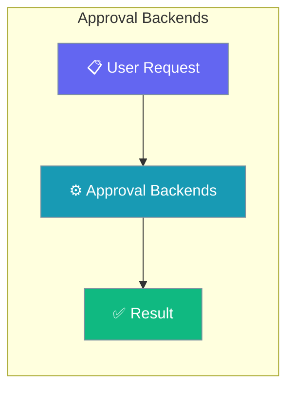
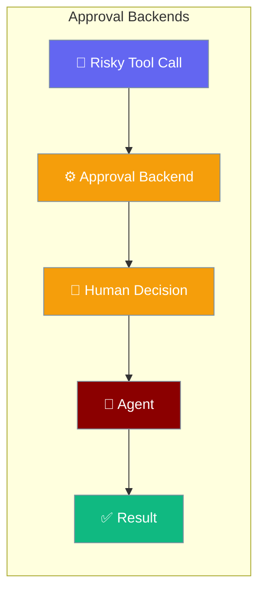
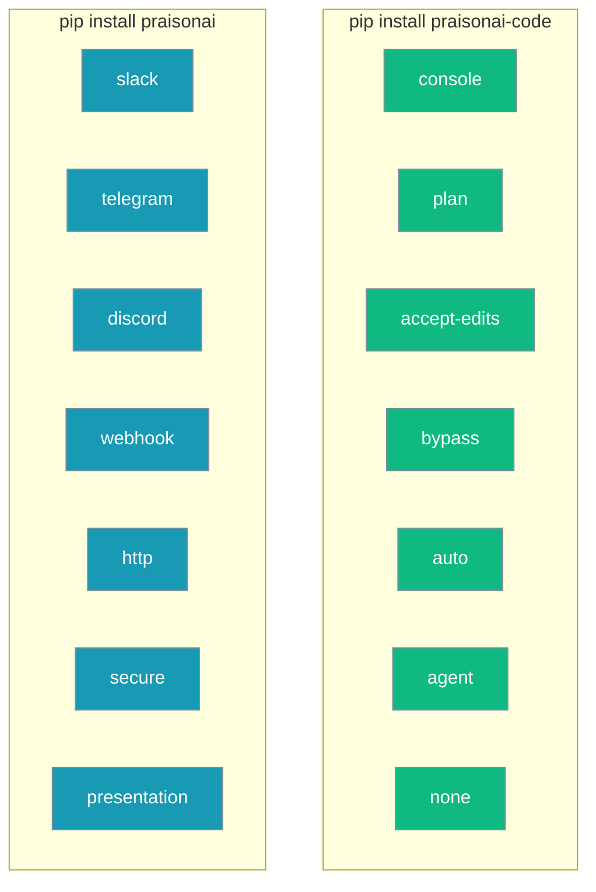
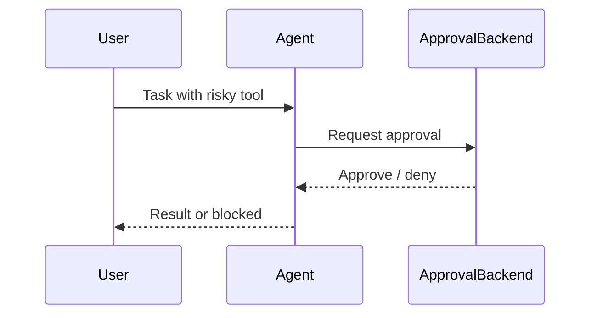

Pick who (or what) approves a tool call — the terminal, a coding-mode fast path, or a chat channel that fans out to Slack/Telegram/Discord.




```python
from praisonaiagents import Agent

agent = Agent(
    name="coder",
    instructions="Edit files carefully.",
    tools=["write_file"],
    approval="console",
)
agent.start("Refactor utils.py")
```

The user triggers a risky tool; the chosen approval backend prompts or routes the decision to a human.



### Available Backends



## How It Works

A risky tool call pauses until the chosen backend collects a human decision.



## Backend Matrix

| Backend | Where it runs | One-line meaning |
|---------|---------------|-------------------|
| `console` (also `true`/`yes`/`1`) | Standalone | Ask on the terminal, y/N |
| `none` (also `false`/`no`/`0`) | Standalone | Auto-approve everything (unsafe) |
| `auto` | Standalone | Auto-approve safe read-only tools |
| `plan` | Standalone | Coding-mode plan approval |
| `accept-edits` | Standalone | Auto-accept file-edit tools |
| `bypass` | Standalone | Approve without prompting (dev) |
| `agent` | Standalone | Delegate to a reviewer agent (see below) |
| `slack` | Wrapper | Approvals routed to Slack |
| `telegram` | Wrapper | Approvals routed to Telegram |
| `discord` | Wrapper | Approvals routed to Discord |
| `webhook` | Wrapper | Custom outbound HTTP webhook |
| `http` | Wrapper | Inbound HTTP approval endpoint |
| `secure` | Wrapper | Secure-mode policy (audit-logged) |
| `presentation` | Wrapper | Presentation/demo-safe policy |

<Note>
Wrapper backends (`slack`, `telegram`, `discord`, `webhook`, `http`, `secure`, `presentation`) require `pip install praisonai`.
</Note>

---

## Quick Start

```python
from praisonaiagents import Agent

agent = Agent(
    name="Code assistant",
    instructions="Help refactor code files.",
)
agent.start("Refactor utils.py")
```

<Steps>
<Step title="Choose your approval mode">

<Tabs>
<Tab title="Terminal">

Ask the user on the terminal before each risky tool call:

```bash
praisonai-code run --approval console "Refactor utils.py"
```

</Tab>
<Tab title="Coding fast path">

Use plan/accept-edits mode (Claude Code-style flow) for unattended coding runs:

```bash
praisonai-code run --approval plan "Refactor utils.py"
```

`accept-edits` auto-accepts file edits; `plan` requires explicit plan approval before execution.

</Tab>
<Tab title="Chat channel (wrapper)">

Route approvals to a Slack channel:

```bash
praisonai run --approval slack --approval-timeout 300 "Refactor utils.py"
```

<Note>
Channel backends (`slack`, `telegram`, `discord`, `webhook`, `http`, `secure`, `presentation`) require `pip install praisonai`.
</Note>

</Tab>
</Tabs>

</Step>
</Steps>

---

## `--approval-timeout`

`--approval-timeout` takes seconds. Pass `none` to wait indefinitely.

```bash
praisonai-code run --approval console --approval-timeout 60 "..."
praisonai-code run --approval slack --approval-timeout none "..."
```

---

## Reviewer-Agent Mode (`--approval agent`)

When you pass `--approval agent`, a built-in LLM reviewer gates every tool call. The default reviewer instruction is:

> *"You are a security reviewer. Only approve low-risk read operations. Deny anything destructive. Respond with exactly one word: APPROVE or DENY"*

```bash
praisonai-code run --approval agent "List all files and summarise the project"
```

The reviewer responds with exactly `APPROVE` or `DENY` for each pending tool call. You can override the default instruction by passing a custom reviewer prompt via the API:

```python
from praisonaiagents import Agent
from praisonaiagents.approval import AgentApproval

reviewer = Agent(
    name="strict-reviewer",
    instructions="Only approve file reads. Deny everything else. Reply APPROVE or DENY.",
)

agent = Agent(
    name="Assistant",
    instructions="Help with coding tasks.",
    approval=AgentApproval(approver_agent=reviewer),
)
agent.start("Read and summarise main.py")
```

---

## Unknown-Backend Error

If you pass an unrecognised backend name, the CLI raises:

```
Unknown approval backend: '<value>'. Valid options: console, plan, accept-edits, bypass, auto, agent, none, discord, http, presentation, secure, slack, telegram, webhook
```

Use this to trap typos — the valid list is alphabetically sorted within the wrapper group.

---

## Best Practices

<AccordionGroup>
<Accordion title="Use console in interactive dev, agent for unattended runs">
Use `console` in interactive dev, `agent` for unattended runs where a reviewer LLM can gate tools.
</Accordion>
<Accordion title="Pair accept-edits and plan with praisonai-code code">
`accept-edits` and `plan` are the coding-mode fast paths — pair them with `praisonai-code code`.
</Accordion>
<Accordion title="Never use none outside throwaway sandboxes">
`none` disables approval entirely; only use it in throwaway sandboxes.
</Accordion>
</AccordionGroup>

---

## Related

<CardGroup cols={2}>
<Card title="Local Tools Loading" icon="wrench" href="/docs/features/local-tools-loading">
Approval decides who says yes to your local tools.
</Card>
<Card title="Approval" icon="shield" href="/docs/features/approval">
The full approval system — dangerous tool gating, TTY detection, and safe defaults.
</Card>
</CardGroup>
