Agents can require human approval before executing dangerous tools. Set `approval=True` on any agent to auto-approve, or pass a custom backend for console, webhook, Slack, or any approval channel.

```mermaid
graph LR
    subgraph "Approval Protocol"
        A[🔧 Tool Call] --> B{🔒 Required?}
        B -->|No| D[✅ Execute]
        B -->|Yes| C[📋 Backend]
        C -->|Approved| D
        C -->|Denied| E[❌ Blocked]
    end

    classDef tool fill:#6366F1,stroke:#7C90A0,color:#fff
    classDef check fill:#F59E0B,stroke:#7C90A0,color:#fff
    classDef result fill:#10B981,stroke:#7C90A0,color:#fff
    classDef denied fill:#8B0000,stroke:#7C90A0,color:#fff

    class A tool
    class B,C check
    class D result
    class E denied
```



## Quick Start

<Steps>

<Step title="Auto-Approve (Bots / Trusted Envs)">
```python
from praisonaiagents import Agent

agent = Agent(
    name="bot",
    instructions="You are a helpful assistant.",
    approval=True
)
agent.start("List files in current directory")
```
</Step>

<Step title="Custom Approval Backend">
```python
from praisonaiagents import Agent
from praisonaiagents.approval import ApprovalRequest, ApprovalDecision

class WebhookBackend:
    async def request_approval(self, request: ApprovalRequest) -> ApprovalDecision:
        # POST to your approval service
        return ApprovalDecision(approved=True, approver="webhook")

    def request_approval_sync(self, request: ApprovalRequest) -> ApprovalDecision:
        return ApprovalDecision(approved=True, approver="webhook")

agent = Agent(
    name="bot",
    instructions="You are a helpful assistant.",
    approval=WebhookBackend()
)
agent.start("List files in current directory")
```
</Step>

<Step title="Default (Console Prompt)">
```python
from praisonaiagents import Agent

# No approval= param → dangerous tools prompt in terminal
agent = Agent(
    name="interactive",
    instructions="You are a helpful assistant.",
)
agent.start("Delete temporary files")
```
</Step>

</Steps>

---

## How It Works


| Step | What Happens |
|------|-------------|
| **Agent backend** | `approval=True` or custom backend on the Agent is checked first |
| **Required?** | Only tools in the dangerous-tools set need approval |
| **Env check** | `PRAISONAI_AUTO_APPROVE=true` skips all prompts |
| **YAML check** | Tools listed in YAML `approve` field are auto-approved |
| **Already approved** | Once approved in a session, no re-prompt |
| **Backend** | ConsoleBackend (default), AutoApproveBackend, or your custom |

---

## Configuration Options


### Agent Parameter (Recommended)

| Value | Behavior |
|-------|----------|
| `approval=True` | Auto-approve all dangerous tools for this agent |
| `approval=False` / `None` | Use registry fallback (default: console prompt) |
| `approval=MyBackend()` | Use a custom approval backend for this agent |

### Other Methods

| Method | Scope | Use Case |
|--------|-------|----------|
| `PRAISONAI_AUTO_APPROVE=true` | All agents | CI/CD, testing |
| `get_approval_registry().set_backend(backend)` | All agents | Global policy |
| `get_approval_registry().set_backend(backend, agent_name="x")` | Single agent | Registry-level per-agent control |
| YAML `approve: [tool1, tool2]` | Per-task | Declarative configs |

---

## Built-in Backends

| Backend | Import | Behavior |
|---------|--------|----------|
| `AutoApproveBackend` | `from praisonaiagents import AutoApproveBackend` | Always approves |
| `ConsoleBackend` | `from praisonaiagents.approval import ConsoleBackend` | Rich terminal prompt (default) |
| `CallbackBackend` | `from praisonaiagents.approval import CallbackBackend` | Wraps a legacy callback function |

---

## Custom Backend

Implement `request_approval` (async) and optionally `request_approval_sync` to create any approval channel:

```python
from praisonaiagents import Agent
from praisonaiagents.approval import ApprovalRequest, ApprovalDecision

class SlackBackend:
    async def request_approval(self, request: ApprovalRequest) -> ApprovalDecision:
        approved = await self._ask_slack(
            f"Approve {request.tool_name} for {request.agent_name}?"
        )
        return ApprovalDecision(
            approved=approved,
            approver="slack",
            metadata={"channel": "#approvals"},
        )

    def request_approval_sync(self, request: ApprovalRequest) -> ApprovalDecision:
        # Sync fallback for non-async tool execution
        return ApprovalDecision(approved=True, approver="slack")

agent = Agent(
    name="slack-bot",
    instructions="You are a helpful assistant.",
    approval=SlackBackend()
)
```

---

## Multi-Agent Example

Different agents can have different approval policies:

```python
from praisonaiagents import Agent, AutoApproveBackend

# Bot agent: auto-approve everything
bot = Agent(
    name="bot",
    instructions="Automated assistant",
    approval=True
)

# Interactive agent: console prompt (default)
interactive = Agent(
    name="interactive",
    instructions="Human-supervised assistant",
)
```

---

## Registry (Advanced)

For global or centralized approval control, use the registry directly:

```python
from praisonaiagents import Agent, AutoApproveBackend
from praisonaiagents.approval import get_approval_registry

registry = get_approval_registry()

# Global auto-approve
registry.set_backend(AutoApproveBackend())

# Per-agent override via registry
registry.set_backend(AutoApproveBackend(), agent_name="trusted-bot")
```

<Note>
  The `approval=` parameter on `Agent` takes priority over the global registry.
  If an agent has `approval=True`, it will auto-approve regardless of registry settings.
</Note>

---

## Dangerous Tools (Default)

These tools require approval by default:

| Tool | Risk Level |
|------|-----------|
| `execute_command` | critical |
| `kill_process` | critical |
| `execute_code` | critical |
| `write_file` | high |
| `delete_file` | high |
| `move_file` | high |
| `execute_query` | high |
| `crawl` | medium |
| `scrape_page` | medium |

Add or remove requirements:

```python
from praisonaiagents.approval import get_approval_registry

registry = get_approval_registry()
registry.add_requirement("my_dangerous_tool", risk_level="high")
registry.remove_requirement("crawl")
```

---

## Best Practices

<AccordionGroup>
  <Accordion title="Use approval=True for bot agents">
    Set `approval=True` directly on agent constructors for unattended bots. This is the simplest, most agent-centric approach.
  </Accordion>

  <Accordion title="Use environment variable for CI/CD">
    Set `PRAISONAI_AUTO_APPROVE=true` in your CI environment to avoid blocking on prompts during automated testing.
  </Accordion>

  <Accordion title="Create custom backends for production">
    Build webhook or messaging backends that route approvals to the right team. The async protocol supports long-running approval flows.
  </Accordion>

  <Accordion title="Use per-agent backends for multi-agent systems">
    Different agents may need different approval policies. Pass different backends to each agent's `approval=` parameter.
  </Accordion>
</AccordionGroup>

---

## Related

<CardGroup cols={2}>
  <Card title="Schedule Tools" icon="clock" href="/tools/schedule-tools">
    Agent-centric scheduling tools
  </Card>
  <Card title="Tools" icon="wrench" href="/tools/tools">
    Built-in tools reference
  </Card>
</CardGroup>
