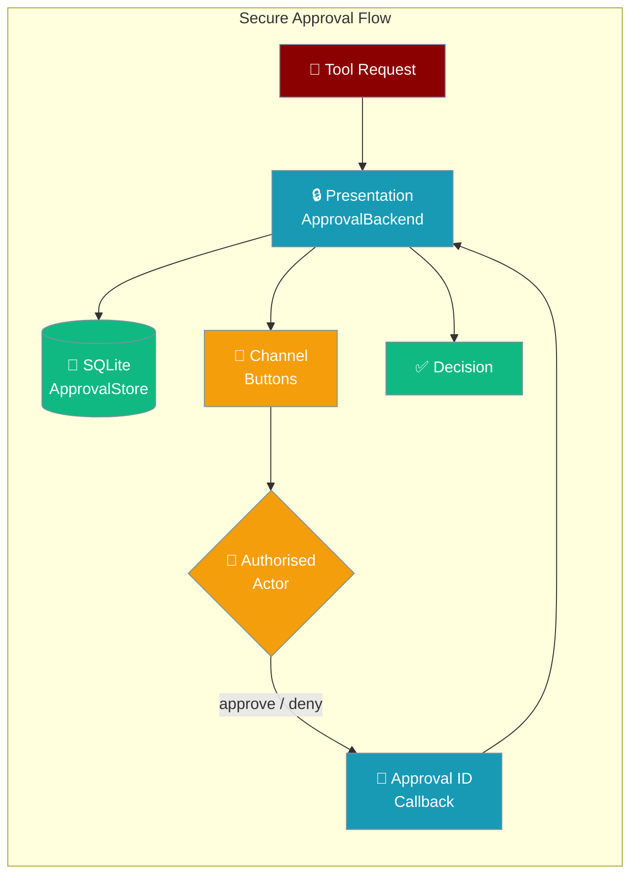

`--approval secure` is a hardened approval backend that persists decisions across restarts, authorises approvers against an allowlist, and binds each decision to an unguessable approval ID — not to a message ID that anyone could race.

<Tip>
For the high-level approval lifecycle model, see the [Approval concept page](/docs/concepts/approval).
</Tip>

```python
from praisonaiagents import Agent

agent = Agent(
    name="assistant",
    instructions="Ask before destructive tools.",
    approval="secure",
)
agent.start("Remove stale cache files.")
```

The user triggers a risky tool; the secure backend stores the request until an authorised actor approves or denies via the channel callback.



## How It Works

A risky tool call is stored durably until an authorised actor resolves it by unguessable approval ID.

```mermaid
sequenceDiagram
    participant User
    participant Agent
    participant SecureBackend
    participant Actor

    User->>Agent: Risky tool call
    Agent->>SecureBackend: Persist request + approval ID
    SecureBackend->>Actor: Prompt authorised approver
    Actor-->>SecureBackend: Approve / deny by ID
    SecureBackend-->>Agent: Decision
    Agent-->>User: Result or blocked
```

### Telegram: zero-config wiring

When the transport is a Telegram bot, `Agent(approval="secure")` (alias `"presentation"`) is auto-wired on `TelegramBot.start()` — the bot supplies the channel renderer and target, and calls `rehydrate()` to restore pending approvals. No `register_approval_backend()` call is required. See [Telegram Durable Approval](/docs/features/telegram-durable-approval).

## Quick Start

<Steps>
<Step title="Enable via CLI">
Run the gateway with the secure approval backend:

```bash
export PRAISONAI_APPROVAL_ACTORS="user123,admin456"

praisonai run --approval secure path/to/agent.yaml
```

The alias `--approval presentation` is equivalent.
</Step>

<Step title="Set Allowed Approvers">
`PRAISONAI_APPROVAL_ACTORS` is **required and must be non-empty** when using `--approval secure`. The gateway fails closed if this variable is not set:

```bash
export PRAISONAI_APPROVAL_ACTORS="user123,user456,admin789"
```

Values are comma-separated actor (user) IDs from your chat platform.
</Step>

<Step title="Programmatic Usage">
```python
from praisonaiagents import Agent
from praisonai.bots import PresentationApprovalBackend, ApprovalStore

store = ApprovalStore(path="~/.praisonai/state/approvals.sqlite")

backend = PresentationApprovalBackend(
    store=store,
    allowed_actors={"user123", "admin456"},
    timeout=300.0,
)

agent = Agent(
    name="Secure Agent",
    instructions="Execute tasks with approval.",
    approval=backend,
)

agent.start("Deploy the new version")
```
</Step>

<Step title="Rehydrate on Restart">
After a restart, rehydrate pending approvals so late decisions still resolve:

```python
backend = PresentationApprovalBackend(
    store=ApprovalStore(path="~/.praisonai/state/approvals.sqlite"),
    allowed_actors={"admin456"},
)

rehydrated = await backend.rehydrate()
print(f"Restored {rehydrated} pending approvals")
```
</Step>
</Steps>

---

## Security Properties

The secure backend fixes four gaps in the per-channel backends (`TelegramApproval`, `SlackApproval`, etc.):

| Property | Default backends | `--approval secure` |
|----------|-----------------|---------------------|
| Actor authorisation | ❌ Anyone can approve | ✅ `PRAISONAI_APPROVAL_ACTORS` allowlist |
| Pending state | In-memory (lost on restart) | ✅ SQLite persistence |
| Decision binding | By message ID | ✅ By unguessable approval ID |
| LLM classifier in decision path | ✅ (some) | ❌ Removed |
| Unknown decision values | Silently treated as deny | ✅ Rejected at the Telegram callback boundary (fail-closed) |

### Unguessable Approval ID

Each approval request carries a cryptographically unguessable `approval_id` in the button callback payload. A `deny` or `approve` decision binds to that specific ID — not to the Telegram/Slack message ID, which an attacker could observe or guess. **Replays are rejected**: once an ID is resolved it cannot be re-used.

### Persistence and Rehydration

Pending approvals are written to `~/.praisonai/state/approvals.sqlite` (honouring `PRAISONAI_HOME`). On restart, `rehydrate()` restores all pending approvals with the **original `allowed_actors` re-applied** — a restored approval cannot become unrestricted just because the process restarted.

---

## CLI Flags

| Flag | Description |
|------|-------------|
| `--approval secure` | Enable `PresentationApprovalBackend` |
| `--approval presentation` | Alias for `--approval secure` |

---

## Environment Variables

| Variable | Required | Description |
|----------|----------|-------------|
| `PRAISONAI_APPROVAL_ACTORS` | **Yes — must be non-empty** | Comma-separated user IDs allowed to approve tool calls |
| `PRAISONAI_HOME` | No | Override base directory; approval store defaults to `$PRAISONAI_HOME/state/approvals.sqlite` |

<Warning>
`PRAISONAI_APPROVAL_ACTORS` must be set and non-empty. The gateway fails closed (refuses to run) if this variable is missing or empty when `--approval secure` is active.
</Warning>

---

## Storage

Approvals persist to SQLite at:
```
~/.praisonai/state/approvals.sqlite
```

Override with `PRAISONAI_HOME`:
```bash
export PRAISONAI_HOME=/var/lib/praisonai
# → /var/lib/praisonai/state/approvals.sqlite
```

---

## API Reference

```python
from praisonai.bots import PresentationApprovalBackend, ApprovalStore
```

| Method | Description |
|--------|-------------|
| `rehydrate()` | Restore pending approvals from the store; returns count |
| `handle_callback(approval_id, decision, actor)` | Resolve a button tap; returns `True` when handled, `False` when unknown/replay/unauthorised |
| `request_approval(request)` | `ApprovalProtocol` implementation — wait for a decision |

---

## Best Practices

<AccordionGroup>
<Accordion title="Always set PRAISONAI_APPROVAL_ACTORS">
The backend is fail-closed: without an allowlist it cannot authorise any actor and will reject all approvals. Set this variable in your deployment environment before starting the gateway.
</Accordion>

<Accordion title="Call rehydrate() at startup">
In a long-lived gateway, call `await backend.rehydrate()` after construction so any approval that was pending when the process last stopped can still be resolved. Without rehydration, pending approvals are invisible.
</Accordion>

<Accordion title="Use SQLite persistence for production">
Passing a `store=ApprovalStore(...)` makes approvals durable across restarts. Without a store, the backend uses in-memory state only and pending approvals are lost on restart.
</Accordion>

<Accordion title="Scope actor IDs to one platform">
Actor IDs are platform-specific strings (Telegram user IDs, Slack user IDs, etc.). If you run bots on multiple platforms, ensure the IDs in `PRAISONAI_APPROVAL_ACTORS` match the platform your approvers use.
</Accordion>
</AccordionGroup>

---

## Related

<CardGroup cols={2}>
<Card title="Approval (Concept)" icon="check-circle" href="/docs/concepts/approval">
  High-level approval lifecycle model
</Card>
<Card title="Durable Approvals" icon="database" href="/docs/features/durable-approvals">
  Durable approval storage
</Card>
<Card title="Message Presentation" icon="layout" href="/docs/features/message-presentation">
  Interactive buttons and keyboards
</Card>
<Card title="Interactive Approval" icon="mouse-pointer" href="/docs/features/interactive-approval">
  Approval via chat interactions
</Card>
</CardGroup>
