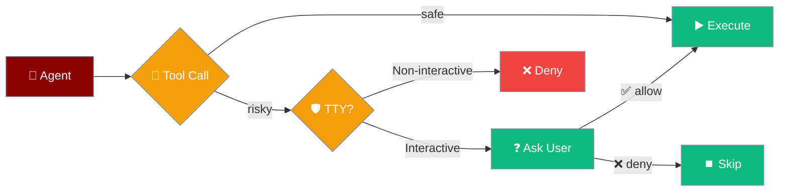
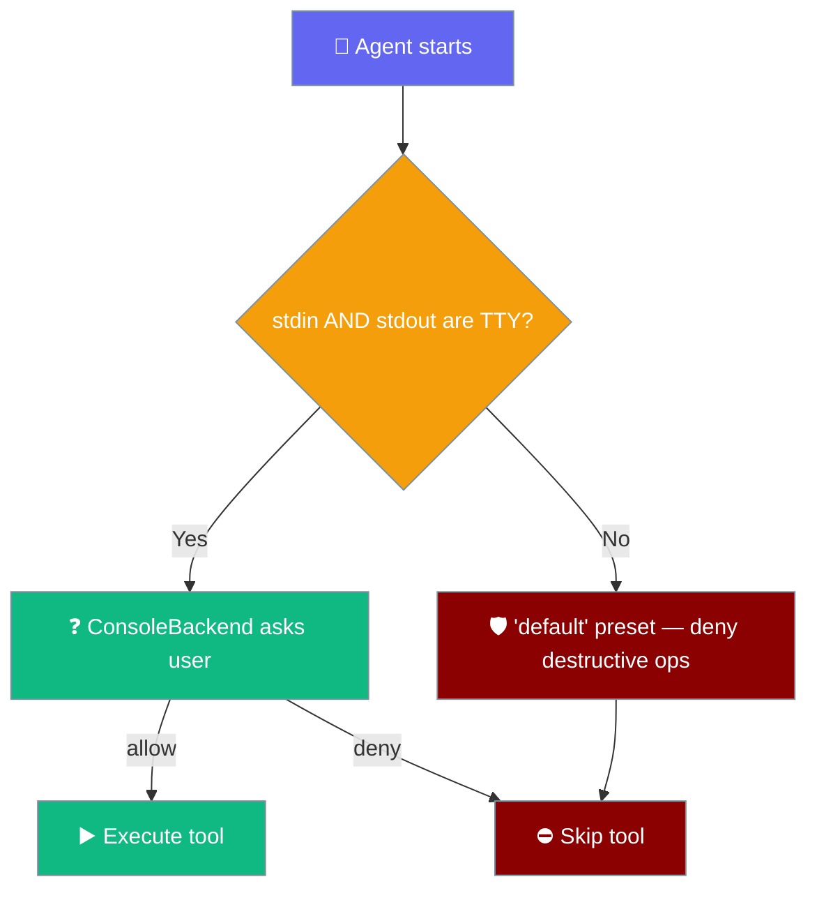
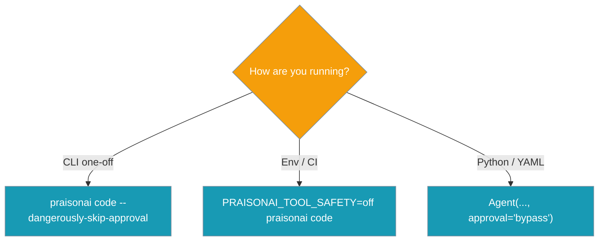
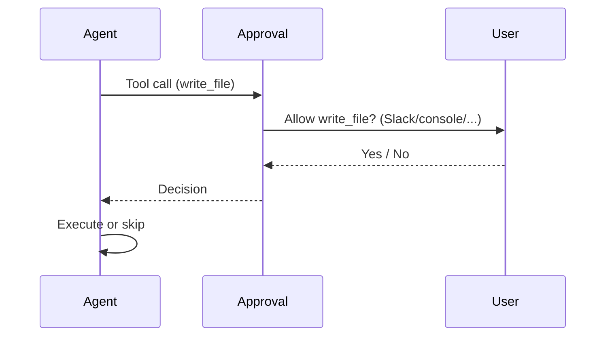

Approval pauses an agent before it runs a risky tool and asks a human (or another channel) to allow or deny it.

<Note>
**Durability:** For chat bots, pending approvals can survive a gateway restart when you configure an [`ApprovalStore`](/docs/features/durable-approvals). Each `ApprovalRequest` includes `approval_id`, `agent_name`, and `session_id` for correlation.
</Note>

<Note>
**Two-layer defence for inbound bots:** [Gateway Tool Policy](/docs/features/gateway-tool-policy) runs *before* dispatch — dangerous tools are never even advertised to the model on untrusted routes. Approval runs *after* the model decides to call a tool, catching anything that slips through. Use both for defence in depth.
</Note>

<Warning>
**Behaviour change (PR #2369):** Dangerous built-in tools (`execute_command`, `kill_process`, `execute_code`, `delete_file`, `move_file`, `copy_file`, and others) are now **gated by default**. Interactive sessions (TTY) ask before running; non-interactive sessions (CI/pipes) deny. Read-only tools are unaffected. See [What counts as dangerous](#what-counts-as-dangerous) below.
</Warning>

<Note>
**Earlier change (PR #2122):** Approval is enabled by default. YAML configs that omitted the `approval` key previously got `enabled: false`; they now get the prompting policy.
</Note>

<Note>
**Sync and Async Parity**: Approval checks now work uniformly in both sync and async tool execution paths.
</Note>


```mermaid
graph LR
    Agent[🤖 Agent] --> Tool{🔧 Tool Call}
    Tool -->|risky| Gate{🛡️ TTY?}
    Gate -->|Interactive| Ask[❓ Ask User]
    Gate -->|Non-interactive| Deny[❌ Deny]
    Ask -->|✅ allow| Run[▶️ Execute]
    Ask -->|❌ deny| Skip[⏹️ Skip]
    Tool -->|safe| Run

    classDef agent fill:#8B0000,stroke:#7C90A0,color:#fff
    classDef gate fill:#F59E0B,stroke:#7C90A0,color:#fff
    classDef ok fill:#10B981,stroke:#7C90A0,color:#fff
    classDef bad fill:#EF4444,stroke:#7C90A0,color:#fff

    class Agent agent
    class Tool,Gate gate
    class Run,Skip,Ask ok
    class Deny bad
```

## Quick Start

<Steps>
<Step title="Default (safe, no setup needed)">
Dangerous tools are gated automatically. Just run your agent — it will ask before doing anything destructive:

```python
from praisonaiagents import Agent

agent = Agent(
    name="Coder",
    instructions="Refactor utils.py",
    tools=["shell", "write_file"],
    # approval is automatic: asks on a TTY, denies in CI
)
agent.start()
```
</Step>

<Step title="Bypass safety (opt-out)">
To restore the old unrestricted behaviour:

```python
from praisonaiagents import Agent

agent = Agent(
    name="Admin",
    instructions="Manage the server",
    approval="bypass",   # run dangerous tools silently
)
agent.start("Clean up old logs")
```

Or via environment variable:

```bash
PRAISONAI_TOOL_SAFETY=off praisonai code
```
</Step>

<Step title="Deny silently (no prompts)">
Block dangerous tools without prompting (useful for CI that should fail fast):

```python
agent = Agent(
    name="Reviewer",
    instructions="Review code only",
    approval=False,    # deny dangerous tools silently
)
```
</Step>

<Step title="Full Configuration">
```python
agent = Agent(
    name="Admin",
    instructions="...",
    approval={
        "enabled": True,
        "backend": "slack",
        "approve_all_tools": False,
        "timeout": 120,
        "approve_level": "high",
    },
)
```
</Step>
</Steps>

---

## What counts as dangerous

The `DEFAULT_DANGEROUS_TOOLS` set (from `praisonaiagents/approval/registry.py`) determines which tools trigger approval:

| Tool name | Risk level | Description |
|-----------|-----------|-------------|
| `execute_command` | critical | Runs arbitrary shell commands |
| `kill_process` | critical | Terminates running processes |
| `execute_code` | critical | Executes arbitrary code |
| `acp_execute_command` | critical | ACP shell command execution |
| `write_file` | high | Writes / creates a file |
| `delete_file` | high | Deletes a file |
| `move_file` | high | Moves / renames a file |
| `copy_file` | high | Copies a file |
| `acp_create_file` | high | ACP file creation |
| `acp_edit_file` | high | ACP file edits |
| `acp_delete_file` | high | ACP file deletion |
| `execute_query` | high | Executes a database query |
| `evaluate` | medium | Evaluates code expressions |
| `crawl` | medium | Crawls web URLs |
| `scrape_page` | medium | Scrapes a web page |

Read-only tools (search, read_file, etc.) are **not** in this set and run without gating.

---

## Interactive vs non-interactive

PraisonAI checks whether both `stdin` and `stdout` are TTYs to decide what to do when no `approval=` argument is passed:

| Context | Result |
|---------|--------|
| Terminal (TTY) | **Ask** — `ConsoleBackend` prompts before each dangerous tool |
| CI / piped / script | **Deny** — `default` permission preset blocks destructive ops |


```mermaid
graph TB
    Start[🚀 Agent starts] --> Check{stdin AND stdout are TTY?}
    Check -->|Yes| Ask[❓ ConsoleBackend asks user]
    Check -->|No| Preset[🛡️ 'default' preset — deny destructive ops]
    Ask -->|allow| Exec[▶️ Execute tool]
    Ask -->|deny| Block[⛔ Skip tool]
    Preset --> Block

    classDef start fill:#6366F1,stroke:#7C90A0,color:#fff
    classDef check fill:#F59E0B,stroke:#7C90A0,color:#fff
    classDef ok fill:#10B981,stroke:#7C90A0,color:#fff
    classDef bad fill:#8B0000,stroke:#7C90A0,color:#fff

    class Start start
    class Check check
    class Ask,Exec ok
    class Block,Preset bad
```

The `default` preset specifically blocks: `execute_command`, `kill_process`, `execute_code`, `acp_execute_command`, `delete_file`, `move_file`, `copy_file`, `acp_delete_file`. Write and create operations (`write_file`, `acp_create_file`, `acp_edit_file`) still run — they are blocked only under the `safe` or `read_only` presets.

---

## Bypassing safety

Three ways to restore unrestricted behaviour:


```mermaid
graph TB
    Q{How are you running?}
    Q -->|CLI one-off| CLI["praisonai code --dangerously-skip-approval"]
    Q -->|Env / CI| ENV["PRAISONAI_TOOL_SAFETY=off praisonai code"]
    Q -->|Python / YAML| PY["Agent(..., approval='bypass')"]

    classDef q fill:#F59E0B,stroke:#7C90A0,color:#fff
    classDef ans fill:#189AB4,stroke:#7C90A0,color:#fff

    class Q q
    class CLI,ENV,PY ans
```

**1. CLI flag**

```bash
praisonai code --dangerously-skip-approval
# also sets PRAISONAI_TOOL_SAFETY=off for any subprocess tree
```

**2. Environment variable**

```bash
PRAISONAI_TOOL_SAFETY=off praisonai code
```

Accepted "off" values: `off`, `full`, `none`, `0`, `false`.

**3. Python / YAML**

```python
from praisonaiagents import Agent

Agent(tools=["shell", "write_file"], approval="bypass")   # silent allow
Agent(tools=["shell", "write_file"], approval=False)       # silent deny (no prompts)
Agent(tools=["shell", "write_file"], approval="safe")      # block all dangerous tools
Agent(tools=["shell", "write_file"], approval="read_only") # alias of "safe"
Agent(tools=["shell", "write_file"], approval="full")      # no restrictions
```

---

## How users approve


```mermaid
sequenceDiagram
    participant Agent
    participant Approval
    participant User

    Agent->>Approval: Tool call (write_file)
    Approval->>User: Allow write_file? (Slack/console/...)
    User-->>Approval: Yes / No
    Approval-->>Agent: Decision
    Agent->>Agent: Execute or skip
```

## Configuration

<Warning>
The default `console` backend requires a sync call stack. If you decorate a tool with `@require_approval` and invoke it from an async agent (`achat`, `astart`, async tools, async callbacks), the call now raises `PermissionError`. Configure a non-console backend (HTTP, Slack, webhook) or drive the agent from sync code.
</Warning>

| Option | Type | Default | Description |
|---|---|---|---|
| `enabled` | `bool` | **`true`** | Turn approval on/off — safe by default |
| `backend` | `str` | `"console"` | One of: `console`, `slack`, `telegram`, `discord`, `webhook`, `http`, `agent`, `auto`, `none` |
| `approve_all_tools` | `bool` | `false` | If true, every tool needs approval (not just risky ones) |
| `timeout` | `float` | `null` | Seconds to wait for a decision; `null` = no timeout |
| `approve_level` | `ApprovalLevel \| null` | `null` | Auto-approve up to this risk level: `low`, `medium`, `high`, `critical` |
| `guardrails` | `str` | `null` | Free-text guardrail description |
| `default_policy` | `"deny" \| "prompt" \| "allow"` | `"prompt"` | Policy when no per-tool entry matches |
| `approve_tools` | `Dict[str, ApprovalLevel] \| null` | `null` | Per-tool granularity, e.g. `{"shell": "critical"}` |
| `permissions` | `Dict[str, Any]` | `null` | Declarative allow/deny/ask rules. See [Declarative Permissions](/docs/features/declarative-permissions). |

<Note>
Approval backends decide *how* to ask a human (Slack, console, …). Declarative `permissions` decide *whether* to ask at all in non-interactive runs.
</Note>

## YAML

```yaml
agents:
  admin:
    role: Server admin
    approval:
      enabled: true
      backend: slack
      timeout: 120
      approve_level: high
      default_policy: prompt
      approve_tools:
        shell: critical
        read_file: low
```

### Hook installation

Register a `before_tool` hook that enforces the policy:

```python
from praisonai._approval_spec import ApprovalSpec

spec = ApprovalSpec(
    enabled=True,
    default_policy="prompt",
    approve_tools={"shell": "critical"},
)
spec.install_hook()
```

Shorthands: `approval: true` (console), `approval: slack` (named backend), `approval: false` / `null` (off).

> Unknown keys raise `ValueError` — typos like `approve_levels:` will fail loudly.

## CLI

```bash
praisonai "deploy" --approval slack --approval-timeout 120 --approve-level high
```

| CLI flag | YAML / Python field |
|---|---|
| `--trust` | `backend: auto` |
| `--approval <name>` | `backend: <name>` |
| `--approve-all-tools` | `approve_all_tools: true` |
| `--approval-timeout <s>` | `timeout: <s>` |
| `--approve-level <l>` | `approve_level: <l>` |
| `--allow <pattern>` | `permissions: { "<pattern>": allow }` |
| `--deny <pattern>` | `permissions: { "<pattern>": deny }` |
| `--permissions <file>` | Load rules from YAML/JSON file |
| `--permission-default <action>` | `permissions: { "*": <action> }` |
| `--guardrail "<txt>"` | `guardrails: "<txt>"` |

## Using approval with async agents

When using async agents (`.achat()`, `.astart()`, or async tools), the default `console` backend will fail with `PermissionError`. Configure a non-console backend:

```python
from praisonaiagents import Agent
from praisonaiagents.approval import get_approval_registry, WebhookBackend

# Configure webhook backend for async compatibility
get_approval_registry().set_backend(
    WebhookBackend(url="http://localhost:8080/approve")
)

agent = Agent(
    name="AsyncBot",
    instructions="Process requests asynchronously",
    approval=True
)

# This now works with async agents
await agent.astart("Delete old files")
```

Available non-console backends: `webhook`, `http`, `slack`, `telegram`, `discord`, `agent`.

## Argument-aware approval cache

Approval grants are scoped to the exact tool arguments — calling the same tool with different arguments triggers a fresh approval.

```mermaid
graph LR
    Call[🔧 Tool Call] --> Key{🔑 Cache Key}
    Key -->|same args| Hit[✅ Cached — skip prompt]
    Key -->|different args| Miss[🛡️ New prompt]
    Key -->|critical tool| Always[⚠️ Always prompt]

    classDef call fill:#8B0000,stroke:#7C90A0,color:#fff
    classDef key fill:#F59E0B,stroke:#7C90A0,color:#fff
    classDef hit fill:#10B981,stroke:#7C90A0,color:#fff
    classDef miss fill:#6366F1,stroke:#7C90A0,color:#fff

    class Call call
    class Key key
    class Hit hit
    class Miss,Always miss
```

The cache key formula is:

```
"{tool_name}:{sha256(json.dumps(arguments, sort_keys=True))[:16]}"
```

So `write_file({"path": "/tmp/a.txt"})` and `write_file({"path": "/tmp/b.txt"})` produce **different** keys and each requires its own approval.

**Critical-risk tools** (`execute_command`, `kill_process`, `execute_code`) always re-prompt regardless of the cache — `is_already_approved` returns `False` unconditionally for them.

**Worked example**:

```python
from praisonaiagents import Agent

agent = Agent(
    name="FileBot",
    instructions="Write files as requested",
    approval=True,
)

# First call — prompts for approval
agent.start("Write 'hello' to /tmp/a.txt")

# Second call with SAME path — no prompt (cached)
agent.start("Write 'hello again' to /tmp/a.txt")

# Third call with DIFFERENT path — prompts again
agent.start("Write 'world' to /tmp/b.txt")
```

<Note>
This is a behavior change from previous versions where approving a tool name once would auto-approve **all** subsequent calls to that tool in the same context, regardless of arguments. Now only calls with **identical arguments** skip the prompt.
</Note>

## Troubleshooting

| Error | Cause | Fix |
|-------|--------|-----|
| `PermissionError: Approval request failed for <tool>` | Async agent with console backend | Configure a non-console backend |
| `RuntimeError: Tool '<tool>' requires approval but cannot use console I/O from async context.` | Same root cause, surfaced earlier | Same fix |

## Best practices

<AccordionGroup>
<Accordion title="Console approval">
No env vars needed; you see the prompt directly in the terminal. This is now the default when running in an interactive session.
</Accordion>
<Accordion title="Slack approval">
Routes approval requests to a channel humans already watch — great for CI pipelines that need human gating.
</Accordion>
<Accordion title="Set timeouts">
Without a timeout, the agent blocks indefinitely waiting for a decision.
</Accordion>
<Accordion title="Use approve_level">
`approve_level: high` lets safe tools run without prompts and only gates the dangerous ones.
</Accordion>
<Accordion title="Restore old behavior for trusted environments">
Use `approval="bypass"` or `PRAISONAI_TOOL_SAFETY=off` when you control the environment fully and want the pre-4.6.27 unrestricted behaviour.
</Accordion>
</AccordionGroup>

## Related

<CardGroup cols={2}>
<Card icon="plug" href="/features/approval-protocol">
All backend protocols (Slack, Telegram, Discord, Webhook, HTTP, Agent)
</Card>
<Card icon="terminal" href="/docs/cli/tool-approval">
Full CLI flag reference
</Card>
<Card icon="shield-check" href="/docs/features/interactive-approval">
Interactive terminal approval experience
</Card>
<Card icon="database" href="/docs/features/durable-approvals">
Restart-safe pending approvals for bots
</Card>
<Card icon="shield" href="/docs/features/permission-modes">
Permission modes (plan, accept-edits, bypass)
</Card>
</CardGroup>
