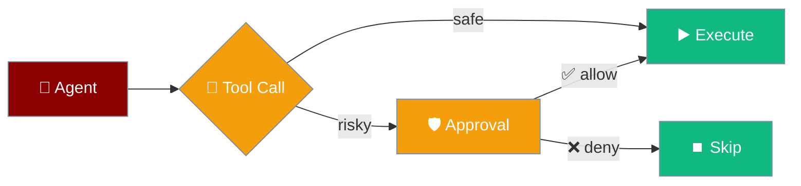
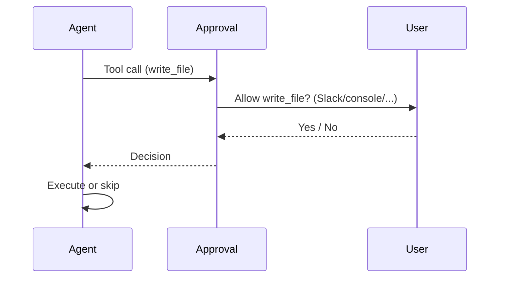

Approval pauses an agent before it runs a risky tool and asks a human (or another channel) to allow or deny it.

<Note>
**Sync and Async Parity**: Approval checks now work uniformly in both sync and async tool execution paths. Previously, async calls bypassed approval prompts.
</Note>


```mermaid
graph LR
    Agent[🤖 Agent] --> Tool{🔧 Tool Call}
    Tool -->|risky| Approve[🛡️ Approval]
    Approve -->|✅ allow| Run[▶️ Execute]
    Approve -->|❌ deny| Skip[⏹️ Skip]
    Tool -->|safe| Run

    classDef agent fill:#8B0000,stroke:#7C90A0,color:#fff
    classDef gate fill:#F59E0B,stroke:#7C90A0,color:#fff
    classDef ok fill:#10B981,stroke:#7C90A0,color:#fff

    class Agent agent
    class Tool,Approve gate
    class Run,Skip ok
```

## Quick Start

<Steps>
<Step title="Simple Usage">
```python
from praisonaiagents import Agent

agent = Agent(name="Admin", instructions="Manage the server", approval=True)
agent.start("Clean up old logs")
```
</Step>

<Step title="Pick Backend">
```python
agent = Agent(name="Admin", instructions="...", approval="slack")
```
</Step>

<Step title="Full Configuration">
```python
agent = Agent(
    name="Admin",
    instructions="...",
    approval={
        "enabled": True,
        "backend": "slack",
        "approve_all_tools": False,
        "timeout": 120,
        "approve_level": "high",
    },
)
```
</Step>
</Steps>

## How users approve


```mermaid
sequenceDiagram
    participant Agent
    participant Approval
    participant User

    Agent->>Approval: Tool call (write_file)
    Approval->>User: Allow write_file? (Slack/console/...)
    User-->>Approval: Yes / No
    Approval-->>Agent: Decision
    Agent->>Agent: Execute or skip
```

## Configuration

<Warning>
The default `console` backend requires a sync call stack. If you decorate a tool with `@require_approval` and invoke it from an async agent (`achat`, `astart`, async tools, async callbacks), the call now raises `PermissionError`. Configure a non-console backend (HTTP, Slack, webhook) or drive the agent from sync code.
</Warning>

| Option | Type | Default | Description |
|---|---|---|---|
| `enabled` | `bool` | `false` | Turn approval on/off |
| `backend` | `str` | `"console"` | One of: `console`, `slack`, `telegram`, `discord`, `webhook`, `http`, `agent`, `auto`, `none` |
| `approve_all_tools` | `bool` | `false` | If true, every tool needs approval (not just risky ones) |
| `timeout` | `float` | `null` | Seconds to wait for a decision; `null` = no timeout |
| `approve_level` | `str` | `null` | Auto-approve up to this risk level: `low`, `medium`, `high`, `critical` |
| `guardrails` | `str` | `null` | Free-text guardrail description |

## YAML

```yaml
agents:
  admin:
    role: Server admin
    approval:
      enabled: true
      backend: slack
      timeout: 120
      approve_level: high
```

Shorthands: `approval: true` (console), `approval: slack` (named backend), `approval: false` / `null` (off).

> Unknown keys raise `ValueError` — typos like `approve_levels:` will fail loudly.

## CLI

```bash
praisonai "deploy" --approval slack --approval-timeout 120 --approve-level high
```

| CLI flag | YAML / Python field |
|---|---|
| `--trust` | `backend: auto` |
| `--approval <name>` | `backend: <name>` |
| `--approve-all-tools` | `approve_all_tools: true` |
| `--approval-timeout <s>` | `timeout: <s>` |
| `--approve-level <l>` | `approve_level: <l>` |
| `--guardrail "<txt>"` | `guardrails: "<txt>"` |

## Using approval with async agents

When using async agents (`.achat()`, `.astart()`, or async tools), the default `console` backend will fail with `PermissionError`. Configure a non-console backend:

```python
from praisonaiagents import Agent
from praisonaiagents.approval import get_approval_registry, WebhookBackend

# Configure webhook backend for async compatibility
get_approval_registry().set_backend(
    WebhookBackend(url="http://localhost:8080/approve")
)

agent = Agent(
    name="AsyncBot",
    instructions="Process requests asynchronously",
    approval=True
)

# This now works with async agents
await agent.astart("Delete old files")
```

Available non-console backends: `webhook`, `http`, `slack`, `telegram`, `discord`, `agent`.

## Troubleshooting

| Error | Cause | Fix |
|-------|--------|-----|
| `PermissionError: Approval request failed for <tool>` | Async agent with console backend | Configure a non-console backend |
| `RuntimeError: Tool '<tool>' requires approval but cannot use console I/O from async context.` | Same root cause, surfaced earlier | Same fix |

## Best practices

<AccordionGroup>
<Accordion title="Console approval">
No env vars needed; you see the prompt directly in the terminal.
</Accordion>
<Accordion title="Slack approval">
Routes approval requests to a channel humans already watch.
</Accordion>
<Accordion title="Set timeouts">
Without a timeout, the agent blocks indefinitely waiting for a decision.
</Accordion>
<Accordion title="Use approve_level">
`approve_level: high` lets safe tools run without prompts and only gates the dangerous ones.
</Accordion>
</AccordionGroup>

## Related

<CardGroup cols={2}>
<Card icon="plug" href="/features/approval-protocol">
All backend protocols (Slack, Telegram, Discord, Webhook, HTTP, Agent)
</Card>
<Card icon="terminal" href="/cli/tool-approval">
Full CLI flag reference
</Card>
</CardGroup>