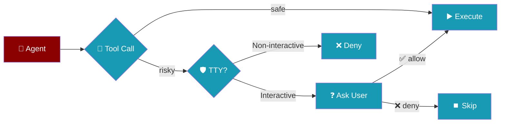
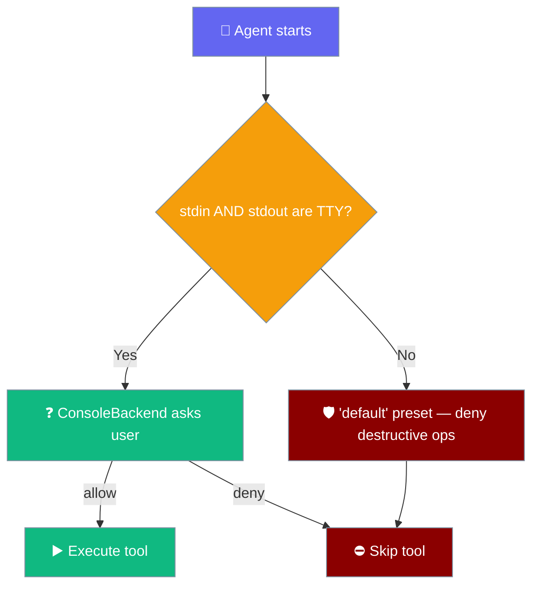
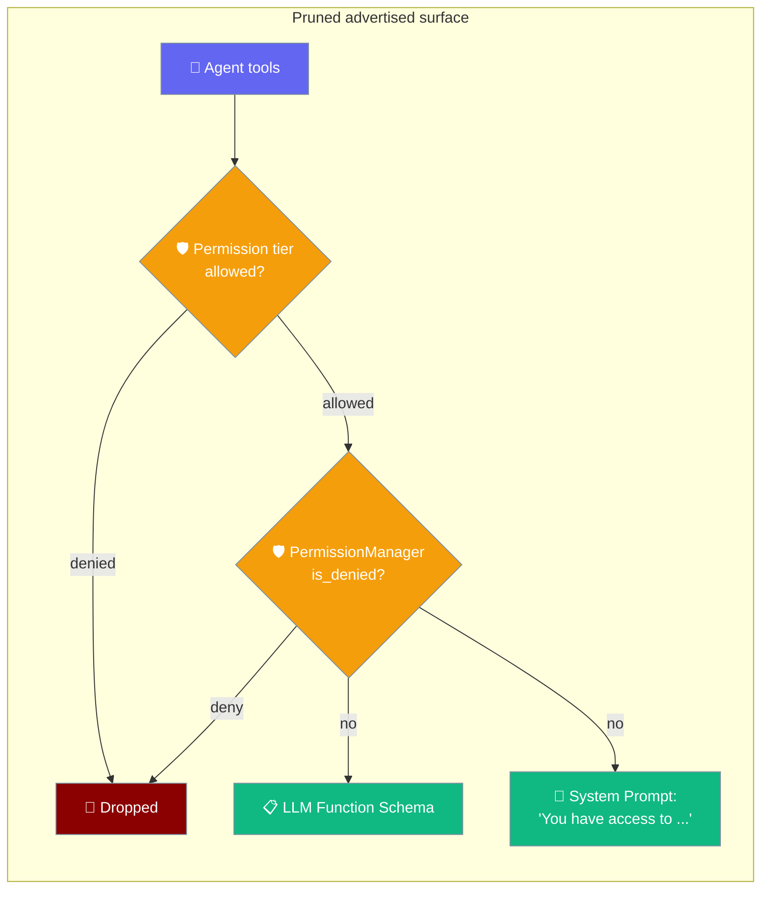
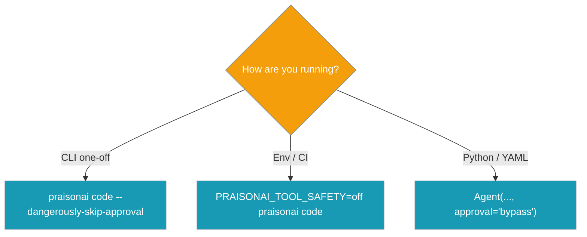
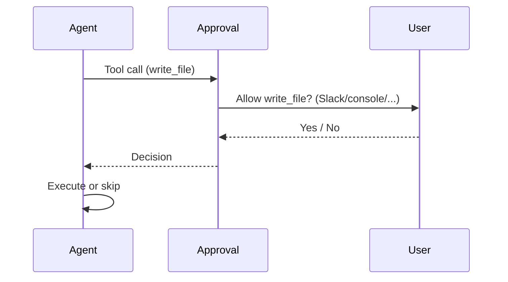
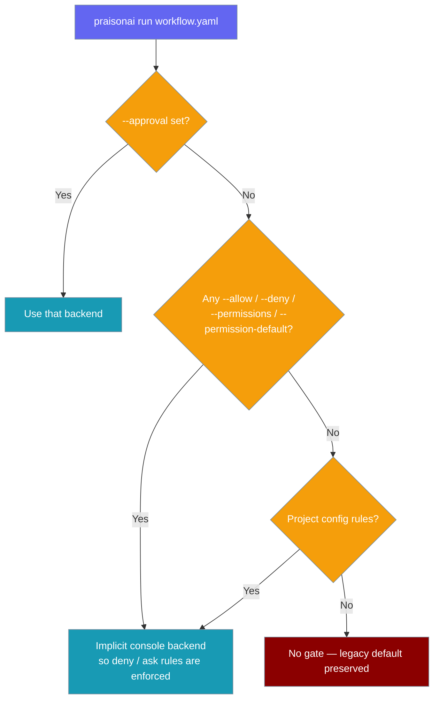

Approval pauses an agent before it runs a risky tool and asks a human (or another channel) to allow or deny it.


```python
from praisonaiagents import Agent

agent = Agent(
    name="Coder",
    instructions="Refactor safely",
    tools=["shell", "write_file"],
)
agent.start("Remove unused imports in utils.py")
```


<Note>
**Durability:** For chat bots, pending approvals can survive a gateway restart when you configure an [`ApprovalStore`](/features/durable-approvals). Each `ApprovalRequest` includes `approval_id`, `agent_name`, and `session_id` for correlation.
</Note>

<Note>
**Two-layer defence for inbound bots:** [Gateway Tool Policy](/features/gateway-tool-policy) runs *before* dispatch — dangerous tools are never even advertised to the model on untrusted routes. Approval runs *after* the model decides to call a tool, catching anything that slips through. Use both for defence in depth.
</Note>

<Warning>
**Behaviour change (PR #2369):** Dangerous built-in tools (`execute_command`, `kill_process`, `execute_code`, `delete_file`, `move_file`, `copy_file`, and others) are now **gated by default**. Interactive sessions (TTY) ask before running; non-interactive sessions (CI/pipes) deny. Read-only tools are unaffected. See [What counts as dangerous](#what-counts-as-dangerous) below.
</Warning>

<Note>
**Pruned tool surface (since v1.6.91):** Denied tools are removed from the model's view — both the function schema and the system-prompt enumeration. The model never wastes a turn calling a tool it cannot execute. See [How tools are pruned from the LLM](#how-tools-are-pruned-from-the-llm).
</Note>

<Note>
**Earlier change (PR #2122):** Approval is enabled by default. YAML configs that omitted the `approval` key previously got `enabled: false`; they now get the prompting policy.
</Note>

<Note>
**Sync and Async Parity**: Approval checks now work uniformly in both sync and async tool execution paths.
</Note>

The user requests a code change; the agent pauses for approval before running dangerous tools.


```mermaid
graph LR
    Agent[🤖 Agent] --> Tool{🔧 Tool Call}
    Tool -->|risky| Gate{🛡️ TTY?}
    Gate -->|Interactive| Ask[❓ Ask User]
    Gate -->|Non-interactive| Deny[❌ Deny]
    Ask -->|✅ allow| Run[▶️ Execute]
    Ask -->|❌ deny| Skip[⏹️ Skip]
    Tool -->|safe| Run

    classDef agent fill:#8B0000,color:#fff
    classDef tool fill:#189AB4,color:#fff

    class Agent agent
    class Tool,Gate,Ask,Run,Skip,Deny tool
```

## Quick Start

<Steps>
<Step title="Default (safe, no setup needed)">
Dangerous tools are gated automatically. Just run your agent — it will ask before doing anything destructive:

```python
from praisonaiagents import Agent

agent = Agent(
    name="Coder",
    instructions="Refactor utils.py",
    tools=["shell", "write_file"],
    # approval is automatic: asks on a TTY, denies in CI
)
agent.start()
```
</Step>

<Step title="Bypass safety (opt-out)">
To restore the old unrestricted behaviour:

```python
from praisonaiagents import Agent

agent = Agent(
    name="Admin",
    instructions="Manage the server",
    approval="bypass",   # run dangerous tools silently
)
agent.start("Clean up old logs")
```

Or via environment variable:

```bash
PRAISONAI_TOOL_SAFETY=off praisonai code
```
</Step>

<Step title="Deny silently (no prompts)">
Block dangerous tools without prompting (useful for CI that should fail fast):

```python
agent = Agent(
    name="Reviewer",
    instructions="Review code only",
    approval=False,    # deny dangerous tools silently
)
```
</Step>

<Step title="Full Configuration">
```python
agent = Agent(
    name="Admin",
    instructions="...",
    approval={
        "enabled": True,
        "backend": "slack",
        "approve_all_tools": False,
        "timeout": 120,
        "approve_level": "high",
    },
)
```
</Step>
</Steps>

---

## Declare approval on the tool itself

Gate a custom tool in one line — right where you define it:

```python
from praisonaiagents import Agent, tool

@tool(approval=True)
def delete_account(user_id: str) -> str:
    """Permanently delete a user account."""
    return f"Deleted {user_id}"

agent = Agent(instructions="Help users.", tools=[delete_account])
agent.start("Delete account u_42")
```

No agent config needed — the tool carries its own approval requirement everywhere it goes. `@tool(approval=…)` uses the **same vocabulary** as agent-level `Agent(approval=…)`: the decorator says *what* needs approval, the agent config says *how* to ask. (`@tool(requires_approval=…)` still works as a deprecated alias.)

This is an additive third path alongside the built-in `DEFAULT_DANGEROUS_TOOLS` set (below) and the agent-level `approve_tools` map.

<Card title="Tool Approval" icon="shield-check" href="/features/tool-requires-approval">
  Full reference for the `@tool(approval=...)` decorator parameter
</Card>

---

## What counts as dangerous

The `DEFAULT_DANGEROUS_TOOLS` set (from `praisonaiagents/approval/registry.py`) determines which tools trigger approval:

| Tool name | Risk level | Description |
|-----------|-----------|-------------|
| `execute_command` | critical | Runs arbitrary shell commands |
| `kill_process` | critical | Terminates running processes |
| `execute_code` | critical | Executes arbitrary code |
| `acp_execute_command` | critical | ACP shell command execution |
| `write_file` | high | Writes / creates a file |
| `delete_file` | high | Deletes a file |
| `move_file` | high | Moves / renames a file |
| `copy_file` | high | Copies a file |
| `acp_create_file` | high | ACP file creation |
| `acp_edit_file` | high | ACP file edits |
| `acp_delete_file` | high | ACP file deletion |
| `execute_query` | high | Executes a database query |
| `evaluate` | medium | Evaluates code expressions |
| `crawl` | medium | Crawls web URLs |
| `scrape_page` | medium | Scrapes a web page |

Read-only tools (search, read_file, etc.) are **not** in this set and run without gating.

---

## Interactive vs non-interactive

PraisonAI checks whether both `stdin` and `stdout` are TTYs to decide what to do when no `approval=` argument is passed:

| Context | Result |
|---------|--------|
| Terminal (TTY) | **Ask** — `ConsoleBackend` prompts before each dangerous tool |
| CI / piped / script | **Deny** — `default` permission preset blocks destructive ops |


```mermaid
graph TB
    Start[🚀 Agent starts] --> Check{stdin AND stdout are TTY?}
    Check -->|Yes| Ask[❓ ConsoleBackend asks user]
    Check -->|No| Preset[🛡️ 'default' preset — deny destructive ops]
    Ask -->|allow| Exec[▶️ Execute tool]
    Ask -->|deny| Block[⛔ Skip tool]
    Preset --> Block

    classDef start fill:#6366F1,stroke:#7C90A0,color:#fff
    classDef check fill:#F59E0B,stroke:#7C90A0,color:#fff
    classDef ok fill:#10B981,stroke:#7C90A0,color:#fff
    classDef bad fill:#8B0000,stroke:#7C90A0,color:#fff

    class Start start
    class Check check
    class Ask,Exec ok
    class Block,Preset bad
```

The `default` preset specifically blocks: `execute_command`, `kill_process`, `execute_code`, `acp_execute_command`, `delete_file`, `move_file`, `copy_file`, `acp_delete_file`. Write and create operations (`write_file`, `acp_create_file`, `acp_edit_file`) still run — they are blocked only under the `safe` or `read_only` presets.

---

## How tools are pruned from the LLM

Denied tools are filtered out of both the function schema and the system prompt before the LLM ever sees them.


```mermaid
graph LR
    subgraph "Pruned advertised surface"
        Tools[🧰 Agent tools] --> Tier{🛡️ Permission tier\nallowed?}
        Tier -->|allowed| Pattern{🛡️ PermissionManager\nis_denied?}
        Tier -->|denied| Drop[🚫 Dropped]
        Pattern -->|no| Schema[📋 LLM Function Schema]
        Pattern -->|no| Prompt[📝 System Prompt:\n'You have access to ...']
        Pattern -->|deny| Drop
    end

    classDef input fill:#6366F1,stroke:#7C90A0,color:#fff
    classDef gate fill:#F59E0B,stroke:#7C90A0,color:#fff
    classDef ok fill:#10B981,stroke:#7C90A0,color:#fff
    classDef warn fill:#8B0000,stroke:#7C90A0,color:#fff

    class Tools input
    class Tier,Pattern gate
    class Schema,Prompt ok
    class Drop warn
```

| Layer | Before v1.6.91 | Since v1.6.91 |
|-------|----------------|---------------|
| Function schema sent to LLM | All tools advertised; denial only at execution | Denied tools removed from the schema |
| `"You have access to the following tools: …"` in system prompt | All tool names listed | Only allowed tool names listed |

```python
from praisonaiagents import Agent

def execute_command(command: str) -> str:
    """Run a shell command."""
    ...

def read_file(path: str) -> str:
    """Read a file."""
    ...

agent = Agent(
    name="Reader",
    instructions="Help me explore the codebase",
    tools=[execute_command, read_file],
    approval="safe",   # blocks execute_command (dangerous)
)

agent.start("Show me what's in main.py")
# The model is offered ONLY read_file.
# execute_command is invisible — no denied-call loops, no wasted turns.
```

<Note>
`ask` and `allow` tools stay advertised — approval still runs at execution time as defence in depth. Only tools whose permission tier resolves to a hard `deny` (preset deny set, or explicit `*: deny` rule) disappear from the model's view.
</Note>

| Preset | Pruned from LLM? | Use when |
|--------|------------------|----------|
| `approval="full"` / `"bypass"` | No — everything visible | You fully trust the environment |
| `approval="default"` (auto-applied in CI / non-TTY) | Yes — shell exec + destructive file ops removed | Default safety, write-friendly |
| `approval="safe"` / `"read_only"` | Yes — all dangerous tools removed | Read-only / review agents |
| `approval={"permissions": {"*": "deny", ...}}` | Yes — anything matched as `deny` removed | Custom allow-lists |
| `approval={"permissions": {"bash:rm *": "deny", ...}}` | **Yes — pattern-matched deny rules removed (native + MCP)** | Fine-grained rule-based safety |

### Pattern-based rules and MCP tools

The same pruning path now covers pattern-based rules — not just presets. Rules loaded from `.praisonai/permissions/`, YAML, CLI flags, or a `PermissionManager` are consulted via `PermissionManager.is_denied()` when the schema is built, and MCP tools go through the identical gate.

```python
from praisonaiagents import Agent
from praisonaiagents.mcp import MCP

agent = Agent(
    name="Ops",
    instructions="Run ops tasks",
    tools=MCP("http://localhost:8000/sse"),
    approval={
        "permissions": {
            "tool:delete_*": "deny",   # MCP-namespaced tool names
        },
    },
)
# delete_* MCP tools never appear in the schema and are blocked at call time
# with {"permission_denied": True}.
```

MCP tools using a `tool:<name>` prefix match rules written against either the bare name or the prefixed form.

<Tip>
When you set `approval="safe"` on a code-review agent and notice the model never tries to edit or run shell — that's pruning working. No prompts appear because the model isn't asking.
</Tip>

---

## Bypassing safety

Three ways to restore unrestricted behaviour:


```mermaid
graph TB
    Q{How are you running?}
    Q -->|CLI one-off| CLI["praisonai code --dangerously-skip-approval"]
    Q -->|Env / CI| ENV["PRAISONAI_TOOL_SAFETY=off praisonai code"]
    Q -->|Python / YAML| PY["Agent(..., approval='bypass')"]

    classDef q fill:#F59E0B,stroke:#7C90A0,color:#fff
    classDef ans fill:#189AB4,stroke:#7C90A0,color:#fff

    class Q q
    class CLI,ENV,PY ans
```

**1. CLI flag**

```bash
praisonai code --dangerously-skip-approval
# also sets PRAISONAI_TOOL_SAFETY=off for any subprocess tree
```

**2. Environment variable**

```bash
PRAISONAI_TOOL_SAFETY=off praisonai code
```

Accepted "off" values: `off`, `full`, `none`, `0`, `false`.

**3. Python / YAML**

```python
from praisonaiagents import Agent

Agent(tools=["shell", "write_file"], approval="bypass")   # silent allow
Agent(tools=["shell", "write_file"], approval=False)       # silent deny (no prompts)
Agent(tools=["shell", "write_file"], approval="safe")      # block all dangerous tools
Agent(tools=["shell", "write_file"], approval="read_only") # alias of "safe"
Agent(tools=["shell", "write_file"], approval="full")      # no restrictions
```

<Note>
Every string that `PermissionMode.resolve()` recognises — `plan`, `accept_edits`, `dont_ask`, `bypass`, and their aliases (`yolo`, `auto_edit`, `full_auto`, `suggest`, `prompt`, `reject`, `no_ask`) — is also valid on `Agent(approval=…)`. See [Permission Modes](/docs/features/permission-modes#every-alias-resolves-to-the-same-mode) for the full alias table.
</Note>

---

## How users approve


```mermaid
sequenceDiagram
    participant Agent
    participant Approval
    participant User

    Agent->>Approval: Tool call (write_file)
    Approval->>User: Allow write_file? (Slack/console/...)
    User-->>Approval: Yes / No
    Approval-->>Agent: Decision
    Agent->>Agent: Execute or skip
```

<Note>
On the console backend, the prompt now offers **four** choices: `[o] once`, `[s] this session`, `[a] always`, `[n] no`. See [Interactive Tool Approval](/docs/features/interactive-approval#scope-choice) for the full scope semantics.
</Note>

## Configuration

<Warning>
The default `console` backend requires a sync call stack. If you decorate a tool with `@require_approval` and invoke it from an async agent (`achat`, `astart`, async tools, async callbacks), the call now raises `PermissionError`. Configure a non-console backend (HTTP, Slack, webhook) or drive the agent from sync code.
</Warning>

| Option | Type | Default | Description |
|---|---|---|---|
| `enabled` | `bool` | **`true`** | Turn approval on/off — safe by default |
| `backend` | `str` | `"console"` | One of: `console`, `slack`, `telegram`, `discord`, `webhook`, `http`, `agent`, `auto`, `none` |
| `approve_all_tools` | `bool` | `false` | If true, every tool needs approval (not just risky ones) |
| `timeout` | `float` | `null` | Seconds to wait for a decision; `null` = no timeout |
| `approve_level` | `ApprovalLevel \| null` | `null` | Auto-approve up to this risk level: `low`, `medium`, `high`, `critical` |
| `guardrails` | `str` | `null` | Free-text guardrail description |
| `default_policy` | `"deny" \| "prompt" \| "allow"` | `"prompt"` | Policy when no per-tool entry matches |
| `approve_tools` | `Dict[str, ApprovalLevel] \| null` | `null` | Per-tool granularity, e.g. `{"shell": "critical"}` |
| `permissions` | `Dict[str, Any]` | `null` | Declarative allow/deny/ask rules. See [Declarative Permissions](/features/declarative-permissions). |

<Note>
Approval backends decide *how* to ask a human (Slack, console, …). Declarative `permissions` decide *whether* to ask at all in non-interactive runs.
</Note>

## YAML

```yaml
agents:
  admin:
    role: Server admin
    approval:
      enabled: true
      backend: slack
      timeout: 120
      approve_level: high
      default_policy: prompt
      approve_tools:
        shell: critical
        read_file: low
```

### Hook installation

Register a `before_tool` hook that enforces the policy:

```python
from praisonai._approval_spec import ApprovalSpec

spec = ApprovalSpec(
    enabled=True,
    default_policy="prompt",
    approve_tools={"shell": "critical"},
)
spec.install_hook()
```

Shorthands: `approval: true` (console), `approval: slack` (named backend), `approval: false` / `null` (off).

> Unknown keys raise `ValueError` — typos like `approve_levels:` will fail loudly.

## CLI

```bash
praisonai "deploy" --approval slack --approval-timeout 120 --approve-level high
```

| CLI flag | YAML / Python field |
|---|---|
| `--trust` | `backend: auto` |
| `--approval <name>` | `backend: <name>` |
| `--approve-all-tools` | `approve_all_tools: true` |
| `--approval-timeout <s>` | `timeout: <s>` |
| `--approve-level <l>` | `approve_level: <l>` |
| `--allow <pattern>` | `permissions: { "<pattern>": allow }` |
| `--deny <pattern>` | `permissions: { "<pattern>": deny }` |
| `--permissions <file>` | Load rules from YAML/JSON file |
| `--permission-default <action>` | `permissions: { "*": <action> }` |
| `--guardrail "<txt>"` | `guardrails: "<txt>"` |

## YAML workflow approval gating

`praisonai run workflow.yaml` honours the **same** approval and permission flags as a single-agent `praisonai run "<prompt>"`. The flags are threaded onto the workflow engine, so a YAML workflow can no longer bypass the approval gate a prompt run enforces.

<Warning>
On older versions, `--approval`, `--allow`, `--deny`, `--permissions`, and `--permission-default` were silently dropped on the YAML path — a workflow file ran ungated even when you passed them. They are now enforced. Runs with **no** permission or approval flags are unchanged.
</Warning>

```bash
praisonai run workflow.yaml \
  --deny "bash:rm *" \
  --allow "bash:pytest *" \
  --approval console \
  --approval-timeout 60
```


```mermaid
graph TB
    Start[praisonai run workflow.yaml] --> Explicit{--approval set?}
    Explicit -->|Yes| Backend[Use that backend]
    Explicit -->|No| Rules{Any --allow / --deny /<br/>--permissions / --permission-default?}
    Rules -->|Yes| Console[Implicit console backend<br/>so deny / ask rules are enforced]
    Rules -->|No| Config{Project config rules?}
    Config -->|Yes| Console
    Config -->|No| Legacy[No gate — legacy default preserved]

    classDef start fill:#6366F1,stroke:#7C90A0,color:#fff
    classDef gate fill:#F59E0B,stroke:#7C90A0,color:#fff
    classDef backend fill:#189AB4,stroke:#7C90A0,color:#fff
    classDef legacy fill:#8B0000,stroke:#7C90A0,color:#fff

    class Start start
    class Explicit,Rules,Config gate
    class Backend,Console backend
    class Legacy legacy
```

| # | Behaviour | Detail |
|---|-----------|--------|
| 1 | **Explicit `--approval` wins** | `--approval console` (or `plan`, `accept-edits`, `bypass`) sets the backend for the workflow run. |
| 2 | **Permission rules imply `console`** | Any `--allow` / `--deny` / `--permissions` / `--permission-default` with no `--approval` activates a `console` backend so `deny` / `ask` patterns are actually enforced. |
| 3 | **`--approve-all-tools` / `--approval-timeout` propagate** | Both reach the YAML run, matching the prompt semantics. |
| 4 | **No flags → no gate** | A plain `praisonai run workflow.yaml` with no approval or permission flags threads no override, preserving the legacy default exactly. |
| 5 | **Composes with session flags** | `--continue`, `--session`, `--fork`, `--no-save` flow into the same engine; a `--no-save` run with only `--allow` sets approval without persisting a session. |
| 6 | **Rule-source precedence** | CLI flags **and** project config (`.praisonai/permissions.yaml`, etc.) merge into one rule set — the same merge the prompt path uses. |

<Warning>
**The surprising one:** with no `--approval` but any `--allow` / `--deny` / `--permissions` / `--permission-default`, the workflow run activates a **`console`** backend automatically. In a non-interactive pipeline, add an explicit `--approval` (e.g. `--approval bypass` for a trusted CI run, or a non-console backend) so the run doesn't block waiting on a console prompt.
</Warning>

See [Run › YAML Workflows Are Permission-Gated](/cli/run#yaml-workflows-are-permission-gated) for the CLI-side walk-through and [Permissions](/features/permissions) for how the rules are merged.

## Using approval with async agents

When using async agents (`.achat()`, `.astart()`, or async tools), the default `console` backend will fail with `PermissionError`. Configure a non-console backend:

```python
from praisonaiagents import Agent
from praisonaiagents.approval import get_approval_registry, WebhookBackend

# Configure webhook backend for async compatibility
get_approval_registry().set_backend(
    WebhookBackend(url="http://localhost:8080/approve")
)

agent = Agent(
    name="AsyncBot",
    instructions="Process requests asynchronously",
    approval=True
)

# This now works with async agents
await agent.astart("Delete old files")
```

Available non-console backends: `webhook`, `http`, `slack`, `telegram`, `discord`, `agent`.

## Argument-aware approval cache

Approval grants are scoped to the exact tool arguments — calling the same tool with different arguments triggers a fresh approval — unless you approve with `reusable_scope=True`, which stores a derived prefix pattern that covers arg variants. See [Reusable Approval Scopes](/features/reusable-approval-scopes).

<Note>
Persistent shell approvals (`scope="always"` / `"session"`) can opt into a **reusable command-prefix scope**: approving `bash:git status -s` records the pattern `bash:git status *` and covers all trailing-arg variants of the same subcommand. See [Reusable command-prefix approvals](/docs/features/permissions#reusable-command-prefix-approvals). Compound commands (`&&`, `|`, `;`, `$()`) and bare commands with no subcommand stay literal. Interactive users reach the same scopes through the `[s] session` and `[a] always` keys in the console prompt.
</Note>

```mermaid
graph LR
    Call[🔧 Tool Call] --> Key{🔑 Cache Key}
    Key -->|same args| Hit[✅ Cached — skip prompt]
    Key -->|different args| Miss[🛡️ New prompt]
    Key -->|critical tool| Always[⚠️ Always prompt]

    classDef call fill:#8B0000,stroke:#7C90A0,color:#fff
    classDef key fill:#F59E0B,stroke:#7C90A0,color:#fff
    classDef hit fill:#10B981,stroke:#7C90A0,color:#fff
    classDef miss fill:#6366F1,stroke:#7C90A0,color:#fff

    class Call call
    class Key key
    class Hit hit
    class Miss,Always miss
```

The cache key formula is:

```
"{tool_name}:{sha256(json.dumps(arguments, sort_keys=True))[:16]}"
```

So `write_file({"path": "/tmp/a.txt"})` and `write_file({"path": "/tmp/b.txt"})` produce **different** keys and each requires its own approval.

**Critical-risk tools** (`execute_command`, `kill_process`, `execute_code`) always re-prompt regardless of the cache — `is_already_approved` returns `False` unconditionally for them.

For persistent approvals across sessions, see [Reusable Approval Scopes](/features/reusable-approval-scopes) — once [PraisonAI PR #2576](https://github.com/MervinPraison/PraisonAI/pull/2576) is merged, the pattern will be auto-derived from a command-arity table so `git status -s` and `git status --short` share one rule (`bash:git status *`).

**Worked example**:

```python
from praisonaiagents import Agent

agent = Agent(
    name="FileBot",
    instructions="Write files as requested",
    approval=True,
)

# First call — prompts for approval
agent.start("Write 'hello' to /tmp/a.txt")

# Second call with SAME path — no prompt (cached)
agent.start("Write 'hello again' to /tmp/a.txt")

# Third call with DIFFERENT path — prompts again
agent.start("Write 'world' to /tmp/b.txt")
```

<Note>
This is a behavior change from previous versions where approving a tool name once would auto-approve **all** subsequent calls to that tool in the same context, regardless of arguments. Now only calls with **identical arguments** skip the prompt.
</Note>

### How approval decisions are keyed

`mark_approved()` and `is_already_approved()` take the effective **arguments** and the requesting **agent** alongside the tool name. The `@require_approval` decorator binds the call's arguments via `inspect.signature`, merges any `modified_args` the approval callback returns, and derives the cache key from that effective call — not from the tool name alone.

```python
mark_approved(tool_name: str, arguments: dict | None = None, agent_name: str | None = None) -> None
is_already_approved(tool_name: str, arguments: dict | None = None, agent_name: str | None = None) -> bool
```

| Item | Post PR#3678 behaviour |
|------|------------------------|
| Approval cache key | `(agent_name or "*", tool_name, effective_arguments)` |
| `mark_approved("write_file", args, agent_name="A")` | Only unlocks the same call **when Agent A requests it**; Agent B still re-prompts |
| `mark_approved("write_file", args)` (no agent) | Uses `*` sentinel; only satisfies calls made outside any agent |
| `mark_approved("write_file")` | Only unlocks `write_file()` with **no args**, under the `*` sentinel |
| `modified_args` from the callback | Rolled into the cache key, so the effective (sanitised) call is what's remembered |
| Automatic `agent_name` capture | `Agent._check_tool_approval_sync/_async` pass `getattr(self, "name", None)` into `mark_approved`; user code rarely needs to pass it explicitly |

For C-callables with no bindable signature, the key falls back to a positional `__args__` tuple.

```mermaid
graph LR
    Call[🔧 Tool call] --> Bind[🔗 Bind args via inspect.signature]
    Bind --> Merge{✏️ modified_args?}
    Merge -->|yes| Eff[Effective args = merged]
    Merge -->|no| Eff2[Effective args = bound]
    Eff --> Key[🔑 key = agent_name + tool_name + args]
    Eff2 --> Key
    Key --> Cache{Already approved?}
    Cache -->|hit| Skip[✅ Run without prompt]
    Cache -->|miss| Ask[🛡️ Prompt for approval]

    classDef call fill:#8B0000,stroke:#7C90A0,color:#fff
    classDef proc fill:#189AB4,stroke:#7C90A0,color:#fff
    classDef gate fill:#F59E0B,stroke:#7C90A0,color:#fff
    classDef ok fill:#10B981,stroke:#7C90A0,color:#fff

    class Call call
    class Bind,Eff,Eff2 proc
    class Merge,Key,Cache,Ask gate
    class Skip ok
```

Because approvals are keyed on the real arguments, approving one call no longer collapses to a per-tool flag:

```text
approved /tmp/notes.txt: True
approved /etc/cron.d/evil: False   # was True before the fix
```

```python
from praisonaiagents import Agent, require_approval

@require_approval(risk_level="high")
def write_file(path: str, content: str) -> str:
    """Write a file — a human must approve before each write."""
    with open(path, "w") as f:
        f.write(content)
    return f"wrote {path}"

agent = Agent(
    name="File Writer",
    instructions="Write user files on request.",
    tools=[write_file],
)
agent.start("Save 'hello' to notes.txt")
# → prompts, then writes notes.txt.
# A later write_file('/etc/passwd', ...) re-prompts — the earlier
# approval only covered notes.txt, not every write_file call.
```

<AccordionGroup>
<Accordion title="Always pass arguments when you mark_approved() in tests">
`mark_approved("write_file")` now only matches an argument-less call. In tests that pre-approve a specific call, pass the same dict the tool will receive: `mark_approved("write_file", arguments={"path": "/tmp/a", "content": "hi"})`.

If your test exercises an `Agent`, also pass `agent_name=` so the pre-approval matches the agent the SDK will look up for. Without it, the registry stores against `*` and the agent path will re-prompt.
</Accordion>
<Accordion title="Use modified_args to lock the caller to the sanitised value">
When your approval callback returns `modified_args`, the cache key follows the modified args — so the approved (sanitised) call is exactly what runs and what is remembered.
</Accordion>
<Accordion title="Custom callbacks: prefer per-argument bucketing">
Prompt once per unique high-risk argument (for example, one prompt per file path) rather than once per tool name. This keeps a single approval from unlocking an unrelated target.
</Accordion>
</AccordionGroup>

### Per-agent approval scoping

Approvals granted inside a multi-agent run are scoped to the agent that received them. If a permissive agent and a stricter agent share the same run and both call the same tool with the same arguments, the stricter agent still re-prompts — the permissive agent's approval does not carry over. Calls made outside any agent (e.g. bare `@require_approval` module functions in tests) use a `*` sentinel and never satisfy an agent-scoped lookup.

```python
from praisonaiagents.approval.registry import ApprovalRegistry

reg = ApprovalRegistry()
reg.mark_approved("write_file", {}, agent_name="permissive")
reg.is_already_approved("write_file", {}, agent_name="permissive")  # True
reg.is_already_approved("write_file", {}, agent_name="strict")      # False
```

### Path-scoped shell approvals

Shell tool approvals are keyed on the **actual path being touched** — particularly out-of-workspace paths — not on the shell tool name alone. This is the same argument-scoping idea applied to shell targets: approving `rm /tmp/build-cache` no longer unlocks `rm /etc/hosts`; the second path re-prompts.

### Durable, Per-Agent Scoping

On the gateway, "allow always" grants persist across restart and default to being scoped to the approving agent — one agent's approval no longer authorises every other agent. Grants live in a SQLite store at `~/.praisonai/state/gateway/approvals.sqlite` and expire after 90 days by default.

The in-process approval registry is now agent-scoped too: an in-context approval for one agent never pre-authorises an identical call from another agent in the same run. See [Per-agent approval scoping](#per-agent-approval-scoping).

<Card title="Gateway Scoped Approvals" icon="user-lock" href="/features/gateway-scoped-approvals">
  Durable, agent-scoped allow-always grants, the `scope_to_agent` / `scope_to_args` resolver options, and the `/api/approval/allow-list` endpoint
</Card>

## Troubleshooting

| Error | Cause | Fix |
|-------|--------|-----|
| `PermissionError: Approval request failed for <tool>` | Async agent with console backend | Configure a non-console backend |
| `RuntimeError: Tool '<tool>' requires approval but cannot use console I/O from async context.` | Same root cause, surfaced earlier | Same fix |
| Tool I expected to be called was never tried by the model | Tool name is in the active deny set / preset and is pruned from the LLM's view | Either widen permissions (e.g. `approval="full"`) or change your `permissions` rules; check the agent's `_perm_deny` at runtime |

## Best Practices

<AccordionGroup>
<Accordion title="Console approval">
No env vars needed; you see the prompt directly in the terminal. This is now the default when running in an interactive session.
</Accordion>
<Accordion title="Slack approval">
Routes approval requests to a channel humans already watch — great for CI pipelines that need human gating.
</Accordion>
<Accordion title="Set timeouts">
Without a timeout, the agent blocks indefinitely waiting for a decision.
</Accordion>
<Accordion title="Use approve_level">
`approve_level: high` lets safe tools run without prompts and only gates the dangerous ones.
</Accordion>
<Accordion title="Restore old behavior for trusted environments">
Use `approval="bypass"` (or its identical aliases `"yolo"` / `"full_auto"`) or `PRAISONAI_TOOL_SAFETY=off` when you control the environment fully and want the pre-4.6.27 unrestricted behaviour.
</Accordion>
<Accordion title="Use approval='safe' for review and plan agents">
Use `approval="safe"` or `approval="read_only"` for review/plan agents — the model is offered only read tools, so it can't waste turns calling write or shell tools that would just be denied.
</Accordion>
</AccordionGroup>

## Related

<CardGroup cols={2}>
<Card icon="plug" href="/features/approval-protocol">
All backend protocols (Slack, Telegram, Discord, Webhook, HTTP, Agent)
</Card>
<Card icon="terminal" href="/cli/tool-approval">
Full CLI flag reference
</Card>
<Card icon="shield-check" href="/features/interactive-approval">
Interactive terminal approval experience
</Card>
<Card icon="database" href="/features/durable-approvals">
Restart-safe pending approvals for bots
</Card>
<Card icon="shield" href="/features/permission-modes">
Permission modes (plan, accept-edits, bypass)
</Card>
<Card icon="computer-mouse" href="/features/computer-use-tools">
Screen/mouse/keyboard control — canonical per-action approval-callback example
</Card>
</CardGroup>
