# Approval System

The approval system provides human-in-the-loop oversight for potentially dangerous operations, ensuring safety and compliance in agent operations.

```mermaid
graph LR
    Agent[🤖 Agent] --> Tool[🔧 Tool Call]
    Tool --> Check{🛡️ Requires Approval?}
    
    Check -->|No| Execute[✅ Execute]
    Check -->|Yes| Prompt[❓ Approval Prompt]
    
    Prompt --> Human[👤 Human Review]
    Human -->|Approve| Execute
    Human -->|Deny| Reject[❌ Reject]
    Human -->|Modify| Modified[✏️ Modified Args]
    Modified --> Execute
    
    Execute --> Result[📤 Result]
    Reject --> Error[⚠️ Error]
    
    classDef agent fill:#8B0000,stroke:#7C90A0,color:#fff
    classDef check fill:#189AB4,stroke:#7C90A0,color:#fff
    classDef human fill:#2E8B57,stroke:#7C90A0,color:#fff
    classDef result fill:#FF6B6B,stroke:#7C90A0,color:#fff
    
    class Agent agent
    class Check,Prompt check
    class Human human
    class Execute,Result,Reject,Error result
```



## Overview

The approval system provides:

* **Risk-based categorisation** of tools and operations
* **Customisable approval workflows** for different risk levels
* **Human oversight** for dangerous operations
* **Audit trail** of approval decisions

## Risk Levels

<CardGroup cols={2}>
  <Card icon="skull-crossbones" title="Critical Risk">
    Operations that could cause severe damage or security breaches
  </Card>
  <Card icon="exclamation-triangle" title="High Risk">
    Operations with significant potential impact
  </Card>
  <Card icon="triangle-exclamation" title="Medium Risk">
    Operations requiring caution
  </Card>
  <Card icon="info-circle" title="Low Risk">
    Operations with minimal risk
  </Card>
</CardGroup>

## Quick Start

<CodeGroup>
```python Basic Approval
from praisonaiagents import Agent
from praisonaiagents.approval import require_approval, set_approval_callback

# Create a tool requiring approval
@require_approval(risk_level="high")
def delete_file(filepath: str):
    """Delete a file from the system"""
    import os
    os.remove(filepath)
    return f"Deleted {filepath}"

# Create agent with the tool
agent = Agent(
    name="File Manager",
    tools=[delete_file]
)

# Tool will request approval before execution
agent.start("Delete the file config.old")
```

```python Custom Approval
from praisonaiagents.approval import ApprovalDecision

def custom_approval(function_name, arguments, risk_level):
    # Auto-approve low risk operations
    if risk_level == "low":
        return ApprovalDecision(approved=True)
    
    # Custom logic for file operations
    if function_name == "delete_file":
        filepath = arguments.get("filepath", "")
        if filepath.startswith("/tmp/"):
            return ApprovalDecision(approved=True)
    
    # Default to console approval
    return None  # Falls back to console

# Set custom callback
set_approval_callback(custom_approval)
```

```python Modify Arguments
def safety_approval(function_name, arguments, risk_level):
    if function_name == "run_command":
        command = arguments.get("command", "")
        
        # Add safety flags
        if "rm" in command and "-rf" in command:
            # Modify to safer version
            safer_command = command.replace("-rf", "-ri")
            return ApprovalDecision(
                approved=True,
                modified_args={"command": safer_command}
            )
    
    return None

set_approval_callback(safety_approval)
```
</CodeGroup>

## Default Dangerous Tools

The following tools are pre-configured as dangerous:

<CodeGroup>
```python System Operations
# System-level operations
- subprocess_run
- execute_command
- run_shell_command

# Code execution
- exec
- eval
- python_repl_tool
```

```python File Operations
# File operations
- write_file
- delete_file
- move_file

# Database operations
- execute_sql
- drop_table
```

```python Network Operations
# Network operations
- http_request
- api_call

# File modifications
- append_to_file
- modify_config
```
</CodeGroup>

## Console Approval Interface

The default console approval interface:

```
🛡️ APPROVAL REQUIRED - HIGH RISK OPERATION
━━━━━━━━━━━━━━━━━━━━━━━━━━━━━━━━━━━━━━
Function: delete_file
Risk Level: HIGH

Arguments:
  filepath: /home/user/important.doc

Description: This operation will permanently delete the specified file.

Options:
[A]pprove  [D]eny  [M]odify arguments  [?]Help

Your choice:
```

## Creating Approval-Required Tools

### Using Decorators

```python
from praisonaiagents.approval import require_approval

@require_approval(risk_level="critical")
def execute_sql(query: str, database: str):
    """Execute SQL query on database"""
    # Implementation
    pass

@require_approval(risk_level="medium")
def send_email(to: str, subject: str, body: str):
    """Send email to recipient"""
    # Implementation
    pass
```

### Dynamic Approval Requirements

```python
from praisonaiagents.approval import add_approval_requirement

# Add approval to existing function
add_approval_requirement(
    function=existing_function,
    risk_level="high"
)

# Add approval by function name
add_approval_requirement(
    function_name="dangerous_operation",
    risk_level="critical"
)
```

## Approval Callbacks

### Basic Callback Structure

```python
def approval_callback(function_name: str, arguments: dict, risk_level: str):
    """
    Returns:
        - ApprovalDecision(approved=True/False, modified_args=dict)
        - None to use default console approval
    """
    pass
```

### Advanced Callback Examples

<CodeGroup>
```python Policy-Based Approval
from praisonaiagents.approval import ApprovalDecision
import re

class ApprovalPolicy:
    def __init__(self):
        self.policies = {
            "file_operations": {
                "allowed_paths": ["/tmp/", "/var/log/"],
                "forbidden_extensions": [".exe", ".dll", ".so"]
            },
            "network_operations": {
                "allowed_domains": ["api.company.com", "*.trusted.com"],
                "forbidden_ports": [22, 3389]
            }
        }
    
    def check_file_operation(self, function_name, arguments):
        filepath = arguments.get("filepath", "")
        
        # Check allowed paths
        if any(filepath.startswith(path) for path in self.policies["file_operations"]["allowed_paths"]):
            return ApprovalDecision(approved=True)
        
        # Check forbidden extensions
        if any(filepath.endswith(ext) for ext in self.policies["file_operations"]["forbidden_extensions"]):
            return ApprovalDecision(
                approved=False,
                reason="Forbidden file type"
            )
        
        return None  # Require manual approval
    
    def __call__(self, function_name, arguments, risk_level):
        if "file" in function_name:
            return self.check_file_operation(function_name, arguments)
        return None

# Set policy-based approval
policy = ApprovalPolicy()
set_approval_callback(policy)
```

```python Logging Approval
import logging
from datetime import datetime

def logging_approval(function_name, arguments, risk_level):
    # Log all approval requests
    logging.info(f"""
    Approval Request:
    - Time: {datetime.now()}
    - Function: {function_name}
    - Risk: {risk_level}
    - Arguments: {arguments}
    """)
    
    # Auto-approve with logging for low risk
    if risk_level == "low":
        logging.info(f"Auto-approved: {function_name}")
        return ApprovalDecision(approved=True)
    
    # Use console for higher risk
    return None

set_approval_callback(logging_approval)
```

```python Async Approval
import asyncio
from praisonaiagents.approval import ApprovalDecision

async def async_approval(function_name, arguments, risk_level):
    # Send to external approval system
    async with aiohttp.ClientSession() as session:
        async with session.post('https://approval.api/request', json={
            'function': function_name,
            'arguments': arguments,
            'risk_level': risk_level
        }) as response:
            result = await response.json()
            
            if result['status'] == 'approved':
                return ApprovalDecision(
                    approved=True,
                    modified_args=result.get('modified_args')
                )
            else:
                return ApprovalDecision(
                    approved=False,
                    reason=result.get('reason')
                )

# Set async approval
set_approval_callback(async_approval)
```
</CodeGroup>

## Integration Patterns

### With Agents

```python
from praisonaiagents import Agent
from praisonaiagents.approval import require_approval

# Define dangerous tools
@require_approval(risk_level="high")
def modify_database(table: str, operation: str):
    # Database modification logic
    pass

@require_approval(risk_level="critical")
def system_command(command: str):
    # System command execution
    pass

# Create agent with approval-required tools
agent = Agent(
    name="System Administrator",
    instructions="You help with system administration tasks.",
    tools=[modify_database, system_command]
)

# Tools will request approval when used
response = agent.start("Delete old logs from the database")
```

### With Custom Tools

```python
from praisonaiagents.tools import Tool
from praisonaiagents.approval import require_approval

class FileManager(Tool):
    @require_approval(risk_level="medium")
    def delete_files(self, pattern: str):
        """Delete files matching pattern"""
        import glob
        import os
        
        files = glob.glob(pattern)
        for file in files:
            os.remove(file)
        return f"Deleted {len(files)} files"
    
    @require_approval(risk_level="high")
    def modify_permissions(self, path: str, mode: int):
        """Change file permissions"""
        import os
        os.chmod(path, mode)
        return f"Changed permissions for {path}"
```

## Best Practices

<CardGroup cols={2}>
  <Card icon="chart-line" title="Risk Assessment">
    - Properly categorise risk levels
    - Consider worst-case scenarios
    - Document risk rationale
    - Regular risk reviews
  </Card>
  <Card icon="user-check" title="User Experience">
    - Clear approval prompts
    - Provide context for decisions
    - Allow argument modification
    - Minimise approval fatigue
  </Card>
  <Card icon="shield" title="Security">
    - Never auto-approve critical operations
    - Validate modified arguments
    - Log all approval decisions
    - Implement approval timeouts
  </Card>
  <Card icon="code" title="Implementation">
    - Test approval workflows
    - Handle approval denials gracefully
    - Provide fallback options
    - Document approval requirements
  </Card>
</CardGroup>

## Complete Example

<CodeGroup>
```python System Admin Agent
from praisonaiagents import Agent, Task, PraisonAIAgents
from praisonaiagents.approval import require_approval, set_approval_callback, ApprovalDecision
import logging

# Configure logging
logging.basicConfig(level=logging.INFO)

# Define approval-required tools
@require_approval(risk_level="low")
def check_disk_space(path: str = "/"):
    import shutil
    stats = shutil.disk_usage(path)
    return f"Free space: {stats.free / (1024**3):.2f} GB"

@require_approval(risk_level="medium")
def clean_temp_files(directory: str = "/tmp"):
    import os
    import glob
    
    files = glob.glob(f"{directory}/*")
    size = sum(os.path.getsize(f) for f in files if os.path.isfile(f))
    
    for file in files:
        if os.path.isfile(file):
            os.remove(file)
    
    return f"Cleaned {len(files)} files ({size / 1024**2:.2f} MB)"

@require_approval(risk_level="high")
def restart_service(service_name: str):
    import subprocess
    
    result = subprocess.run(
        ["systemctl", "restart", service_name],
        capture_output=True,
        text=True
    )
    
    if result.returncode == 0:
        return f"Successfully restarted {service_name}"
    else:
        return f"Failed to restart {service_name}: {result.stderr}"

# Custom approval logic
def smart_approval(function_name, arguments, risk_level):
    # Auto-approve disk checks
    if function_name == "check_disk_space":
        return ApprovalDecision(approved=True)
    
    # Approve temp cleaning with restrictions
    if function_name == "clean_temp_files":
        directory = arguments.get("directory", "")
        if directory.startswith("/tmp"):
            logging.info(f"Auto-approved temp cleaning: {directory}")
            return ApprovalDecision(approved=True)
        else:
            logging.warning(f"Manual approval required for: {directory}")
            return None
    
    # Always require manual approval for service restarts
    if function_name == "restart_service":
        service = arguments.get("service_name", "")
        if service in ["nginx", "apache2"]:
            # These are considered safer
            return None  # Still require manual approval
        else:
            # Deny potentially dangerous services
            return ApprovalDecision(
                approved=False,
                reason=f"Service {service} is not in allowed list"
            )
    
    return None

# Set approval callback
set_approval_callback(smart_approval)

# Create system admin agent
admin_agent = Agent(
    name="System Administrator",
    instructions="""You are a system administrator that helps with:
    - Monitoring disk space
    - Cleaning temporary files
    - Managing services
    Always explain what you're doing and why.""",
    tools=[check_disk_space, clean_temp_files, restart_service]
)

# Create maintenance tasks
tasks = [
    Task(
        description="Check disk space on the root partition",
        agent=admin_agent,
        expected_output="Disk space report"
    ),
    Task(
        description="Clean temporary files if disk space is low",
        agent=admin_agent,
        expected_output="Cleaning report or explanation"
    ),
    Task(
        description="Restart the web server if needed",
        agent=admin_agent,
        expected_output="Service status report"
    )
]

# Run with approval system
agents = PraisonAIAgents(
    agents=[admin_agent],
    tasks=tasks,
    verbose=True
)

# Execute (will prompt for approvals as needed)
result = agents.start()
```
</CodeGroup>

## Next Steps

<CardGroup cols={2}>
  <Card icon="shield" href="/features/guardrails">
    Learn about output validation
  </Card>
  <Card icon="lock" href="/security">
    Explore security guidelines
  </Card>
</CardGroup>