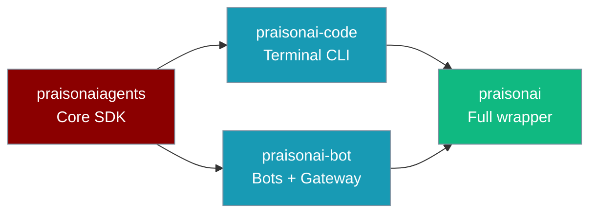
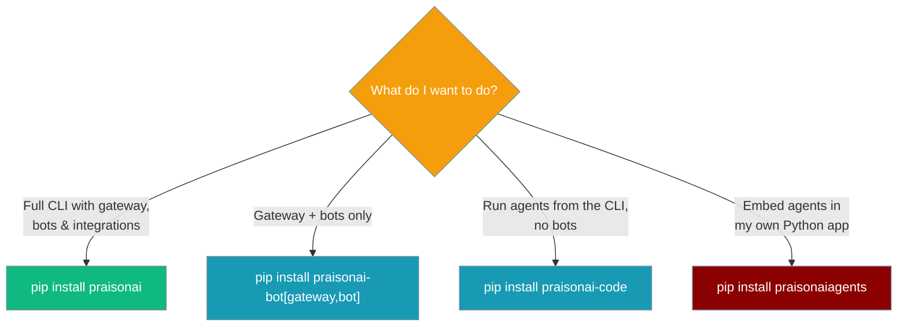
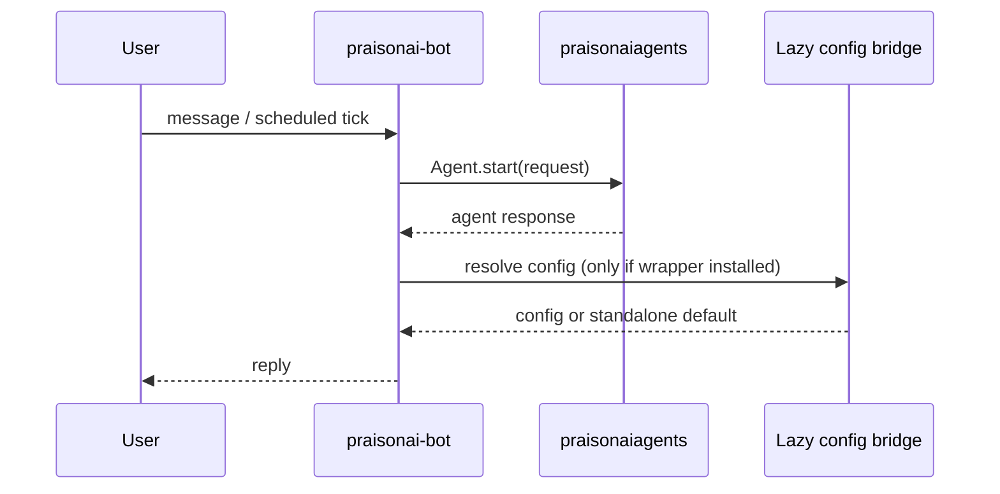

PraisonAI ships as four packages that stack — pick the smallest one that covers what you need.



## Quick Start

<Steps>
<Step title="SDK only — embed agents in your Python app">
```bash
pip install praisonaiagents
```
The core `Agent`, tools, memory, and hooks. No CLI, no gateway.
</Step>

<Step title="Terminal CLI — run/chat/code, no gateway or bots">
```bash
pip install praisonai-code
```
The agentic CLI (`run`, `chat`, `code`) and LLM runtime, without channel bots.
</Step>

<Step title="Gateway + bots — channel runtime without the wrapper">
```bash
pip install "praisonai-bot[gateway,bot]"
```
The WebSocket gateway, Telegram/Discord/Slack bots, and the scheduler tick.
</Step>

<Step title="Everything — the full wrapper">
```bash
pip install praisonai
```
Transitively pulls `praisonai-code`, `praisonai-bot`, and `praisonaiagents`.
</Step>
</Steps>

---

## How to Choose



Start at the top: install `praisonai` unless you know you want a lighter footprint. Each lower tier trims dependencies at the cost of features.

---

## How Tiers Interact at Runtime

The bot tier reaches wrapper-only features through a lazy bridge, so it stays installable on its own.



The bot tier never imports the wrapper directly — the bridge resolves config the same way whether you run bot-tier standalone or the full `praisonai` install.

---

## Ownership Table

Each tier owns a clear slice and must not depend upward.

| Tier | Package | Owns | Must not depend on |
|------|---------|------|-------------------|
| 1 | `praisonaiagents` | Agent, tools, memory, hooks, protocols | any wrapper |
| 2a | `praisonai-code` | `run`/`chat`/`code`, Typer CLI, runtime, LLM | `praisonai` PyPI (lazy bridge only) |
| 2b | `praisonai-bot` | Bots, gateway, channel CLI, OS daemon, **gateway scheduler tick** | `praisonai` PyPI (lazy bridge for jobs/UI) |
| 3 | `praisonai` | Framework adapters (CrewAI/AutoGen), train, serve, dashboard, async jobs API | — |

**Publish order:** `praisonaiagents` → `praisonai-code` + `praisonai-bot` → `praisonai`

---

## Config Kernel

Shared configuration lives in `praisonai_code/cli/configuration/`. The `praisonai-bot` tier reaches it through a lazy internal bridge, so the bot package stays installable on its own without importing the wrapper. You never call this bridge directly — it resolves config the same way whether you run bot-tier standalone or the full wrapper.

---

## Common Patterns

### Embed agents in my app

Install the SDK and call `Agent` directly.

```python
from praisonaiagents import Agent

agent = Agent(name="assistant", instructions="You are a helpful assistant.")
agent.start("Summarise the latest release notes.")
```

### Deploy a bot with scheduled updates, no CrewAI

Install the bot tier and run a scheduled agent tick — no wrapper required.

```python
import asyncio
from praisonaiagents import Agent
from praisonaiagents.scheduler import ScheduleRunner, FileScheduleStore
from praisonai_bot.scheduler import ScheduledAgentExecutor

agent = Agent(name="watcher", instructions="Summarise new alerts.")
runner = ScheduleRunner(FileScheduleStore("./schedules"))
executor = ScheduledAgentExecutor(runner=runner, agent_resolver=lambda _id: agent)

asyncio.run(executor.run_loop(interval=15.0))
```

---

## Best Practices

<AccordionGroup>
<Accordion title="Start with praisonai unless you know you want a lighter install">
The full wrapper pulls every tier and is the recommended default. Drop to `praisonai-code`, `praisonai-bot`, or `praisonaiagents` only when you have a specific reason to trim dependencies.
</Accordion>

<Accordion title="Shims keep old imports working — you don't need to migrate immediately">
After the C9 module moves, the old `praisonai.scheduler.executor` and `praisonai.scheduler.condition_gate` paths remain importable as backward-compatibility shims when the wrapper is installed. New code should import from `praisonai_bot.scheduler.*`, but existing code keeps running.
</Accordion>

<Accordion title="The scheduler tick works standalone from bot tier; RunPolicy needs the wrapper">
`ScheduledAgentExecutor` ships in `praisonai-bot`, so scheduled ticks run without the wrapper. The `RunPolicy` safety gate stays in `praisonai` — install the wrapper if you need it for unattended runs.
</Accordion>
</AccordionGroup>

---

## Related

<CardGroup cols={2}>
<Card title="Installation" icon="download" href="/docs/installation">
  Four-package install comparison
</Card>
<Card title="praisonai-bot SDK" icon="comments" href="/docs/sdk/praisonai-bot/index">
  Bot-tier package reference
</Card>
<Card title="Scheduler Pre-Run Gate" icon="filter" href="/docs/features/scheduler-pre-run-gate">
  Cost-efficiency gate for scheduled ticks
</Card>
<Card title="Scheduled Run Policy" icon="shield-halved" href="/docs/features/scheduled-run-policy">
  Safety gate for unattended runs
</Card>
</CardGroup>
