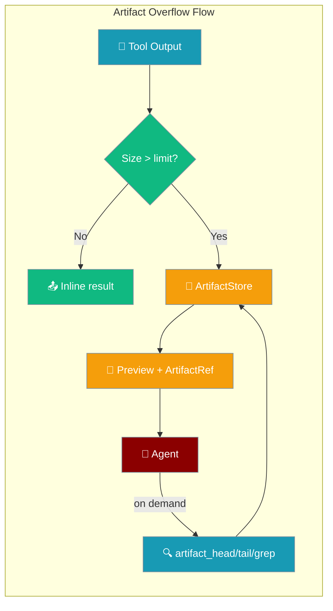
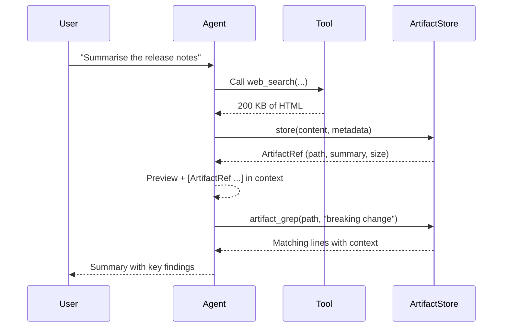
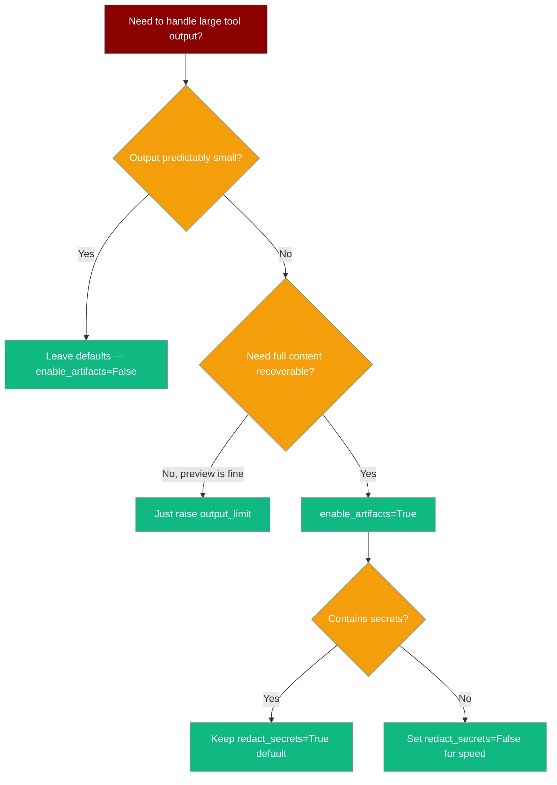

When a tool returns more data than fits in context, Artifact Storage saves the overflow to disk and gives the agent tools to page through it — so nothing is silently lost.



## Quick Start

<Steps>
<Step title="Enable with one line">
```python
from praisonaiagents import Agent, ToolConfig

agent = Agent(
    name="Researcher",
    instructions="Research topics deeply",
    tools=[web_search],
    tool_config=ToolConfig(enable_artifacts=True)
)

agent.start("Summarise the latest LangChain release notes")
# Large results are now saved to ~/.praisonai/artifacts/
# instead of being silently truncated.
```
</Step>

<Step title="With configuration">
```python
from praisonaiagents import Agent, ToolConfig

agent = Agent(
    name="Log Analyst",
    instructions="Analyse application logs",
    tools=[read_file],
    tool_config=ToolConfig(
        output_limit=32000,           # raise threshold to 32 KB
        enable_artifacts=True,
        artifact_retention_days=14,   # keep artifacts for 2 weeks
        redact_secrets=True,          # strip API keys / tokens before writing
    )
)

agent.start("Find errors in app.log from the last hour")
```
</Step>

<Step title="With a custom artifact store">
```python
from praisonaiagents import Agent, ToolConfig
from praisonaiagents.context import FileSystemArtifactStore

store = FileSystemArtifactStore(base_dir="/data/my-artifacts")

agent = Agent(
    name="Data Analyst",
    instructions="Analyse large datasets",
    tools=[query_database],
    tool_config=ToolConfig(
        enable_artifacts=True,
        artifact_store=store,
    )
)
```
</Step>
</Steps>

---

## How It Works



When a tool returns output larger than `output_limit`, the agent:

1. Writes the full content to `~/.praisonai/artifacts/{agent_id}/{run_id}/`
2. Replaces the oversize output with a short preview and an `[ArtifactRef ...]` line
3. Gains six new tools (auto-registered) to page through the stored content

The agent picks these up autonomously — you do not call them manually.

---

## Configuration Options

| Option | Type | Default | Description |
|--------|------|---------|-------------|
| `output_limit` | `int` | `16000` | Maximum bytes of tool output before spilling to the artifact store |
| `output_max_lines` | `int` | `None` | Maximum lines before spilling (alternative to byte limit) |
| `output_direction` | `str` | `"both"` | Truncation direction shown to the agent: `"head"`, `"tail"`, or `"both"` |
| `enable_artifacts` | `bool` | `False` | Master switch — enables artifact spillover. Off by default for backward compatibility |
| `artifact_retention_days` | `int` | `7` | Days to keep artifacts before garbage collection on agent destruction |
| `artifact_store` | `Any` | `None` | Custom store instance — pass a `FileSystemArtifactStore(...)` or another `ArtifactStoreProtocol` implementation |
| `redact_secrets` | `bool` | `True` | Redact common secret patterns (API keys, tokens, passwords) before writing to disk |
| `timeout` | `int` | `None` | Tool execution timeout in seconds |
| `retry_policy` | `RetryPolicy` | `None` | Tool retry configuration |
| `parallel` | `bool` | `False` | Enable parallel tool execution |

**Validation rules:**
- `output_limit` must be `> 0`
- `output_max_lines`, if set, must be `> 0`
- `output_direction` must be one of `"head"`, `"tail"`, or `"both"`
- `artifact_retention_days` must be `>= 0`

---

## Retrieval Tools the Agent Gains

These tools are **auto-registered on first overflow** — you do not add them manually.

| Tool | Signature | Returns |
|------|-----------|---------|
| `artifact_head` | `artifact_head(artifact_path, lines=50)` | First N lines as a string |
| `artifact_tail` | `artifact_tail(artifact_path, lines=50)` | Last N lines as a string |
| `artifact_grep` | `artifact_grep(artifact_path, pattern, context_lines=2, max_matches=50)` | List of `{line_number, line, context_before, context_after}` |
| `artifact_chunk` | `artifact_chunk(artifact_path, start_line=1, end_line=None)` | Lines `start_line..end_line` (1-indexed, inclusive) |
| `artifact_load` | `artifact_load(artifact_path)` | Full content (deserialised if JSON) — loads entire file into memory |
| `artifact_list` | `artifact_list(agent_id=None, run_id=None, tool_name=None)` | List of artifact metadata dicts |

When a tool output is too large, the agent sees a truncated preview with a line like:

```
[Artifact from web_search: /home/user/.praisonai/artifacts/agent1/run1/abc123.artifact (204.8 KB) - First 200 chars of content...]
```

The agent then calls `artifact_grep`, `artifact_chunk`, or other tools autonomously to retrieve the parts it needs.

<Warning>
`artifact_load` loads the entire file into memory. For large files, prefer `artifact_head`, `artifact_tail`, or `artifact_chunk` to page through the content.
</Warning>

---

## Storage Layout

Artifacts are stored under `~/.praisonai/artifacts/` by default:

```
~/.praisonai/artifacts/
└── {agent_id}/
    └── {run_id}/
        ├── {sha256[:12]}_{uuid8}.artifact       # raw content
        └── {sha256[:12]}_{uuid8}.meta.json      # metadata
```

The `.meta.json` file contains size, mime type, checksum (SHA256), tool name, and turn number.

**Security:** The store rejects any retrieval path outside `base_dir` and any extension other than `.artifact`. Keep this in mind when writing custom store implementations.

**Cleanup:** Artifacts older than `artifact_retention_days` are removed when the agent is finalized (garbage collected). Set `artifact_retention_days=0` to disable retention-based cleanup.

---

## Which Option Should I Use?



---

## Common Patterns

### Long web scrapes

An agent scrapes a 200 KB page. The preview shows head and tail, and the agent uses `artifact_grep` to find "pricing" without re-scraping:

```python
from praisonaiagents import Agent, ToolConfig

agent = Agent(
    name="Web Researcher",
    instructions="Research pricing information from websites",
    tools=[web_scrape],
    tool_config=ToolConfig(
        enable_artifacts=True,
        output_limit=8000,
    )
)

agent.start("Find pricing tiers on stripe.com")
# Agent scrapes page → overflow stored → uses artifact_grep("pricing") autonomously
```

### Log file analysis

`read_file` over a 5 MB log spills to disk. The agent uses `artifact_chunk` to inspect around an error timestamp:

```python
from praisonaiagents import Agent, ToolConfig

agent = Agent(
    name="Log Analyst",
    instructions="Find errors in application logs",
    tools=[read_file],
    tool_config=ToolConfig(
        enable_artifacts=True,
        output_limit=16000,
        artifact_retention_days=1,  # logs don't need long retention
    )
)

agent.start("Find what caused the 503 errors at 14:32 UTC in /var/log/app.log")
# Agent reads file → overflow stored → uses artifact_chunk(start_line=4500, end_line=4600)
```

### Custom store backend

Power users can supply their own store instead of the filesystem default:

```python
from praisonaiagents import Agent, ToolConfig
from praisonaiagents.context import ArtifactStoreProtocol

class S3ArtifactStore:
    """Custom store that writes artifacts to S3."""
    def store(self, content, metadata): ...
    def load(self, ref): ...
    def head(self, ref, lines=50): ...
    def tail(self, ref, lines=50): ...
    def grep(self, ref, pattern, context_lines=2, max_matches=50): ...
    def chunk(self, ref, start_line=1, end_line=None): ...
    def list_artifacts(self, run_id=None, agent_id=None, tool_name=None): ...

agent = Agent(
    name="Cloud Analyst",
    instructions="Analyse cloud resources",
    tools=[fetch_cloud_data],
    tool_config=ToolConfig(
        enable_artifacts=True,
        artifact_store=S3ArtifactStore(bucket="my-artifacts"),
    )
)
```

---

## Best Practices

<AccordionGroup>
<Accordion title="Only enable for tools that produce large output">
`enable_artifacts=False` by default means zero overhead. Enable it only for tools that regularly return large results — web scrapers, file readers, database queries, log fetchers.
</Accordion>

<Accordion title="Tune output_limit to your model's context budget">
Set `output_limit` based on how much context your model can handle, not arbitrarily large. A value of 8,000–32,000 bytes works well for most models. Larger values mean less of the context window is available for the agent's reasoning.
</Accordion>

<Accordion title="Set short retention in CI and sandboxes">
Cleanup only runs on agent finalization (garbage collection). In CI environments or sandboxes, set `artifact_retention_days=0` or `artifact_retention_days=1` to avoid disk buildup if agents are not properly finalized.
</Accordion>

<Accordion title="Trust redact_secrets=True for any web or file tool">
The default `redact_secrets=True` scans for API keys (`api_key`, `secret`, `token`), OpenAI keys (`sk-...`), and GitHub tokens (`ghp_...`) before writing to disk. Only disable it for known-safe content (e.g., structured scientific data with no credentials).
</Accordion>
</AccordionGroup>

---

## Related

<CardGroup cols={2}>
<Card title="Tool Configuration" icon="wrench" href="/docs/configuration/tool-config">
  The parent `ToolConfig` object — timeout, retry, parallel execution, and artifact settings.
</Card>
<Card title="Context Compaction" icon="compress" href="/docs/features/intelligent-conversation-compaction">
  Adjacent context-management feature — compact conversation history when approaching token limits.
</Card>
<Card title="Dynamic Context Discovery" icon="brain-circuit" href="/docs/features/dynamic-context-discovery">
  How agents discover and use artifact references in their context window.
</Card>
<Card title="Caching" icon="database" href="/docs/features/prompt-caching">
  Cache LLM responses to reduce costs and latency — a sibling cost/performance feature.
</Card>
</CardGroup>
