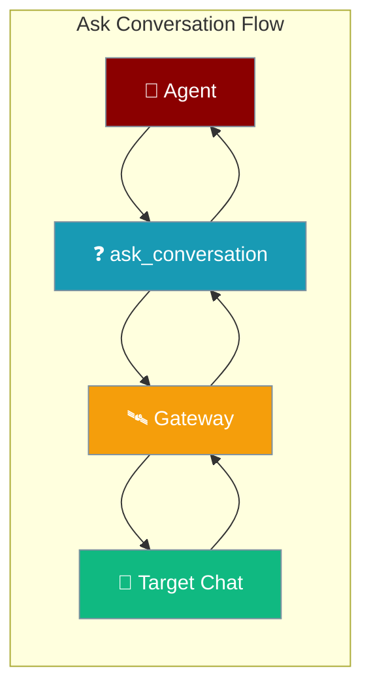
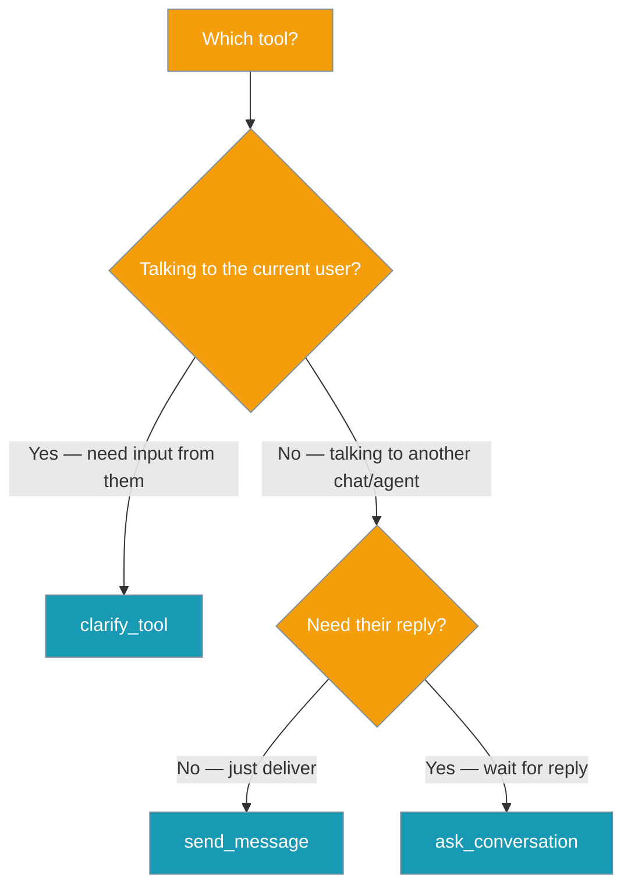
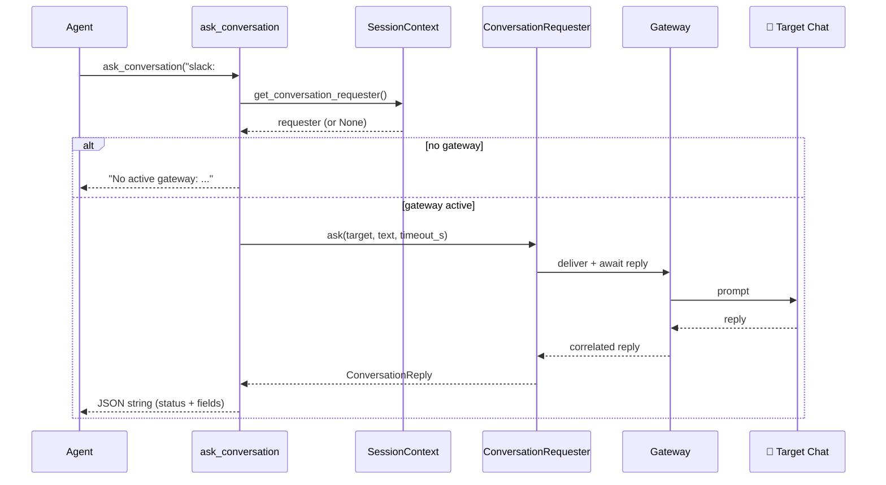
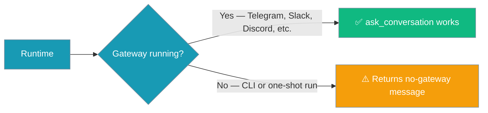
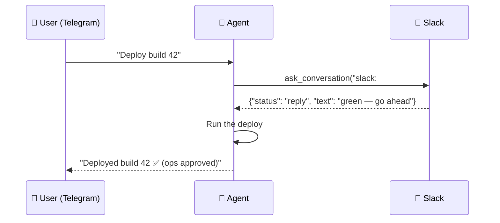

Ask Conversation lets a running agent send a prompt to another chat, wait for that chat's reply, and act on it — bounded by a timeout so a turn never hangs silently.

```python
from praisonaiagents import Agent
from praisonaiagents.tools import ask_conversation

agent = Agent(
    name="Deploy Coordinator",
    instructions=(
        "Before deploying, ask #ops on Slack whether staging is green. "
        "If they reply 'yes', run the deploy. Otherwise, wait."
    ),
    tools=[ask_conversation],
)
agent.start("Deploy build 42.")
```

A user asks the agent to ship a build; the agent asks another channel whether it's safe, waits for the reply, and acts on the answer — all within a single turn.



## Which tool?

`ask_conversation` is easy to confuse with its two siblings. This decision diagram picks the right one.



| Tool | Direction | Waits for reply? | Availability |
|------|-----------|------------------|--------------|
| `clarify_tool` | To the current user | Yes | Any runtime |
| `send_message` | To any target | No (fire-and-deliver) | Bot / gateway only |
| `ask_conversation` | To any target | Yes (bounded, typed outcome) | Bot / gateway only |

---

## Quick Start

<Steps>
<Step title="Ask One Question">

```python
from praisonaiagents import Agent
from praisonaiagents.tools import ask_conversation

agent = Agent(
    name="Coordinator",
    instructions="Ask #ops on Slack if staging is green before deploying.",
    tools=[ask_conversation],
)

agent.start("Deploy build 42.")
# Model call:
#   ask_conversation("slack:#ops", "Is staging green for build 42?")
# Returns JSON:
#   {"status": "reply", "from": "slack:#ops", "text": "yes, staging is green"}
```

</Step>

<Step title="Adjust the Timeout for Slower Channels">

```python
# Give an on-call human longer to answer than a live chat.
#   ask_conversation("slack:#oncall", "Approve deploy 42?", timeout_s=600)
```

Default wait is 120 seconds. Raise `timeout_s` for humans who may be away; the hard cap is 3600 seconds.

</Step>

<Step title="Handle the Four Outcomes in Instructions">

```python
agent = Agent(
    name="Coordinator",
    instructions=(
        "Ask #ops if it's OK to deploy. "
        "If status is 'reply' and they say yes, deploy. "
        "If status is 'timeout', 'undelivered', or 'no_route', "
        "do not deploy — report the reason to the user instead."
    ),
    tools=[ask_conversation],
)
```

Every call resolves to exactly one typed outcome, so tell the agent what to do for each.

</Step>
</Steps>

---

## How It Works

`ask_conversation` sends the prompt through the same delivery stack `send_message` uses, then waits for the next reply that correlates back from the target — returning it as a JSON string.



| Component | Purpose |
|-----------|---------|
| **ask_conversation tool** | Agent-callable function; resolves the requester from context |
| **ConversationRequestProtocol** | Interface the gateway registers per-turn to send-and-await |
| **SessionContext slot** | Task-local `register_conversation_requester` — no globals, safe for concurrent handlers |
| **Send Policy Guard** | Same policy that gates `send_message`; deny → `undelivered` before dispatch |
| **Gateway** | Delivers to Telegram, Slack, Discord, WhatsApp, etc., and correlates the reply |

The reply is matched back to the request via the existing correlation-id infrastructure.

---

## Outcomes

Every call resolves to exactly one of four typed statuses, so a turn never hangs silently.

| `status` | Meaning | Extra fields |
|----------|---------|--------------|
| `"reply"` | Target answered within `timeout_s` | `from`, `text`, optionally `detail` |
| `"timeout"` | Delivered, but no reply within `timeout_s` | optionally `from`, `detail` |
| `"undelivered"` | Prompt could not be delivered (send policy denied it, or the requester raised) | `detail` explains why |
| `"no_route"` | Target could not be resolved to a reachable channel | — |

```json
{"status": "reply", "from": "slack:#ops", "text": "yes, staging is green"}
```

```json
{"status": "timeout"}
```

```json
{"status": "undelivered", "detail": "Sending to 'slack:#exec' is not permitted by the current send policy."}
```

```json
{"status": "no_route"}
```

---

## Targets

Targets use the same forms as `send_message` — see [Send Message → Targets](/features/send-message-tool#targets).

---

## Timeouts (bounded wait)

`timeout_s` sets the maximum seconds the tool waits for a reply, and the value is normalized so a turn can never wait forever.

| Input to `timeout_s` | Result |
|----------------------|--------|
| Omitted | `120.0` (default) |
| `NaN`, `+inf`, `-inf` | Falls back to `120.0` |
| `≤ 0` or non-numeric | Falls back to `120.0` |
| `> 3600` | Clamped to `3600.0` |

The target is model-controlled, so the tool refuses to let a prompt-injected agent make a turn wait indefinitely — this clamp is a security property, not a suggestion.

---

## When It's Available

`ask_conversation` needs a running bot/gateway to reach another chat and correlate its reply.



| Runtime | Behaviour |
|---------|-----------|
| Bot / Gateway (Telegram, Slack, Discord, WhatsApp, …) | Sends the prompt and awaits a reply; returns a typed JSON string |
| CLI / one-shot (`agent.start(...)` directly) | Returns the string below — **does not raise** |

When no gateway is active the tool returns:

```
No active gateway: ask_conversation is only available inside a running bot/gateway (e.g. Telegram, Slack, Discord). It is unavailable for CLI/one-shot runs.
```

---

## User Interaction Flow

A Telegram user asks the deploy agent to ship build 42. Before running the deploy, the agent calls `ask_conversation("slack:#ops", "OK to deploy build 42?")`. #ops replies "green — go ahead" in Slack. The agent proceeds with the deploy and reports success back to the user on Telegram.



---

## Configuration Reference

`ask_conversation` takes three arguments:

| Argument | Type | Default | Description |
|----------|------|---------|-------------|
| `target` | `str` | required | Symbolic destination — same forms as `send_message`: `"origin"`, `"<platform>"`, `"<platform>:<chat_id>[:<thread_id>]"`, or a friendly alias. |
| `text` | `str` | `""` | The prompt to send to `target`. |
| `timeout_s` | `float` | `120.0` | Max seconds to wait for a reply. Non-numeric, non-finite (`NaN` / `±inf`), or non-positive falls back to `120s`; anything above `3600s` is clamped to `3600s`. |

**Returns:** a JSON string of the reply — one of the four statuses above.

---

## Common Patterns

### Human-in-the-loop approval on another platform

```python
agent = Agent(
    name="Deployer",
    instructions=(
        "Before deploying, ask #ops on Slack for approval. "
        "Only deploy if they reply yes."
    ),
    tools=[ask_conversation],
)
# Model call:
#   ask_conversation("slack:#ops", "Approve deploy of build 42?")
```

### Cross-agent handoff

```python
agent = Agent(
    name="Writer",
    instructions="Ask the research agent for the latest revenue number, then use it.",
    tools=[ask_conversation],
)
# Model call:
#   ask_conversation("slack:#research", "What's the latest Q3 revenue figure?")
```

### Graceful fallback on non-reply outcomes

```python
agent = Agent(
    name="Coordinator",
    instructions=(
        "Ask #ops before deploying. "
        "If ask_conversation returns status other than 'reply', "
        "skip the deploy and tell the user why."
    ),
    tools=[ask_conversation],
)
```

---

## Best Practices

<AccordionGroup>
<Accordion title="Prefer ask_conversation over polling" icon="clock">
The wait is bounded and correlated — you get exactly one typed outcome. Don't loop `send_message` and re-check for a reply; `ask_conversation` handles the send-and-await for you.
</Accordion>

<Accordion title="Right-size timeout_s" icon="hourglass-half">
Keep it short for humans in a live channel, longer for on-call escalations. The hard cap is 3600s — anything higher is clamped.

```python
# Live channel — a few minutes
ask_conversation("slack:#ops", "OK to deploy?", timeout_s=180)

# On-call escalation — up to the 3600s cap
ask_conversation("slack:#oncall", "Approve emergency fix?", timeout_s=3600)
```
</Accordion>

<Accordion title="Handle all four outcomes in agent instructions" icon="list-check">
Include a line like _"If ask_conversation returns status ≠ 'reply', fall back to X"_ so `reply`, `timeout`, `undelivered`, and `no_route` are all covered.
</Accordion>

<Accordion title="Restrict targets with SendPolicy" icon="shield-check">
Use `SendPolicy` to limit which channels an agent may ask. A denied policy returns `undelivered` **before** the message goes out, so the target chat is never contacted.
</Accordion>
</AccordionGroup>

---

## Related

<CardGroup cols={2}>
<Card title="Send Message Tool" icon="paper-plane" href="/features/send-message-tool">
Fire-and-deliver sibling — message a target without waiting for a reply
</Card>

<Card title="Send Policy" icon="shield-check" href="/features/send-policy">
Restrict which targets ask_conversation may reach
</Card>

<Card title="Clarify Tool" icon="messages-question" href="/features/clarify-tool">
Ask the current user mid-turn (not another chat)
</Card>

<Card title="Messaging Bots" icon="robot" href="/features/messaging-bots">
Set up the gateway that makes this tool available
</Card>

<Card title="Channels Gateway" icon="satellite-dish" href="/features/channels-gateway">
Connect Telegram, Slack, Discord, and WhatsApp
</Card>

<Card title="Gateway" icon="tower-broadcast" href="/features/gateway">
How request/reply is bound to a running gateway
</Card>
</CardGroup>
