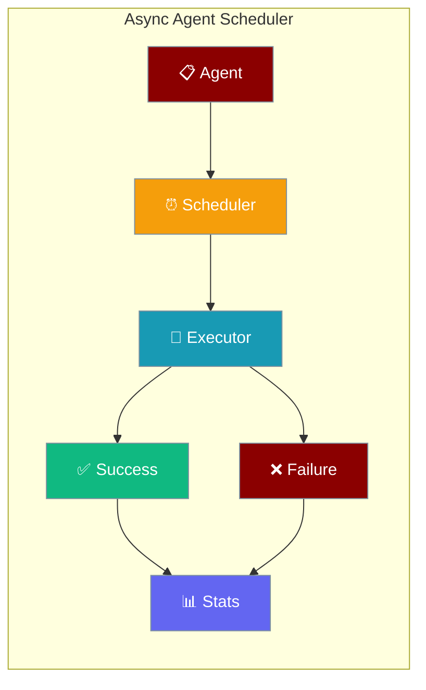
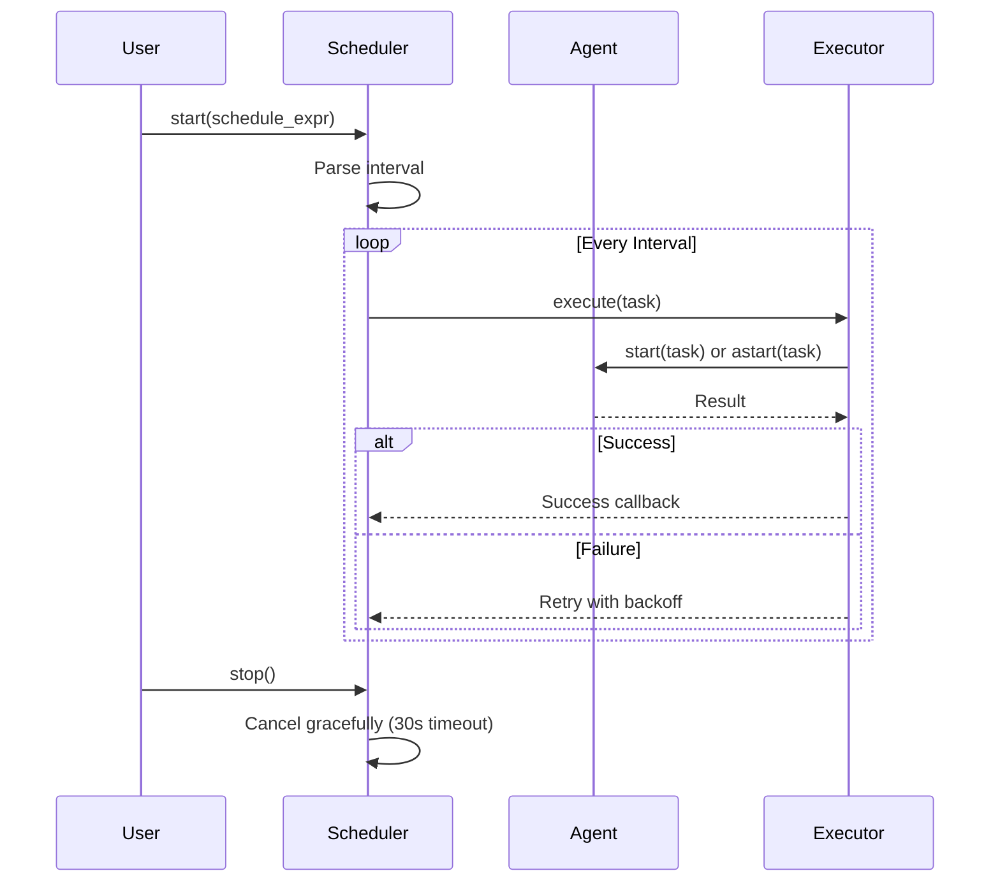
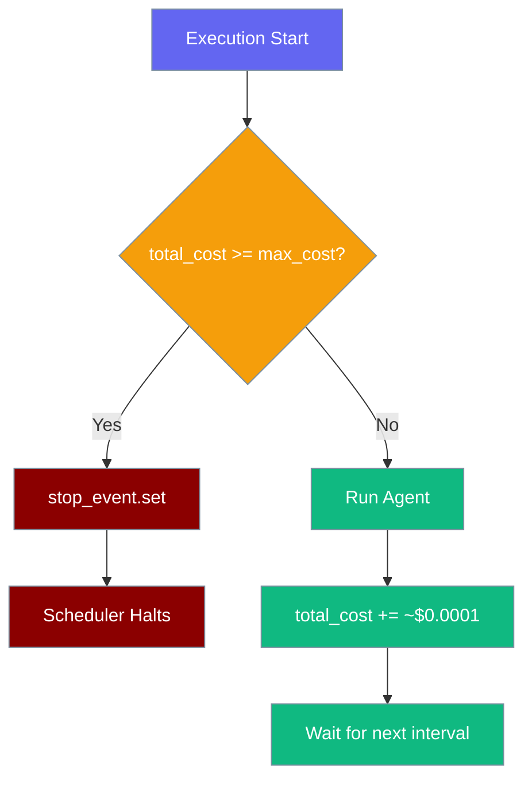

Run an agent on a recurring schedule with async-native execution, cooperative cancellation, and built-in retries.



## Quick Start

<Steps>
<Step title="Simple Usage">
```python
import asyncio
from praisonaiagents import Agent
from praisonai.async_agent_scheduler import AsyncAgentScheduler

# Migration note: this import will move to praisonai.scheduler.async_agent_scheduler
# See import paths section below

async def main():
    agent = Agent(
        name="NewsChecker",
        instructions="Summarise today's AI news in 3 bullet points.",
    )

    scheduler = AsyncAgentScheduler(agent, task="Check the latest AI news")
    await scheduler.start("hourly", max_retries=3, run_immediately=True)

    # ... run your app ...

    await scheduler.stop()
    print(await scheduler.get_stats())

asyncio.run(main())
```
</Step>

<Step title="With Callbacks">
```python
import asyncio
from praisonaiagents import Agent
from praisonai.async_agent_scheduler import AsyncAgentScheduler

def on_success(result):
    print(f"Agent completed successfully: {result}")

def on_failure(error):
    print(f"Agent failed: {error}")

async def main():
    agent = Agent(
        name="DataProcessor",
        instructions="Process incoming data efficiently",
    )

    scheduler = AsyncAgentScheduler(
        agent, 
        task="Process latest batch of data",
        on_success=on_success,
        on_failure=on_failure
    )

    # Run every 30 minutes
    await scheduler.start("*/30m", max_retries=3, run_immediately=True)

    # Keep running
    try:
        await asyncio.sleep(3600)  # Run for 1 hour
    finally:
        await scheduler.stop()
        stats = await scheduler.get_stats_async()
        print(f"Completed {stats['successful_executions']} successful executions")

asyncio.run(main())
```
</Step>

<Step title="With Timeout & Budget Limit">
```python
import asyncio
from praisonaiagents import Agent
from praisonai.async_agent_scheduler import AsyncAgentScheduler

async def main():
    agent = Agent(
        name="CostAwareAgent",
        instructions="Summarise the latest tech headlines.",
    )

    scheduler = AsyncAgentScheduler(
        agent,
        task="Summarise tech news",
        timeout=30,        # stop a single run after 30s
        max_cost=1.00,     # auto-shutdown once $1.00 spent
    )

    await scheduler.start("hourly", run_immediately=True)
    await asyncio.sleep(3600 * 4)
    stats = await scheduler.get_stats_async()
    print(f"Spent ${stats['total_cost_usd']}, remaining ${stats['remaining_budget']}")
    await scheduler.stop()

asyncio.run(main())
```
</Step>
</Steps>

---

## How It Works



The AsyncAgentScheduler uses async-native execution with cooperative cancellation, replacing the old thread-based scheduler.

<Note>
The scheduler's async primitives (`_stop_event`, `_cancel_event`, `_stats_lock`) are now created lazily inside `_ensure_async_primitives()` and bound to the loop that `start()` runs on. Tests that call `stop()` without first calling `start()` must invoke `scheduler._ensure_async_primitives()` explicitly — see `tests/unit/scheduler/test_async_agent_scheduler.py` in PR #1583 for the canonical pattern.
</Note>

---

## Schedule Expression Reference

| Expression | Interval | Description |
|------------|----------|-------------|
| `"daily"` | 86400s | Every 24 hours |
| `"hourly"` | 3600s | Every hour |
| `"*/30m"` | 1800s | Every 30 minutes |
| `"*/1h"` | 3600s | Every 1 hour |
| `"*/5s"` | 5s | Every 5 seconds |
| `"60"` | 60s | Custom seconds (plain digits) |

---

## Configuration Options

### AsyncAgentScheduler Constructor

| Parameter | Type | Default | Description |
|-----------|------|---------|-------------|
| `agent` | `Any` | Required | Agent instance to schedule |
| `task` | `str` | Required | Task description to execute |
| `config` | `Optional[Dict[str, Any]]` | `None` | Optional configuration dictionary |
| `on_success` | `Optional[Callable[[Any], None]]` | `None` | Callback function on successful execution |
| `on_failure` | `Optional[Callable[[Exception], None]]` | `None` | Callback function on failed execution |
| `timeout` | `Optional[int]` | `None` | **NEW** — Maximum execution time per run in seconds. `None` means no limit. Enforced with `asyncio.wait_for()`. |
| `max_cost` | `Optional[float]` | `1.00` | **NEW** — Maximum total cost in USD. Scheduler auto-stops when reached. Set to `None` to disable. Default `$1.00` is a safety guard. |

### start() Method Options

| Parameter | Type | Default | Description |
|-----------|------|---------|-------------|
| `schedule_expr` | `str` | Required | Schedule expression (e.g., "hourly", "*/1h", "3600") |
| `max_retries` | `int` | `3` | Maximum retry attempts on failure |
| `run_immediately` | `bool` | `False` | If True, run agent immediately before starting schedule |

### Reading Stats

Statistics can be read in both sync and async contexts with different guarantees:

```mermaid
graph LR
    A[Async Caller] --> B[get_stats_async()]
    B --> C[_stats_lock]
    C --> D[Atomic Snapshot]
    
    E[Sync Caller] --> F[get_stats() / get_stats_sync()]
    F --> G[Direct Read]
    G --> H[May Tear]
    
    classDef async fill:#10B981,stroke:#7C90A0,color:#fff
    classDef sync fill:#F59E0B,stroke:#7C90A0,color:#fff
    classDef atomic fill:#6366F1,stroke:#7C90A0,color:#fff
    classDef tear fill:#8B0000,stroke:#7C90A0,color:#fff
    
    class A,B async
    class E,F sync
    class C,D atomic
    class H tear
```

| Method | Sync/Async | Atomicity | When to Use |
|--------|-----------|-----------|-------------|
| `get_stats()` | sync | **Best-effort, NOT atomic** — counters may be observed mid-update | Quick sync checks, tests, scripts |
| `get_stats_sync()` | sync | Alias for `get_stats()` (same best-effort behaviour, named for clarity) | When you want the sync intent obvious in code |
| `get_stats_async()` | async | **Atomic snapshot** under `_stats_lock` | Inside async code paths where consistency matters |

### Stats Response Format

| Field | Type | Description |
|-------|------|-------------|
| `is_running` | `bool` | Whether scheduler is currently running |
| `total_executions` | `int` | Total number of execution attempts |
| `successful_executions` | `int` | Number of successful executions |
| `failed_executions` | `int` | Number of failed executions |
| `success_rate` | `float` | Success percentage (0-100) |
| `total_cost_usd` | `float` | **NEW** — Running total cost in USD (4 dp) |
| `remaining_budget` | `float \| None` | **NEW** — `max_cost - total_cost_usd`, or `None` if `max_cost` is disabled |

---

## Common Patterns

### Running in FastAPI Application

```python
from contextlib import asynccontextmanager
from fastapi import FastAPI
from praisonaiagents import Agent
from praisonai.async_agent_scheduler import AsyncAgentScheduler

scheduler = None

@asynccontextmanager
async def lifespan(app: FastAPI):
    # Startup
    global scheduler
    agent = Agent(name="BackgroundWorker", instructions="Process background tasks")
    scheduler = AsyncAgentScheduler(agent, task="Process pending tasks")
    await scheduler.start("*/5m", max_retries=2)
    
    yield
    
    # Shutdown
    if scheduler:
        await scheduler.stop()

app = FastAPI(lifespan=lifespan)
```

### Error Handling with Logging

```python
import asyncio
import logging
from praisonaiagents import Agent
from praisonai.async_agent_scheduler import AsyncAgentScheduler

logging.basicConfig(level=logging.INFO)

def handle_failure(error):
    logging.error(f"Agent execution failed: {error}")
    # Send alert, write to database, etc.

async def main():
    agent = Agent(name="MonitoringAgent", instructions="Monitor system health")
    scheduler = AsyncAgentScheduler(
        agent, 
        task="Check system status",
        on_failure=handle_failure
    )
    
    await scheduler.start("*/10m")
    
    try:
        await asyncio.sleep(float('inf'))
    except KeyboardInterrupt:
        await scheduler.stop()

asyncio.run(main())
```

### Graceful Shutdown on SIGINT

```python
import asyncio
import signal
from praisonaiagents import Agent
from praisonai.async_agent_scheduler import AsyncAgentScheduler

scheduler = None

def signal_handler():
    if scheduler:
        asyncio.create_task(scheduler.stop())

async def main():
    global scheduler
    
    # Setup signal handling
    for sig in [signal.SIGINT, signal.SIGTERM]:
        signal.signal(sig, lambda s, f: signal_handler())
    
    agent = Agent(name="LongRunningAgent", instructions="Process data continuously")
    scheduler = AsyncAgentScheduler(agent, task="Process data batch")
    
    await scheduler.start("*/15m", run_immediately=True)
    
    try:
        # Keep running until signal
        await asyncio.sleep(float('inf'))
    except KeyboardInterrupt:
        print("Received interrupt, shutting down gracefully...")
    finally:
        if scheduler:
            await scheduler.stop()
            stats = await scheduler.get_stats_async()
            print(f"Final stats: {stats}")

asyncio.run(main())
```

### Budget-aware Scheduling

```python
import asyncio
from praisonaiagents import Agent
from praisonai.async_agent_scheduler import AsyncAgentScheduler

async def main():
    agent = Agent(name="ReportAgent", instructions="Generate hourly report")

    # Hard-stop after $5 total spend, 60s per run
    scheduler = AsyncAgentScheduler(
        agent,
        task="Generate report",
        timeout=60,
        max_cost=5.00,
    )

    await scheduler.start("hourly")
    while scheduler.is_running:
        await asyncio.sleep(60)
        stats = await scheduler.get_stats_async()
        if stats["remaining_budget"] is not None and stats["remaining_budget"] < 0.50:
            print(f"⚠️  Budget nearly exhausted: ${stats['remaining_budget']:.4f} left")
    print("Scheduler stopped (budget reached or manual stop)")

asyncio.run(main())
```



---

## Best Practices

<AccordionGroup>
<Accordion title="Always await scheduler.stop() before exiting">
The `stop()` method waits up to 30 seconds for the current execution to complete before canceling. This prevents data corruption and ensures clean shutdown.

```python
# Good
try:
    await scheduler.start("hourly")
    await asyncio.sleep(3600)
finally:
    await scheduler.stop()

# Bad - may interrupt agent mid-execution
await scheduler.start("hourly")
await asyncio.sleep(3600)
# Exit without stopping
```
</Accordion>

<Accordion title="Use run_immediately=True for testing">
Enable `run_immediately=True` to verify your agent works correctly before waiting for the first scheduled interval.

```python
# Test immediately, then schedule
await scheduler.start("hourly", run_immediately=True)

# Good for smoke tests
await scheduler.start("daily", run_immediately=True)
```
</Accordion>

<Accordion title="Keep callbacks lightweight">
Success and failure callbacks are called synchronously. Heavy operations should be offloaded to avoid blocking the scheduler.

```python
# Good - lightweight logging
def on_success(result):
    logger.info(f"Agent completed: {result}")

# Bad - heavy database operations
def on_success(result):
    database.save_large_dataset(result)  # Blocks scheduler
    
# Better - offload heavy work
def on_success(result):
    asyncio.create_task(save_to_database(result))
```
</Accordion>

<Accordion title="Prefer AsyncAgentScheduler over legacy thread-based scheduler">
For new code, use `AsyncAgentScheduler` instead of the legacy `AgentScheduler`. The async version provides better cancellation, no daemon threads, and fits naturally into async applications.

```python
# New async approach
from praisonai.async_agent_scheduler import AsyncAgentScheduler
scheduler = AsyncAgentScheduler(agent, task)
await scheduler.start("hourly")

# Legacy thread-based (avoid for new code)
from praisonai.scheduler import AgentScheduler
scheduler = AgentScheduler(agent, task)
scheduler.start("hourly")
```
</Accordion>

<Accordion title="Budget Control">
The default `max_cost=1.00` is intentional — it caps unattended cost runaway. For long-running production deployments, raise it explicitly to the budget you've approved, or set `max_cost=None` only when an external billing system enforces limits.

```python
# Production with explicit budget
scheduler = AsyncAgentScheduler(agent, task, max_cost=50.00)

# Disable budget (only when external limits exist)
scheduler = AsyncAgentScheduler(agent, task, max_cost=None)
```

When the budget triggers, the scheduler logs a warning and calls `stop_event.set()` internally — `stats["is_running"]` flips to `False`.
</Accordion>

<Accordion title="Timeout Configuration">
Set `timeout` to bound the worst-case wall-clock time per run. Internally implemented with `asyncio.wait_for()`, which raises `asyncio.TimeoutError` and triggers the standard retry path.

```python
scheduler = AsyncAgentScheduler(
    agent,
    task,
    timeout=30,        # individual run cannot exceed 30s
    max_cost=1.00,
)
```

`timeout=None` (the default) imposes no limit.
</Accordion>
</AccordionGroup>

---

<Note>
**Import paths (PR #1552):**
- **Pending deprecation** (still works, emits `PendingDeprecationWarning` — will move to `praisonai.scheduler.async_agent_scheduler` in a future release): `from praisonai.async_agent_scheduler import AsyncAgentScheduler`
- **Canonical:** `from praisonai.scheduler import AgentScheduler` (sync scheduler)
- **Deprecated** (still works, emits `DeprecationWarning`): `from praisonai.agent_scheduler import AgentScheduler`

**Migration from Legacy Scheduler:** `AsyncAgentScheduler` replaces the thread-based `AgentScheduler` for new applications. The sync-looking public CLI (`praisonai schedule ...`) is unchanged and continues to work as before.
</Note>

<Warning>
**Jupyter/Event Loop Compatibility:** Starting with [PR #1448](https://github.com/MervinPraison/PraisonAI/pull/1448), PraisonAI no longer calls `nest_asyncio.apply()` or `asyncio.set_event_loop()` on your behalf when ACP/LSP is enabled. If you embed PraisonAI inside a Jupyter kernel or another running event loop, either call `nest_asyncio.apply()` yourself at the top of your notebook, or run PraisonAI from a separate process.
</Warning>

---

## Related

<CardGroup cols={2}>
<Card title="Scheduler CLI" icon="terminal" href="/docs/cli/scheduler">
  Command-line interface for scheduling agents
</Card>
<Card title="Background Tasks" icon="play" href="/docs/features/background-tasks">
  Running agents as background processes
</Card>
</CardGroup>