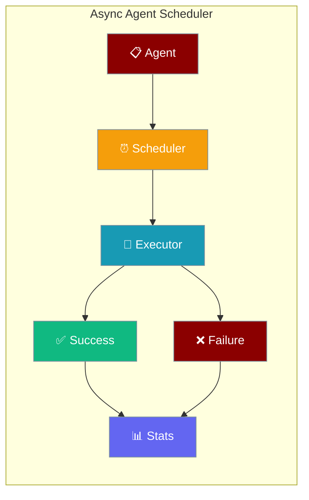
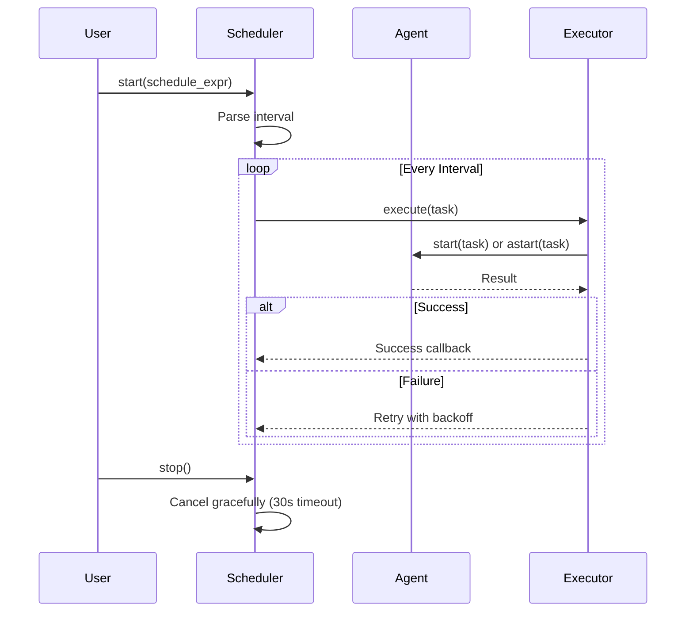
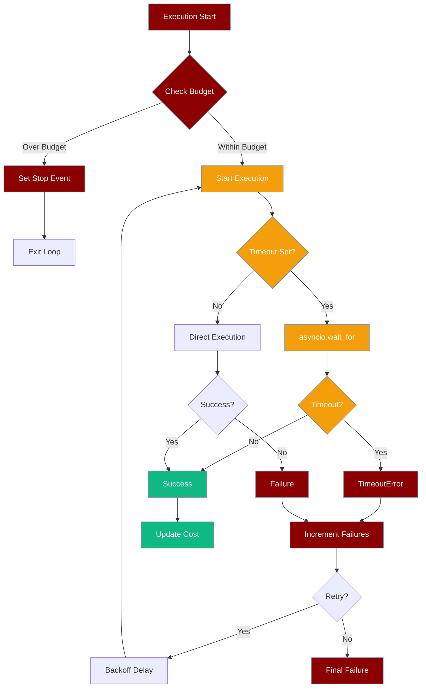

Run an agent on a recurring schedule with async-native execution, cooperative cancellation, and built-in retries.



## Quick Start

<Steps>
<Step title="Simple Usage">
```python
import asyncio
from praisonaiagents import Agent
from praisonai.async_agent_scheduler import AsyncAgentScheduler

# Migration note: this import will move to praisonai.scheduler.async_agent_scheduler
# See import paths section below

async def main():
    agent = Agent(
        name="NewsChecker",
        instructions="Summarise today's AI news in 3 bullet points.",
    )

    scheduler = AsyncAgentScheduler(agent, task="Check the latest AI news")
    await scheduler.start("hourly", max_retries=3, run_immediately=True)

    # ... run your app ...

    await scheduler.stop()
    print(await scheduler.get_stats())

asyncio.run(main())
```
</Step>

<Step title="With Callbacks">
```python
import asyncio
from praisonaiagents import Agent
from praisonai.async_agent_scheduler import AsyncAgentScheduler

def on_success(result):
    print(f"Agent completed successfully: {result}")

def on_failure(error):
    print(f"Agent failed: {error}")

async def main():
    agent = Agent(
        name="DataProcessor",
        instructions="Process incoming data efficiently",
    )

    scheduler = AsyncAgentScheduler(
        agent, 
        task="Process latest batch of data",
        on_success=on_success,
        on_failure=on_failure
    )

    # Run every 30 minutes
    await scheduler.start("*/30m", max_retries=3, run_immediately=True)

    # Keep running
    try:
        await asyncio.sleep(3600)  # Run for 1 hour
    finally:
        await scheduler.stop()
        stats = await scheduler.get_stats_async()
        print(f"Completed {stats['successful_executions']} successful executions")

asyncio.run(main())
```
</Step>

<Step title="With Budget and Timeout">
```python
import asyncio
from praisonaiagents import Agent
from praisonai.scheduler.async_agent_scheduler import AsyncAgentScheduler

async def main():
    agent = Agent(
        name="DataProcessor",
        instructions="Process and analyze market data efficiently.",
    )

    scheduler = AsyncAgentScheduler(
        agent,
        task="Check the latest AI news",
        timeout=60,        # cancel any run that exceeds 60s
        max_cost=2.00,     # stop the scheduler after $2.00 total spend
    )
    await scheduler.start("hourly", max_retries=3, run_immediately=True)

    # ... run your app ...

    await scheduler.stop()
    stats = await scheduler.get_stats()
    print(f"Total cost: ${stats['total_cost_usd']}")
    print(f"Remaining budget: ${stats['remaining_budget']}")

asyncio.run(main())
```
</Step>
</Steps>

---

## How It Works



The AsyncAgentScheduler uses async-native execution with cooperative cancellation, replacing the old thread-based scheduler.

<Note>
The scheduler's async primitives (`_stop_event`, `_cancel_event`, `_stats_lock`) are now created lazily inside `_ensure_async_primitives()` and bound to the loop that `start()` runs on. Tests that call `stop()` without first calling `start()` must invoke `scheduler._ensure_async_primitives()` explicitly — see `tests/unit/scheduler/test_async_agent_scheduler.py` in PR #1583 for the canonical pattern.
</Note>

---

## Schedule Expression Reference

| Expression | Interval | Description |
|------------|----------|-------------|
| `"daily"` | 86400s | Every 24 hours |
| `"hourly"` | 3600s | Every hour |
| `"*/30m"` | 1800s | Every 30 minutes |
| `"*/1h"` | 3600s | Every 1 hour |
| `"*/5s"` | 5s | Every 5 seconds |
| `"60"` | 60s | Custom seconds (plain digits) |

---

## Configuration Options

### AsyncAgentScheduler Constructor

| Parameter | Type | Default | Description |
|-----------|------|---------|-------------|
| `agent` | `Any` | Required | Agent instance to schedule |
| `task` | `str` | Required | Task description to execute |
| `config` | `Optional[Dict[str, Any]]` | `None` | Optional configuration dictionary |
| `on_success` | `Optional[Callable[[Any], None]]` | `None` | Callback function on successful execution |
| `on_failure` | `Optional[Callable[[Exception], None]]` | `None` | Callback function on failed execution |
| `timeout` | `Optional[int]` | `None` | Maximum execution time per run in seconds. When set, each agent execution is wrapped in `asyncio.wait_for(...)` — runs longer than this are cancelled and treated as a failure (retried per `max_retries`). `None` = no limit. |
| `max_cost` | `Optional[float]` | `1.00` | Maximum total cost in USD across the scheduler's lifetime. Defaults to **$1.00 for safety**. Set to `None` to disable. When the budget is hit, the scheduler sets `_stop_event` and exits the loop on the next tick. |

### start() Method Options

| Parameter | Type | Default | Description |
|-----------|------|---------|-------------|
| `schedule_expr` | `str` | Required | Schedule expression (e.g., "hourly", "*/1h", "3600") |
| `max_retries` | `int` | `3` | Maximum retry attempts on failure |
| `run_immediately` | `bool` | `False` | If True, run agent immediately before starting schedule |

## Factory Methods

Create a scheduler directly from YAML or a recipe instead of wiring an agent manually.

### `AsyncAgentScheduler.from_yaml(...)`

```python
from praisonai.scheduler.async_agent_scheduler import AsyncAgentScheduler

scheduler = AsyncAgentScheduler.from_yaml("agents.yaml")
await scheduler.start_from_yaml_config()   # uses interval/max_retries/run_immediately from YAML
```

| Parameter | Type | Default | Description |
|-----------|------|---------|-------------|
| `yaml_path` | `str` | `"agents.yaml"` | Path to the agents.yaml file. |
| `interval_override` | `Optional[str]` | `None` | Override the schedule interval from the YAML. |
| `max_retries_override` | `Optional[int]` | `None` | Override `max_retries` from the YAML. |
| `timeout_override` | `Optional[int]` | `None` | Override `timeout` from the YAML. |
| `max_cost_override` | `Optional[float]` | `None` | Override `max_cost` from the YAML. |
| `on_success` | `Optional[Callable]` | `None` | Success callback. |
| `on_failure` | `Optional[Callable]` | `None` | Failure callback. |

Raises `ValueError` if no `task` is present in the YAML.

### `scheduler.start_from_yaml_config()`

Async method. Must be called after `from_yaml()`. Reads `interval`, `max_retries`, and `run_immediately` from the YAML's schedule block and starts the scheduler.

### `AsyncAgentScheduler.from_recipe(...)`

```python
scheduler = AsyncAgentScheduler.from_recipe("news-monitor")
await scheduler.start_from_yaml_config()
```

| Parameter | Type | Default | Description |
|-----------|------|---------|-------------|
| `recipe_name` | `str` | Required | Name of the recipe to schedule. |
| `input_data` | `Any` | `None` | Input data forwarded to the recipe. |
| `config` | `Optional[Dict[str, Any]]` | `None` | Per-recipe config overrides. |
| `interval_override` | `Optional[str]` | `None` | Override schedule interval from recipe runtime config. |
| `max_retries_override` | `Optional[int]` | `None` | Override `max_retries` from recipe runtime config. |
| `timeout_override` | `Optional[int]` | `None` | Override `timeout`. Default falls back to `300s`. |
| `max_cost_override` | `Optional[float]` | `None` | Override `max_cost`. Default falls back to `$1.00`. |
| `on_success` / `on_failure` | `Optional[Callable]` | `None` | Callbacks. |

The recipe is resolved via `praisonai.recipe.bridge.resolve(...)` and wrapped in an internal `AsyncRecipeExecutorAgent` that offloads sync recipe execution to `loop.run_in_executor`. Recipe-level `schedule.timeout_sec` and `schedule.max_cost_usd` are honoured unless overridden.

### Reading Stats

Statistics can be read in both sync and async contexts with different guarantees:

```mermaid
graph LR
    A[Async Caller] --> B[get_stats_async()]
    B --> C[_stats_lock]
    C --> D[Atomic Snapshot]
    
    E[Sync Caller] --> F[get_stats() / get_stats_sync()]
    F --> G[Direct Read]
    G --> H[May Tear]
    
    classDef async fill:#10B981,stroke:#7C90A0,color:#fff
    classDef sync fill:#F59E0B,stroke:#7C90A0,color:#fff
    classDef atomic fill:#6366F1,stroke:#7C90A0,color:#fff
    classDef tear fill:#8B0000,stroke:#7C90A0,color:#fff
    
    class A,B async
    class E,F sync
    class C,D atomic
    class H tear
```

Statistics can be read in two equivalent ways from async code, and in one sync-safe way:

| Method | Sync/Async | Atomicity | When to Use |
|--------|-----------|-----------|-------------|
| `await scheduler.get_stats()` | async | **Atomic snapshot** under `_stats_lock`. As of PR #1784, this method now delegates to `get_stats_async()`. | Anywhere — this is the canonical reader. |
| `await scheduler.get_stats_async()` | async | **Atomic snapshot** under `_stats_lock`. | Equivalent to `get_stats()`; kept for explicit-naming readability. |
| `scheduler.get_stats_sync()` | sync | **Best-effort, no lock** — counters may be observed mid-update. | Sync contexts only (tests, scripts, REPL). Avoid in async code. |

⚠️ **Behaviour change from previous releases:** `get_stats()` used to be a sync best-effort read. Callers that did `scheduler.get_stats()` (no `await`) now receive a coroutine. Either `await` it, or call `get_stats_sync()` for a drop-in sync replacement.

### Stats Response Format

| Field | Type | Description |
|-------|------|-------------|
| `is_running` | `bool` | Whether scheduler is currently running |
| `total_executions` | `int` | Total number of execution attempts |
| `successful_executions` | `int` | Number of successful executions |
| `failed_executions` | `int` | Number of failed executions |
| `success_rate` | `float` | Success percentage (0-100) |
| `total_cost_usd` | `float` | Rough estimated total cost across all executions (`~$0.0001` per successful run as a placeholder estimate). Rounded to 4 dp. |
| `remaining_budget` | `Optional[float]` | `max_cost - total_cost_usd`, rounded to 4 dp. `None` when `max_cost` is `None`. |

## Budget & Timeout Behaviour

The scheduler includes budget tracking and timeout support to prevent runaway costs and executions.



### Budget Tracking

- Default budget: **$1.00** for safety
- Rough cost estimate: **$0.0001** per successful execution (placeholder)
- When budget is exceeded, scheduler stops gracefully
- Set `max_cost=None` to disable budget limits

### Timeout Behavior

- Per-execution timeout using `asyncio.wait_for()`
- Timeout errors are treated as failures and trigger retries
- Backoff delay applied between retry attempts
- No timeout by default (`timeout=None`)

---

## Common Patterns

### Running in FastAPI Application

```python
from contextlib import asynccontextmanager
from fastapi import FastAPI
from praisonaiagents import Agent
from praisonai.async_agent_scheduler import AsyncAgentScheduler

scheduler = None

@asynccontextmanager
async def lifespan(app: FastAPI):
    # Startup
    global scheduler
    agent = Agent(name="BackgroundWorker", instructions="Process background tasks")
    scheduler = AsyncAgentScheduler(agent, task="Process pending tasks")
    await scheduler.start("*/5m", max_retries=2)
    
    yield
    
    # Shutdown
    if scheduler:
        await scheduler.stop()

app = FastAPI(lifespan=lifespan)
```

### Error Handling with Logging

```python
import asyncio
import logging
from praisonaiagents import Agent
from praisonai.async_agent_scheduler import AsyncAgentScheduler

logging.basicConfig(level=logging.INFO)

def handle_failure(error):
    logging.error(f"Agent execution failed: {error}")
    # Send alert, write to database, etc.

async def main():
    agent = Agent(name="MonitoringAgent", instructions="Monitor system health")
    scheduler = AsyncAgentScheduler(
        agent, 
        task="Check system status",
        on_failure=handle_failure
    )
    
    await scheduler.start("*/10m")
    
    try:
        await asyncio.sleep(float('inf'))
    except KeyboardInterrupt:
        await scheduler.stop()

asyncio.run(main())
```

### Graceful Shutdown on SIGINT

```python
import asyncio
import signal
from praisonaiagents import Agent
from praisonai.async_agent_scheduler import AsyncAgentScheduler

scheduler = None

def signal_handler():
    if scheduler:
        asyncio.create_task(scheduler.stop())

async def main():
    global scheduler
    
    # Setup signal handling
    for sig in [signal.SIGINT, signal.SIGTERM]:
        signal.signal(sig, lambda s, f: signal_handler())
    
    agent = Agent(name="LongRunningAgent", instructions="Process data continuously")
    scheduler = AsyncAgentScheduler(agent, task="Process data batch")
    
    await scheduler.start("*/15m", run_immediately=True)
    
    try:
        # Keep running until signal
        await asyncio.sleep(float('inf'))
    except KeyboardInterrupt:
        print("Received interrupt, shutting down gracefully...")
    finally:
        if scheduler:
            await scheduler.stop()
            stats = await scheduler.get_stats_async()
            print(f"Final stats: {stats}")

asyncio.run(main())
```

---

## Best Practices

<AccordionGroup>
<Accordion title="Always await scheduler.stop() before exiting">
The `stop()` method waits up to 30 seconds for the current execution to complete before canceling. This prevents data corruption and ensures clean shutdown.

```python
# Good
try:
    await scheduler.start("hourly")
    await asyncio.sleep(3600)
finally:
    await scheduler.stop()

# Bad - may interrupt agent mid-execution
await scheduler.start("hourly")
await asyncio.sleep(3600)
# Exit without stopping
```
</Accordion>

<Accordion title="Use run_immediately=True for testing">
Enable `run_immediately=True` to verify your agent works correctly before waiting for the first scheduled interval.

```python
# Test immediately, then schedule
await scheduler.start("hourly", run_immediately=True)

# Good for smoke tests
await scheduler.start("daily", run_immediately=True)
```
</Accordion>

<Accordion title="Keep callbacks lightweight">
Success and failure callbacks are called synchronously. Heavy operations should be offloaded to avoid blocking the scheduler.

```python
# Good - lightweight logging
def on_success(result):
    logger.info(f"Agent completed: {result}")

# Bad - heavy database operations
def on_success(result):
    database.save_large_dataset(result)  # Blocks scheduler
    
# Better - offload heavy work
def on_success(result):
    asyncio.create_task(save_to_database(result))
```
</Accordion>

<Accordion title="Prefer AsyncAgentScheduler over legacy thread-based scheduler">
For new code, use `AsyncAgentScheduler` instead of the legacy `AgentScheduler`. The async version provides better cancellation, no daemon threads, and fits naturally into async applications.

```python
# New async approach
from praisonai.async_agent_scheduler import AsyncAgentScheduler
scheduler = AsyncAgentScheduler(agent, task)
await scheduler.start("hourly")

# Legacy thread-based (avoid for new code)
from praisonai.scheduler import AgentScheduler
scheduler = AgentScheduler(agent, task)
scheduler.start("hourly")
```
</Accordion>
</AccordionGroup>

---

<Note>
**Import paths (PR #1552):**
- **Pending deprecation** (still works, emits `PendingDeprecationWarning` — will move to `praisonai.scheduler.async_agent_scheduler` in a future release): `from praisonai.async_agent_scheduler import AsyncAgentScheduler`
- **Canonical:** `from praisonai.scheduler import AgentScheduler` (sync scheduler)
- **Deprecated** (still works, emits `DeprecationWarning`): `from praisonai.agent_scheduler import AgentScheduler`

**Migration from Legacy Scheduler:** `AsyncAgentScheduler` replaces the thread-based `AgentScheduler` for new applications. The sync-looking public CLI (`praisonai schedule ...`) is unchanged and continues to work as before.
</Note>

<Warning>
**Jupyter/Event Loop Compatibility:** Starting with [PR #1448](https://github.com/MervinPraison/PraisonAI/pull/1448), PraisonAI no longer calls `nest_asyncio.apply()` or `asyncio.set_event_loop()` on your behalf when ACP/LSP is enabled. If you embed PraisonAI inside a Jupyter kernel or another running event loop, either call `nest_asyncio.apply()` yourself at the top of your notebook, or run PraisonAI from a separate process.
</Warning>

---

## Related

<CardGroup cols={2}>
<Card title="Scheduler CLI" icon="terminal" href="/docs/cli/scheduler">
  Command-line interface for scheduling agents
</Card>
<Card title="Background Tasks" icon="play" href="/docs/features/background-tasks">
  Running agents as background processes
</Card>
</CardGroup>