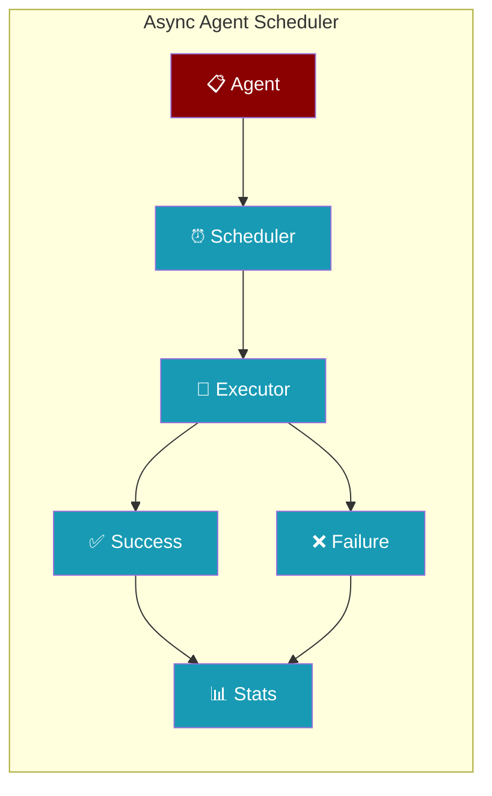
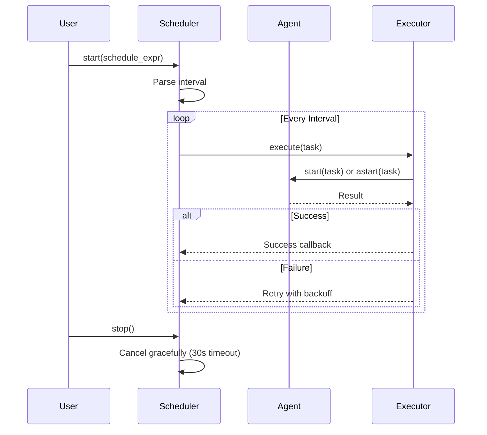
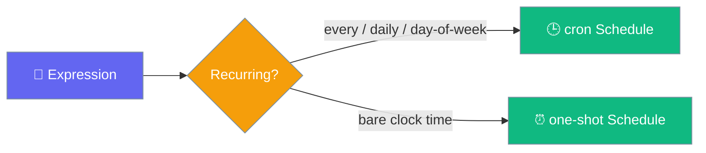
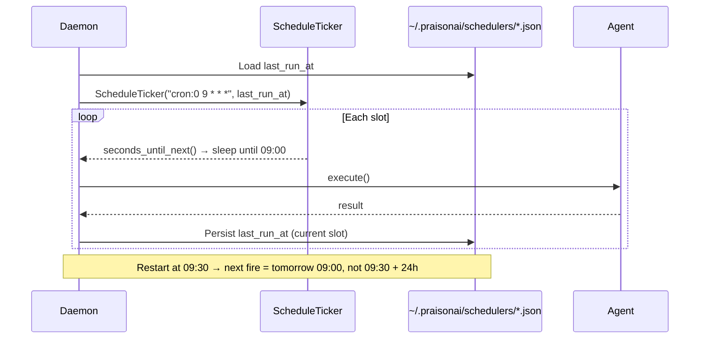
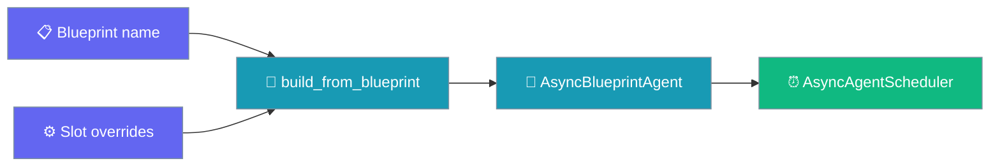
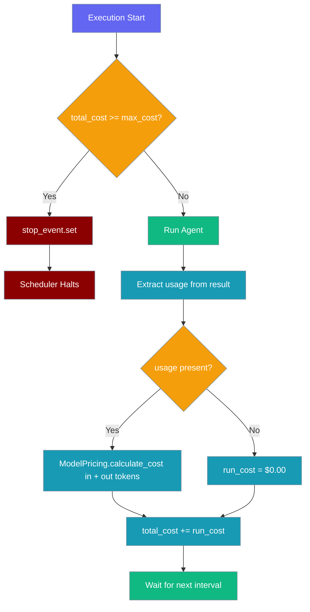

Run an agent on a recurring schedule with async-native execution, cooperative cancellation, and built-in retries.
```python
from praisonaiagents import Agent

agent = Agent(
    name="NewsChecker",
    instructions="Summarise today's AI news in three bullet points.",
)
# Schedule via AsyncAgentScheduler (see Quick Start)
```


<Note>
Since PraisonAI PR #1566, exceptions inside a scheduled run are caught and reported via `on_failure` without killing the scheduler loop. Use `await scheduler.get_stats_async()` for metrics from async code.
</Note>

<Note>
Agent-scheduler runs inherit the same at-most-once claim behavior on the default store — a due job fires on only one worker per tick even with several processes polling the same store. Both bundled stores (`ConfigYamlScheduleStore` and `FileScheduleStore`) implement `claim_due`, so this holds out of the box; it only becomes conditional if you bring a custom store that opts out. See [Multi-process safety](/docs/features/async-scheduler#multi-process-safety-at-most-once).
</Note>

The user sets a recurring schedule; the scheduler runs the agent asynchronously without blocking the event loop.


```mermaid
graph LR
    subgraph "Async Agent Scheduler"
        A[📋 Agent] --> B[⏰ Scheduler]
        B --> C[🔄 Executor]
        C --> D[✅ Success]
        C --> E[❌ Failure]
        D --> F[📊 Stats]
        E --> F
    end
    
    classDef agent fill:#8B0000,color:#fff
    classDef tool fill:#189AB4,color:#fff
    
    class A agent
    class B,C,D,E,F tool
```

## Quick Start

<Steps>
<Step title="Simple Usage">
```python
import asyncio
from praisonaiagents import Agent
from praisonai.scheduler import AsyncAgentScheduler

async def main():
    agent = Agent(
        name="NewsChecker",
        instructions="Summarise today's AI news in 3 bullet points.",
    )

    scheduler = AsyncAgentScheduler(agent, task="Check the latest AI news")
    await scheduler.start("hourly", max_retries=3, run_immediately=True)

    # ... run your app ...

    await scheduler.stop()
    print(await scheduler.get_stats())

asyncio.run(main())
```
</Step>

<Step title="With Callbacks">
```python
import asyncio
from praisonaiagents import Agent
from praisonai.scheduler import AsyncAgentScheduler

def on_success(result):
    print(f"Agent completed successfully: {result}")

def on_failure(error):
    print(f"Agent failed: {error}")

async def main():
    agent = Agent(
        name="DataProcessor",
        instructions="Process incoming data efficiently",
    )

    scheduler = AsyncAgentScheduler(
        agent, 
        task="Process latest batch of data",
        on_success=on_success,
        on_failure=on_failure
    )

    # Run every 30 minutes
    await scheduler.start("*/30m", max_retries=3, run_immediately=True)

    # Keep running
    try:
        await asyncio.sleep(3600)  # Run for 1 hour
    finally:
        await scheduler.stop()
        stats = await scheduler.get_stats_async()
        print(f"Completed {stats['successful_executions']} successful executions")

asyncio.run(main())
```
</Step>

<Step title="With Timeout & Budget Limit">
```python
import asyncio
from praisonaiagents import Agent
from praisonai.scheduler import AsyncAgentScheduler

async def main():
    agent = Agent(
        name="CostAwareAgent",
        instructions="Summarise the latest tech headlines.",
    )

    scheduler = AsyncAgentScheduler(
        agent,
        task="Summarise tech news",
        timeout=30,        # stop a single run after 30s
        max_cost=1.00,     # auto-shutdown once $1.00 spent
    )

    await scheduler.start("hourly", run_immediately=True)
    await asyncio.sleep(3600 * 4)
    stats = await scheduler.get_stats_async()
    print(f"Spent ${stats['total_cost_usd']}, remaining ${stats['remaining_budget']}")
    await scheduler.stop()

asyncio.run(main())
```
</Step>

<Step title="Deliver Results to a Chat Channel">
```python
import asyncio
from praisonaiagents import Agent
from praisonai.scheduler import AsyncAgentScheduler

async def main():
    agent = Agent(name="Briefer", instructions="Summarise today's AI news in 5 bullets.")
    scheduler = AsyncAgentScheduler(agent, task="Morning brief", deliver="telegram:123456")
    await scheduler.start("hourly")

asyncio.run(main())
```

`AsyncAgentScheduler` accepts the same `deliver=` parameter as the sync scheduler and dispatches delivery through `asyncio.to_thread` — the shared helper uses the sync bridge, so delivery never blocks the event loop and never raises. See [Scheduler → Deliver Results](/docs/cli/scheduler#deliver-scheduled-results-to-a-chat-channel) for the full token grammar and the `praisonai[bot]` optional dependency.
</Step>
</Steps>

---

## How It Works


```mermaid
sequenceDiagram
    participant User
    participant Scheduler
    participant Agent
    participant Executor
    
    User->>Scheduler: start(schedule_expr)
    Scheduler->>Scheduler: Parse interval
    
    loop Every Interval
        Scheduler->>Executor: execute(task)
        Executor->>Agent: start(task) or astart(task)
        Agent-->>Executor: Result
        alt Success
            Executor-->>Scheduler: Success callback
        else Failure
            Executor-->>Scheduler: Retry with backoff
        end
    end
    
    User->>Scheduler: stop()
    Scheduler->>Scheduler: Cancel gracefully (30s timeout)
```

The AsyncAgentScheduler uses async-native execution with cooperative cancellation, replacing the old thread-based scheduler.

<Note>
The scheduler's async primitives (`_stop_event`, `_cancel_event`, `_stats_lock`) are now created lazily inside `_ensure_async_primitives()` and bound to the loop that `start()` runs on. Tests that call `stop()` without first calling `start()` must invoke `scheduler._ensure_async_primitives()` explicitly — see `tests/unit/scheduler/test_async_agent_scheduler.py` in PR #1583 for the canonical pattern.

**Shared dispatch helper ([PR #2147](https://github.com/MervinPraison/PraisonAI/pull/2147)):** `AsyncPraisonAgentExecutor.execute()` now delegates to the shared `adispatch_agent` helper (`praisonai.scheduler._dispatch`). No behaviour change — the dispatch ladder (`astart` → `to_thread(start)` → `AttributeError`) is unchanged. See also the [sync scheduler note](/cli/scheduler) for the corresponding fix to `AgentScheduler`.
</Note>

---

## Schedule Expression Reference

| Expression | Interval | Description |
|------------|----------|-------------|
| `"hourly"` | 3600s | Every hour |
| `"daily"` | 86400s | Every 24 hours |
| `"weekly"` | 604800s | Every 7 days |
| `"*/30m"` | 1800s | Every 30 minutes |
| `"*/1h"` | 3600s | Every 1 hour |
| `"*/5s"` | 5s | Every 5 seconds |
| `"60"` | 60s | Custom seconds (plain digits) |
| `"cron:0 9 * * *"` | wall-clock | Fires at the real time-of-day. Uses the `croniter` engine (installed automatically with `praisonaiagents`). |
| `"at:2026-03-01T09:00:00"` | one-shot | ISO 8601 timestamp. A naive value (no `Z`/offset) is stamped with the resolved zone at parse time — the stored string is aware, DST-correct per target date. See [Timezones](#timezones). |

Legacy forms above are **unchanged** — every one keeps its existing behaviour.

### Timezones

A naive `at:` timestamp (no `Z`, no `+HH:MM` offset) and every `cron:` expression resolve their timezone in this order:

1. The `tz` field on the schedule (per-schedule).
2. The `default_timezone` argument on the scheduler / agent (per-process default set in code).
3. The `PRAISONAI_SCHEDULE_TIMEZONE` environment variable (process-wide default).
4. `UTC` (fallback when none of the above is set).

<Note>
An `at:` string that already carries an offset (`at:2026-03-01T09:00:00+05:30`, `at:2026-03-01T09:00:00Z`) is unaffected — the offset in the string always wins.
</Note>

```python
from praisonaiagents.tools import schedule_add

# Naive — interpreted in the schedule tz (America/New_York here)
schedule_add(
    name="report-ny",
    schedule="at:2026-03-01T09:00:00",
    message="Send morning report",
    tz="America/New_York",
)

# Offset in the string wins — 09:00 India time everywhere
schedule_add(
    name="report-ist",
    schedule="at:2026-03-01T09:00:00+05:30",
    message="Send morning report",
)
```

See [Schedule Tools → Timezones](/tools/schedule-tools#timezones-for-at-and-cron) for the full ladder and the `PRAISONAI_SCHEDULE_TIMEZONE` example.

### Natural language

Plain English clock times and day names parse into the same one-shot and cron schedules — no prefixes required.


```mermaid
graph LR
    Expr[📝 Expression] --> Decide{Recurring?}
    Decide -->|every / daily / day-of-week| Cron[🕒 cron Schedule]
    Decide -->|bare clock time| OneShot[⏰ one-shot Schedule]

    classDef req fill:#6366F1,stroke:#7C90A0,color:#fff
    classDef dec fill:#F59E0B,stroke:#7C90A0,color:#fff
    classDef out fill:#10B981,stroke:#7C90A0,color:#fff
    class Expr req
    class Decide dec
    class Cron,OneShot out
```

| Expression | Kind | Equivalent | Notes |
|------------|------|------------|-------|
| `"at 9am"` | one-shot | `at:<next 09:00 in tz>` | Fires once at the next 09:00 in the schedule's timezone. The stored ISO string is aware (not naive). If the clock time already passed today, the next occurrence is tomorrow. |
| `"at 9:30pm"` | one-shot | `at:<next 21:30 in tz>` | Minutes and AM/PM supported. |
| `"at 17:00"` | one-shot | `at:<next 17:00 in tz>` | 24-hour clock supported. |
| `"every day at 9am"` | cron | `cron:0 9 * * *` | Daily at clock time. |
| `"daily at 9am"` | cron | `cron:0 9 * * *` | Alias for `every day at 9am`. |
| `"weekdays at 9am"` | cron | `cron:0 9 * * 1-5` | Mon–Fri. |
| `"weekends at 10:30am"` | cron | `cron:30 10 * * 0,6` | Sat & Sun. |
| `"every monday 9am"` | cron | `cron:0 9 * * 1` | Any single day-of-week name. |
| `"every mon,wed,fri at 9am"` | cron | `cron:0 9 * * 1,3,5` | Comma-joined day-of-week list. |

**Natural-language expressions.** A bare clock time (`at 9am`) is treated as a one-shot at the next matching local time in the schedule's timezone. Any recurring form — `every …`, `daily …`, or one that names a day of the week — is translated to a cron expression and follows the same wall-clock semantics as `cron:`. The `croniter` engine that evaluates these expressions ships with `praisonaiagents` by default. If it is somehow missing (a stripped install), `parse_schedule()` raises `ValueError` at creation time with an install hint — no more silent "accepted but never fires".

Day-of-week names accept full or abbreviated forms (`monday`/`mon`, `tuesday`/`tue`/`tues`, `thursday`/`thu`/`thurs`, …), plus `weekday(s)` → `1-5` and `weekend(s)` → `0,6`. A bare clock time is timezone-aware: `at 9am` denotes 09:00 **local time in the schedule's timezone**, not 09:00 UTC.

```python
from praisonaiagents.scheduler import parse_schedule

parse_schedule("at 9am")                    # one-shot: next 09:00 local
parse_schedule("at 9:30pm")                 # one-shot: next 21:30 local
parse_schedule("every day at 9am")          # cron: "0 9 * * *"
parse_schedule("daily at 9am")              # cron: "0 9 * * *"
parse_schedule("weekdays at 9am")           # cron: "0 9 * * 1-5"
parse_schedule("weekends at 10:30am")       # cron: "30 10 * * 0,6"
parse_schedule("every monday 9am")          # cron: "0 9 * * 1"
parse_schedule("every mon,wed,fri at 9am")  # cron: "0 9 * * 1,3,5"

# Timezone-aware one-shot: 09:00 New York, not 09:00 UTC
schedule = parse_schedule("at 9am", tz="America/New_York")
```

Add the same forms from the CLI:

```bash
praisonai schedule add "standup" -s "weekdays at 9am" -m "post the standup summary"
praisonai schedule add "reminder" -s "at 5pm"          -m "wrap up the day" --once
```

### Timezones

A naive `at:` timestamp and the clock forms (`at 9am`, `at 17:00`) resolve their zone in order: the schedule `tz` → the instance default → `PRAISONAI_SCHEDULE_TIMEZONE` → the machine's local zone. An `at:` string that already carries an offset (`+05:30`, `Z`) is used verbatim. `cron:` follows the same order but falls back to **UTC**, not local.

- **Stored value is aware.** As of [PraisonAI #4732](https://github.com/MervinPraison/PraisonAI/pull/4732), `parse_schedule` stamps a naive `at:` with the resolved zone at parse time, so the stored ISO string names an unambiguous instant and fires at the same wall-clock time on any runner.
- **DST is per target date.** The offset attached is the one in force on the target date. In Europe/London, `at:2026-07-01T09:00:00` stamps `+01:00` and `at:2026-12-01T09:00:00` stamps `+00:00`, whichever day you parse it.
- **Bad zone names fail loudly.** An unknown IANA zone in `PRAISONAI_SCHEDULE_TIMEZONE` (or `tz=`) now raises `ValueError` at parse time instead of being accepted and never firing.

```python
from praisonaiagents.scheduler.parser import parse_schedule

parse_schedule("at:2026-07-01T09:00:00", tz="Europe/London").at  # -> "...T09:00:00+01:00"
parse_schedule("at:2026-12-01T09:00:00", tz="Europe/London").at  # -> "...T09:00:00+00:00"
```

See [Schedule Tools → Timezones](/tools/schedule-tools#timezones-for-at-and-cron) for the full precedence ladder and the legacy-job migration story.

### Wall-clock cron

`cron:` schedules honour the real time-of-day, not the interval since process start.

- **Time-of-day accuracy** — `cron:0 9 * * *` fires at 09:00 wall-clock every day. A restart at 09:30 does *not* re-phase the schedule to 09:30.
- **Downtime catch-up (exactly once)** — if the process was down when a slot was due (e.g. a scale-to-zero window), the schedule catches up **once** on resume, then re-anchors to the next future occurrence. Never double-fires the same slot.
- **State file** — the daemon persists `last_run_at` to `~/.praisonai/schedulers/<name>.json` so restarts pick up the schedule exactly where they left off.
- **Bundled engine** — the `croniter` engine that powers wall-clock cron ships with `praisonaiagents` by default, so `cron:` schedules work out of the box with no extra install step.

<Note>
**Two code paths, one engine.** When you create a schedule through `praisonaiagents.scheduler.parser.parse_schedule` (the core parser), a `cron:` or natural-language recurring form is refused at creation with a clear `ValueError` if `croniter` is somehow missing on a stripped install — it is never accepted and silently skipped. The `praisonai schedule` **daemon ticker** (`ScheduleTicker`) is a separate wrapper path: if it can't import `croniter` at run time it degrades a `cron:` schedule to a process-relative interval and logs a one-time warning. Both behaviours only matter on a stripped install — a default `praisonaiagents` install includes `croniter`.
</Note>

Plain interval expressions (`hourly`, `*/30m`, raw seconds) are **unchanged** — they keep the fixed-interval sleep behaviour.


```mermaid
sequenceDiagram
    participant Daemon
    participant Ticker as ScheduleTicker
    participant State as ~/.praisonai/schedulers/*.json
    participant Agent

    Daemon->>State: Load last_run_at
    Daemon->>Ticker: ScheduleTicker("cron:0 9 * * *", last_run_at)
    loop Each slot
        Ticker-->>Daemon: seconds_until_next() → sleep until 09:00
        Daemon->>Agent: execute()
        Agent-->>Daemon: result
        Daemon->>State: Persist last_run_at (current slot)
    end
    Note over Daemon,State: Restart at 09:30 → next fire = tomorrow 09:00, not 09:30 + 24h
```

Introduced in [PraisonAI PR #3527](https://github.com/MervinPraison/PraisonAI/pull/3527).

<Note>
Since [PraisonAI PR #2916](https://github.com/MervinPraison/PraisonAI/pull/2916), the wrapper delegates the shared grammar (`hourly` / `daily` / `weekly` / `*/N{m,h,s}` / raw seconds) to `praisonaiagents.scheduler.parser.parse_schedule`, so `weekly` is now accepted by every wrapper scheduler (`AgentScheduler`, `AsyncAgentScheduler`, `DeploymentScheduler`, and the `praisonai schedule` CLI). The bare `*/N` (unit-less) fast-path stays local to the wrapper.
</Note>

---

## Configuration Options

### AsyncAgentScheduler Constructor

| Parameter | Type | Default | Description |
|-----------|------|---------|-------------|
| `agent` | `Any` | Required | Agent instance to schedule |
| `task` | `str` | Required | Task description to execute |
| `config` | `Optional[Dict[str, Any]]` | `None` | Optional configuration dictionary |
| `on_success` | `Optional[Callable[[Any], None]]` | `None` | Callback function on successful execution |
| `on_failure` | `Optional[Callable[[Exception], None]]` | `None` | Callback function on failed execution |
| `timeout` | `Optional[int]` | `None` | **NEW** — Maximum execution time per run in seconds. `None` means no limit. Enforced with `asyncio.wait_for()`. |
| `max_cost` | `Optional[float]` | `1.00` | **NEW** — Maximum total cost in USD. Scheduler auto-stops when reached. `0` (and any negative value) is a real zero budget that trips immediately; only `None` disables the brake. Default `$1.00` is a safety guard. |

<Note>
**Fixed in [PraisonAI #3420](https://github.com/MervinPraison/PraisonAI/issues/3420):** `max_cost=0` is now a real (zero) budget — the scheduler trips immediately instead of running unbounded (previously `0` was silently treated as "no cap"). Combined with `run_immediately=True`, the immediate run trips the brake, so `await scheduler.start(...)` returns **`False`** and does **not** spin up the background task. Check the return value before assuming the scheduler is live.

```python
started = await scheduler.start("hourly", run_immediately=True)
if not started:
    # budget tripped on the immediate run — nothing scheduled
    print(await scheduler.get_stats_async())
```
</Note>

### start() Method Options

| Parameter | Type | Default | Description |
|-----------|------|---------|-------------|
| `schedule_expr` | `str` | Required | Schedule expression (e.g., "hourly", "*/1h", "3600") |
| `max_retries` | `int` | `3` | Maximum retry attempts on failure |
| `run_immediately` | `bool` | `False` | If True, run agent immediately before starting schedule |

`start()` returns a `bool`: `True` when the background task is running, `False` when it never starts — already running, a parse error, or an immediate run that tripped the budget brake (see the `max_cost` note above).

## Reading Stats

```mermaid
graph LR
    A[Async Caller] --> B[get_stats() / get_stats_async()]
    B --> C[_stats_lock]
    C --> D[Atomic Snapshot]
    
    E[Sync Caller] --> F[get_stats_sync()]
    F --> G[Direct Read]
    G --> H[May Tear]
    
    classDef async fill:#10B981,stroke:#7C90A0,color:#fff
    classDef sync fill:#F59E0B,stroke:#7C90A0,color:#fff
    classDef atomic fill:#6366F1,stroke:#7C90A0,color:#fff
    classDef tear fill:#8B0000,stroke:#7C90A0,color:#fff
    
    class A,B async
    class E,F sync
    class C,D atomic
    class H tear
```

Statistics can be read in both sync and async contexts with different guarantees:
| Method | Sync/Async | Atomicity | When to Use |
|--------|-----------|-----------|-------------|
| `scheduler.get_stats()` | sync | **Best-effort, no lock** — counters may be observed mid-update during concurrent execution. | Backward compatibility. Quick stats access in sync contexts. |
| `await scheduler.get_stats_async()` | async | **Atomic snapshot** under `_stats_lock` — all counters read together. | Async contexts where consistent stats are needed. |
| `scheduler.get_stats_sync()` | sync | **Best-effort, no lock** — same as `get_stats()` for clarity. | Explicit sync contexts (tests, scripts, REPL). |

### Stats Response Format

| Field | Type | Description |
|-------|------|-------------|
| `is_running` | `bool` | Whether scheduler is currently running |
| `total_executions` | `int` | Total number of execution attempts |
| `successful_executions` | `int` | Number of successful executions |
| `failed_executions` | `int` | Number of failed executions |
| `success_rate` | `float` | Success percentage (0-100) |
| `total_cost_usd` | `float` | Running total cost in USD (4 dp) |
| `remaining_budget` | `float \| None` | `max_cost - total_cost_usd`, or `None` if `max_cost` is disabled |
| `runtime_seconds` | `float` | **NEW (PR #1857)** — Seconds since `start()` was called. `0` when scheduler hasn't started. |
| `cost_per_execution` | `float` | **NEW (PR #1857)** — `total_cost_usd / total_executions`, rounded to 4 dp. `0` when no executions yet. |
| `delivered_deliveries` | `int` | Runs whose configured `deliver=` target was accepted by the router. Bumped **only** by a `DELIVERED` outcome — never inferred. |
| `undelivered_deliveries` | `int` | Runs whose configured `deliver=` target failed (router returned `False` or the send raised). Bumped **only** by an `UNDELIVERED` outcome — surfaced via `on_failure`, never silent. |

Both counters are explicit: `SUPPRESSED` and `NOT_CONFIGURED` runs contribute **zero** to each, so `delivered_deliveries + undelivered_deliveries ≤ successful_executions`. See the [per-outcome counter table](/features/scheduler-delivery#delivery-outcomes) for which cell each run lands in.

Since [PR #1857](https://github.com/MervinPraison/PraisonAI/pull/1857), `AsyncAgentScheduler` shares its stats builder with the sync `AgentScheduler` via the internal `_BaseAgentScheduler` mixin — the schema is now identical across sync and async.

---

## Async Blueprints

`AsyncAgentScheduler.from_blueprint(...)` builds a scheduler from a named blueprint template, dispatching the blueprint prompt via `astart()` so scheduled runs never block the event loop.


```mermaid
graph LR
    Blueprint[📋 Blueprint name] --> Resolver[🧠 build_from_blueprint]
    Slots[⚙️ Slot overrides] --> Resolver
    Resolver --> Wrapper[🎁 AsyncBlueprintAgent]
    Wrapper --> Scheduler[⏰ AsyncAgentScheduler]

    classDef input fill:#6366F1,stroke:#7C90A0,color:#fff
    classDef process fill:#189AB4,stroke:#7C90A0,color:#fff
    classDef output fill:#10B981,stroke:#7C90A0,color:#fff

    class Blueprint,Slots input
    class Resolver,Wrapper process
    class Scheduler output
```

Blueprint resolution lives in the shared `_base_scheduler.build_from_blueprint`, so the async and sync surfaces stay in lock-step. `from_blueprint` also populates `_yaml_schedule_config`, so `start_from_yaml_config()` starts the scheduler on the blueprint's resolved interval.

<Steps>
<Step title="Build from a blueprint">
```python
import asyncio
from praisonai.scheduler import AsyncAgentScheduler

async def main():
    # Async twin of AgentScheduler.from_blueprint — the blueprint prompt is
    # dispatched via astart(), so scheduled runs never block the event loop.
    scheduler = AsyncAgentScheduler.from_blueprint(
        "morning-brief",
        slots={"topic": "AI"},
    )
    await scheduler.start_from_yaml_config()

    await asyncio.sleep(3600)
    await scheduler.stop()

asyncio.run(main())
```
</Step>

<Step title="Override interval and delivery">
```python
import asyncio
from praisonai.scheduler import AsyncAgentScheduler

async def main():
    scheduler = AsyncAgentScheduler.from_blueprint(
        "morning-brief",
        slots={"topic": "AI"},
        deliver="telegram:123456",   # overrides the blueprint default
        interval_override="*/30m",   # overrides the resolved schedule
    )
    await scheduler.start_from_yaml_config()

    await asyncio.sleep(3600)
    await scheduler.stop()

asyncio.run(main())
```
</Step>
</Steps>

### from_blueprint() Parameters

| Parameter | Type | Default | Description |
|-----------|------|---------|-------------|
| `blueprint_name` | `str` | Required | Name of the blueprint (`"morning-brief"`, `"important-mail"`, `"weekly-review"`, or a custom one) |
| `slots` | `Optional[Dict[str, Any]]` | `None` | Values that fill the blueprint's template slots |
| `deliver` | `str` | `""` | Delivery target token; overrides the blueprint's default |
| `agent_id` | `str` | `""` | Agent ID to execute the job |
| `interval_override` | `Optional[str]` | `None` | Override the resolved schedule expression |
| `max_retries_override` | `Optional[int]` | `None` | Override max retries |
| `timeout_override` | `Optional[int]` | `None` | Override per-run timeout (seconds) |
| `max_cost_override` | `Optional[float]` | `None` | Override max cost in USD |
| `on_success` | `Optional[Callable]` | `None` | Success callback |
| `on_failure` | `Optional[Callable]` | `None` | Failure callback |

`from_blueprint` raises `ValueError` if the blueprint is not found or a required slot is missing.

<Note>
**New in PR #4336:** `AsyncAgentScheduler.from_blueprint(...)` restores surface parity with the sync `AgentScheduler.from_blueprint(...)`. Blueprint resolution now lives in the shared `_base_scheduler.build_from_blueprint`, so any future blueprint change lands in both schedulers at once. The async wrapper (`AsyncBlueprintAgent`) exposes both `astart` (used by the async scheduler) and a sync `start` fallback, so it never blocks the event loop.
</Note>

---

## Common Patterns

### Running in FastAPI Application

```python
from contextlib import asynccontextmanager
from fastapi import FastAPI
from praisonaiagents import Agent
from praisonai.scheduler import AsyncAgentScheduler

scheduler = None

@asynccontextmanager
async def lifespan(app: FastAPI):
    # Startup
    global scheduler
    agent = Agent(name="BackgroundWorker", instructions="Process background tasks")
    scheduler = AsyncAgentScheduler(agent, task="Process pending tasks")
    await scheduler.start("*/5m", max_retries=2)
    
    yield
    
    # Shutdown
    if scheduler:
        await scheduler.stop()

app = FastAPI(lifespan=lifespan)
```

### Error Handling with Logging

```python
import asyncio
import logging
from praisonaiagents import Agent
from praisonai.scheduler import AsyncAgentScheduler

logging.basicConfig(level=logging.INFO)

def handle_failure(error):
    # Fires on EITHER an execution error OR a delivery failure. When it's a
    # delivery failure the reason string is "scheduled result could not be
    # delivered" (see PR #4476) — match on it to distinguish the two.
    logging.error(f"Agent execution failed: {error}")
    # Send alert, write to database, etc.

async def main():
    agent = Agent(name="MonitoringAgent", instructions="Monitor system health")
    scheduler = AsyncAgentScheduler(
        agent,
        task="Check system status",
        # on_failure now fires on EITHER an execution error OR a delivery failure
        # (reason is "scheduled result could not be delivered" for the latter).
        on_failure=handle_failure
    )
    
    await scheduler.start("*/10m")
    
    try:
        await asyncio.sleep(float('inf'))
    except KeyboardInterrupt:
        await scheduler.stop()

asyncio.run(main())
```

### Graceful Shutdown on SIGINT

```python
import asyncio
import signal
from praisonaiagents import Agent
from praisonai.scheduler import AsyncAgentScheduler

scheduler = None

def signal_handler():
    if scheduler:
        asyncio.create_task(scheduler.stop())

async def main():
    global scheduler
    
    # Setup signal handling
    for sig in [signal.SIGINT, signal.SIGTERM]:
        signal.signal(sig, lambda s, f: signal_handler())
    
    agent = Agent(name="LongRunningAgent", instructions="Process data continuously")
    scheduler = AsyncAgentScheduler(agent, task="Process data batch")
    
    await scheduler.start("*/15m", run_immediately=True)
    
    try:
        # Keep running until signal
        await asyncio.sleep(float('inf'))
    except KeyboardInterrupt:
        print("Received interrupt, shutting down gracefully...")
    finally:
        if scheduler:
            await scheduler.stop()
            stats = await scheduler.get_stats_async()
            print(f"Final stats: {stats}")

asyncio.run(main())
```

### Budget-aware Scheduling

```python
import asyncio
from praisonaiagents import Agent
from praisonai.scheduler import AsyncAgentScheduler

async def main():
    agent = Agent(name="ReportAgent", instructions="Generate hourly report")

    # Hard-stop after $5 total spend, 60s per run
    scheduler = AsyncAgentScheduler(
        agent,
        task="Generate report",
        timeout=60,
        max_cost=5.00,
    )

    await scheduler.start("hourly")
    while scheduler.is_running:
        await asyncio.sleep(60)
        stats = await scheduler.get_stats_async()
        if stats["remaining_budget"] is not None and stats["remaining_budget"] < 0.50:
            print(f"⚠️  Budget nearly exhausted: ${stats['remaining_budget']:.4f} left")
    print("Scheduler stopped (budget reached or manual stop)")

asyncio.run(main())
```

<Note>
**Real cost tracking ([PR #2171](https://github.com/MervinPraison/PraisonAI/pull/2171)):** Before #2171, both schedulers added a fixed `$0.0001` to `total_cost` per run, so the default `max_cost=1.00` only tripped after ~10,000 runs regardless of model. The scheduler now pulls `usage` (input/output tokens) and `model` off the agent response and prices it through `praisonai.cli.features.cost_tracker.ModelPricing`. Responses with no `usage` metadata contribute **$0** — the brake errs on the side of running rather than tripping on missing data. Negative token counts are clamped to `0` so they can never bypass the brake.
</Note>


```mermaid
graph TB
    Start[Execution Start] --> Check{total_cost >= max_cost?}
    Check -->|Yes| Stop[stop_event.set] --> Halt[Scheduler Halts]
    Check -->|No| Run[Run Agent]
    Run --> Extract[Extract usage from result]
    Extract --> HasUsage{usage present?}
    HasUsage -->|Yes| Price[ModelPricing.calculate_cost in + out tokens]
    HasUsage -->|No| Zero[run_cost = $0.00]
    Price --> AddCost[total_cost += run_cost]
    Zero --> AddCost
    AddCost --> NextLoop[Wait for next interval]

    classDef start fill:#6366F1,stroke:#7C90A0,color:#fff
    classDef check fill:#F59E0B,stroke:#7C90A0,color:#fff
    classDef stop fill:#8B0000,stroke:#7C90A0,color:#fff
    classDef run fill:#10B981,stroke:#7C90A0,color:#fff
    classDef calc fill:#189AB4,stroke:#7C90A0,color:#fff

    class Start start
    class Check,HasUsage check
    class Stop,Halt stop
    class Run,NextLoop run
    class Extract,Price,Zero,AddCost calc
```

---

### Daemon state persistence

When `AsyncAgentScheduler` runs as a daemon (started via `praisonai schedule start <name> ...`), it now updates `~/.praisonai/schedulers/<name>.json` after every execution with the current `executions` count and `cost`. The file I/O is offloaded with `asyncio.to_thread()` so the event loop is never blocked. Previously these writes were a TODO and async daemons silently reported stale numbers. See [PR #1857](https://github.com/MervinPraison/PraisonAI/pull/1857).

<Note>
As of [PraisonAI #4537](https://github.com/MervinPraison/PraisonAI/pull/4537), those writes are **atomic** — the state file goes to a temp file, is `fsync`'d, then renamed into place with `os.replace`. A crash mid-write can no longer leave a truncated JSON file that silently disables cron catch-up on next start. Corrupt or unreadable state files now log a warning (`Corrupt scheduler state ...` / `Cannot access scheduler state ...`) and the scheduler re-anchors from process start. See [Async Scheduler → Daemon state persistence](/features/async-scheduler#daemon-state-persistence).
</Note>

---

## Best Practices

<AccordionGroup>
<Accordion title="Always await scheduler.stop() before exiting">
The `stop()` method waits up to 30 seconds for the current execution to complete before canceling. This prevents data corruption and ensures clean shutdown.

<Note>
As of [PraisonAI #4537](https://github.com/MervinPraison/PraisonAI/pull/4537), `await scheduler.stop()` also interrupts an in-flight retry backoff immediately — it no longer holds for the full backoff `cap` (default 300 s). Shutdown is bounded by the current in-flight run, so SIGTERM'd containers exit inside the normal grace window. Same behaviour as the sync [interruptible backoff](/cli/scheduler#interruptible-backoff-pr-1673).
</Note>

```python
# Good
try:
    await scheduler.start("hourly")
    await asyncio.sleep(3600)
finally:
    await scheduler.stop()

# Bad - may interrupt agent mid-execution
await scheduler.start("hourly")
await asyncio.sleep(3600)
# Exit without stopping
```
</Accordion>

<Accordion title="Use run_immediately=True for testing">
Enable `run_immediately=True` to verify your agent works correctly before waiting for the first scheduled interval.

```python
# Test immediately, then schedule
await scheduler.start("hourly", run_immediately=True)

# Good for smoke tests
await scheduler.start("daily", run_immediately=True)
```
</Accordion>

<Accordion title="Keep callbacks lightweight">
Success and failure callbacks are called synchronously. Heavy operations should be offloaded to avoid blocking the scheduler.

```python
# Good - lightweight logging
def on_success(result):
    logger.info(f"Agent completed: {result}")

# Bad - heavy database operations
def on_success(result):
    database.save_large_dataset(result)  # Blocks scheduler
    
# Better - offload heavy work
def on_success(result):
    asyncio.create_task(save_to_database(result))
```
</Accordion>

<Accordion title="Prefer AsyncAgentScheduler over legacy thread-based scheduler">
For new code, use `AsyncAgentScheduler` instead of the legacy `AgentScheduler`. The async version provides better cancellation, no daemon threads, and fits naturally into async applications.

```python
# New async approach
from praisonai.scheduler import AsyncAgentScheduler
scheduler = AsyncAgentScheduler(agent, task)
await scheduler.start("hourly")

# Legacy thread-based (avoid for new code)
from praisonai.scheduler import AgentScheduler
scheduler = AgentScheduler(agent, task)
scheduler.start("hourly")
```
</Accordion>

<Accordion title="Use the async blueprint entry point inside a running loop">
Inside FastAPI or any running event loop, build schedulers with `AsyncAgentScheduler.from_blueprint` — the blueprint prompt dispatches through `astart()` and never blocks. The sync `AgentScheduler.from_blueprint` runs `threading.Event.wait()` under the hood and stalls the loop each tick.

```python
# Good — async app
from praisonai.scheduler import AsyncAgentScheduler
scheduler = AsyncAgentScheduler.from_blueprint("morning-brief", slots={"topic": "AI"})

# Avoid inside a running event loop
from praisonai.scheduler import AgentScheduler
scheduler = AgentScheduler.from_blueprint("morning-brief", slots={"topic": "AI"})
```
</Accordion>

<Accordion title="Budget Control">
The default `max_cost=1.00` caps unattended cost runaway. Since [PR #2171](https://github.com/MervinPraison/PraisonAI/pull/2171), `total_cost_usd` is the real per-token spend computed from each response's `usage` field — pick a value that matches your approved budget, not a multiple chosen to compensate for an undercount.

```python
# Production with explicit budget
scheduler = AsyncAgentScheduler(agent, task, max_cost=50.00)

# Disable budget (only when external limits enforce it)
scheduler = AsyncAgentScheduler(agent, task, max_cost=None)
```

```python
# Dry-run / safety-drill: schedule wired up but nothing will execute
scheduler = AsyncAgentScheduler(agent, task, max_cost=0)
await scheduler.start("hourly")
assert scheduler.is_running is False   # trips on the first tick
```

This is the same code path as any other budget trip, so `stats["is_running"]` flips to `False` and the stop event fires — useful for smoke-testing the schedule and delivery wiring without spending anything.

When the budget triggers, the scheduler logs a warning and calls `stop_event.set()` internally — `stats["is_running"]` flips to `False`.

If your model is missing from `DEFAULT_PRICING`, the run is priced at `$0` and `total_cost_usd` will under-report — register it via the [custom pricing](/docs/cli/cost-tracking#custom-pricing) snippet so the brake stays meaningful.
</Accordion>

<Accordion title="Timeout Configuration">
Set `timeout` to bound the worst-case wall-clock time per run. Internally implemented with `asyncio.wait_for()`, which raises `asyncio.TimeoutError` and triggers the standard retry path.

```python
scheduler = AsyncAgentScheduler(
    agent,
    task,
    timeout=30,        # individual run cannot exceed 30s
    max_cost=1.00,
)
```

`timeout=None` (the default) imposes no limit.
</Accordion>

<Accordion title="Wall-clock cron works out of the box">
`cron:` schedules honour wall-clock time using the `croniter` engine, which ships with `praisonaiagents` by default — no separate install step. On a stripped install without it, the `praisonai schedule` daemon ticker logs a one-time warning and falls back to a coarse interval anchored to process start, while the core `parse_schedule()` refuses the cron schedule at creation with a `ValueError`.

```python
from praisonai.scheduler import AsyncAgentScheduler

# Fires at 09:00 wall-clock every day — croniter ships with praisonaiagents
scheduler = AsyncAgentScheduler(agent, task="Morning brief")
await scheduler.start("cron:0 9 * * *")
```
</Accordion>
</AccordionGroup>

---

<Note>
**Import paths (updated in PR #1723):**
- **Canonical (recommended):** `from praisonai.scheduler import AsyncAgentScheduler`
- **Explicit module path:** `from praisonai.scheduler.async_agent_scheduler import AsyncAgentScheduler`
- **Deprecated** (still works, emits `DeprecationWarning`): `from praisonai.async_agent_scheduler import AsyncAgentScheduler`

The sync `AgentScheduler` is unchanged: `from praisonai.scheduler import AgentScheduler`.
</Note>

<Warning>
**Jupyter/Event Loop Compatibility:** Starting with [PR #1448](https://github.com/MervinPraison/PraisonAI/pull/1448), PraisonAI no longer calls `nest_asyncio.apply()` or `asyncio.set_event_loop()` on your behalf when ACP/LSP is enabled. If you embed PraisonAI inside a Jupyter kernel or another running event loop, either call `nest_asyncio.apply()` yourself at the top of your notebook, or run PraisonAI from a separate process.
</Warning>

---

## Skipping Ticks with a Pre-Run Gate

A pre-run gate lets you run a cheap shell check before each scheduled tick — the agent only fires when the check says there's something to do. This cuts token spend on quiet ticks (e.g. polling for new emails every 5 minutes but only summarising when mail actually arrives).

See [Scheduler Pre-Run Gate](/features/scheduler-pre-run-gate) for the full configuration reference and examples.

---

## Delivering Results to a Chat

Pass `deliver=` to push each successful result to Telegram, Discord, Slack, or WhatsApp — no gateway required.

```python
scheduler = AsyncAgentScheduler(agent, task="Morning brief", deliver="telegram:123456")
await scheduler.start("hourly")
```

See [Scheduler Delivery](/features/scheduler-delivery) for the token grammar (Python / YAML / CLI) and reliability guarantees.

<Note>
A scheduled run whose whole output is exactly `NO_REPLY` (or `[SILENT]` / `SILENT`) skips delivery — the tick still succeeds and is recorded in stats, but nothing is pushed. Both `AgentScheduler` and `AsyncAgentScheduler` share this check through `_BaseAgentScheduler._should_suppress_delivery`, so it holds uniformly on sync and async schedules. See [Scheduler Delivery → Intentional Silence](/docs/features/scheduler-delivery#intentional-silence).

Before [PraisonAI #3420](https://github.com/MervinPraison/PraisonAI/issues/3420), the async path pushed the literal marker string every tick — the check now lives on the shared base, so async schedules stay quiet too.

For a run whose delivery *fails* (rather than being intentionally suppressed), `on_failure` now fires instead of `on_success`, and the run counts as `undelivered_deliveries`. See [Scheduler Delivery → Delivery outcomes](/docs/features/scheduler-delivery#delivery-outcomes).
</Note>

---

## Related

<Note>
`RunPolicy` adds run-scoped guardrails (tool scoping, prompt scanning, durable audit) to `ScheduledAgentExecutor`. `AsyncAgentScheduler` is independent of `RunPolicy` — see [Scheduled Run Policy](/features/scheduled-run-policy) for how to add guardrails when using `ScheduledAgentExecutor` or `EnhancedScheduledAgentExecutor`.

`AsyncAgentScheduler` lives in the `praisonai` wrapper (`from praisonai.scheduler import AsyncAgentScheduler`). `ScheduledAgentExecutor` and `JobResult` live in the bot tier — use `from praisonai_bot.scheduler import ScheduledAgentExecutor, JobResult` when using them directly.
</Note>

<CardGroup cols={2}>
<Card title="Scheduler CLI" icon="terminal" href="/cli/scheduler">
  Command-line interface for scheduling agents
</Card>
<Card title="Pre-Run Gate" icon="filter" href="/features/scheduler-pre-run-gate">
  Skip ticks when a cheap check says nothing to do
</Card>
<Card title="Scheduler Delivery" icon="paper-plane" href="/features/scheduler-delivery">
  Push scheduled results to Telegram/Discord/Slack/WhatsApp
</Card>
<Card title="Background Tasks" icon="play" href="/features/background-tasks">
  Running agents as background processes
</Card>
<Card title="Run Policy" icon="shield-halved" href="/features/scheduled-run-policy">
  Scope tools, scan prompts, and audit output for unattended runs
</Card>
<Card title="Multi-Tenant Scheduler" icon="user-shield" href="/features/scheduler-multi-tenant">
  Isolate each gateway user's jobs with a principal owner key
</Card>
</CardGroup>